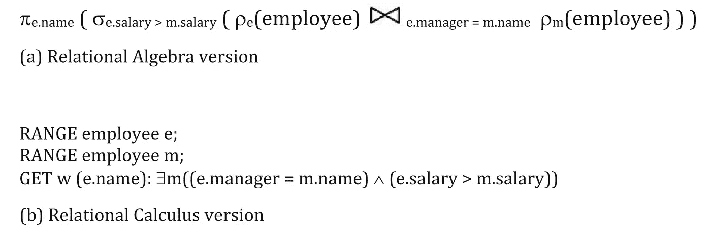
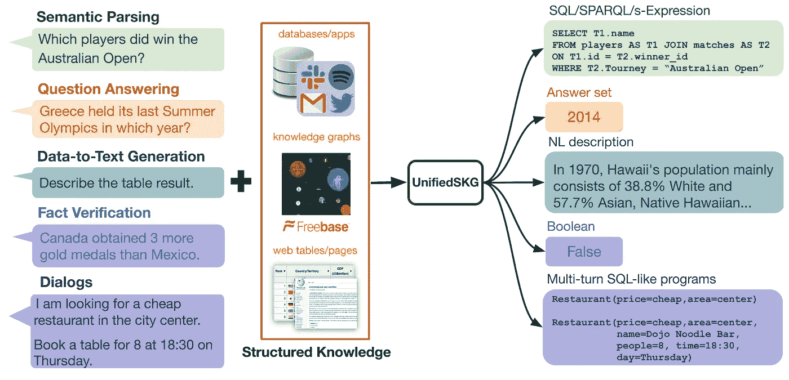

# 有了 NLQ，编写 SQL 变得容易多了

> 原文：<https://towardsdatascience.com/how-writing-sql-could-get-a-whole-lot-easier-with-nlq-3ffeb84b435d>

## 机器学习

## 自然语言查询将会更好地改变你的数据职业


莫妮卡·西尔维斯特在 [Pexels](https://www.pexels.com/photo/person-lying-on-sofa-with-cat-909620/) 拍摄的照片

问问题最直观、最有效、最不耗费精力的方式是什么？它是用你自己语言中最简单的词语。现代搜索引擎，如谷歌，使得使用简单的句子在线搜索信息变得很平常。这有助于创造我们的现代社会，改善全球信息的获取；很难夸大搜索引擎的出现真正带来了多大的变革。然而，在互联网上搜索信息并没有真正变得大众化和流行，直到我们可以用自然语言问互联网问题，就像我们可以和另一个人交谈一样。

对于数据专业人员来说，使用自然语言搜索信息的能力可能很快就会成为现实。不，我不是说需要每天在谷歌上搜索一百万次来复制和粘贴代码。而是键入一个句子来查询数据库，并以表格的形式返回一个答案，该答案与用来创建它的 SQL 查询配对。

这整个过程通过自然语言处理(NLP)是可能的。尽管所有关于最新和最棒的语言模型的新闻稿都导致了 AGI，但使用 NLP 驱动自然语言查询(NLQ)还不是一个解决的问题，但我相信这种能力可能比我们想象的更近。

## 自然语言查询简史(NLQ)

我想简单谈谈我们是如何走到这一步的，因为这与我要说的观点有关，即互联网并没有真正变得对大众“可用”,直到提问变得像说话一样直观。另外，我认为历史很有趣。

在 20 世纪 70 年代，互联网处于 ARPANet 的早期阶段，你必须浏览 [FTP 文件目录](https://www.theregister.com/2011/04/15/ftp_turns_40/)。这最终导致了 1990 年发布的第一个搜索引擎 [Archie。Archie 是第一个 web 索引，搜索请求是通过文本匹配来完成的，匹配方式有四种](https://www.poynter.org/reporting-editing/2014/today-in-media-history-the-first-internet-search-engine-is-released-in-1990/):精确匹配、正则表达式、sub 和 subcase。

20 世纪 90 年代引发了一场搜索引擎的竞赛，早期的搜索引擎只能找到一个网站，如果你知道该网站的确切名称 ⁴.慢慢地，搜索引擎变得越来越类似于日常用语，这也是互联网真正变得大众化和“可用”的时候。第一个成功做到这一点的搜索引擎变得如此受欢迎，以至于高互联网流量和没有足够的服务器的混合使网站如此之慢，以至于它实际上是 unusable⁴.

剩下的就是历史了。AltaVista 和 Ask Jeeves(后来 Ask.com)⁴在自然语言搜索方面做得比任何人都好，直到谷歌推出了他们的 PageRank 算法，用自然语言返回相关结果，彻底击败了竞争对手。

我记得上小学的时候，在谷歌上输入关键词，但仍然没有找到我想要的东西。现在，谷歌使用 BERT 语言模型进行搜索，我输入完整的句子，就像我在和另一个人说话一样，大多数时候都能得到我想要的东西。

## 自然语言查询能为 SQL 做什么？

就像搜索引擎被用来查询万维网一样，SQL 是任何想要与数据打交道的人的*通用语*。这是所有数据职业的共同点，直接访问数据库信息的民主化已经酝酿了很长时间。

SQL 语言是在互联网出现的大约同一时间创建的，那是在 70 年代。在 SQL 创建之前，[一位创建了关系数据库模型的计算机科学家](https://en.wikipedia.org/wiki/Edgar_F._Codd) ⁵提出了使用如下数学符号的查询:



图片来自[SQL](https://ieeexplore.ieee.org/stamp/stamp.jsp?arnumber=6359709)⁶的早期历史

SQL 的创始人唐纳德·张伯伦(Donald Chamberlin)和雷·博伊斯(Ray Boyce)在谈到创建这种语言时表示:“我们相信，应该有可能设计出一种关系语言，让没有接受过数学或计算机编程正式培训的用户更容易理解。”⁶

这导致了一种语言，通过使用熟悉的英语单词与数据库进行交流，降低了进入的门槛。对语言的持续兴趣以及它仍然是最流行的数据检索语言的事实证明了 SQL 语言的影响力和简洁性。

我相信与数据库的交互可以进一步改进，查询数据库将会有一些方面与我们今天使用搜索引擎的方式相似。这是一个非常困难的问题，但一旦解决，它将极大地提高数据专业人员的工作效率，并进一步降低外部用户访问源数据的门槛。事实上，这已经发生了。

## 数据库的自然语言查询已经出现了

你有没有注意到拥有人工智能辅助的自然语言查询能力已经成为可视化仪表板公司的标准？Tableau、Power BI 和 Pyramid Analytics(仅举几例)等公司都在他们的仪表板解决方案中添加了自然语言查询。Tableau 已经在 2019 年 2 月 ⁹发布了 AskData，同年晚些时候，Power BI 在他们的 [Q & A 产品](https://visualbi.com/blogs/microsoft/powerbi/qa-data-power-bi/#:~:text=In%20the%20new%20October%202019,reports%20directly%20as%20a%20visual.) ⁰.中添加了自然语言查询金字塔分析公司[最近有一篇文章](https://venturebeat.com/2022/05/09/decision-intelligence-platform-pyramid-analytics-raises-120m/)提到，“(金字塔的)无代码方法使公司内的非技术用户能够找到复杂商业问题的答案。这包括支持**自然语言查询**和人工智能支持的“直接针对数据源工作”的分析。你可以去[这个链接](http://help.pyramidanalytics.com/Content/Root/MainClient/apps/Discover/NLQ/Natural_Language_Query.htm)看看他们的自然语言查询功能的视频。

作为 Tableau 用户，AskData 公布的时候我觉得真的很有意思。这是向数据访问民主化和改进自助分析迈出的又一步。我相信这是一个更大趋势的一部分，不仅改善我们分析产品的最终用户对关系数据库的访问，而且改善数据专业人员的访问便利性。

## 向外行人打开数据库

Tableau、Power BI 和金字塔分析是用于查询单个表的自然语言查询的示例。这很有趣，而且肯定很有帮助，但是我认为这项技术在不久的将来会提供更多。我认为真正具有革命性的是，不仅使用自然语言来查询仪表板，而且首先开发查询来创建仪表板。

Text-to-SQL，更正式的说法是数据库的自然语言接口 [(NLIB)](/natural-language-to-sql-from-scratch-with-tensorflow-adf0d41df0ca) ，是一个迷人的问题，在被认为“解决”之前还有一段路要走。然而，在这一领域已经实现了一个巨大的里程碑。2019 年，人工智能能够以高于人类水平的熟练程度⁰.对单个表格进行查询甚至有像 AI2SQL 这样的网站，在那里你可以[亲自尝试一下](https://app.ai2sql.io/?section=1) ⁴.

尽管 AI 可以为单个表创建查询令人印象深刻，但它可能仍然不会为数据专业人员节省太多时间。对于数据专业人员来说，真正困难的是他们必须编写数百甚至数千行 SQL 代码来创建仪表板或报告。不仅需要编写大量的代码，每个查询还需要:

*   避免重复
*   移除空值
*   清理数据
*   转换数据
*   转换数据时避免错误
*   等等…

我的观点是有很多要考虑的！这个过程真正模拟的是将业务逻辑翻译成代码。

## 文本转 SQL 只是白日梦吗？

文本到 SQL 的想法可能看起来像是在计算机屏幕前花了太多时间的分析师的沉思，但是不管你是不是那个分析师，让你自己想象一下下面的场景。

想象一下，能够让一个主题专家在一个文档中写出业务逻辑，以及最终表格输出的一个示例，他们将这些输入到一个人工智能中。然后，人工智能会将这些方向转换成一组 SQL 查询，以产生所需的输出。在整个过程中，将进行主键检查，并避免重复。数据专家的角色将从花几个月的时间编写代码转变为审核人工智能代码输出，这可能需要几周时间。如果这是可能的，将会有巨大的效率增益。

这听起来像是白日梦，但是我相信这是这个领域的发展方向，并且有一天这将成为可能。Aerin Kim 是微软开发文本到 SQL 人工智能团队的研究员。[这是她对此的看法](/text-to-sql-learning-to-query-tables-with-natural-language-7d714e60a70d)，

> 就个人而言，我发现将自然语言翻译成可执行的 SQL 是一个令人着迷的问题，我认为这个项目不仅仅是一次登月。Text-to-SQL 是一个有潜力被解决的项目，一旦它被解决，它将被广泛应用，因为关系数据库在每个领域都被广泛使用。⁵

## Github Copilot 不是已经在做这个了吗？

文本到 SQL 将是一个了不起的工具，数据专业人员可以用它来提高生产率。它可能会让你想起 Github Copilot，虽然它很相似，但也有一些关键的区别。

Github Copilot 将根据您的文档字符串、函数名和代码中的其他文本来建议代码。Github Copilot AI(名为 Codex)已经使用 Github 上的代码进行了训练。因此，它建议的代码本质上是基于其他程序员在⁶. github 网站上创建的模板这与文本到 SQL 不同，因为文本到 SQL 试图获取句子，而不是建议模板，它将句子翻译成代码。将文本翻译成代码的术语叫做语义解析。

两者之间最大的相似之处是，都使用语言模型为两个应用程序创建了最先进的(SOTA)模型。Codex 建立在 GPT-3 之上，当前的 SOTA 语义解析器基于 Google 的 T5 语言模型。

## 文本到 SQL 的当前功能是什么？

这个研究领域仍然面临的挑战是创建具有多个表的 SQL 查询，以及泛化模型，以便它即使在未经训练的数据库上也能很好地执行。

为了理解文本到 SQL 的当前状态，我想介绍目前用于基准测试的三个不同的数据集:WikiSQL、Spider 和 SPArC。

## **1。WikiSQL**

[WikiSQL 数据库](https://github.com/salesforce/WikiSQL) ⁷于 2017 年发布，包含 [80K 手](https://arxiv.org/abs/1709.00103) ⁸注释问题和 SQL 查询。该数据集是从⁸.的 24K 维基百科表格中生成的为了鼓励对这一领域的探索，Salesforce 收集了数据并使其可访问。他们还创建了一个基于 RNN Seq2Seq 模型的基线模型，该模型通常用于翻译。该模型能够在 59%的情况下提供正确的文本问题输入输出(执行准确性)，并且能够在 48%的情况下获得正确的 SQL 格式(逻辑形式准确性)。⁷

在一篇名为“[如何与您的数据库](https://blog.salesforceairesearch.com/how-to-talk-to-your-database/)对话”的博客文章中，Salesforce 团队解释了他们的基线 Seq2Seq 模型(名为 Seq2SQL)如何能够将文本输入转换为 SQL 查询。Salesforce 团队专注于为三件事生成 SQL 模型:聚合、select 语句和 where 子句。⁹

这是一个很好的开端，但自那以后已经取得了很大进展。⁰.发布 WikiSQL 数据集仅两年后，该数据集就实现了超人的性能 2019 年，Hwang 等人发表的一篇论文。艾尔。说，

> 我们介绍了 SQLova，它是第一个自然语言到 SQL (NL2SQL)的模型，在 WikiSQL 数据集上实现了人类的性能。我们回顾并讨论了 NL2SQL 文献中各种流行的方法，充分利用了 BERT……我们特别指出，我们的模型的性能接近 WikiSQL 的上限，我们观察到很大一部分评估错误是由于错误的注释造成的，我们的模型在执行精度上已经超过人类性能 1.3%。⁰

他们的模型实现了 89%的执行准确率和 84%的逻辑形式准确率。从那以后，排行榜上最高的型号在两个精度指标上都又提高了 4%。⁷

## 2.蜘蛛；状似蜘蛛的物体；星形轮；十字叉；连接柄；十字头

研究人员很快意识到需要另一个数据集来推进 NLQ 场，因此研究人员在 2018 年 9 月创建了[蜘蛛数据集](https://github.com/taoyds/spider)。根据[蜘蛛论文摘要](https://arxiv.org/abs/1809.08887)的解释，蜘蛛不同于 WikiSQL，因为它是在不同于测试数据的数据库上训练的，并且它引入了连接作为寻找问题答案的要求的一部分。这些是与 WikiSQL 数据集的主要区别，并且更接近于数据专业人员日常使用 SQL 的方式。

以下是 Spider 要求模型生成的查询类型的几个示例:

```
SELECT name ,  capacity FROM stadium ORDER BY average DESC LIMIT 1  concert_singerSELECT count(*) FROM concert WHERE YEAR  =  2014 OR YEAR  =  2015   concert_singerSELECT T2.name ,  count(*) FROM concert AS T1 JOIN stadium AS T2 ON T1.stadium_id  =  T2.stadium_id GROUP BY T1.stadium_id  concert_singer
```

带注释的问题和 SQL 查询对示例如下所示:

**问题**

2013 年以后演唱会最多的球场叫什么名字，容量是多少？

**SQL 查询**

关于[蜘蛛数据集的问题 Github 评估示例](https://github.com/taoyds/spider/blob/master/evaluation_examples/dev.sql)

[Spider 数据集上的最高逻辑形式精度目前为 75%](https://yale-lily.github.io/spider) (它们不使用执行精度，因为没有提供预测值)。这是一个巨大的进步，从最初的基线模型精度只有 12%。然而，要想有用，精确度必须提高，至少要达到人类可以达到的水平。

## 3.平流层过程及其在气候中的作用

SParC 是一个首字母缩写词，在⁴.代表[**s**emantic**par**sing](https://yale-lily.github.io/sparc)[数据集](https://github.com/taoyds/sparc)建立在蜘蛛数据集之上，其目的是关注上下文查询。这意味着您的模型可以从连续询问的多个问题中学习。

与蜘蛛数据集相比，这一挑战的难度增加了，这在排行榜得分中显而易见；此[数据集的当前 SOTA 模型仅为 45%](https://yale-lily.github.io/sparc) ⁴.精度测量使用与蜘蛛数据集相同的框架，该数据集被分解成 1 个 [0 个不同的组件](https://github.com/taoyds/spider/tree/master/evaluation_examples)。

根据逻辑形式的准确性对查询进行评估，尽管有生成值的能力，但没有提供执行准确性。

## 自然语言查询的未来会是什么样子？

到目前为止，我提到的所有数据集仍然受到一个限制，即它们是特定于上下文的，这意味着它们专注于“单个任务、域或数据集”⁸.例如，本文主要关注使用关系数据库将自然语言翻译成 SQL。但是，如果关系数据库的文本到 SQL 的熟练程度达到了人类水平，那么当应用于知识图形式的数据或除关系数据库之外的任何其他形式的数据时，这些相同的模型可能就不太有用了。也就是说，大部分数据存储在关系数据库中，这仍然是一个巨大的成就。

为了解决特定上下文模型的问题，帮助开发蜘蛛数据集的同一团队创建了统一结构化知识基础框架(统一 SKG)来测试模型。他们的项目页面将结构化知识基础定义为，“[基础化]结构化知识中的用户请求[产生]各种输出，包括计算机程序(例如，SQL 和 SPARQL)、单元格值和自然语言响应。”⁹

结构化知识基础是解决该问题的元方法，采用“10，000 英尺的视角”,是语义解析和其他知识提取查询的超集。下图显示了该框架可以使用超越语义解析的 NLP 处理的文本类型的示例:



[来源于 UnifiedSKG Github repo，Apache 2.0 许可证](https://github.com/HKUNLP/UnifiedSKG) ⁸

他们的最新型号于 2022 年 3 月发布，基于谷歌的 T5 变压器。他们的新方法使用文本作为输入和输出，以便跨任务、领域和数据集进行归纳。该团队认为，多任务学习是推动该领域发展的途径。在他们的 Github 页面上，他们说，“UnifiedSKG 是一个具有挑战性的零射击和少射击学习的试验台，T0，GPT-3 和 Codex 都在其中挣扎。”⁸

## 结论

这个领域在最近几年经历了令人兴奋的发展，我确信我们将很快看到巨大的进步。在你的数据库中输入自然语言查询，并让人工智能帮助你进行 SQL 查询，可能比你想象的要快。

感谢阅读！

<https://medium.com/@andreasmartinson/membership>  

**附加推荐阅读/资源:**

*   如果您对编写自己的文本到 SQL 模型感兴趣，请查看这篇关于走向数据科学的文章，这篇文章将带您完成以下步骤:[使用 TensorFlow 从自然语言到 SQL](/natural-language-to-sql-from-scratch-with-tensorflow-adf0d41df0ca)。
*   创建蜘蛛数据集的研究人员之一在他的关于自然语言查询的中型文章的底部有一堆很棒的链接:[蜘蛛:向数据库的自然语言接口再迈进一步](https://medium.com/@tao.yu/spider-one-more-step-towards-natural-language-interfaces-to-databases-62298dc6df3c)
*   在 2017 年 WikiSQL 数据集发布之前，研究人员一直在努力改进语义解析和文本到 SQL。最早的数据集之一是 1990 年在⁶.发布的 ATIS 这个研究领域的另一篇重要的早期论文是 1996 年在⁷.发表的 Geoquery

**参考文献**

1.  J.莱登， [FTP 庆祝红宝石周年纪念](https://www.theregister.com/2011/04/15/ftp_turns_40/) (2011)，注册
2.  D.媒体史上的今天:第一个互联网搜索引擎于 1990 年 (2014)，波因特发布。
3.  [和阿奇一起在 ftp 线上搜索数据](https://practical-tech.com/1992/09/26/hunting-data-on-the-ftp-line-with-archie/) (1992)，实用人士的私人技术
4.  南沃恩-尼科尔，[在谷歌之前:搜索的历史](https://www.hpe.com/us/en/insights/articles/how-search-worked-before-google-1703.html) (2017)，惠普企业
5.  埃德加·f·科德，维基百科
6.  D.Chamberlin，[SQL 的早期历史](https://ieeexplore.ieee.org/stamp/stamp.jsp?arnumber=6359709) (2012)，计算历史年鉴
7.  A. [Kulkarni](https://medium.com/@acoustik?source=post_page-----348b777b847a--------------------------------) ，[SQL 为何击败 NoSQL，这对数据的未来意味着什么](https://medium.com/timescale/why-sql-beating-nosql-what-this-means-for-future-of-data-time-series-database-348b777b847a) (2017)，Medium
8.  [堆栈溢出趋势](https://insights.stackoverflow.com/trends?tags=r%2Csql%2Cpython%2Cjulia%2Cjavascript)，堆栈溢出
9.  [Tableau 发布 Ask Data，用自然语言分析数据的全新直观方式](https://www.tableau.com/about/press-releases/2019/tableau-releases-ask-data-new-and-intuitive-way-analyze-data-natural#:~:text=Seattle%2C%20WASH%20%2D%20February%2013%2C,visual%20response%20right%20in%20Tableau.) (2019)，Tableau
10.  南 N. Karthikeshwar， [Q & A 你的数据 in Power BI](https://visualbi.com/blogs/microsoft/powerbi/qa-data-power-bi/#:~:text=In%20the%20new%20October%202019,reports%20directly%20as%20a%20visual.) (2019)，visualbi
11.  页（page 的缩写）索沃斯(Sawers)，决策情报(Decision intelligence)平台金字塔分析(Pyramid Analytics)筹资 1.2 亿美元 (2022)，VentureBeat
12.  [自然语言查询](http://help.pyramidanalytics.com/Content/Root/MainClient/apps/Discover/NLQ/Natural_Language_Query.htm)，金字塔
13.  E.盘古，[自然语言到 SQL 从零开始用 Tensorflow](/natural-language-to-sql-from-scratch-with-tensorflow-adf0d41df0ca) (2022)，中
14.  [AI2SQL](https://app.ai2sql.io/?section=1)
15.  A.金，[【文本转 SQL】学习用自然语言查询表格](/text-to-sql-learning-to-query-tables-with-natural-language-7d714e60a70d) (2020)，中级
16.  J.Howard，[GitHub 副驾驶是福，还是祸？](https://www.fast.ai/2021/07/19/copilot/)，fast.ai
17.  Victor Zhong、Xiong 和 Richard Socher
18.  Victor Zhong，Xiong 和 Richard Socher， [Seq2SQL:使用强化学习从自然语言生成结构化查询。](https://arxiv.org/abs/1709.00103) (2017)，arxiv
19.  动词 （verb 的缩写）钟，[如何与您的数据库对话](https://blog.salesforceairesearch.com/how-to-talk-to-your-database/)，销售人员
20.  W.黄等人。艾尔。，[对 WikiSQL 进行全面的探索，具有表格感知的单词上下文化](https://arxiv.org/pdf/1902.01069.pdf) (2019)，arxiv
21.  陶宇，[蜘蛛](https://github.com/taoyds/spider)，Github
22.  陶喆等。艾尔。， [Spider:用于复杂和跨领域语义解析和文本到 SQL 任务的大规模人工标注数据集](https://arxiv.org/abs/1809.08887) (2018)，arxiv
23.  陶喆等。艾尔。，[蜘蛛 1.0:耶鲁语义解析和文本到 SQL 的挑战](https://yale-lily.github.io/spider)，Github
24.  陶喆等。艾尔。，[SParC 1.0:Yale&sales force 语义解析和文本到 SQL 的上下文挑战](https://yale-lily.github.io/sparc)，Github
25.  陶喆等。艾尔。， [SParC:上下文中的跨域语义解析](https://github.com/taoyds/sparc)，Github
26.  页（page 的缩写）j .普莱斯，[口语系统的评估:ATIS 领域](https://aclanthology.org/H90-1020.pdf) (1990)，aclanthology.org
27.  J.M. Zelle 和 R. J. Mooney，[学习使用归纳逻辑编程解析数据库查询](https://www.aaai.org/Papers/AAAI/1996/AAAI96-156.pdf) (1996)，aaai.org
28.  陶喆等。al， [UnifiedSKG:基于文本到文本语言模型的统一和多任务结构化知识](https://github.com/HKUNLP/UnifiedSKG)
29.  陶喆等。阿尔，[结构化知识基础介绍](https://unifiedskg.com/introduction/)，Github
30.  陶宇，[蜘蛛:向数据库自然语言接口再迈进一步](https://medium.com/@tao.yu/spider-one-more-step-towards-natural-language-interfaces-to-databases-62298dc6df3c) (2018)，中型