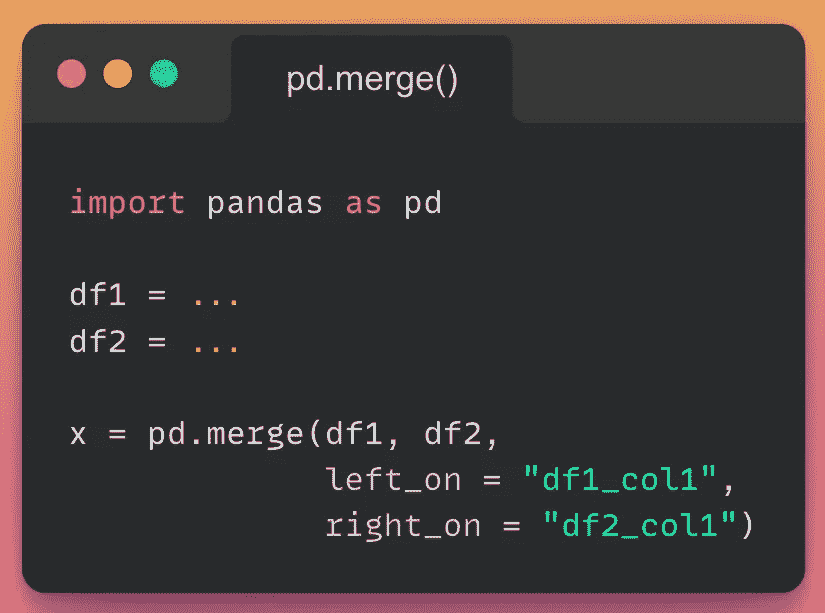
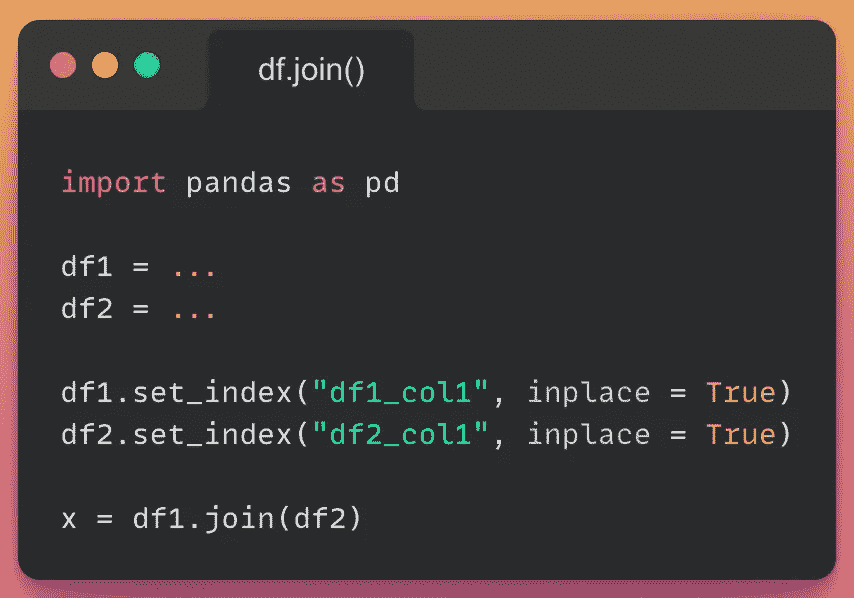
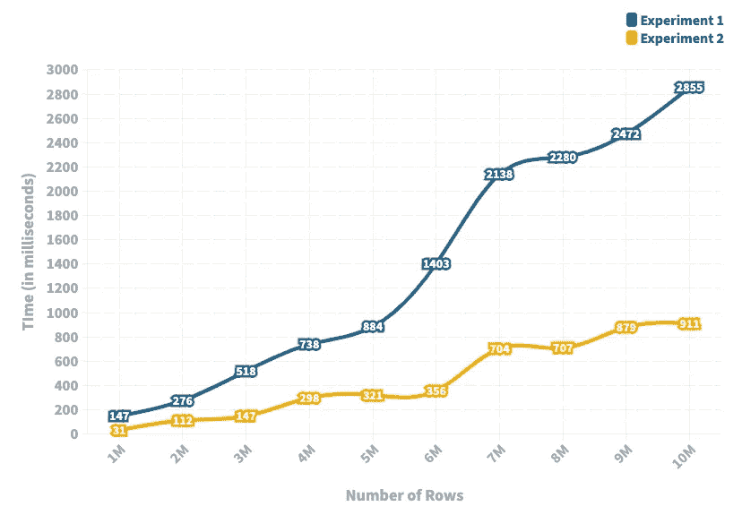

# 如何让熊猫加入速度提高 5 倍

> 原文：<https://towardsdatascience.com/how-you-can-make-pandas-joins-5-times-faster-3ef0d157e70b>

## pd.merge()的更快替代方案

乔纳森·彼得森在 [Unsplash](https://unsplash.com?utm_source=medium&utm_medium=referral) 上拍摄的照片

处理真实世界的数据集一直吸引着数据科学家去大规模构建优化、高效和准确的系统。毫无疑问，优化是构建现实世界软件解决方案成功的关键。虽然我知道不是每个人都在大规模地构建解决方案，但是了解优化技术仍然是有帮助的，甚至适用于一般的数据科学用例。

因此，在这篇文章中，我将考虑 Pandas 中最受欢迎的函数之一，即**连接、**，并通过实验证明分享如何优化 Pandas 合并操作近 5 倍。如果你对熊猫的加入不熟悉，我强烈推荐[这篇](https://pandas.pydata.org/docs/reference/api/pandas.DataFrame.merge.html?highlight=merge#pandas.DataFrame.merge)文章，以便在继续下一步之前了解它们。

# 实验 1:使用 pd.merge()

pd.merge 的代码片段(作者使用 snappify.io 创建的图像)

这里，我们创建两个虚拟数据帧，并使用 [pd.merge()](https://pandas.pydata.org/docs/reference/api/pandas.merge.html) 函数合并它们——显式地指定对哪些列执行合并操作。

# 实验 2:索引列并使用 df.join()

pd.join 的代码片段(作者使用 snappify.io 创建的图像)

类似于实验 1，我们创建两个虚拟数据帧。然而，我们不是直接进行连接，而是首先索引数据帧，然后采用 [J](https://pandas.pydata.org/docs/reference/api/pandas.DataFrame.join.html?highlight=join#pandas.DataFrame.join) OIN 方法来合并数据帧。

# 实验设置:

*   在两个实验中，即实验 1 和实验 2，两个数据帧都具有相同数量的行和两列，其中一列用于连接数据帧。
*   我考虑了不同大小的数据帧，从 100 万行到 1000 万行，每次实验都将行数增加 100 万。
*   我在固定数量的行上重复了十次实验性试验，以消除任何随机性。
*   下面，我报告了这十次试验中合并操作的平均运行时间。

# 结果:

现在，是时候给出令人难以置信的结果了。

描述连接操作运行时的实验结果(图片由作者创建)

*   上面的图描述了实验 1 中执行合并操作和实验 2 中执行(索引+合并)操作所花费的时间(以毫秒为单位)。
*   正如我们从图中看到的，两个实验的运行时间有很大的不同——实验 2 的速度接近实验 1 的 5 倍。
*   随着数据帧大小的增加，两个实验的运行时间之间的差异也增加。这表明索引应该始终是您处理较大数据集的方式。
*   两个连接操作*几乎都随着数据帧的大小而线性增加。然而，实验 2 的运行时间增加的速率远低于实验 1。*

最后，我强烈建议阅读这篇文章的每个人立即停止使用 pd.merge()来执行连接操作，尤其是如果您正在处理大量数据的话。

感谢阅读。我希望这篇文章是有帮助的。

作者创造的模因