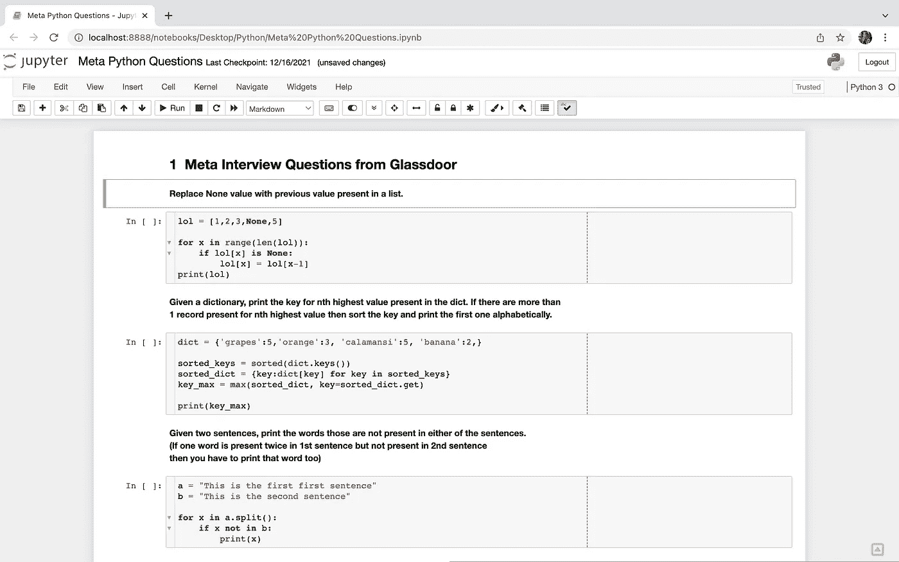
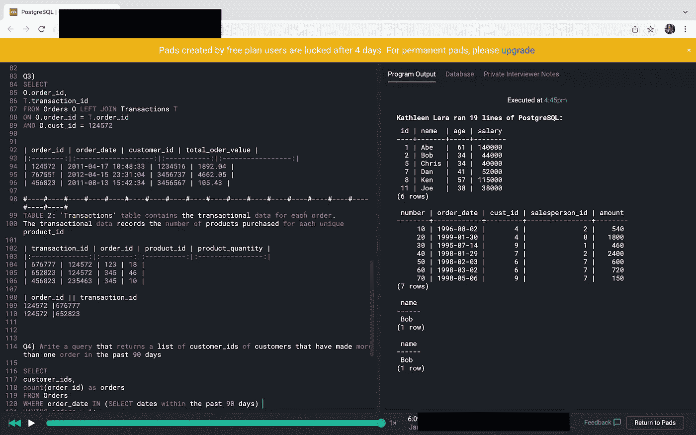

# 如何准备现场编码数据科学家面试

> 原文：<https://towardsdatascience.com/how-you-can-prepare-for-your-live-coding-data-scientist-interview-5ae343b97ae5>

## 找到真正的面试问题，并使用在线工具，这将帮助你粉碎你的下一个现场编码面试。

来自[像素](https://www.pexels.com/photo/photo-of-professor-teahcing-his-student-6325984/)的图像

现在，大多数数据科学职位都要求你懂一两门编程语言，而现场编码是面试过程中的一个重要部分。这里有一些建议可以帮助你准备下一次面试。

# 准备面试

确保你问你的招聘人员他们是否有面试指南或者你可以浏览的示例编码问题。

他们通常建议解决一些 leetcode 或 hackerrank 问题。如果您想熟悉从基础到高级的语法，这些问题非常有用。除此之外，你还可以上**玻璃门**、**盲人**或 **reddit** 网站，尽可能多地收集面试问题，然后把它们全部放在一个文档里，解决所有问题。

我记得大约一年前我在 Meta 面试的时候，我从和我一起面试的人那里收集了大约 30 个编程(python 和 SQL)问题，我试着在给自己计时的同时解决所有的问题。

我用的是 python 的 jupyter notebook(py charm 或者其他任何工具也可以)。glassdoor 上分享的一些问题写得不好，但很容易得到上下文，所以你可以重写它。

作者图片

对于 SQL，我用 coderpad 来练习。Coderpad 有一个免费版本，你可以创建一个小数据库，在那里你可以尝试做一些查询。

作者图片

只要能运行代码，也可以用其他工具来练习。我建议尝试 coderpad，因为大多数公司都使用这个工具(或类似的工具，但外观相同)进行现场编码面试——你可以熟悉一下。

# 在现场编码采访中

**慢慢来**

不要埋头解决问题，退一步，花时间讨论给出的问题。确保你理解被询问的内容和数据。这真的很重要，尤其是如果你面试的是数据科学或数据工程的职位。

例如，如果要求您创建一个按产品列出的总销售额表，并且您有像产品价值和订单价值这样的列，如果您对这些列的理解是正确的，您可以首先确认它们(即，产品价值是否为您提供了产品的价格，订单价值是否为您提供了包括产品和其他一些东西在内的整个订单的价值？)一旦你确认了这些，就更容易理解如何找到正确的解决方案。

**最糟糕的情况:你变得紧张，无法集中注意力**

当你紧张时，很难集中注意力并理解手头的问题，最糟糕的情况是——它会在你的大脑中引起轻微的恐慌，从而导致精神障碍。确保你随身带着笔和纸。当面试官提问时，记下问题(比如做笔记)。另外，用要点写下关于这个问题的额外信息。这将有助于你更好地处理信息，也有助于你在陷入沉思时记住被问到的问题。

我个人总是随身带着笔和纸，因为我发现复杂的东西读两遍后更容易理解。之后勾画出我的想法也有助于我更有条理和验证我的解决方案。

你的面试官是你的朋友

你的面试官是你的编程伙伴——可以随意问他任何关于语法的问题。如果你不确定如何解决问题，你可以寻求解决问题的建议。

# 面试后

他们通常会问你是否有问题要问他们。我通常会准备一两个与他们的角色、他们使用的工具或他在采访中提到的任何我感兴趣的问题。

在你发完感谢邮件后，去点餐或烹饪你最喜欢的食物，因为你应该为你所有的努力工作得到奖励！

**推特:**【https://twitter.com/itskathleenlara】T4

**网址:**[https://www.kathleenlara.com/](https://www.kathleenlara.com/)