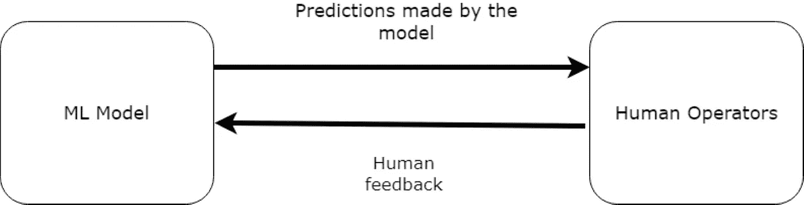
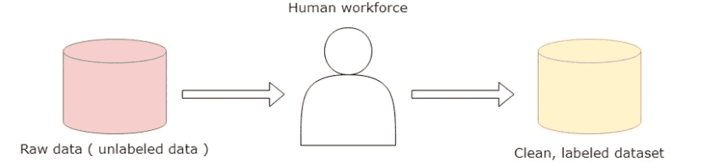

# 人在回路系统—您需要知道的一切

> 原文：<https://towardsdatascience.com/human-in-the-loop-systems-all-you-need-to-know-c260920b8acf>

## 关于 HITL 系统你需要知道的一切

[Unsplash](https://unsplash.com?utm_source=medium&utm_medium=referral) 上[叫我小羊~~~](https://unsplash.com/@eltonchen?utm_source=medium&utm_medium=referral) 的照片

今天，机器学习系统已经在每个行业取得了进展，无论是医学、考古学、购物、物流等。随着使用的增加，开发人员需要确保他们的系统能够很好地处理不断变化的数据、不同的地理位置以及各种各样的客户或最终用户。以及最近在机器学习研究中获得势头的良好性能、可解释性和数据隐私。

由于模型的所有参数都是使用训练数据来优化的，因此该模型可以被认为是数据的高级汇总。确保良好的培训数据是一项挑战，尤其是当这项任务在 ML 行业相对较新的时候。数据也随地区而变化；例如特定语言的口音(对于音频分类问题)、温度和压力之类的物理参数(对于天气预报)、消费者行为的变化等等。

考虑到所有这些问题，**人在回路(HITL)系统**已经被开发团队引入并采用。它帮助他们将人类知识和监督引入他们的 ML 系统，从而提高系统的整体性能和可靠性。

# 人在回路(HITL)系统

典型的 HITL 系统。来源:作者图片

> *HITL 系统让人类参与到改进 ML 系统的过程中，从而打破了计算机在最终决策过程中的自主性*

拥有大量处理和数学的人工智能系统旨在为人类客户服务。如果最终客户不满意，没有什么算法是好的。HITL 将人类智能与机器智能相结合，以解决机器学习任务。手动标记数据实例是最简单的一种 HITL 活动，可以在 ML 开发团队中看到。

人类和机器知识的组合也可以用于提供增强的结果，因为人类和机器都可以解决彼此的限制，从而最大化系统的整体性能。在某些情况下，在事先有高质量数据集的情况下，该模型可以被训练来制定人类行为。我们将涵盖 HITL 系统的各个方面，并探索它们在解决复杂问题方面的真实潜力。

# HITL 系统有什么帮助？

## ML 系统中的透明度

当我们在 ML 系统中引入一个人时，这个系统需要能够被人类自己解释。引入人工操作员可以增强系统的可解释性。在对人的监视中采取了关键步骤，这使得系统透明。深度神经网络的可解释性已经取得了进展，深度神经网络通常被称为*、【黑盒】、*，因为很难理解某个预测是如何做出的。

## 处理边缘用例

在数据中发现异常值。来源:作者图片

通常，在机器学习中，我们的目标是训练一个对异常值具有鲁棒性的模型。离群值是与其他数据点显著不同的数据点。但是在某些情况下，特别是对于随时间演变的数据，离群值可能有助于理解用户/消费者行为中可能出现的某些趋势。

这使得开发人员在将新的 ML 系统部署到产品中时缺乏信心。作为第一次迭代，ML 系统可能还不够成熟，不足以处理边缘情况。这种情况可以由人类审查员来处理，以便纠正模型所犯的错误。这些极端情况可以进一步分析，并可以并入 ML 模型的训练中。这确保了安全性和不断改进的 ML 系统。

## 确保更安全的 ML 系统

ML 系统可用于安全性和可靠性是必须的情况。在实验室和诊所使用 ML 系统必须安全，因为结果直接关系到患者的健康。让人类专家作为系统的一部分确保了安全性和精确性。监控生产线上产品质量的机器人也需要高效，因为任何故障都可能导致工业损失。

在有限数量的样本上训练的 ML 系统在一些真实世界场景中可能表现不佳。在这种情况下，人类可以纠正系统的预测，从而避免任何不幸。从另一个角度来看，人类专家也会犯错误，或者对同一问题有不同的看法。这种复杂情况可以用 ML 系统来处理，ML 系统被训练成在类似的情况下执行相同的操作。因此，ML 系统纠正人类，人类反过来纠正 ML 系统，从而产生更精确和安全的系统。

## 现成任务的数据标签

数据标签。来源:作者图片

对于像识别数字、英语到法语的翻译、人体姿势估计这样的任务，管理数据集是很容易的，因为它们已经在学术和工业用例中广泛使用。

考虑到语言翻译，可能无法获得一小部分人使用的语言的数据。类似地，对于人类姿态估计，指示关节和身体部位的位置的姿态数据点对于某些姿态可能是不可用的，这些姿态是不常见的，但是对于要解决的问题是必不可少的。

在没有数据来训练(或测试)ML 系统的任务中，开发人员需要收集数据并标记。让人类来标记数据将提供高质量的训练样本，这将产生高效的 ML 系统。

# HITL 系统的方法

## 亚马逊土耳其机械公司

亚马逊机械土耳其人(abbrev。MTurk)是一种为数据标记、内容审核、调查等提供分布式劳动力的服务。他们的劳动力分布在世界上的几个国家，这有助于消除分配给他们的任务中的任何形式的偏见。

该服务可在 HITL 系统中发挥重要作用，通过按需临时劳动力构建高质量数据集。他们还可以分析模型的预测，并指导开发人员如何解决特定的问题或异常值。

## 文本分类

文本分类是自然语言处理(NLP)中最基本的任务之一，其中用户给定的句子被分成两个或多个类别。HITL 系统是由 *Karmakharm 等人【1】*在谣言分类任务中引入的，恰好是文本分类的一个用例。他们获得了一个谣言新闻文章或帖子的数据集，然后在其上训练了一个谣言分类系统(文本分类器)。接下来，记者被要求回顾模型的预测，并相应地进行修正。然后，将这些校正/人工注释合并到数据集中，并重新训练模型。

由于文本分类系统大多是深度神经网络，它们缺乏可解释性，因此被称为“黑盒”。使用 HITL 方法，确保了洗钱系统的透明度。

## 图像恢复

图像恢复指的是那些提高噪声/损坏图像质量的技术。通过在过程中引入人类，HITL 方法可用于改进模型的预测。 *Weber 等人【2】*在他们的研究“跟我一起画:人在回路中的图像恢复”中实现了这样一种方法，其中人类知识可以嵌入到模型的预测中，以改善每次迭代的图像恢复。在他们的方法中，图像首先通过图像恢复模型进行初步恢复。然后，这些恢复的图像被传递给操作员，操作员可以通过预先设计的用户界面对图像进行微调。微调后的图像再次被传递给图像恢复模型。

因此，循环继续，直到产生满意的图像。这样，考虑到用户的需求，人类的知识可以用来为模型提供关于如何恢复图像的先验信息。

*[1] T. Karmakharm，N. Aletras，K. Bontcheva，“记者-in-loop:作为谣言分析服务的持续学习”，自然语言处理实证方法会议(EMNLP)，2019 年，第 115-120 页。*

*[2] T. Karmakharm，N. Aletras，K. Bontcheva，“记者-in-loop:作为谣言分析服务的持续学习”，自然语言处理实证方法会议(EMNLP)，2019 年，第 115-120 页。*

# 结束了

希望你喜欢这个故事。如果你有任何疑问/建议，请在下面的评论中告诉我。感谢您的阅读，祝您有美好的一天！