# 人类与机器:将我在 Wordle 中的表现与算法进行比较

> 原文：<https://towardsdatascience.com/human-vs-machine-comparing-my-performance-in-wordle-against-an-algorithm-ac449ca76124>

## 基于统计和线性规划的比较

鸣谢:[布雷特·乔丹](https://unsplash.com/@brett_jordan)在 [Unsplash](https://unsplash.com/photos/POMpXtcVYHo) (照片在 Unsplash 许可下免费使用)

对于过去几个月没有上过网的人(或者只是没有玩过这个游戏)，Wordle 是一个你有六次机会猜一个五个字母的单词的游戏。在每一次尝试中，游戏都会给你最后一个单词的信息。例如:

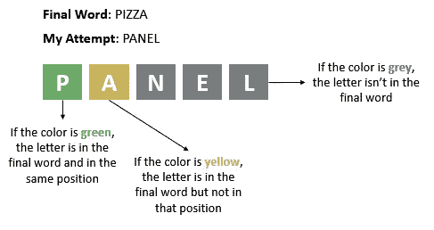

Wordle 规则解释(鸣谢:图片由作者提供)

为了找到这个词，一个人应该有某种策略。就个人而言，为了做出正确的预测，我通常会用我的前两次尝试来“探索”字母表，并试图找到尽可能多的关于最终单词组成的信息(重要的是要提到，因为我来自阿根廷，所以我用西班牙语玩[Wordle](https://wordle.danielfrg.com/))。一旦我这样做了，我用我的其他尝试来猜测最后的单词。

考虑到这种方法和我是一个好胜的人的事实，我想挑战自己，看看我是否能够**创造一种算法，以尽可能最好的方式做到这一点**(或者看看我是否能够*击败机器* ) **。**

我应该如何构建这个算法？我怎么能做出这样的猜测呢？我怎样才能做出*正确的*猜测？如何找到可能的单词？这些问题反映了这样一个事实，即有许多事情需要解决。这样，最终的解决方案应该有几个步骤:生成一个单词语料库，找到将用于探索阶段的好单词，然后尝试使用 Wordle 结果来过滤可能的猜测。我还想尝试一种不同的方法，远离信息论(正如我看到的最流行的视频一样，使用了这种技术)。我将在下面的段落中解释整个过程；然而，我在这个流程图中总结了我的算法的方法:

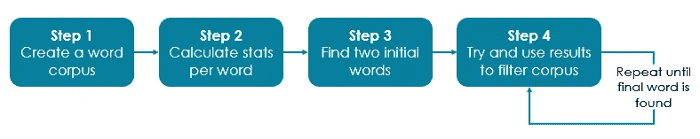

鸣谢:作者图片

## 步骤 1:创建一个单词语料库

为了在 Wordle 中拥有可能是潜在猜测的单词，需要有一个“数据库”或语料库:为此，我使用了 Reese 等人在 2010 年使用的多个维基百科文章(Samuel Reese，Gemma Boleda，Montse Cuadros，Lluís Padró，German Rigau。维基百科:词义消歧的多语言维基百科语料库。《第七届语言资源与评估会议论文集》(LREC'10)，拉瓦莱塔，马尔他。2010 年 5 月)，可以从 [Kaggle](https://www.kaggle.com/datasets/rtatman/120-million-word-spanish-corpus?resource=download) 下载。值得一提的是，维基百科的文章内容可以根据以下[文章](https://en.wikipedia.org/wiki/Wikipedia:Copyrights)中的许可下载。浏览每篇文章的内容，我现在可以有一个由五个字母组成的西班牙语单词的代表性样本。

## 步骤 2:预处理和计算每个单词的统计数据

一旦我们有了一系列可以用来计算统计数据的文本，就有必要考虑如何给单词定性。为此，我创建了两个不同的指标(我不想破坏太多，但这些将在以后使用)

*   *频率*:一个词在文章中出现了多少次
*   *letter_score* :出现在特定单词中的字母的频率总和

在这个意义上， *frequency* 谈论的是单词，而 *letter_score* 谈论的是单词中的字母。因此，我们可以有一个在西班牙语中不常见的单词，但有常见的字母(低*频率*，但高*字母分数*)或反之亦然。

为了做到这一点，我们首先使用下面的函数计算每个单词和字母的频率(注意，我做了一些预处理，从元音中去掉重音，并将每个单词转换为小写):

现在我们有了这个，我们使用创建的字典来创建 *word_stats_dict* ，它有 *letter_score* :

## 第三步:找到用于探索的两个初始单词

让我们回想一下，在我采用的策略中，我使用了我在 Wordle 中的前两次尝试来探索“搜索空间”，试图获得尽可能多的关于最终单词的信息(这里，获得信息很简单:**不是猜测最终单词，而是组成它的字母**)。现在，怎样才能设计出好的探索呢？我用来开发这个的主要假设有两个:

1.  如果我们找到尽可能多的字母信息会更好(在这两个单词中重复一个字母是不明智的)
2.  如果我们能找到在最后一个单词中的字母就更好了

现在，第一点是关于我将首先尝试的单词的条件:它们必须是两个五个字母的单词，有十个不同的字母。然而，第二点有点棘手，因为不可能直接知道答案(这是游戏的重点！).

然而，我们可以尝试找到一个尽可能好的解决方案:如果我们考虑一下，最终的单词更有可能有频繁的字母(即，一个单词更有可能有字母“a”，而不是字母“x”)。因此，前两种尝试应该由常用的字母组成。这很好，因为我们有一个统计数据可以测量这个值:字母分数！**因此，我们要寻找的是两个单词，有十个不同的字母，同时最大化所获得的选择**的 *letter_score* 。

考虑到我们正在尝试最大化一个度量值( *letter_score* 的总和)，同时满足一些条件(只选择两个单词并有十个不同的字母)，我们可以使用线性编程来实现这一点([大英百科全书](https://www.britannica.com/science/linear-programming-mathematics)将线性编程定义为“一种数学建模技术，其中线性函数在受到各种约束时被最大化或最小化”)。

我们以数学方式表示线性模型，如下所示:

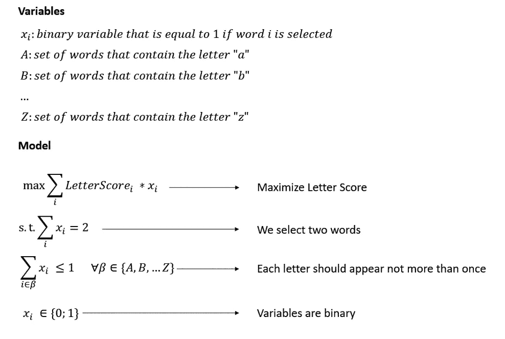

鸣谢:作者图片

为了实现这一点，我们使用或工具 Python 库，如下面的代码所示。我不会涉及太多细节，但是如果你想查看关于线性编程模型实现的更深入的文章，你可以查看下面的[文章](/playing-moneyball-creating-an-efficient-nba-team-with-linear-programming-ef14f6383861)。

模型运行后，选取的词是“leido”(等于“read”的过去式)和“trans”。有趣的是，“雷多”这个词在文章中只出现了 616 次，而“反”这个词却出现了 733 次。然而，它们被选中是因为，正如我们提到的，它们是由常见的字母组成的。最后，**我必须澄清，在我运行算法的每一天，我在我的第一次尝试中使用了同样的两个词**，因为模型的最优值每天都在变化。此外，值得一提的是，可能有几个最佳单词:如果它们具有与“leido”和“trans”相同的字母组成，任何两个单词的组合都可以使用(只要它在 Wordle 的语料库中)。

## 步骤 4:猜测和过滤语料库

一旦我们有了初步的猜测，我们必须找到一种方法来过滤我们的语料库，根据 Wordle 的结果只保留合适的单词。首先，我们如何与 Worldle 互动？我没有找到一个 API 或任何可以给出结果信息的东西，所以基本上，我是手动完成的:

1.  用户通过命令行书写单词
2.  用户通过命令行写入结果

我们如何写结果？由于有三种可能的结果，我们为每一种结果使用一个代码:

*   1 表示字母不在单词中
*   2 表示字母在单词中，但顺序不同
*   3 表示字母在单词中，并按顺序排列

这可以这样来说明:

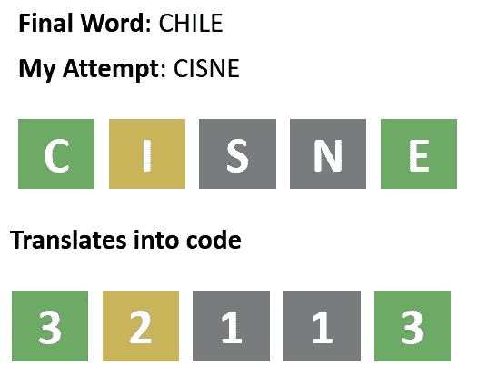

鸣谢:作者图片

为了给出一个更" *pythonesque* "的例子，交互看起来是这样的:

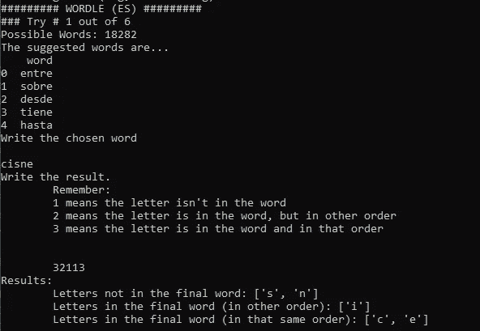

鸣谢:作者图片

您还可以看到代码给出了五个建议单词的列表。玩了几次 Wordle 之后，**我注意到，一般来说，最后一个单词是一个非常常见的单词，所以在这里，使用频率**来计算建议。显然，在第一次尝试中，我们有完整的语料库，所以建议只是出现频率最高的词。

有趣的部分是我们如何使用结果来过滤我们的语料库并提出更好的建议。要做到这一点，我们需要将我们尝试的每个字母与其结果对应起来，并使用它来找到“有资格”成为最终解决方案的单词。首先，我们所做的是检查我们输入单词的每个字母(即我们的猜测)，看看它是出现一次还是两次。这是因为 Wordle 的工作方式:假设最后一个单词是“PANEL”，我们的尝试是“PAPEL”(西班牙语中“paper”的意思)，由于字母“P”出现了两次，Wordle 会将第一个涂成绿色，而将下一个涂成灰色，因此我们需要在代码中考虑这一点，考虑每个不同结果的最佳和最差结果:

既然我们已经在尝试中评估了每个字母的频率，我们就准备用硬规则评估来过滤结果，这很简单

对于我们语料库中的每个单词，我们都会进行评估，比较 *input_word* 中的字母和结果，创建一个标志来指示该单词是否有资格作为潜在的最终解决方案，这是一种“该单词有资格，直到被证明不是这样”的方法。重要的是，我假设没有一个字母可以在 *input_word* 中出现两次以上。对于 *input_word* 中的每个字母，我们评估如下:

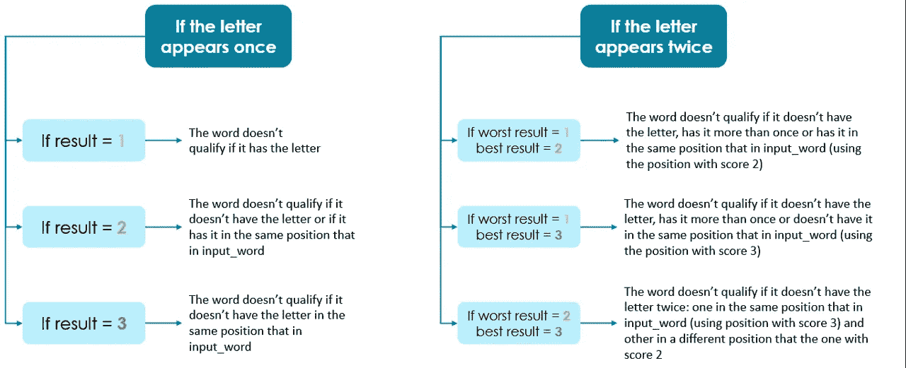

鸣谢:作者图片

给定一个由变量 *text* 定义的单词，通过以下函数进行过滤:

现在我们有了一种过滤语料库的方法，游戏的方式很简单:尝试一个单词(对于我们的前两次尝试，我们已经知道我们将使用哪个-trans 和 leido-)，写下结果，申请过滤器，然后用最频繁的合适的单词再试一次，直到你赢了！

## 评估结果

重要的是不仅要创建一个算法，还要评估它的性能。这就是为什么我将自己的性能与我的算法进行了整整一个月的比较(不用说，我澄清，即使在运行线性编程模型之后，我也没有改变我最初的两个词，用于探索搜索空间)。同样重要的是，考虑到所使用的策略，每天最好的可能结果是在 3 次尝试中获胜(因此，如果我们的算法在该尝试次数中赢得更多游戏，它将被认为更成功)。

首先，评估总体结果，我们看到，平均来说，该算法比我少尝试一次就能找到正确答案，这相当于减少了大约 20%。

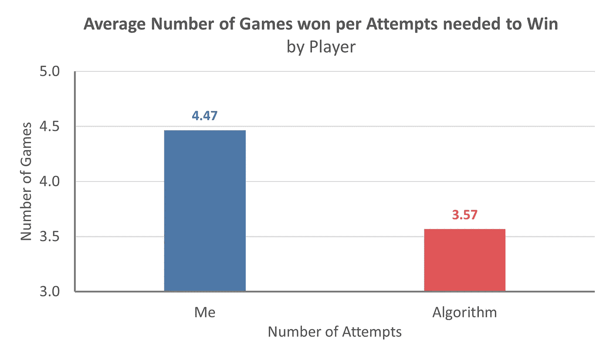

鸣谢:作者图片

此外，虽然我的尝试次数的分布具有对称形状(大多数获胜需要 4 到 5 次尝试，尽管有时我会尝试更少或更多)，但算法的分布似乎是指数的:尝试次数越多的概率不断降低:

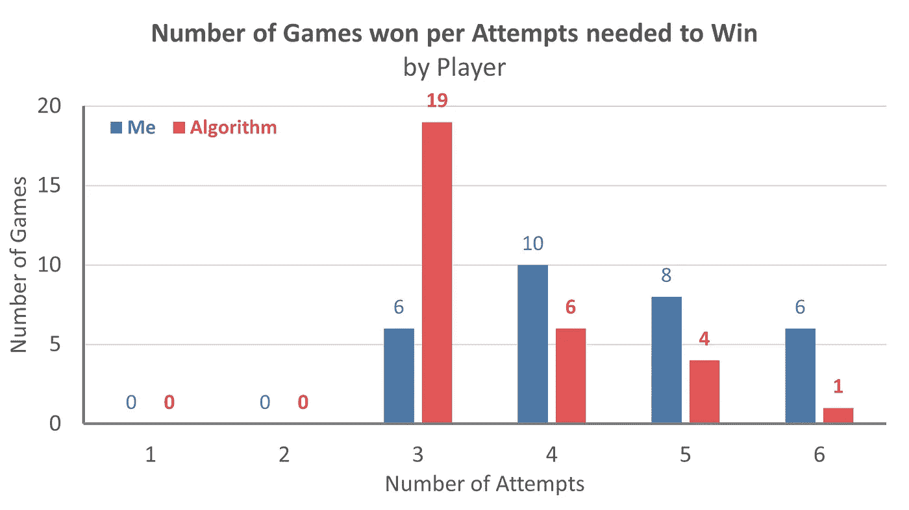

鸣谢:作者图片

当尝试查看我有多少次机会“击败机器”时，我失望地看到我只能这样做两次(7%的次数)，然而我得到了 10 次(33%的次数)，而机器赢得了 60%的次数:

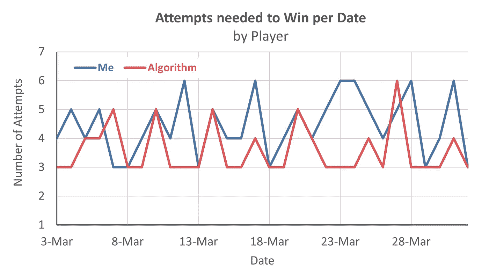

鸣谢:作者图片

此外，为了更好地理解算法的性能，我玩了 30 个级别的游戏 Wordly 和 Wordling(你可以在谷歌 Play 商店上获得的应用程序)，以查看算法的执行情况，并评估 Wordle 是否有任何差异。重要的是要提到，在这些游戏中，我并没有拿算法和自己的表现进行对比。

当评估平均表现和每场比赛尝试次数的分布时，3 场比赛的结果非常相似(Wordle 似乎稍难一些，因为平均尝试次数高 4%)。然而，有趣的是看到了如此相似的分布:

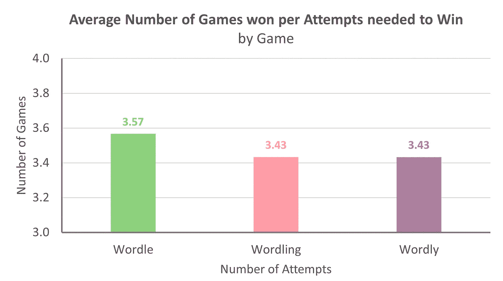

鸣谢:作者图片

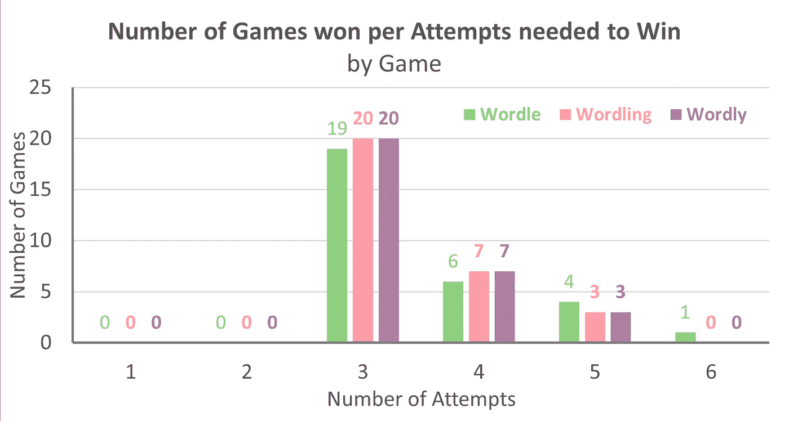

鸣谢:作者图片

考虑到这些结果和我们的策略，我们可以说该算法在大约 66%的情况下运行良好，因为它能够在 3 次尝试中猜出最终的单词。如果我们允许一次额外的尝试，这个数字上升到 88%。

最后，评估算法有效性的另一种方法是评估每次尝试时我们的语料库中还剩多少单词。如果我们的线性规划模型足够好，那么在尝试 3 中我们将只剩下几个单词。平均评估结果，我们可以看到为什么我们的策略包含两个初始单词:当只使用一个初始单词时，我们剩下大约 930 个选项，这可能很多；然而，当使用额外的尝试来探索时，我们剩下大约 28 个单词，这是更容易管理的东西(考虑到我们能够将潜在单词的数量减少 97%)！

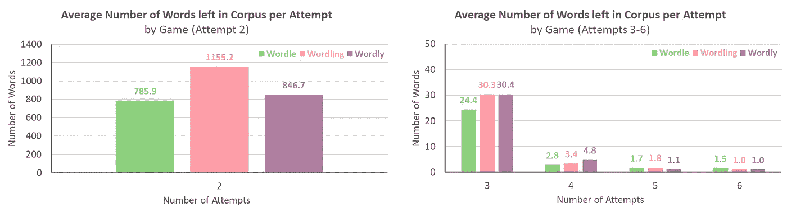

鸣谢:作者图片

然而，值得一提的是，当我们评估一些额外的统计数据(而不仅仅是平均值)时，我们还可以看到，总的来说，剩余单词的数量有很大的可变性(特别是在第二次尝试中)。然而，我相信这进一步证明了为什么使用两个开头的单词可能是个好主意:

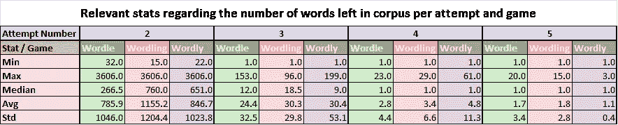

鸣谢:作者图片

就这些，希望你喜欢这篇文章！如果你想更深入地了解这些代码，你可以在下面的回购协议中查看:

<https://github.com/nicogarciaara/play_wordle> 