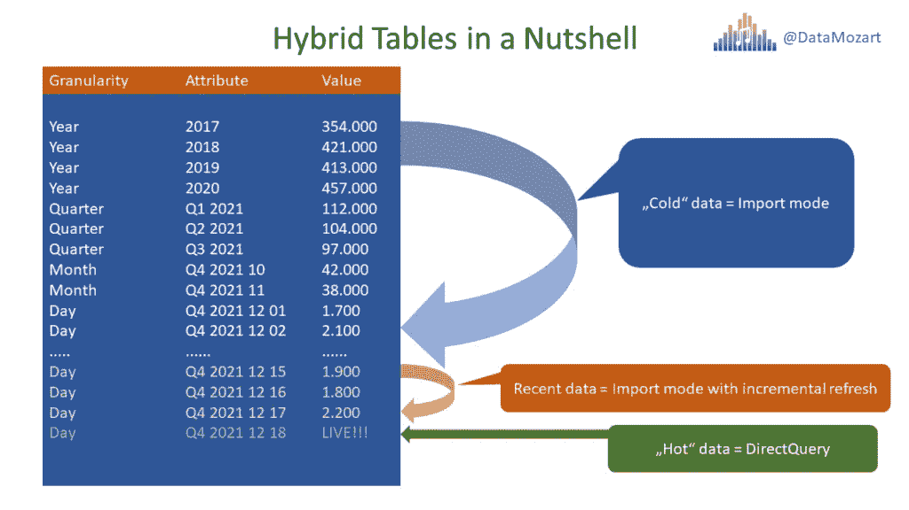
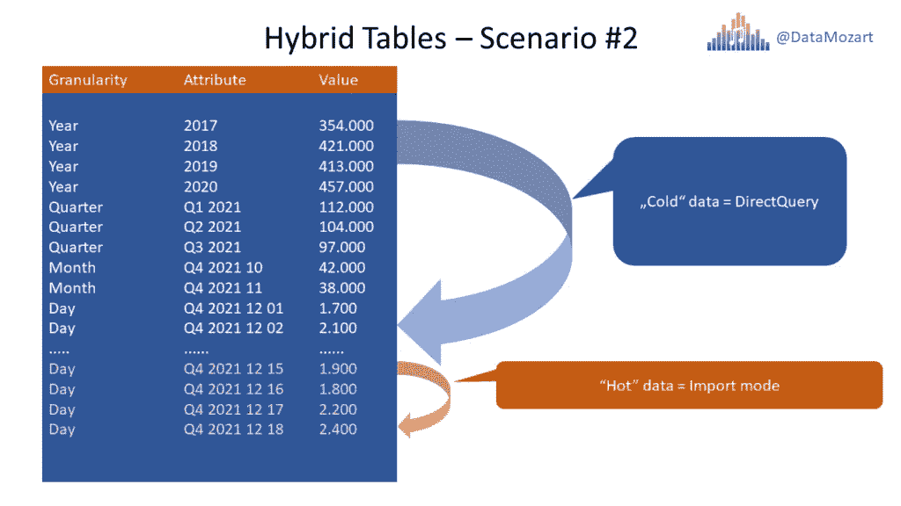
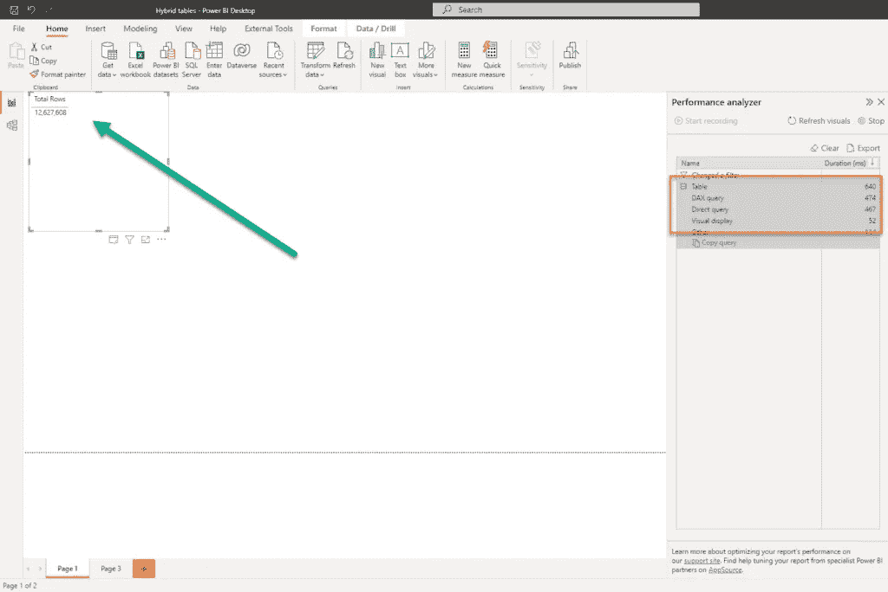
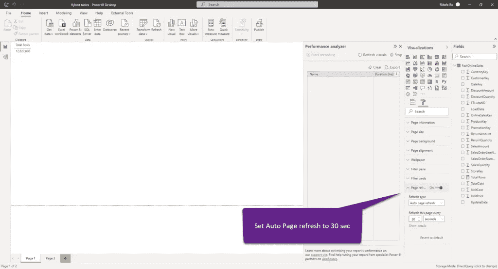
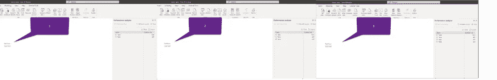
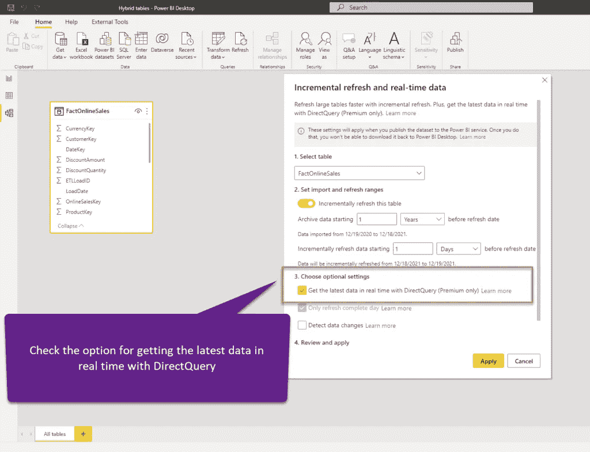
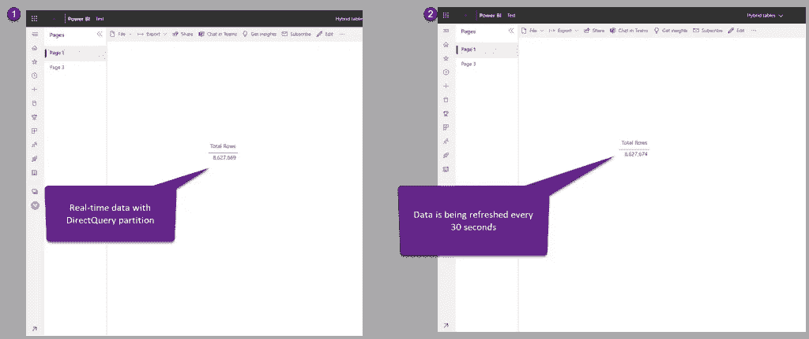
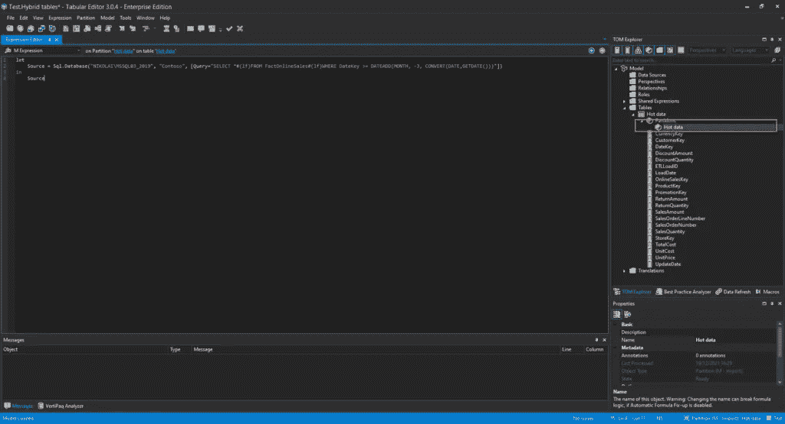
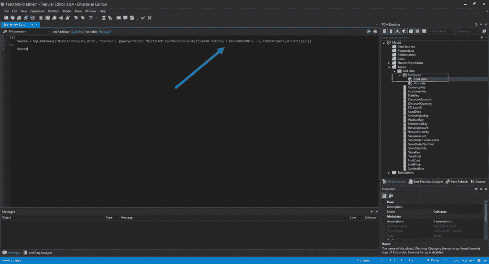
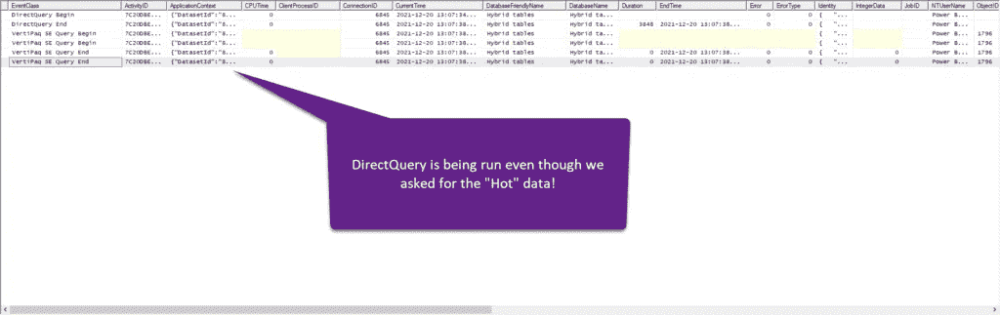

# Power BI 中的混合表——终极指南！

> 原文：<https://towardsdatascience.com/hybrid-tables-in-power-bi-the-ultimate-guide-bfe07d480275>

## 导入模式和 DirectQuery 在同一个表中？？？是的，借助 Power BI 中的最新混合表功能，可以从两个世界中获得最佳效果！


[图片由迈克尔·马莱在 Unsplash 上拍摄](https://unsplash.com/photos/HjV_hEECgcM)

你知道这些漂亮的新车吗？它们将使用电力带你穿过城市拥堵，而在高速公路上，它们通过利用传统的汽油系统，帮助你释放发动机的全部功率。有时电动马达做所有的工作，有时是汽油发动机，有时它们一起工作。结果是燃烧的汽油更少，因此燃油经济性更好(当然，环境也更清洁)。在某些情况下，增加电力甚至可以提高性能。

如果你有混合动力汽车的想法，你是对的…

现在，混合动力汽车与 Power BI 有什么共同之处？！嗯，最近以来，他们做到了——不是“汽车”本身，而是这种混合逻辑。

## 混合表—简短回顾

微软在 5 月的商业应用峰会上宣布了混合桌的概念。而且，我必须承认，这是我从那时起就热切期待的功能之一。不要误解我，所有那些很酷的迷你图，新的格式选项，人工智能内置功能都很好…但是，我只是一个更关心性能而不是[好看的仪表盘](/building-an-end-to-end-analytic-solution-in-power-bi-part-4-from-chart-to-insight-56a543861477)和视觉效果的人:)

***免责声明:*** 在撰写本文时，混合表仍是预览功能，因此一旦它普遍可用，可能会发生一些功能不同的情况。

## 那么，最初的混合表是什么呢？

好了，在回答这个简单的问题之前，我们需要回过头来重申一下 Power BI 中的一个基本概念——***存储模式*** 。一旦开始构建您的解决方案，您就可以为您的表选择三种不同的存储模式: **Import** 模式(这是默认的，也是最常用的)， [**DirectQuery**](https://data-mozart.com/direct-query-in-power-bi-what-when-why/) (在查询执行之前、期间和之后，数据驻留在 Power BI 表格模型之外)，或者 **Dual** (数据被导入到缓存中，但也可以在查询时直接从数据源提供)。

这个具体考虑:“我应该使用导入模式还是 DirectQuery？”总是在性能和报告中实时数据的要求之间进行权衡。

并且，现在让我们来回答原来的问题: ***混合表在单个表*** 中结合了 Import 和 DirectQuery 模式！在我们深入研究并试图理解混合表在多种不同场景中的行为之前，让我们解释一下混合表如何帮助您在性能和实时数据需求之间实现最佳平衡。

# 场景#1 —导入模式中的“冷”数据，DirectQuery 中的“热”数据

使用这种方法，您基本上是在优先考虑实时需求，但是混合表应该可以帮助您获得比“纯”DirectQuery 场景更好的性能比。这是怎么回事？好吧，假设你有一个有 5 亿行的巨型事实表。而且，业务要求数据的最大延迟为 1 分钟——显然，即使[能够将 5 亿行数据加载到内存](/power-bi-how-to-fit-200-million-rows-in-less-than-1gb-63ab5a4eb1c0)中，也无法如此频繁地设置计划刷新！

因此，唯一可行的选择是将表保持在 DirectQuery 模式，忍受用户抱怨报告非常慢。不再是了！以下是混合桌可以帮您节省时间的方法:



作者图片

让我们简单地检查一下上图背后的逻辑。想象一下，您的大多数分析查询都是针对过去 7 天的数据，但是还额外要求实时获得最新数据！历史数据不是特别感兴趣，只是偶尔需要。

在这种情况下，混合表有什么好处？首先，不是在 DirectQuery 模式下保留整个“5 亿行”表，而是只有“最热”的数据保留在将使用 DirectQuery 模式提供服务的分区中。而且，我猜您可以假设需要扫描 10.000 行而不是 5 亿行的查询的性能会有什么不同…

接下来，您可以获得查询“最近”数据(本月最后 X 天的数据)的额外性能提升，因为您可以为该数据配置增量刷新，并从缓存中提供查询…我们稍后将了解如何配置混合表以用于该场景，但我有一个好消息:除了选中几个复选框之外，您基本上不需要做任何特别的事情！

# 场景#2 —导入模式中的“热”数据，DirectQuery 中的“冷”数据

第二个场景和上一个是 180 度！而且，这个场景让人想起我们现在正在用聚合和复合模型来获得两个世界的最佳效果。本质上，我们在原始的 DirectQuery 事实表[中保留历史的、低级别的数据，同时聚合“热”数据并将其导入 Power BI](/power-bi-how-to-fit-200-million-rows-in-less-than-1gb-63ab5a4eb1c0) 中，以获得 VertiPaq 引擎提供的最佳性能。



作者图片

通过这种设置，我们优先考虑性能和[减少数据模型大小](/how-to-reduce-your-power-bi-model-size-by-90-76d7c4377f2d)而不是实时需求。这个场景适合于大多数分析查询针对最近的数据，但是*没有具体要求实时数据*的情况！这样做是为了减少表的内存占用，因为大部分数据不会导入到 Power BI 中，而是继续“存在”在 SQL 数据库中。

对于这个需求，没有现成的解决方案可以为您处理混合场景，并且需要一些额外的工作来配置表。请继续关注，稍后我将向您展示这是如何做到的…

# 为场景#1 做好准备

好了，理论到此为止，是时候动手实践一下混合表在现实中是如何工作的了。让我们首先检查场景#1。但是，在我们配置混合表之前，我将首先在“常规”表上运行一些测试查询，这样我们可以稍后比较性能。

我将使用示例 Contoso 数据库中的 FactOnlineSales SQL Server 表，该表包含 1260 万行。假设我们的报表用户想要实时查看最新的数据，那么我们将让我们的表处于纯 DirectQuery 模式。

我将创建一个简单的 DAX 度量来计算总行数:

总行数= COUNTROWS(FactOnlineSales)

我还将打开性能分析器工具来[捕获 Power BI 生成的时间](/how-to-capture-sql-queries-generated-by-power-bi-fc20a94d4b08)，因为我们的表使用“纯”DirectQuery 存储模式。



作者图片

如您所见，表中有 1260 万行，Power BI 需要大约 0.5 秒返回结果。由于我的用户需要看到实时数据，我将打开[自动页面刷新功能](/auto-page-refresh-in-power-bi-everything-you-need-to-know-a6e7bd9d0444)，并设置我的页面每 30 秒刷新一次。



作者图片

同时，我将对 FactOnlineSales 表运行以下 SQL 查询:

```
WHILE 1=1
BEGIN
   WAITFOR DELAY '00:00:05' -- Wait 5 seconds

  INSERT INTO dbo.FactOnlineSales
  (
      DateKey,
      StoreKey,
      ProductKey,
      PromotionKey,
      CurrencyKey,
      CustomerKey,
      SalesOrderNumber,
      SalesOrderLineNumber,
      SalesQuantity,
      SalesAmount,
      ReturnQuantity,
      ReturnAmount,
      DiscountQuantity,
      DiscountAmount,
      TotalCost,
      UnitCost,
      UnitPrice,
      ETLLoadID,
      LoadDate,
      UpdateDate
  )
  VALUES
  (   GETDATE(), -- DateKey - datetime
      1,         -- StoreKey - int
      1,         -- ProductKey - int
      1,         -- PromotionKey - int
      1,         -- CurrencyKey - int
      1,         -- CustomerKey - int
      N'',       -- SalesOrderNumber - nvarchar(20)
      NULL,      -- SalesOrderLineNumber - int
      0,         -- SalesQuantity - int
      10,      -- SalesAmount - money
      0,         -- ReturnQuantity - int
      NULL,      -- ReturnAmount - money
      NULL,      -- DiscountQuantity - int
      NULL,      -- DiscountAmount - money
      5,      -- TotalCost - money
      NULL,      -- UnitCost - money
      NULL,      -- UnitPrice - money
      NULL,      -- ETLLoadID - int
      NULL,      -- LoadDate - datetime
      NULL       -- UpdateDate - datetime
      )

END
```

这个语句基本上模拟了一个真实的事务数据库，每 5 秒钟插入一个新行。请不要注意语句中提供的所有值，因为这只是一个虚拟表。一旦我执行了这条语句，并将自动页面刷新设置为每 30 秒一次，在三次运行中的每一次中，一个查询花费大约 0.5 秒来返回总行数。您可能会注意到行数在可视化中是如何变化的:



作者图片

是时候配置我们的混合表了，看看会发生什么。第一步是将表从 DirectQuery 切换到 Import 模式，因为混合表只适用于 Import 模式——本质上是通过使用 DirectQuery 为最新数据在其上添加“实时”分区。然后，我将数据集发布到高级工作空间(在本演示中我使用 PPU)。完成后，我将返回并为我的表选择增量刷新:



作者图片

我将我的数据集发布到 Power BI 服务，并等待第一次刷新完成(这可能需要一段时间，因为需要创建表分区并加载“冷”历史数据)。一旦完成，这是我们的报告:



作者图片

您可能会发现，数据是实时变化的，因为我们将自动页面刷新设置为 30 秒，DirectQuery 分区只扫描最新的数据来满足这个查询请求。

这里的关键要点是:通过利用混合表，我们设法从两个世界中获得最佳效果——保持 VertiPaq 引擎的超快性能，同时使报告消费者能够实时更新数据！

# 配置场景#2

在第二个场景中，我们不能依赖 Power BI 在导入数据的分区上自动应用 DirectQuery 分区。正如已经提到的，在这种情况下，我们需要一些额外的工作来设置东西。总体思路是翻转需求，将“热”数据保留在导入模式中，而将“冷”数据保留在 DirectQuery 中。

这里的第一个警告是，您不能在这种情况下使用 Power BI Desktop，因为 Power BI Desktop 不允许您创建自定义分区。但是，这里的好消息是，我们可以使用外部工具通过 XMLA 端点操纵 TOM(表格对象模型)。为此，最流行的工具是[表格编辑器](/top-features-in-tabular-editor-3-to-boost-your-power-bi-development-6140d90d2cac)。

简而言之，我们希望将“热”和“冷”数据分割到不同的分区中:

```
SELECT *
FROM FactOnlineSales
WHERE DateKey >= DATEADD(MONTH, -3, CONVERT(DATE,GETDATE()))
```

这是将包含前 3 个月的“热”数据的分区。你可以根据需要调整这个门槛。

这是我的分区定义在表格编辑器中的样子:



作者图片

我已经将现有分区重命名为热数据。下一步是复制这个分区，并将源查询调整为只针对“冷”数据(在我的例子中，是超过 3 个月的数据):



作者图片

我现在将这个查询的模式属性从 Import 切换到 DirectQuery:


作者图片

我将保存包含所有更改的数据集，并打开 SQL Server Profiler 来检查它在不同的日期分片要求下的表现:



作者图片

即使我们对过去 3 个月的数据进行切片(“热”数据)，仍有 DirectQuery 在后台运行！感谢微软的王南钧·萨考斯基的提醒，他警告说这种事情还在发生！

因此，我真的希望不要编写复杂的 DAX 来获得最高性能，就像我在这里解释的[一样，通过利用混合概念，我们将能够在数据模型的性能和内存占用之间获得最佳平衡。但是，如果对“热”或“冷”数据进行切片，DirectQuery 查询似乎仍然会运行。](/how-to-reduce-your-power-bi-model-size-by-90-76d7c4377f2d)

# 考虑和限制

无论看起来多么酷和强大(它们确实很酷和强大)，实现混合表都有一些限制。

首先，这是(至少目前是)仅 ***高级特性*** ，这意味着您需要一个 P/EM/A SKU，或 PPU(每用户高级)来利用混合表。

接下来，由于所有场景中都涉及到 DirectQuery，您应该知道适用于 DirectQuery 模式的所有一般[限制](https://docs.microsoft.com/en-us/power-bi/connect-data/desktop-use-directquery#considerations-and-limitations)。这意味着，没有复杂的幂查询转换，没有复杂的 DAX 计算——或者简单地说——忘记任何不能转换成 SQL 的东西[！](/what-is-a-query-folding-in-power-bi-and-why-should-i-care-5b89f42f38d7)

此外，无论您是否仅筛选来自导入分区的数据，DirectQuery 分区仍将包括在扫描中。我真诚地希望微软的工程师们能够提出一个解决方案，在查询不需要的时候消除 DirectQuery 分区。

此外，在您选择“混合动力”之前，还有一些事情需要记住:

*   一旦您将数据集发布到 Power BI 服务，您就不能再次从 Power BI Desktop 重新发布相同的数据集，因为这将删除数据集中已经存在的任何现有分区和数据
*   将数据集发布到 Power BI 服务时，不能将带有数据集的 PBIX 下载回 Power BI Desktop

感谢阅读！

[成为会员，阅读 Medium 上的每一个故事！](https://datamozart.medium.com/membership)