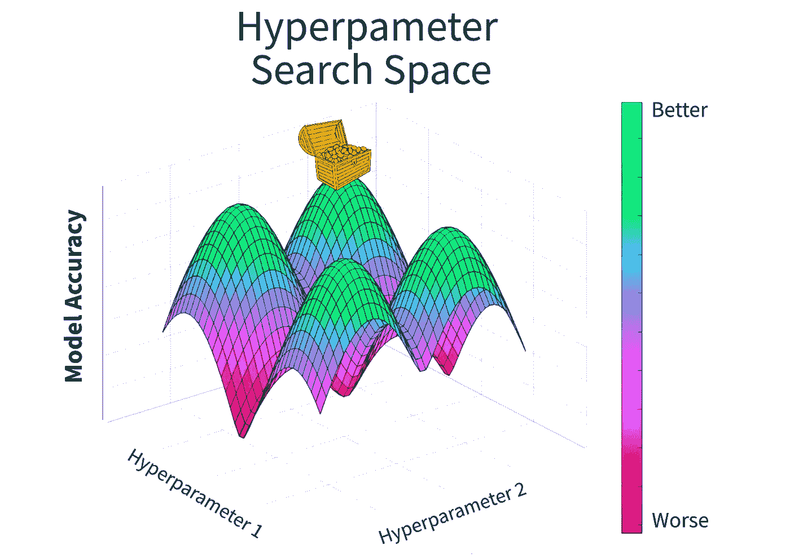
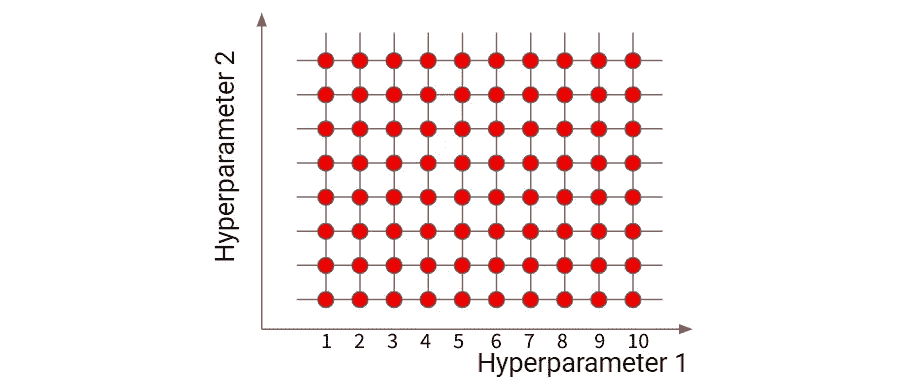
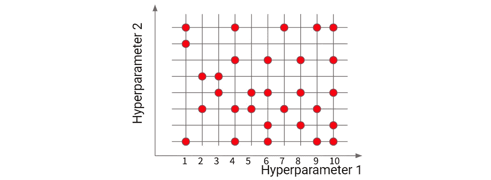
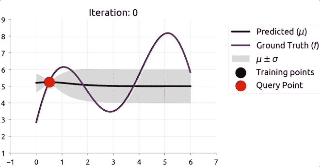
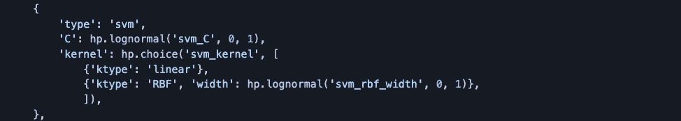
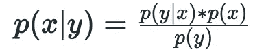
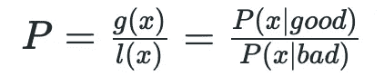
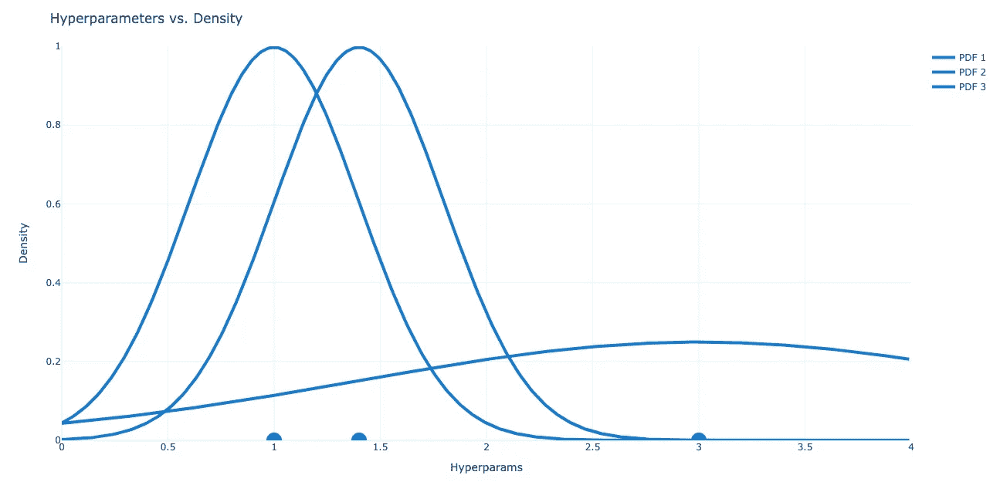
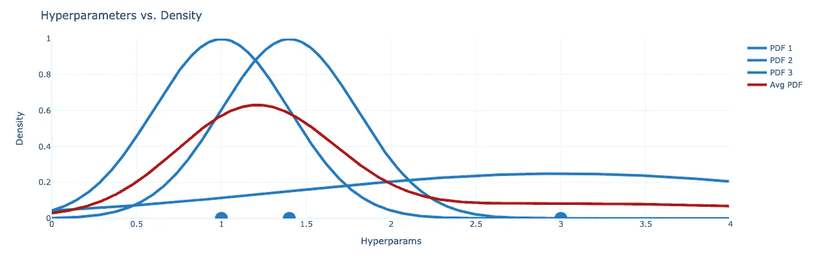

# 远视去神秘化

> 原文：<https://towardsdatascience.com/hyperopt-demystified-3e14006eb6fa>

## 如何使用 HyperOpt 自动调整模型

你喜欢调模型吗？如果你的答案是“是”，那么这篇文章对你来说是**而不是**。

我爷爷的一幅漫画——[网站](https://cartoonsbydale.com/gallery-1)。

在这篇博客中，我们将介绍非常流行的自动超参数调整算法，称为[基于树的 Parzen 估计器](https://proceedings.neurips.cc/paper/2011/file/86e8f7ab32cfd12577bc2619bc635690-Paper.pdf) (TPE)。开源包 HyperOpt 支持 TPE。通过利用 HyperOpt 和 TPE，机器学习工程师可以**快速开发高度优化的模型，而无需任何手动调整**。

事不宜迟，我们开始吧！

# 技术 TLDR

HyperOpt 是一个开源 python 包，它使用一种称为基于树的 Parzen Esimtors (TPE)的算法来选择优化用户定义的目标函数的模型超参数。通过简单地定义每个超参数的函数形式和边界，TPE 彻底而有效地搜索复杂的超空间以达到最优。

TPE 是一种顺序算法，它利用贝叶斯更新并遵循以下顺序。

1.  用几组随机选择的超参数训练模型，返回目标函数值。
2.  根据某个阈值γ，将我们观察到的目标函数值分成“好”和“坏”组。
3.  计算“承诺度”得分，正好是*P(x |好)/P(x |差)*。
4.  通过混合模型确定最大化承诺的超参数。
5.  使用步骤 4 中的超参数拟合我们的模型。
6.  重复步骤 2-5，直到达到停止标准。

这里有一个[快速代码示例](https://github.com/hyperopt/hyperopt/wiki/FMin)。

# 1 —什么是超参数调谐？

好吧，这是很多大词。让我们慢下来，真正明白发生了什么。

## 1.1 —我们的目标

数据科学家很忙。我们希望生产出真正好的模型，但是要以一种有效的、理想的不干涉的方式来实现。

然而，ML 建模生命周期中的某些步骤很难自动化。例如，探索性数据分析(EDA)和特征工程通常是特定于主题的，并且需要人类的直觉。另一方面，模型调整是一个迭代过程，计算机在这个过程中表现出色。

**我们在这篇文章中的目标是理解如何利用算法来自动化模型调整过程。**

为了帮助我们思考这个目标，让我们打个比方:我们是寻找宝藏的海盗。同样重要的是要注意到我们是非常高效的海盗，他们希望尽量减少我们寻找宝藏的时间。那么，我们应该如何最大限度地减少搜索时间呢？答案是**用地图！**

图`1`:3D 超参数搜索空间示例。藏宝箱的位置是全局最优的。图片作者。

在图 1 中，我们有一个虚拟的地图，显示了我们的宝藏所在的位置。经过大量的攀爬和挖掘，找到宝藏并不困难，因为我们知道它的确切位置。

但是当我们没有地图时会发生什么呢？

当我们负责调优一个模型时，不幸的是没有给我们一张地图。我们的地形，对应于超参数搜索空间，是未知的。此外，对应于最优超参数集的我们的宝藏的位置也是未知的。

有了这个设置，让我们来讨论一些有效探索这个空间和找到一些宝藏的潜在方法！

## 1.2 —潜在解决方案

模型调整的原始方法是“手动的”——工程师实际上会手动测试许多不同的配置，并查看哪个超参数组合产生最佳模型。虽然信息丰富，但这一过程效率低下。一定有更好的方法…

**1.2.1 —网格搜索(最差)**

我们的第一个优化算法是网格搜索。网格搜索迭代地测试用户指定网格内超参数的所有可能组合。

图 2:网格搜索布局的例子。作者图片

例如，在图 2 中，你看到红点的地方就是我们重新训练和评估模型的地方。这个框架是低效的，因为它重用了坏的超参数 T4。例如，如果超参数 2 对我们的目标函数几乎没有影响，我们仍然会测试它的值的所有组合，从而将所需的迭代次数增加 10 倍(在本例中)。

但在继续之前，重要的是要注意网格搜索仍然相当流行，因为它保证在给定正确指定的网格的情况下找到最优解。如果你决定使用这种方法，确保你转换你的网格来反映你的超参数的函数形式。例如，[随机森林分类器](https://scikit-learn.org/stable/modules/generated/sklearn.ensemble.RandomForestClassifier.html)的 max_depth 是一个整数——不要让它搜索连续的空间。它也不太可能具有均匀分布，如果您知道超参数的函数形式，请变换网格以反映它。

总之，**网格搜索受到维数灾难的影响，并且在评估之间重新计算信息，但是仍然被广泛使用。**

**1.2.2 —随机搜索(好)**

我们的第二个算法是随机搜索。随机搜索在用户指定的网格中尝试随机值。与网格搜索不同，我们不需要测试每个可能的超参数组合，这提高了效率。

图 3:随机搜索的例子。图片作者。

这里有一个很酷的事实:随机搜索将在 [60 次迭代](https://web.archive.org/web/20160701182750/http://blog.dato.com/how-to-evaluate-machine-learning-models-part-4-hyperparameter-tuning)中找到(平均)前 5%的超参数配置。也就是说，和网格搜索一样，你必须转换你的搜索空间来反映每个超参数的函数形式。

**随机搜索是超参数优化的良好基础。**

**1.2.3 —贝叶斯优化(更好)**

我们的第三个候选算法是我们的第一个基于序列模型的优化(SMBO)算法。与现有技术的关键概念差异是我们**迭代地使用先前的运行来确定未来的勘探点。**

图 4:贝叶斯优化示例— [src](https://distill.pub/2020/bayesian-optimization/) 。图片作者。

贝叶斯超参数优化试图开发我们的超参数搜索空间的概率分布。从那里，它使用一个获取功能，如预期改进，来转换我们的多维空间，使其更“可搜索”最后，它使用优化算法，例如随机梯度下降，来寻找使我们的获取函数最大化的超参数。这些超参数用于拟合我们的模型，并且重复该过程直到收敛。

**贝叶斯优化通常优于随机搜索，但是它有一些核心限制，例如需要数字超参数。**

**1.2.4 —基于树的 Parzen 估值器(最佳)**

最后，我们来谈谈这个节目的明星:基于树的 Parzen 估计器(TPE)。TPE 是另一种 SMBO 算法，通常优于基本贝叶斯优化，但主要卖点是它通过树结构处理复杂的超参数关系。

图 TPE 的层次结构示例— [src](https://github.com/hyperopt/hyperopt/wiki/FMin) 。图片作者。

让我们用图 5 来理解这个**树形结构**。这里我们正在训练一个支持向量机(SVM)分类器。我们将测试两个内核:`linear`和`RBF`。一个`linear`内核没有宽度参数，但是`RBF`有，所以通过使用嵌套字典，我们能够编码这个结构，从而限制搜索空间。

TPE 还支持传统贝叶斯优化所不支持的分类变量。

快速免责声明在继续之前，有[许多其他超参数调整包](https://neptune.ai/blog/best-tools-for-model-tuning-and-hyperparameter-optimization)。每个都支持各种算法，其中一些包括随机森林、高斯过程和遗传算法。TPE 是一种非常流行的通用算法，但不一定是最好的。

**总的来说，TPE 是一个真正强大而高效的超参数优化解决方案。**

# 2 —基于树的 Parzen 估计器(TPE)是如何工作的？

现在，我们已经对一些流行的超参数优化算法有了大致的了解，让我们来深入了解一下 TPE 是如何工作的。

回到我们的类比，我们是寻找宝藏的海盗**，但是没有地图**。我们的船长需要尽快找到宝藏，所以我们需要在有很高可能性找到宝藏的战略地点挖掘，利用之前的挖掘来确定未来挖掘的位置。

## 2.1 —初始化

首先，我们**定义空间**的约束。如上所述，我们的超参数通常具有函数形式、最大/最小值以及与其他超参数的层级关系。利用我们对最大似然算法和数据的了解，我们可以定义我们的搜索空间。

接下来，我们必须**定义我们的目标函数**，它用于评估我们的超参数组合有多“好”。一些例子包括经典的 ML 损失函数，如 RMSE 或 AUC。

太好了！现在我们有了一个有限的搜索空间和一个衡量成功的方法，我们准备开始搜索…

## 2.2 —迭代贝叶斯优化

贝叶斯优化是一种顺序算法，根据目标函数在超空间中找到“成功”概率高的点。TPE 利用贝叶斯优化，但使用一些聪明的技巧来提高性能和处理搜索空间的复杂性…

**2.2.0 —概念设置**

第一个技巧是建模 *P(x|y)* 而不是 *P(y|x)…*

图 TPE 寻求解决的条件概率。图片作者。

贝叶斯优化通常着眼于模型*P(y | x)*，这是给定超参数( *x* )的目标函数值( *y* )的概率。TPE 做相反的事情——它观察模型 *P(x|y)，*，这是给定目标函数值( *y* )的超参数( *x* ) *，*的概率。

**简而言之，TPE 试图找到最佳的目标函数值，然后确定相关的超参数。**

有了这个非常重要的设置，让我们进入实际的算法。

**2.2.1 —将我们的数据分为“好”和“坏”组**

记住，我们的目标是根据某个目标函数找到最佳的超参数值。那么，我们如何利用 *P(x|y)* 来做到这一点呢？

首先，TPE 将我们观察到的数据点分成两组:**好的**，记为*g(x)*和**差的**，记为 *l(x)* 。好与坏之间的界限由用户定义的参数 gamma (γ)确定，该参数对应于分割我们的观察结果的目标函数百分点( *y** )。

因此，当γ = 0.5 时，分割我们观察值的目标函数值( *y** )将是我们观察点的中值。

图 7:将 p(x|y)分解成两组。图片作者。

如图 7 所示，我们可以使用上面的框架形式化 *p(x|y)* 。用海盗的比喻来说…

> 海盗视角:看看我们已经探索过的地方，l(x)列出了宝藏很少的地方，g(x)列出了宝藏很多的地方。

**2.2.32—计算“承诺性”得分**

第二，TPE 定义了我们应该如何通过**“承诺度”得分**评估未观察到的超参数组合。

图 8:承诺分数定义。图片作者。

图 8 定义了我们的承诺分数( *P* )，这只是以下几个部分的比率…

*   **分子**:观察到一组超参数的概率( *x* ，给定对应的目标函数值为“**好**”
*   **分母**:观察一组超参数的概率( *x* ，给定对应的目标函数值为“**坏**”

**“承诺”值越大，我们的超参数 *x* 产生“良好”目标函数的可能性就越大。**

> 海盗视角:许诺性显示了在我们的地形中某个给定的位置有多少可能拥有大量的宝藏。

在继续之前，先说一句，如果你熟悉贝叶斯优化，这个等式就像一个获取函数，与[预期改善(EI)](http://krasserm.github.io/2018/03/21/bayesian-optimization/) 成比例。

**2.2.3—创建概率密度估计值**

第三，TPE 希望通过[混合模型](https://www.cs.toronto.edu/~rgrosse/courses/csc311_f20/readings/L10%20Mixture%20Modeling.pdf)评估“承诺度”得分。**混合模型的思想是取多个概率分布，用一个线性组合——**[**src**](https://www.coursera.org/lecture/mixture-models/basic-definitions-Eh35h#:~:text=Mixture%20models%20are%20probability%20distributions,sense%20using%20a%20linear%20combination.)**把它们放在一起。然后，这些组合的概率分布被用于开发概率密度估计。**

一般来说，混合物建模过程是…

1.  **定义我们积分的分布类型。**在我们的案例中，如果我们的变量是分类的，我们使用重新加权的分类分布，如果是数值的，我们使用高斯(即正态)或均匀分布。
2.  **迭代每个点，并在该点插入一个分布。**
3.  **对所有分布的质量求和，以获得概率密度估计值。**

请注意，该过程是针对两组 *l(x)* 和 *g(x)单独运行的。*

让我们看一下图 9 中的例子…

图 9:适合 3 个超参数观测值的截断高斯分布示例。图片作者。

对于每个观察值(x 轴上的蓝点)，我们创建一个正态分布~N(μ，σ)，其中…

*   **μ (mu)** 是我们正态分布的均值。它的值是我们点在 x 轴上的位置。
*   **σ (sigma)** 是我们正态分布的标准差。其值是到最近邻点的距离**。**

如果点靠得很近，标准差会很小，因此分布会很高，反之，如果点分散，分布会很平坦(图 10)

图 10:标准偏差对正态分布形状影响的例子。图片作者。

> 海盗视角:不——海盗不擅长混合模型。

在继续之前，另一个快速旁白:如果您正在阅读文献，您会注意到 TPE 使用“截断”高斯，这仅仅意味着高斯受我们在超参数配置中指定的范围限制，而不是扩展到+/-无穷大。

确定下一个探索点！

让我们把这些碎片放在一起。到目前为止，我们已经 1)获得了目标函数观察值，2)定义了我们的“前景”公式，以及 3)通过基于先前值的混合模型创建了概率密度估计。我们有所有的片段来评估给定的点！

我们的第一步是为 *g(x)* 和 *l(x)* 创建一个平均概率密度函数(PDF)。

图 11:给定 3 个观察点的平均概率密度的叠加。图片作者。

图 11 显示了一个示例流程，红线是我们的平均 PDF，是所有 PDF 的总和除以 PDF 的数量。

**利用平均 PDF，我们可以得到任意超参数值( *x* )在 *g(x)* 或 *l(x)* 中的概率。**

例如，假设图 11 中的观察值属于“好的”集合， *g(x)* 。基于我们的平均 PDF，3.9 或 0.05 的超参数值不太可能属于“好”集。相反，一个~1.2 的超参数值似乎很可能属于“好”集。

这只是图片的一半。我们对“坏”集合应用相同的方法， *l(x)。*因为我们希望最大化 *g(x) / l(x)* ，**有希望的点应该位于 *g(x)* 高而 *l(x)* 低*的地方。***

很酷，对吧？

有了这些概率分布，我们可以从我们的树形结构超参数中进行采样，并找到最大化“承诺性”的超参数集，从而值得探索。

> 海盗视角:我们挖掘的下一个地点是最大化(拥有大量宝藏的概率)/(拥有少量宝藏的概率)的地点。

# 3-代码

现在您已经知道了它是如何工作的，下面是一些通过开源包 HyperOpt 实现 TPE 的实用技巧。

## 3.1 —超视 App 的结构

通常，利用 HyperOpt 时有三个主要步骤…

1.  **定义搜索空间，**搜索空间就是你要优化的超参数的范围和函数形式。
2.  **定义拟合函数**，该函数调用给定训练/测试分割的`model.fit()`函数。
3.  **定义目标函数**，它是任何经典的准确性度量，如 RMSE 或 AUC。

不幸的是，这些自动调优方法仍然需要数据科学家的设计输入——这不是完全免费的午餐。然而，有趣的是，TPE 对超参数错误设定相当稳健(在合理范围内)。

## 3.2—提示和技巧

*   HyperOpt 可以通过 [Apache Spark](https://docs.databricks.com/machine-learning/automl-hyperparam-tuning/hyperopt-concepts.html#:~:text=A%20Trials%20or%20SparkTrials%20object,Horovod%20in%20the%20objective%20function.) 和 [MongoDB](http://hyperopt.github.io/hyperopt/scaleout/mongodb/) 并行化。如果您正在使用多个内核，无论是在云中还是在本地机器上，这都会大大减少运行时间。
*   如果您正在通过 Apache Spark 并行化调优过程，那么对于单节点 ML 模型(sklearn)使用一个`SparkTrials`对象，对于并行化 ML 模型(MLlib)使用一个`Trails`对象。代码如下。
*   MLflow 是一个追踪模型运行的开源方法。它很容易与远视集成。
*   不要过早缩小搜索空间。超参数的一些组合可能会有惊人的效果。
*   定义搜索空间可能很棘手，尤其是如果您不知道超参数的[函数形式。然而，从个人经验来看，TPE 对于那些函数形式的错误指定是相当健壮的。](https://hyperopt.github.io/hyperopt/getting-started/search_spaces/)
*   选择一个好的目标函数大有帮助。在大多数情况下，误差是不相等的。如果某种类型的错误更有问题，请确保将该逻辑构建到您的函数中。

## 3.3—代码示例

下面是以分布式方式运行 HyperOpt 的一些代码。它改编自书中的代码，[机器学习工程在行动](https://www.manning.com/books/machine-learning-engineering-in-action)——这里是 [git repo](https://github.com/BenWilson2/ML-Engineering/tree/main/notebooks/ch08) 。

这个代码片段的一些不错的特性包括通过 [Apache Spark](http://hyperopt.github.io/hyperopt/scaleout/spark/) 的并行化和通过 [MLflow](https://mlflow.org/) 的模型日志。还要注意，这个代码片段优化了一个 sk learn RandomForestRegressor——您必须更改模型和拟合函数以适应您的需要。

最后，[原始代码](https://github.com/BenWilson2/ML-Engineering/tree/main/notebooks/ch08)非常有价值，并且没有被广泛利用。它有从`SparkTrials`对象中提取运行信息的方法，这些信息可以用来显示精度随时间的提高。**真正高 ROI 的活动是为您的数据科学团队调整和模块化原始代码的功能，这大约需要一天时间。**如果我错了，留下评论，我会删除这一段。

# 4 —摘要

这就是你要的——远视的荣耀！

为了强调关键点，让我们快速回顾一下。

超参数调整是 ML 模型生命周期的必要部分，但是非常耗时。基于序列模型的优化(SMBO)算法擅长于在复杂的超空间中搜索最优解，并且它们可以应用于超参数调整。基于树的 Parzen 估计器(TPE)是一种非常有效的 SMBO，其性能优于贝叶斯优化和随机搜索。

TPE 重复以下步骤，直到达到停止标准:

1.  根据一些超参数γ，将观察点分为“好”和“坏”组。
2.  将混合模型拟合到“好”和“坏”集，以开发平均概率密度估计。
3.  选择最大化“承诺”分数的点，这利用步骤 2 来估计在“好”和“坏”集合中的概率。

最后，我们有一个非常酷的代码片段，展示了如何通过 SparkTrials 并行化 HyperOpt。它还将我们的所有迭代记录到 MLflow 中。

*感谢阅读！我会再写 9 篇文章，把学术研究带到 DS 行业。如果你有兴趣，可以随时* [*关注我*](https://michaelberk.medium.com/) 🙂。