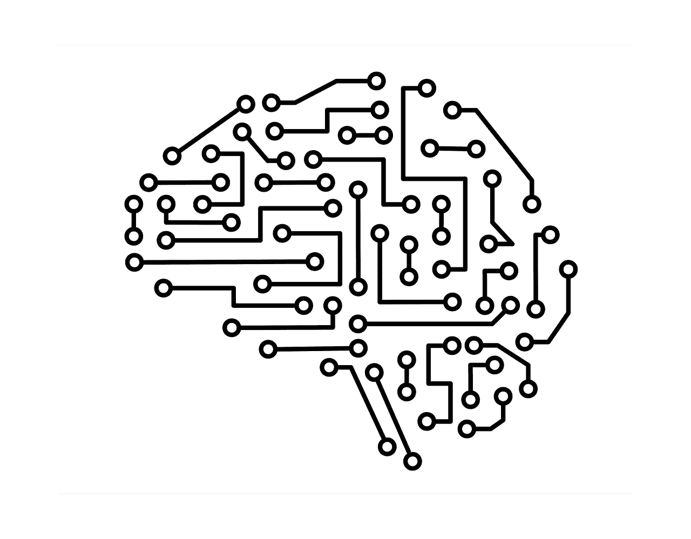
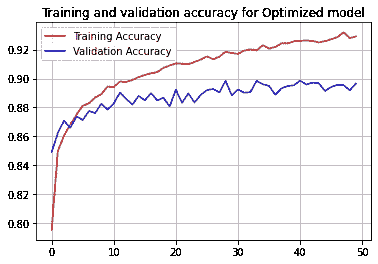
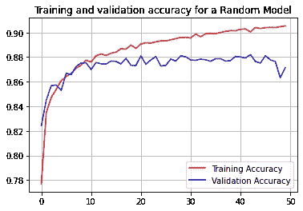
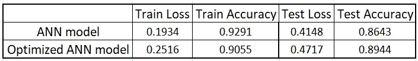

# 使用 Keras 调谐器对深度学习模型进行超参数优化

> 原文：<https://towardsdatascience.com/hyperparameter-optimization-for-deep-learning-models-with-keras-tuner-4c5010c9ad79>

## 可扩展的超参数优化框架解决了优化人工神经网络模型的难题



图片由[菲利普·马克特和](https://pixabay.com/users/marquetand-3570369/?utm_source=link-attribution&amp;utm_medium=referral&amp;utm_campaign=image&amp;utm_content=5076887)从[皮克斯拜](https://pixabay.com/?utm_source=link-attribution&amp;utm_medium=referral&amp;utm_campaign=image&amp;utm_content=5076887)拍摄

为了调整机器学习算法，Scikit-learn 包提供了 GridSearchCV、RandomSearchCV 的实现，以找到 ML 模型的最佳超参数集。但在训练深度学习(ANN)模型时，数据科学家往往难以找到正确的隐藏层数、每层神经元数量、辍学率和其他超参数。为了训练最优的深度学习模型，人们需要找到最佳的超参数集，这是一项非常繁琐的任务，需要硬编码或随着超参数的变化重新运行实验。

[KerasTuner](https://keras.io/keras_tuner/) 是一个易于使用、可扩展的超参数优化框架，解决了超参数搜索的痛点，并轻松搜索 ANN 模型的最佳配置。在本文中，我们将使用 Keras Tuner 为图像分类应用程序执行超调。

## 设置:

**数据集:**我们将使用 Keras Tuner 框架为一个 ANN 模型找到最佳的超参数集，该模型对来自 [***时尚 MNIST 数据集***](https://github.com/zalandoresearch/fashion-mnist)**(在* [*麻省理工学院许可*](https://github.com/zalandoresearch/fashion-mnist/blob/master/LICENSE) *)* 的服装图像进行分类。数据集是开源的，可以从`[tf.keras.datasets.fashion_mnist](https://www.tensorflow.org/api_docs/python/tf/keras/datasets/fashion_mnist)`访问。*

***安装:** KerasTuner 需要 **Python 3.6+** 和 **TensorFlow 2.0+，**确保按要求升级。Keras Tuner 可以从 PyPI 安装，使用:*

```
***!pip install -q -U keras-tuner***
```

# *Keras 调谐器:*

*KerasTuner 是一个易于使用、可扩展的超参数优化框架，它通过运行定义的语法为您的深度学习模型搜索最佳的超参数集。Keras Tuner 提供 4 种调谐器或算法，包括`**RandomSearch**`、`**Hyperband**`、`**BayesianOptimization**`和`**Sklearn**`，可执行超参数优化，并可扩展以试验新的搜索算法。*

*在本文中，我们将使用 Keras Tuner 框架优化一个 ANN 模型的 ***学习率*** 、 ***层数*** 、 ***每层神经元数、*** 和 ***辍学率*** 。*

> *现在，让我们从人工神经网络模型的实现开始，并使用 KerasTuner 软件包优化其超参数。*

## *1.下载并加载数据集:*

*在定义深度学习模型之前，让我们从加载数据集开始:*

*(代码由作者编写)，下载并加载训练和测试数据*

## ***2。定义人工神经网络模型:***

*深度学习模型架构是使用 Keras 实现定义的。我们可以使用 Keras Tuner 来调整:*

*   *致密层数(第 6 行)*
*   *每个致密层中的神经元数量(第 9、10 行)*
*   *辍学率(第 13、14 行)*
*   *学习率(第 20、21 行)*

*在建立深度学习模型时，可以定义超参数搜索空间进行优化。你为超调设置的模型叫做 ***超模*** 。我们将定义`**model_builder()**` 函数来定义超模。*

*(由作者编写代码)，使用由运行定义的 KerasTuner 语法定义 ANN 模型*

## *3.实例化 Keras 调谐器:*

*Keras 调谐器提供`**RandomSearch**`、`**Hyperband**`、**、**调谐器来优化超参数。要实例化调谐器，可以指定 hypermodel 函数和其他参数。*

***超波段:***

*超波段调优算法使用自适应资源分配和提前停止来快速收敛到高性能模型。*

*(代码由作者编写)，实例化 Hyperband 调谐器*

> *遵循 [KerasTuner 文档](https://keras.io/api/keras_tuner/tuners/hyperband/)获取 Hyperband 参数的描述。*

***随机搜索:***

*RandomSeach 算法遵循随机方法来选择超参数。*

*(作者代码)，实例化 RandomSearch 调谐器*

> *按照 [KerasTuner 文档](https://keras.io/api/keras_tuner/tuners/random/)获取 RandomSearch 参数的描述。*

## *3.运行超参数搜索:*

*`**tuner.search()**` 功能可用于在超模上运行超参数搜索。search 方法的参数与用于`tf.keras.model.fit`函数的参数相同。*

*(作者代码)，运行 hyperband 调谐器*

## *4.训练优化的模型:*

*`tuner.get_best_hyperparameters()`函数返回超模的最优超参数集。此外，可以传递同一组超参数来训练优化的 ANN 模型。*

*(由作者编码)，用最佳超参数集训练 ANN 模型*

# *输出:*

*下面的结果是通过在具有 60k 训练和 10k 测试样本 ***的 [***时尚 MNIST 数据集***](https://github.com/zalandoresearch/fashion-mnist)*上训练 ANN 模型而获得的。**** *优化的人工神经网络模型和具有下述硬编码超参数的人工神经网络模型的性能:**

******

(图片由作者提供)，**左:**在优化的超参数上训练的 ANN 模型的训练和验证精度，**右:**在硬编码的超参数上训练的 ANN 模型的训练和验证精度** ****

**(图片由作者提供)，人工神经网络/优化人工神经网络模型的训练测试损失和准确性**

**通过优化人工神经网络超参数，我们可以观察到约 3%的测试精度差异。**

# **结论:**

**Keras Tuner 框架可以帮助数据科学家通过优化超参数来训练一个强大的深度学习模型。在定义超模型时，数据科学家需要为每个超参数预先指定参数范围。**

**对于计算机视觉应用，还可以使用两个预定义的`HyperModel`类- [超例外](https://keras-team.github.io/keras-tuner/documentation/hypermodels/#hyperxception-class)和[超结果](https://keras-team.github.io/keras-tuner/documentation/hypermodels/#hyperresnet-class)。**

# **参考资料:**

**[1] KerasTuner 文件:[https://keras.io/keras_tuner/](https://keras.io/keras_tuner/)**

**[2]数据集(时尚 MNIST):[https://github.com/zalandoresearch/fashion-mnist](https://github.com/zalandoresearch/fashion-mnist)**

> **感谢您的阅读**