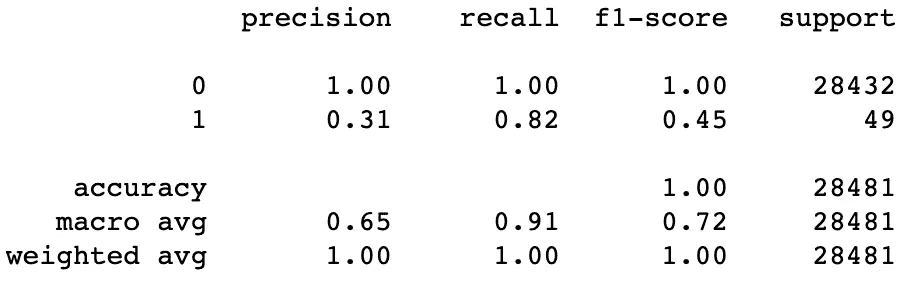
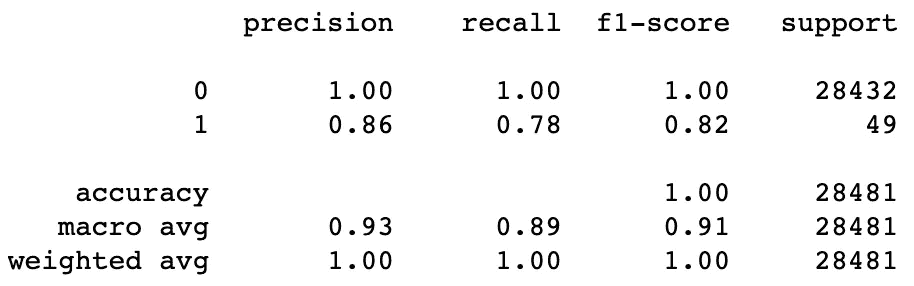

# 超参数调整和采样策略

> 原文：<https://towardsdatascience.com/hyperparameter-tuning-and-sampling-strategy-1014e05f6c14>

## ***利用流水线和超参数调优寻找最佳采样策略***

处理不平衡机器学习问题的关键步骤之一是对数据进行重新采样。我们可以对多数类进行欠采样和/或对少数类进行过采样。然而，有一个问题需要解决:我们应该将多数阶级减少到多少，和/或增加少数阶级？一种简单但耗时的方法是逐个改变多数类和少数类的重采样值，以找到最佳匹配。得益于[不平衡学习](https://imbalanced-learn.org/stable/)库和超参数调整，我们可以设计出一种高效且相对简单的方法来确定最佳重采样策略。

迪伦·麦克劳德在 [Unsplash](https://unsplash.com?utm_source=medium&utm_medium=referral) 上的照片

**建造管道**

选择[欺诈检测数据集](https://www.openml.org/search?type=data&sort=runs&id=1597&status=active)进行实验，该数据集 [CC 许可](https://creativecommons.org/licenses/by/4.0/)并可从 [OpenML 平台](https://www.openml.org/)访问。数据集有 31 个特征:其中 28 个特征(V1 到 V28)是数字特征，使用 PCA 进行转换以保持机密性；“时间”描述了每个事务经过的秒数；“金额”表示交易金额；“类别”表示交易是否是欺诈性的。数据非常不平衡，因为所有交易中只有 0.172%是欺诈性的。

  

为了确定最佳采样率，我们需要建立一个机器学习管道。许多数据爱好者更喜欢 scikit-learn 的管道，因为它提供了一种建立机器学习管道的简单方法。然而，欠采样和过采样不能使用常规 sklearn 流水线来完成，因为采样将在*拟合*和*变换*方法期间发生。这可以通过不平衡学习(imblearn)库实现的[管道类来弥补。imblearn 的流水线确保重采样只发生在*拟合*方法期间。](https://imbalanced-learn.org/stable/references/generated/imblearn.pipeline.Pipeline.html)

  

首先，我们将加载数据。然后，从数据中获取特征和标签，并创建训练测试分割，因此测试分割可用于评估使用训练分割训练的模型的性能。

一旦创建了训练集和测试集，就可以实例化管道。流水线由一系列步骤组成:转换数据、重采样和以模型结束。为了简单起见，我们将使用一个数值缩放器(来自 sklearn 的 [RobustScaler)来缩放数值字段(数据集中的所有特征都是数值)；然后是欠采样方法(](https://scikit-learn.org/stable/modules/generated/sklearn.preprocessing.RobustScaler.html?highlight=robustscaler#sklearn.preprocessing.RobustScaler) [RandomUnderSampler 类](https://imbalanced-learn.org/stable/references/generated/imblearn.under_sampling.RandomUnderSampler.html))、过采样方法( [SMOTE 算法](https://imbalanced-learn.org/stable/references/generated/imblearn.over_sampling.SMOTE.html))，最后是机器学习模型(我们使用的是 [LightGBM](https://lightgbm.readthedocs.io/en/latest/pythonapi/lightgbm.LGBMClassifier.html) ，一个实现梯度提升算法的框架)。作为初始基准，多数类欠采样到 10，000，少数类过采样到 10，000。

**初始建模**

在进行超参数调整之前，先训练一个初始模型。上一节中构建的管道在列车分裂上进行训练，然后在测试分裂上进行测试。由于我们选择的数据是高度不平衡的(在重采样之前)，只测量精度是无效的。因此，通过使用 [sklearn 的分类报告](https://scikit-learn.org/stable/modules/generated/sklearn.metrics.classification_report.html)，我们将监控两个类的精确度、召回率和 f1 分数。

评估基础管道的分类报告。图片由作者提供。

测试结果表明，虽然该模型在对非欺诈性交易进行分类方面工作得很好，但在检测欺诈方面却很差，因为精确度和 f1 分数都非常低。有了这个基准，我们将看到超参数调优如何帮助我们找到更好的采样率。

**调优寻找最佳采样率**

在本文中，我们将只关注欠采样和过采样技术的采样策略。最初，创建两个列表，其包括用于欠采样和过采样方法的不同采样策略。这些列表将用于从给定的采样策略中找到最佳的采样策略。

[GridSearchCV](https://scikit-learn.org/stable/modules/generated/sklearn.model_selection.GridSearchCV.html?highlight=gridsearchcv#sklearn.model_selection.GridSearchCV) 和 [RandomizedSearchCV](https://scikit-learn.org/stable/modules/generated/sklearn.model_selection.RandomizedSearchCV.html?highlight=randomizedsearchcv#sklearn.model_selection.RandomizedSearchCV) 是 sklearn 的两个超参数调优类，前者遍历提供的所有参数值以找到最佳值集，后者随机选择超参数值并运行，直到达到用户指定的迭代次数。在这个实验中，我们将使用 GridSearchCV 进行超参数调优。GridSearchCV 需要两个参数:*估计器*和 *param_grid* 。*估计器*是模型(在我们的例子中是管道)，而 *param_grid* 是一个字典，其中的键代表需要调整的参数，值代表参数的值集。

使用管道重新采样和构建模型可以更容易地执行超参数调整，并找到最佳采样策略。由于我们已经在管道中指定了欠采样和过采样技术的名称(如“欠采样器”和“过采样器”)，我们可以使用“__”来访问它们的参数，以使用该参数进行超参数调整(例如，“欠采样器 _ _ 采样策略”)。

一旦超参数调优完成，我们就可以从指定列表中获得欠采样和过采样的最佳采样策略集，然后用它们来训练流水线，评估其性能。

评估 hp 调整管道的分类报告。图片由作者提供。

使用超参数调整来寻找最佳采样策略是有效的，因为管道在检测欺诈交易方面有了显著的改进。

这篇文章的工作原理可以在这里找到。

 [## GitHub-Vaseekaran-V/HP _ Tuning _ Sampling _ Strategy:Repo 使用超参数调优来查找…

github.com](https://github.com/Vaseekaran-V/HP_Tuning_Sampling_Strategy) 

**最后的话**

在重采样时找到采样率的最佳点是耗时且复杂的，但机器学习管道和超参数调整可以提供一种简单的解决方案来缓解该问题。

本文研究了超参数调整对欠采样和过采样技术确定最佳采样比的影响，该解决方案相对容易实现。

我希望这篇文章对你有用，我[希望听到你对这篇文章的反馈/批评](https://www.linkedin.com/in/vvaseekaran/)，因为它将帮助我提高写作和编码技能。

干杯！