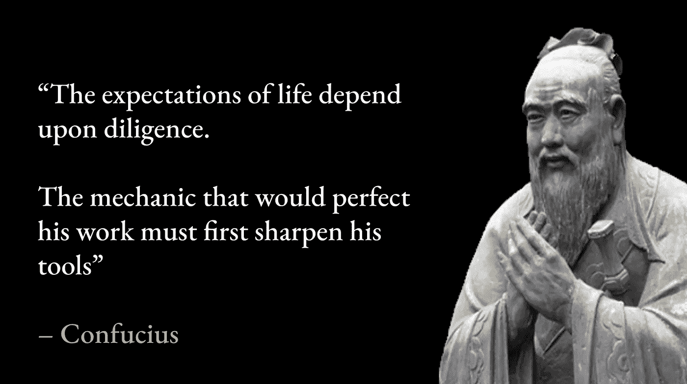
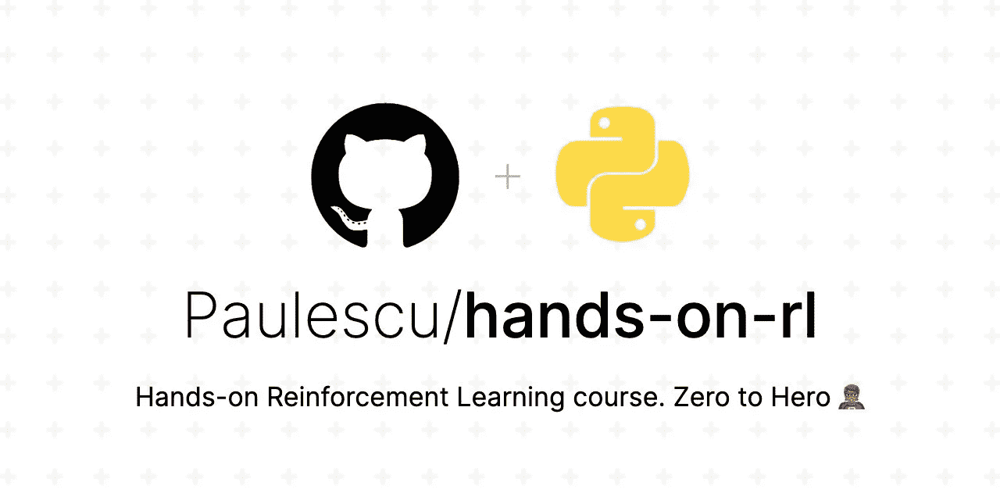
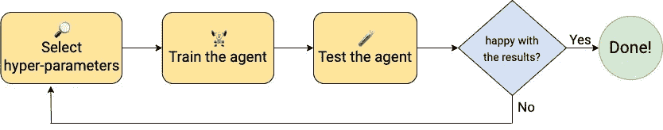
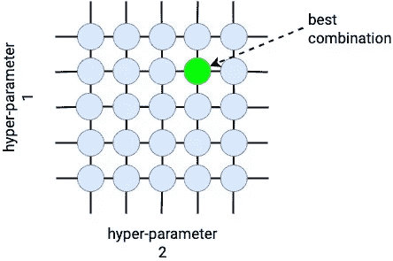
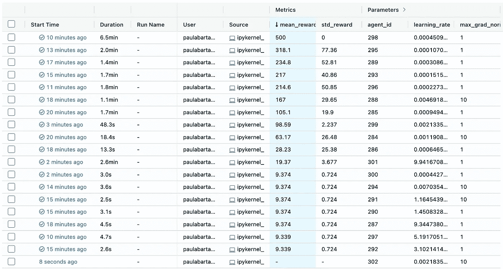
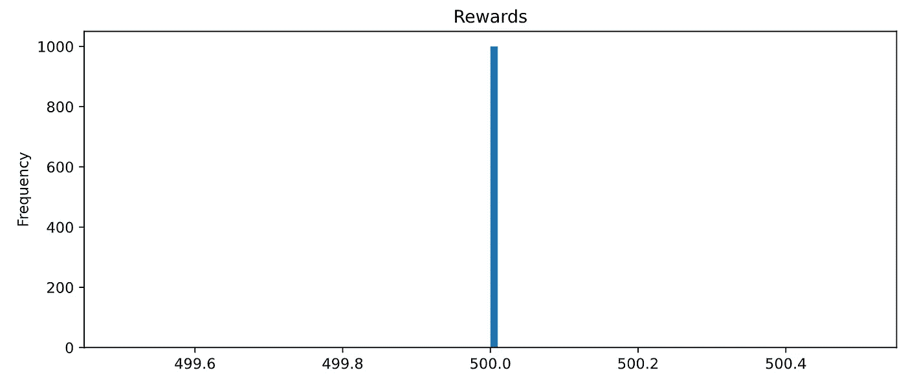

# 深层 RL 中超参数

> 原文：<https://towardsdatascience.com/hyperparameters-in-deep-rl-f8a9cf264cd6>

## RL 实践课程—第 6 部分

照片由[盒装水更好](https://unsplash.com/@boxedwater?utm_source=unsplash&utm_medium=referral&utm_content=creditCopyText)上 [Unsplash](https://unsplash.com/s/photos/nature?utm_source=unsplash&utm_medium=referral&utm_content=creditCopyText)

深层 RL 中的超参数对于训练成功的代理是至关重要的。在今天的课程中，我们将学习如何找到让你成为快乐的深度 RL 开发者的方法。

# 欢迎来到❤️课程

欢迎来到强化学习实践课程的第 6 部分，它将带你从零到英雄🦸‍♂️.

这是目前为止我们所做的:

1.  [强化学习简介](/hands-on-reinforcement-learning-course-part-1-269b50e39d08)
2.  [表格 Q-学习](/hands-on-reinforcement-learning-course-part-2-1b0828a1046b)
3.  [表格萨萨](/hands-on-reinforcement-learning-course-part-3-5db40e7938d4)
4.  [线性 Q 学习](/hands-on-reinforcement-learning-course-part-4-55da5eae851f)
5.  [深度 Q 学习](/hands-on-reinforcement-learning-course-part-5-bdb2e7fa243c)
6.  👉🏻**深 RL 中的超参数**(今日)

在第 5 部分中，我们使用深度 Q 学习构建了一个完美的代理来解决 Cart Pole 环境。

我们使用了一组超参数，我和你们分享过。然而，我没有解释我是如何得到它们的。

如果你想成为强化学习的真正专家，你需要学习如何调整超参数。为此，你需要使用正确的工具。

孔子知道得很清楚！(图片由作者提供)

今天我们将使用 Python 生态系统中最好的超参数搜索开源库:Optuna。

本课所有代码在 [**本 Github repo**](https://github.com/Paulescu/hands-on-rl) **中。** Git 克隆它来跟随着今天的问题。

想分享爱吗？请 [**给它一个 Github 里的⭐吧！**](https://github.com/Paulescu/hands-on-rl)

实践学习课程 Github repo

# 第六部分

# 内容

1.  [问题](#4c98)
2.  [解决方案:贝叶斯搜索](#236f)
3.  [使用 Optuna 进行超参数搜索](#2f7e)
4.  [重述✨](#9b3d)
5.  [作业📚](#a528)
6.  下一步是什么？❤️

# 1.问题是

机器学习模型有参数和超参数。

## *这两者有什么区别？*

参数是你在训练你的模型后找到**的数字。例如，将状态映射到最佳 q 值的神经网络的参数。**

另一方面，超参数是在训练模型之前需要设置的数字。你不能通过训练找到它们，但是你需要事先正确地猜测它们。一旦设置了这些参数，就可以训练模型并找到剩余的参数。

超参数存在于机器学习的周围。例如，在有监督的机器学习问题中(就像我们在第 5 部分中解决的问题)，您需要设置学习率。数值太低，模型会陷入局部最小值。数字太大，模型将振荡太多，永远不会收敛到最佳参数。

在深度强化学习中，事情变得更加具有挑战性。

## *为什么？*

因为

*   深度 RL 算法比监督机器学习模型有**更多**超参数。
*   更重要的是，深度 RL 中的超参数对最终的训练结果有着巨大的影响。换句话说，深度 RL 算法对您预先设置的超参数非常敏感。环境越复杂，超参数越关键。

在[第 5 部分](/hands-on-reinforcement-learning-course-part-5-bdb2e7fa243c#2d1f)中，我们看到了两组超参数，与 q 值网络的相同参数化相结合，如何导致两个非常不同的代理，具有非常不同的性能。其中一个代理是 okayish(平均奖励 180 左右)，另一个是完美解决(平均奖励 500)。

那么问题是…

> 如何才能找到** **好的**** 超参数？🤔

为了找到好的超参数，我们采用试错法。

本质上，这是 4 个步骤:

1.  我们选择一组超参数，
2.  培训代理人，
3.  评估代理。
4.  如果我们对结果满意，我们就完成了。否则，我们选择一组新的超参数，并重复整个过程。

找到好的超参数的 4 个步骤(图片由作者提供)

## 网格搜索

如果超参数的数量很少(例如 2-3 个)，我们可以尝试所有可能的组合，并选择效果最好的一个。这个方法叫做**网格搜索**，对于很多有监督的 ML 问题都很管用。

例如，如果我们的算法只有 2 个超参数，每个超参数取 5 个可能值中的 1 个，我们最终得到 5×5 = 25 个组合。我们可以使用每个超参数组合训练代理 25 次，并找到最好的组合。

一个非常小的超参数空间(图片由作者提供)

另一方面，在深层 RL 问题中，有更多的超参数，例如 10–20 个。并且每个超参数可以取许多可能的值。

这创建了一个巨大的网格，我们需要在其中进行搜索，其中组合的数量**相对于超参数的数量和每个超参数可以取值的数量呈指数增长**。在这种情况下，网格搜索不再是可行的搜索方式。

例如，如果我们有 10 个超参数，并且每个超参数可以从 10 个可能值中取 1，则网格大小为 10，000，000，000(1 后跟 10 个 0)。如果我们的训练循环需要 10 分钟来完成(这是一个非常乐观的估计)，它将花费我们

10 分钟 x 10，000，000，000 = **190，258 年**😵‍💫

用简单的话来说就是……不可能。

您可以并行搜索，并将这个数字减少几个数量级。例如，如果您有一个可以运行多达 100，000 个并行进程的大型计算机集群，这将花费您大约 2 年的时间…

尽管如此，这是一个非常低效的解决问题的方法，你不觉得吗？

## 随机搜索

网格搜索的另一种选择是**随机搜索**，常用于有监督的 ML 问题。

想法很简单:不是检查每一个`N`可能的超参数组合(其中`N`是一个非常大的数字，例如 1，000，000，000)，我们随机地尝试它们的一个子集，大小为`T`(其中`T`比`N`小得多，例如 100)，并且训练和评估代理`T`次。从这些`T`试验中，我们选择效果最佳的超参数组合。

随机搜索是一种更有效的搜索方式，在速度和解决方案的质量方面比网格搜索好得多。

然而，使用随机搜索(顾名思义),您实际上是在每次迭代中旋转轮盘来决定下一步尝试什么超参数。这似乎是一种很愚蠢的搜索方式，不是吗？

一定有更聪明的办法，对吧？🤔

# 2.解决方案:贝叶斯搜索

为了更好地搜索(无论你在生活中搜索什么)，通常一个好主意是记住你过去尝试了什么，并使用这些信息来决定下一步最好尝试什么。

这正是**贝叶斯搜索**方法所做的。

贝叶斯搜索方法跟踪过去的迭代结果，以决定接下来在超参数空间中最有希望尝试的区域是什么。

使用贝叶斯搜索，你在一个**代理模型**的帮助下探索空间，这给你一个*估计*每个超参数组合有多好。随着你运行更多的迭代，算法更新代理模型，这些估计变得越来越好。

最终，您的代理模型足以将您的搜索指向好的超参数。瞧，这就是你得到它们的方式！

贝叶斯搜索方法优于随机搜索，是在深度学习中使用的完美选择。

不同的贝叶斯搜索算法在构建代理模型的方式上有所不同。最流行的方法之一是**树形结构的 Parzen 估计器(又名 TPE)。这就是我们今天要用的方法。**

## 说👋去奥普图纳

幸运的是，有一个令人惊叹的开源 Python 库叫做 [**Optuna**](https://optuna.org/) ，它实现了贝叶斯搜索方法。

Optuna 有一个干净的 API，抽象出 TPE 和其他贝叶斯搜索方法背后的所有细节。这是一个完美的即插即用库，我们可以在没有深入理解贝叶斯方法背后的数学知识的情况下开始使用。

> *如果你想深入了解贝叶斯搜索和树形结构 Parzen 估计器背后的本质细节，我推荐你阅读 Will Koehrsen 的这篇精彩文章:*
> 📝[机器学习的贝叶斯超参数优化的概念解释](/a-conceptual-explanation-of-bayesian-model-based-hyperparameter-optimization-for-machine-learning-b8172278050f)

有了贝叶斯方法和 Optuna，我们就可以找到解决问题的超参数了。

所以，让我们开始吧！

# 3.使用 Optuna 进行超参数搜索

[👉🏽notebooks/09 _ hyperparameter _ search . ipynb](https://github.com/Paulescu/hands-on-rl/blob/main/03_cart_pole/notebooks/09_hyperparameter_search.ipynb)

让我们从加载环境开始:

为了可视化每个超参数运行的参数和评估指标，我喜欢使用 [MLflow](https://www.mlflow.org/) 。

MLflow 是一个非常模块化的库，旨在实现 ML 模型的操作化。其中一个组件叫做 [MLFlow Tracking](https://www.mlflow.org/docs/latest/tracking.html) ，顾名思义，它可以帮助我们跟踪模型开发过程中需要的一切。当您运行大量超参数实验，并且想要记录每次运行中使用的确切配置时，这一点非常重要。

我们将在名为`hyperparameter_search`的实验中将 MLflow 指标记录到`MLFLOW_RUNS_DIR`

> *🔎* ***超参数搜索结果可视化***
> 
> *要查看 MLFLow 仪表板，您需要进入命令行，并使用 cd 进入今天课程的根目录。*
> 
> *这是我电脑里的样子* `*$ cd ~/src/online-courses/hands-on-rl/03_cart_pole*`
> 
> *然后你启动 MLFLow 跟踪服务器:* `*$ mlflow ui --backend-store-uri mlflow_runs/*`
> 
> *并点击控制台上打印的 URL，在我的例子中是*[*http://127 . 0 . 0 . 1:5000*](http://127.0.0.1:5000)

为了用 Optuna 优化超参数，我们封装了

*   超参数采样
*   培养
*   以及 RL 代理的评估

在一个`objective()`函数中，它返回我们想要优化的指标。

## 目标函数

在我们的例子中，`objective()`函数通过调用`sample_hyper_parameters()`对超参数进行采样，训练 200 集的代理，并对 1000 集的新集进行评估。这个函数的输出就是这 1000 集中的平均奖励。这是我们想要最大化的度量。

函数`sample_hyper_parameters()`根据下式采样并返回超参数值

*   我们指定的范围
*   而 Optuna 使用的采样器，默认是 TPE。

如果您查看`[**src/optimize_hyperparameters.py**](https://github.com/Paulescu/hands-on-rl/blob/00a8061d322c4aa2c666f84b10ad12c6c334811d/03_cart_pole/src/optimize_hyperparameters.py#L17)` 中的函数`sample_hyper_parameters()`定义，您将会看到我们只提供了对超参数有意义的宽区间或宽范围的值。我们不需要实现任何贝叶斯抽样方法，因为 Optuna 会为我们做。

下一步是创建一个 Optuna 研究对象。

观察我们如何将`storage`参数设置为本地`sqlite`文件。这很重要，因为它允许我们在运行代码的计算机或进程由于任何原因崩溃时继续搜索。

最后，我们用`study.optimize()`开始搜索，并告诉 Optuna 最多尝试 100 次。

在我的 MacBook 中，达到 500 分的超参数大约需要 15 分钟，也就是完美代理。

我建议你在 MLflow 仪表板上监控结果，一旦你看到一个代理达到 500 奖励，就中断 Optuna 搜索。

这是我看到的结果:

agent_id = 298 是我的赢家(图片由作者提供)

最后，为了让你相信你已经完美地解决了`CartPole`问题，我鼓励你加载你最好的代理(在我的例子中是【T1)……

…并再次评估它。你应该每集都得 500 分！

满分。！(图片由作者提供)

答对了。

祝贺你成功来到这里。我们最终学会了如何调整超参数，以最大限度地提高 Deep Q 代理的性能。

这是一次漫长的`CartPole`冒险之旅。

是时候坐下来，放松一下，回头看看我们刚刚走过的路。

秘鲁帕拉卡斯(图片由作者提供)

# 4.重述✨

这些是今天的关键要点:

*   **深层 RL 的超参数很关键**。你需要实验来找到好的，如果你不遵循智能搜索策略，这可能会非常耗时。在大多数情况下，单靠蛮力(即网格搜索)是不可行的。
*   **贝叶斯搜索方法**是解决这个问题的最佳工具之一。他们探索并了解下一步在超参数空间中最有希望尝试的领域。它们比随机搜索收敛得更快。
*   **Optuna** 是一个非常棒的用于超参数搜索的开源库。这是一个即插即用的解决方案，抽象出贝叶斯搜索背后的所有细节。通过几行代码，您可以构建一个强大的超参数实验管道。

# 5.家庭作业📚

[👉🏽笔记本/10 _ 家庭作业. ipynb](https://github.com/Paulescu/hands-on-rl/blob/main/03_cart_pole/notebooks/10_homework.ipynb)

是时候把手弄脏了:

1.  [**Git 克隆**](https://github.com/Paulescu/hands-on-rl) 把 repo 到你的本地机器上。
2.  [**设置**](https://github.com/Paulescu/hands-on-rl/tree/main/02_mountain_car#quick-setup) 本课的环境`03_cart_pole`
3.  打开`[**03_cart_pole/notebooks/10_homework.ipynb**](https://github.com/Paulescu/hands-on-rl/blob/main/03_cart_pole/notebooks/10_homework.ipynb)`

今天的挑战是找到一个更小的网络来完美地解决 CartPole 问题。

如果你仔细观察函数`sample_hyper_parameters()`，你会发现我保持了神经网络结构的固定(即`nn_hidden_layers = [256, 256]`)。

你能用只有一个隐藏层的 Q 网络找到一个完美的代理吗？

# 6.下一步是什么？❤️

在接下来的讲座中，我们将介绍新的深度 RL 算法。但是，在我们到达那里之前，我想分享一个技巧来加快你的训练循环。

在下一课中，我将分享我用来在 GPU 上训练深度 RL 模型的一个技巧，价格合理… $0。

想知道怎么做吗？

敬请关注。

在那之前，

和平、爱和学习。

你想成为机器学习专家，接触机器学习和数据科学的顶级课程吗？

👉🏽订阅 [***【数据机】*通迅**](https://datamachines.xyz/subscribe/) **。**

👉🏽 [**跟着我**](https://pau-labarta-bajo.medium.com/) 上媒。

👉🏽 [**给科目 GitHub 回购**](https://github.com/Paulescu/hands-on-rl) 一个⭐

祝你愉快，🧡❤️💙

避寒胜地