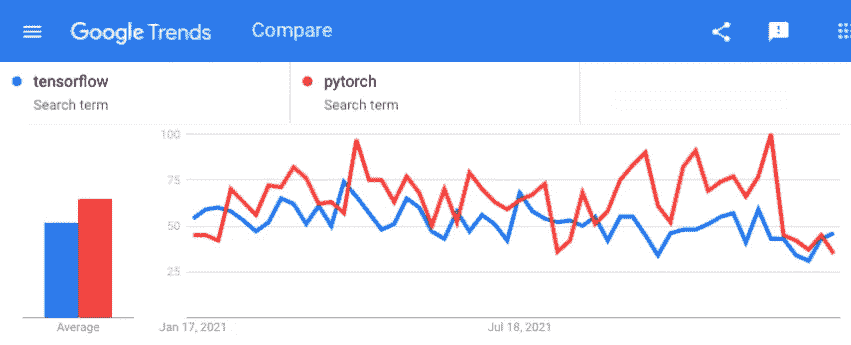
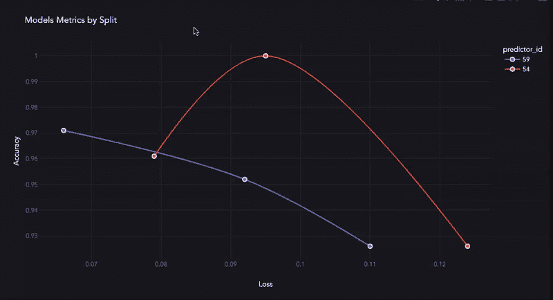
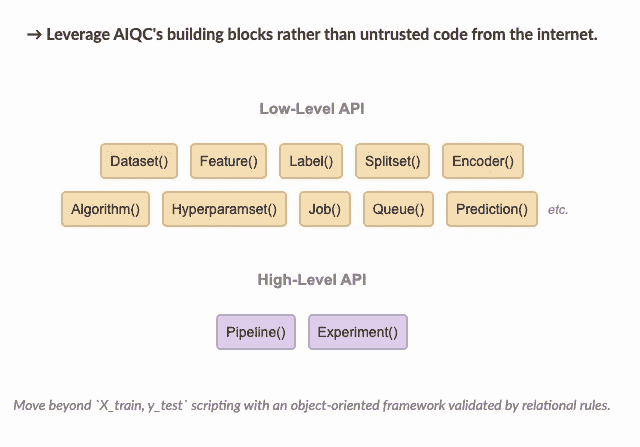

# TensorFlow 和 PyTorch 的超调

> 原文：<https://towardsdatascience.com/hypertuning-for-tensorflow-pytorch-a6e117e4655e>


超参数调整就像用数据打碟一样——照片来源([unsplash.com/photos/ZfCVTJ30yoc](https://unsplash.com/photos/ZfCVTJ30yoc))

> *深度学习库的根本问题是，它们是为单次内存运行而设计的，其唯一目的是最小化损失——而在现实中，调整一个架构需要多次运行，工作流需要持续，训练损失只是模型评估的开始。*



红色非常受欢迎，尽管较少的图层类型功能较少-图片由作者提供

# 物以类聚。

一年前，我开始构建一个库，让 **TensorFlow** 和 **PyTorch** 的实验跟踪和参数调整更加容易。这些库共享相同的底层概念，因此包装它们很容易:

*   *fn_build —* 为架构。
*   *fn_train —* 定义回路。
*   *fn_lose* —计算损耗。
*   *fn_optimize —* 用于学习设置。
*   *fn_predict —* 用于运行它。

很有趣！我用简单的 *if* 语句(例如 *concave_convex:[True，False]* )测试了完全不同的架构，甚至将 Torch 损失函数与 Keras 模型混合在一起。

根据我正在进行的分析类型(例如回归、二元分类和多标签分类)，我开始注意到我正在使用相同的*丢失-优化-预测*组合。所以我能够为大多数组件设置可覆盖的默认值。

> ♻️类似于 Keras 如何抽象一个训练循环，我抽象了一个训练循环的循环，同时保持了工作流的可定制性。

以下是一个基本的多标签分类示例:

```
# Unique param combos will get passed into functions as `hp**`.
**hyperparameters** = {
      "neuron_count":  [9, 12]
    , "batch_size":    [3, 5]
    , "epoch_count":   [30, 60]
} **def fn_build***(features_shape, label_shape, **hp):*
    model = Sequential()
    model.add(Input(shape=features_shape))
    model.add(Dense(units=hp['neuron_count'], activation='relu'))
    model.add(Dense(units=label_shape[0], activation='softmax'))
    return model **def fn_train***(
    model, loser, optimizer, 
    samples_train, samples_evaluate, **hp
):*
    model.compile(
          loss      = loser
        , optimizer = optimizer
        , metrics   = ['accuracy']
    )
    model.fit(
          samples_train["features"]
        , samples_train["labels"]
        , validation_data = (
            samples_evaluate["features"]
            , samples_evaluate["labels"]
        )
        , verbose    = 0
        , batch_size = hp['batch_size']
        , epochs     = hp['epoch_count']
        , callbacks  = [History()]
    )
    return model
```

这些组件用于组装培训工作的*队列*:

```
**queue = aiqc.Experiment.make**(
      **# --- Analysis type ---**
      *library*         = "keras"
    , *analysis_type*   = "classification_multi"

      **# --- Model functions ---**
    , *fn_build*        = fn_build
    , *fn_train*        = fn_train
    , *fn_lose*         = None *#auto CatCrossEnt.*
    , *fn_optimize*     = None *#auto Adamax <3.*
    , *fn_predict*      = None *#returns `preds, probs`.*

      **# --- Training options ---**
    , *repeat_count*    = 2
    , *hyperparameters* = hyperparameters

      **# --- Data source ---**
    , *splitset_id*     = splitset.id #scroll down.
    , *hide_test*       = False
)**queue.run_jobs()**
#🔮 Training Models 🔮: 100%|███████████████████████| 16/16
```

然而，当到了用指标和图表评估每个模型的时候，我意识到一些关键问题被掩盖了。



AIQC 的内置可视化——作者图片


探索超维度特征空间以最小化损失——作者图片

# 深度学习，浅范围。

> 深度学习库做好一件事；高效地将损失降至最低。非常快—使用 20，000 列 650 个样本，每个时期 1 秒—非常快。

离计算机科学繁重的任务越远，这些库的帮助就越少。其他的事情——上游的*数据准备*和下游的*模型评估*都转移到了用户的肩上。核心深度学习库不是:

🤔 ***分析感知*** —算法不知道您正在进行什么类型的分析，因此它不知道评估给定模型需要什么指标&图表。

[💾](https://emojipedia.org/floppy-disk/) ***数据感知*** —程序不知道你的数据集是如何构造的。这不仅适用于(a)需要评估的分割/折叠中的特征/标签等子集，还适用于(b)用于预处理/后处理的形状。

📂*—模型、指标和任何预处理步骤只存在于内存中。保存和组织它们取决于从业者。*

# *面向对象的方法。*

**

*AIQC 高级和低级原料药的要点-图片由作者提供。*

> *算法只是希望你以正确的格式显示正确的数据。我厌倦了互联网上任意食谱中的这种“X_train，y_test”数学术语。就叫它们**特性**和标签吧！等等…就是这样！*

*基于所涉及的数据和分析的类型，有一些规则来管理这些对象应该如何相互交互。所有这些信息都需要持久化。这个标准使得机器学习成为对象关系模型(ORM)抽象的完美候选，也就是关系数据库的 API。*

*在构建**低级** *特征时，标签、编码器、分割、折叠*等。—我意识到我每次都在用不同设置的相同对象。所以我将所有的摄取&预处理步骤组合成一个**高级** *流水线*，并将所有的训练&评估对象组合成一个*实验*。*

*Iris 数据集的多标签分类问题的数据准备如下:*

```
*import aiqc
# Creates or finds SQLite db for persisting workflow.
aiqc.setup()# Built-in example datasets.
from aiqc import datum
df = datum.to_pandas('iris.tsv') **splitset = aiqc.Pipeline.Tabular.make**(
      **# --- Data source ---**
      *df_or_path* = df

      **# --- Label preprocessing ---**
    , *label_column*  = 'species'
    , *label_encoder* = dict(
          sklearn_preprocess=OneHotEncoder()
    )

      **# --- Feature preprocessing ---**
    , *feature_cols_excluded* = 'species'
    , *feature_encoders*      = [
          dict(
              sklearn_preprocess   = StandardScaler()
              # Encode a list of `dtypes` or `columns`              
              , dtypes = ['float64'] 
          )
    ] **# --- Stratification ---**
    , *size_test*       = 0.22
    , *size_validation* = 0.12
    , *fold_count*      = None
    , *bin_count*       = None)*
```

## *AIQC 是面向对象 MLOps 的开源框架。*

**高级 API* 允许从业者专注于他们的数据科学工作流程，而不是将脚本和拼凑的工具集粘在一起。它抽象出了使机器学习变得如此不可接近的数据争论。*

> *<https://github.com/aiqc/aiqc>**(别忘了⭐ )***