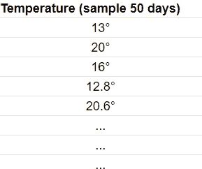
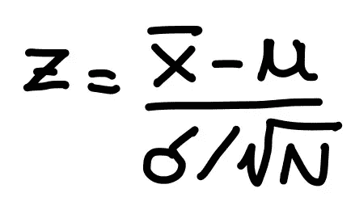
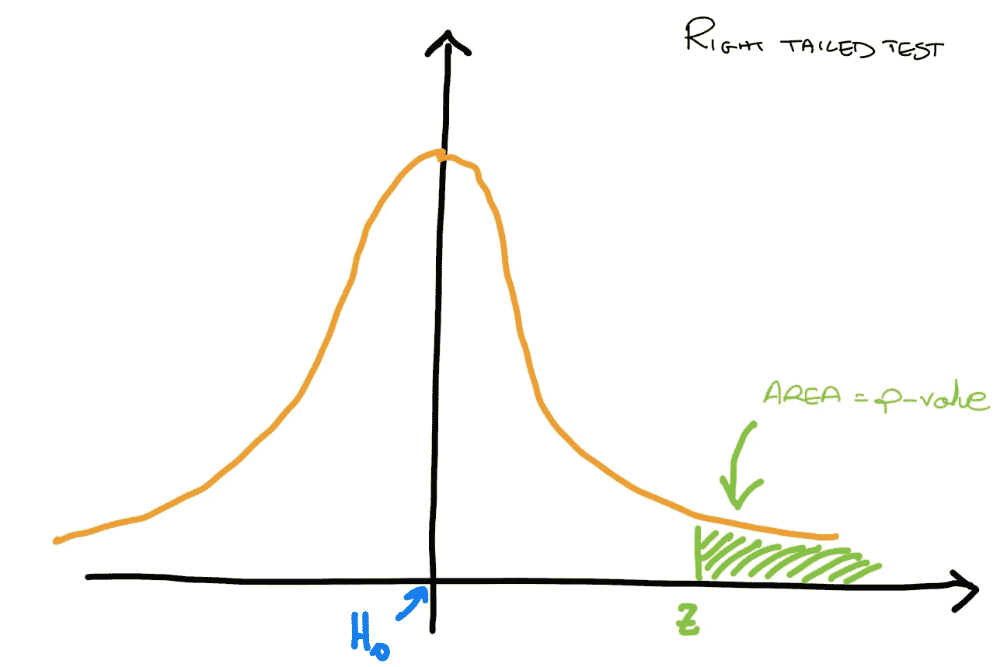
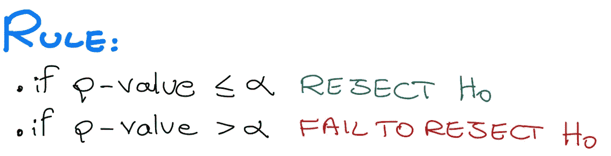
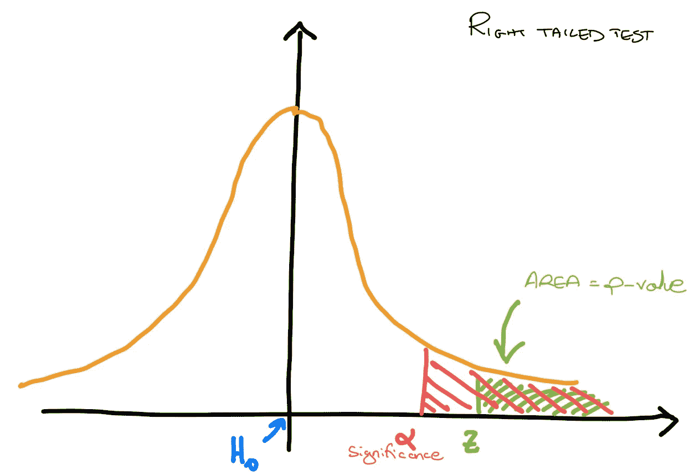

# 假设检验和气候变化

> 原文：<https://towardsdatascience.com/hypotesis-testing-and-climate-change-7ef750ce149e>

美国国家海洋和大气管理局在 [Unsplash](https://unsplash.com?utm_source=medium&utm_medium=referral) 拍摄的照片

## 以气候变化为例学习假设检验

假设检验是机器学习中的一个基本主题。当然，如果你要去面试，这将是一个你需要准备的问题。但是为什么它如此重要呢？

## 为什么要假设检验？

假设您正在解决一个分类问题，并且假设您只对结果的准确性感兴趣。您首先非常快速地实现一个简单的**模型 A** ，它返回关于您的测试数据的某个精确度 **acc(A)** 。经过艰苦的工作和研究，你设法实现了第二个**模型 B** ，它比第一个复杂得多，并且具有精度 **acc(B)** 。

在项目的最后阶段，即模型选择阶段，您将比较两个精度，并注意到 **acc(B) > acc(A)。这是否意味着 B 型比 A 型好？**嗯，没那么容易……**万一 B 只是运气好呢？**您确定通过在数据集的不同分割(训练测试)上重新运行这两个模型，B 的结果总是比 A 好吗？

令人欣慰的是，统计学为我们提供了工具，能够客观地说一个模型是否比另一个模型表现得更好，而不管可能发生的偶然事件(如幸运的分裂)，这就是为什么我们需要研究假设检验。

## **总体思路**

假设您是一名研究人员，正在调查意大利罗马市的每日温度变化。日温度变化是一天中测得的最高温度和最低温度之间的差值。

科学界认为，平均每天的温度范围是 13。另一方面，你基于你的研究，认为这个平均数不再是 13 而是更大。
因此，假设**零假设**是目前被**视为真的假设**，即平均范围为 13，而你的**替代假设**是平均范围大于 13。

两个假设(作者图片)

但是现在你如何说服自己，说服别人你的假设是正确的，让你的新想法占上风？

## 检验统计量

请仔细注意，你的目标是**拒绝零假设**，如果你没有这样做，我们说你**没有拒绝零假设**。

嗯，最简单的方法就是去罗马测量几天的温度范围，然后计算平均值。你决定去测量未来 60 天的温度变化，所以你收集了一个数据样本。你对这 60 天的数据进行平均，结果= 13.7。你怎么想呢?也许零假设是正确的，我的研究是错误的。

然后你取另一个 60 天的样本，你得到= 16.3。现在你反而开始相信你的替代假设实际上是正确的，尽管你并不确定。

然而，在最后 60 天的样本中，你测得的是= 24.3。现在你非常确定你是对的，并且最终可以拒绝零假设。

但是这些考虑是非常直观和个人的。也许有人会说= 24.3 不足以否定零假设，也许只是车流量大，测得的温度更高的情况。然后，我们希望能够使用统计测试更客观地断言语句，并且能够以一定的**置信度 C** (通常是 **C = 95%** )拒绝或不拒绝零假设。

下表显示了在 60 天内对您的数据样本进行的测量:

样本数据(图片由作者提供)

我们这里测量的**统计量****是数值**的平均值，我们想了解它实际上是否不同于科学界接受的平均值:= 13。

在我们的例子中，我们可以使用一个 **Z-test** 来查看在我们的样本上计算出的平均值是否与 13 显著不同，或者它是否只是一个偶然事件。

现在，我们理所当然地认为，在这种情况下，z 测试是许多现有测试中最合适的测试，在接下来的文章中，我们将看到如何根据特定的情况选择合适的测试。计算 z 检验的公式如下:

z 测试(图片由作者提供)

这个测试将返回给我们一个数字( **z** )，它是在 60 天的努力工作中测量的各种数据的**总结。**

## 置信区间

现在我们的目标是用这个 z 值来看看我们是否能拒绝零假设。为此，我们将使用一个**右尾检验**，因为我们的替代假设是 **> 13** ，如果是< 13，我们将使用一个**左尾检验**并最终 for！=13 a **双尾检验**。

我们知道各种 z 值可能来自以零为中心的高斯分布，因此我们可以计算出具有某个 z 值的概率。这个概率对应于我们称之为 **p 值**的曲线下面积。

我们可以使用所有统计学书籍中提供的表格来计算分数的 p 值，例如本 [one](https://statisticsbyjim.com/hypothesis-testing/z-table/) 。(根据您使用的是左检验、右检验还是双尾检验，请注意正确使用表格)

右尾测试(图片由作者提供)

我们希望我们的 z 值远离中心，这代表零假设。
请记住，我们希望拒绝某个**置信水平 C** 为 95%或**显著性水平α = 1-C** = 0.05 的零假设。

现在我们可以遵循一个简单的规则**来拒绝或者不通过**来拒绝零假设:

(失败)拒绝 H0(图片作者)

为了理解这个简单的规则，请看下图。

右尾测试(图片由作者提供)

我们拒绝显著性α = 0.05 (C = 95%)的零假设所需要的只是一个与图中α值相匹配的 z 值。我们的 z 值甚至比我们强加的更远离 H0，所以我们可以完全有把握地拒绝 H0，这就是为什么我们拒绝如果 p 值≤ α。

例如，如果我们的 p 值是 *p 值= 0.16* ，我们可以以 C = 84%的置信度拒绝 H0。

## 让我们编码

你想要真实的气候数据吗？

你想研究真实的气候数据吗？我可以给你推荐一个有趣的网站，在那里你可以找到从**地球观测的几个太空任务中收集的免费可用数据。**

我目前在欧洲航天局工作，我专注于改进这个门户，在那里你可以找到一群工作人员(包括数据)。

 [## 主页

### 地球在线提供欧洲航天局在地球观测领域的新闻和信息。的…

earth.esa.int](https://earth.esa.int/eogateway) 

在这里你可以浏览来自**哥白尼任务的数据。**

 [## 哥白尼空间组件数据存取

### 自 2010 年以来，各种各样的地球观测数据已经产生，以满足哥白尼的需要…

spacedata.copernicus.eu](https://spacedata.copernicus.eu/)  [## 开放式接入集线器

### 自从哨兵-1 任务开始以来，波模 OCN 产品包含了显著的波高…

哥白尼](https://scihub.copernicus.eu/) 

## 最后的想法

> 假设检验为做出有关感兴趣人群的数据决策提供了一个可靠的框架。它有助于研究人员成功地将数据从样本外推至更大的人群。

无论你是在研究解决气候变化问题的模型，还是预测下个月的股票价值，你总是需要评估和了解你的模型是否优于以前的模型或起始基线，为此你需要假设检验。在未来的文章中，我将更具体地阐述机器学习领域的各种统计测试，并解释如何在现实世界的应用中使用它们。

# 结束了

*马赛洛·波利蒂*

[Linkedin](https://www.linkedin.com/in/marcello-politi/) ， [Twitter](https://twitter.com/_March08_) ， [CV](https://march-08.github.io/digital-cv/)