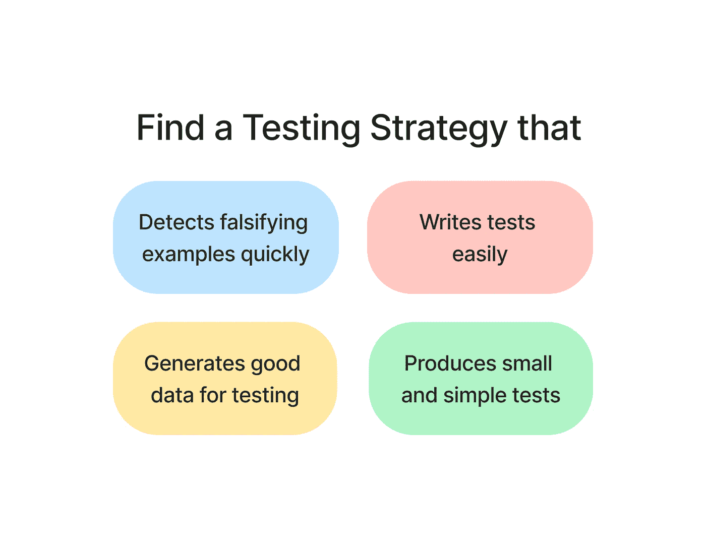
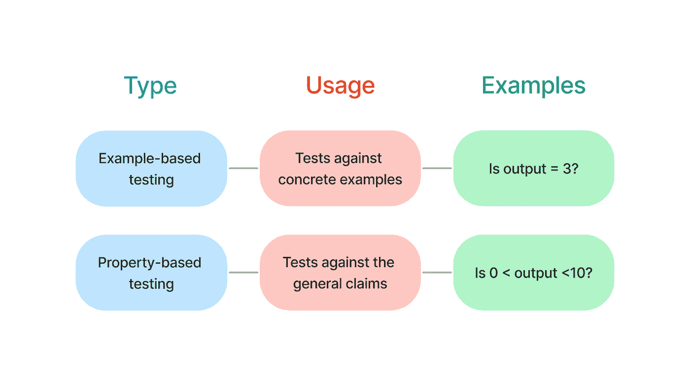

# 假设和潘德拉:生成用于测试的综合熊猫数据框架

> 原文：<https://towardsdatascience.com/hypothesis-and-pandera-generate-synthesis-pandas-dataframe-for-testing-e5673c7bec2e>

## 用基于属性的测试创建干净和健壮的测试


作者图片

# 动机

假设您正在试图判断函数`processing_fn`是否正常工作。您使用 pytest 通过一个示例来测试该函数。

测试通过了，但是你知道一个例子是不够的。您需要使用更多的示例来测试该函数，以确保该函数可以正常处理任何数据。

为此，您可以使用 pytest parameterize，但是很难找出每个可能导致失败的示例。

即使你花时间去写所有的例子，你也要花很长时间去运行所有的测试。

如果有一种测试策略可以让您:

*   轻松编写测试
*   为测试生成良好的数据
*   快速检测伪造示例
*   制作简单明了的测试



作者图片

这就是假说和潘德拉派上用场的时候。

# 潘德拉是什么？

Pandera 是一个简单的 Python 库，用于验证熊猫数据帧。

</validate-your-pandas-dataframe-with-pandera-2995910e564>  

要安装 Pandera，请键入:

```
pip install pandera
```

# 什么是假设？

[Hypothesis](https://github.com/HypothesisWorks/hypothesis) 是一个灵活易用的基于属性的测试库。

基于实例的测试使用具体的实例和具体的预期输出。基于属性的测试将这些具体的例子归纳为基本的特征。

因此，基于属性的测试允许您编写更清晰的测试，并更好地指定代码的行为。



作者图片

要安装假设，请键入:

```
pip install hypothesis
```

本文将向您展示如何使用这两个工具来生成用于测试的合成熊猫数据帧。

# Pandera —检查函数的输出

首先，我们将使用 Pandera 来测试当给定**一个输入**时，函数的**输出是否满足某些约束**。

在下面的代码中，我们:

*   使用`pandera.DataFrameSchema`为输出指定一些约束，比如列的数据类型和值的范围。
*   使用`pandera.check_output`装饰器来测试函数的输出是否满足约束。

因为运行这段代码时没有错误，所以输出是有效的。

# 假设—创建测试示例

接下来，我们将根据`pandera.DataFrameSchema`给出的约束，使用假设**创建用于测试**的数据。

具体来说，我们将补充:

*   `schema.strategy(size=5)`指定描述如何生成和简化数据的搜索策略
*   `@given`在指定策略的大范围匹配数据上运行测试功能

使用 pytest 运行测试:

```
pytest test4.py
```

输出:

我们在不到 2 秒的时间里发现了一个伪造的例子！输出也很简单。例如，不要选择如下可能导致错误的示例:

```
 val1  val2
0     1    2
1     2    1
2     3    0
3     4    0
4     5    1
```

假设选择了一个更简单易懂的例子:

```
 val1  val2
0     0    0
1     0    0
2     0    0
3     0    0
4     0    0
```

这很酷，因为:

*   我们不需要列举任何具体的例子。
*   这些例子非常直观，足以让我们快速理解被测试函数的行为。
*   我们在短时间内找到了伪造的例子。

# 结论

恭喜你！您刚刚学习了如何使用 Pandera 和 Hypothesis 来生成用于测试的综合数据。我希望这篇文章能够为您提供为 Python 函数创建健壮和干净的测试所需的知识。

随意发挥，并在这里叉这篇文章的源代码:

<https://github.com/khuyentran1401/Data-science/tree/master/data_science_tools/pandera_hypothesis>  

我喜欢写一些基本的数据科学概念，并尝试不同的数据科学工具。你可以通过 [LinkedIn](https://www.linkedin.com/in/khuyen-tran-1401/) 和 [Twitter](https://twitter.com/KhuyenTran16) 与我联系。

如果你想查看我写的所有文章的代码，请点击这里。在 Medium 上关注我，了解我的最新数据科学文章，例如:

</detect-defects-in-a-data-pipeline-early-with-validation-and-notifications-83e9b652e65a>  </how-to-create-fake-data-with-faker-a835e5b7a9d9>  </pytest-for-data-scientists-2990319e55e6>  <https://pub.towardsai.net/github-actions-in-mlops-automatically-check-and-deploy-your-ml-model-9a281d7f3c84> 