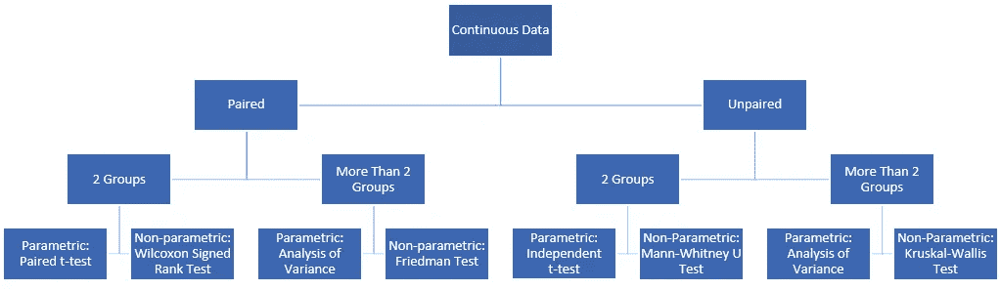
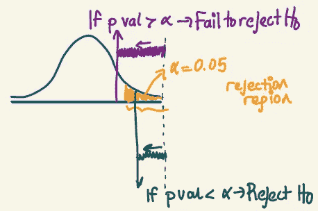
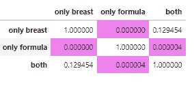
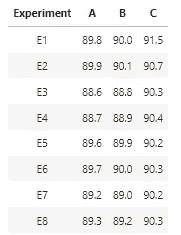
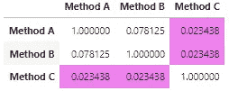
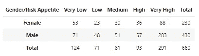

# 使用 Python 进行假设检验:带实际示例的分步实践教程

> 原文：<https://towardsdatascience.com/hypothesis-testing-with-python-step-by-step-hands-on-tutorial-with-practical-examples-e805975ea96e>

假设就是主张，我们可以用统计数据来证明或反驳它们。在这一点上，*假设检验*构建了问题，因此我们可以使用统计证据来检验这些主张。所以我们可以检查这个声明是否有效。

在本文中，我想一步一步地展示用 Python 对几个问题进行假设检验。但在此之前，我先简单解释一下假设检验过程。如果你愿意，你可以直接提问。

## 1.定义假设

首先，我们应该了解我们在寻找哪个科学问题的答案，并且它应该以*零假设(H₀)* 和*替代假设(H₁或 Hₐ).)的形式来表述*请记住，H₀和 H₁一定是互斥的，H *₁* 不应该包含相等:

*   **H₀:** μ=x， **H₁:** μ≠x
*   **H₀:** μ≤x， **H₁:** μ > x
*   **H₀:** μ≥x， **H₁:** μ < x

## 2.假设检验

为了决定是使用**参数**还是**非参数**版本的测试，我们应该检查下面列出的具体要求:

*   每个样本中的观测值都是独立同分布的(IID)。
*   每个样本中的观察值呈正态分布。
*   每个样本中的观察值具有相同的方差。

## 3.选择合适的测试

然后，我们选择要使用的适当测试。当选择合适的测试时，分析有多少组被比较以及数据是否配对是很重要的。为了确定数据是否匹配，有必要考虑数据是否是从相同的个体收集的。因此，您可以使用下表来决定合适的测试。



图片由作者提供。

## 4.决定和结论

在执行假设检验后，我们获得一个相关的***p*-值**，它显示了检验的显著性。

如果*p*-值小于α(显著性水平)，换句话说，有足够的证据证明 H₀不成立；你可以拒绝 H₀.否则，你就无法拒绝 H₀.请记住，拒绝 H₀就是认可 H₁.然而，未能拒绝 H₀并不意味着 H₀是有效的，也不意味着 H₁是错误的。



图片由作者提供。

现在我们准备开始代码部分。

可以访问[https://github . com/ECE isik/EIP/blob/main/hypothesis _ testing _ examples . ipynb](https://github.com/eceisik/eip/blob/main/hypothesis_testing_examples.ipynb)查看完整实现。

# Q1。独立 t 检验


照片由[在](https://unsplash.com/@comparefibre?utm_source=medium&utm_medium=referral) [Unsplash](https://unsplash.com?utm_source=medium&utm_medium=referral) 上对比纤维

由于新冠肺炎的原因，一位大学教授在网上授课，而不是面对面授课。后来，他将录制的讲座上传到云端，供异步跟踪课程的学生(那些没有参加课程但后来观看了记录的学生)使用。但他认为，在上课时间上课并参与过程的学生更成功。因此，他在学期末记录了学生的平均成绩。数据如下。

**同步**=【94。，84.9，82.6，69.5，80.1，79.6，81.4，77.8，81.7，78.8，73.2，87.9，87.9，93.5，82.3，79.3，71.6，88.6，74.6，74.1，80.6]
**异步**=【77.1，71 ., 72.2, 74.8, 85.1, 67.6, 69.9, 75.3, 71.7, 65.7, 72.6, 71.5, 78.2]

通过使用 0.05 的显著性水平来评估无效假设和备选假设，进行假设检验以检查教授的信念是否具有统计显著性。在进行假设检验之前，检查相关的假设。对结果进行评论。

## 1.定义假说

因为分数是从不同的个体获得的，所以数据是不成对的。

**h₀:**μₛ≤μₐ
h₁:μₛ>μₐ

## 2.假设检验

H₀:数据呈正态分布。
**H₁:** 数据不是正态分布的。
假设α=0.05。如果*p*-值为> 0.05，可以说数据呈正态分布。

为了检查正态性，我使用了夏皮罗-维尔克的 W 检验，这通常是小样本的首选，但也有其他选择，如 Kolmogorov-Smirnov 和 D'Agostino 和 Pearson 的检验。请访问 https://docs.scipy.org/doc/scipy/reference/stats.html 了解更多信息。

```
p value:0.6556
Fail to reject null hypothesis >> The data is normally distributed
p value:0.0803
Fail to reject null hypothesis >> The data is normally distributed
```

H₀:样本的方差是相同的。
**H₁:** 样本的方差不同。

它检验总体方差相等的零假设(称为方差齐性或同方差齐性)。假设 Levene 检验的结果*p*-值小于显著性水平(通常为 0.05)。在这种情况下，基于从具有相等方差的总体中随机抽样，所获得的样本方差差异不太可能发生。

为了检查方差同质性，我更喜欢 Levene 的测试，但您也可以从这里检查 Bartlett 的测试:[https://docs . scipy . org/doc/scipy/reference/generated/scipy . stats . Bartlett . html # scipy . stats . Bartlett](https://docs.scipy.org/doc/scipy/reference/generated/scipy.stats.bartlett.html#scipy.stats.bartlett)

```
p value:0.8149
Fail to reject null hypothesis >> The variances of the samples the are same.
```

## 3.选择合适的测试

由于假设得到满足，我们可以对两组和不成对的数据进行参数版本的测试。

```
p value:0.00753598
since the hypothesis is one sided >> use p_value/2 >> p_value_one_sided:0.0038
Reject null hypothesis
```

## 4.决定和结论

***在这个显著性水平上，有足够的证据可以得出这样的结论:同步跟随课程的学生的平均成绩高于异步跟随课程的学生。***

# Q2。方差分析


照片由[克里斯蒂安·鲍文](https://unsplash.com/@chrishcush?utm_source=medium&utm_medium=referral)在 [Unsplash](https://unsplash.com?utm_source=medium&utm_medium=referral) 上拍摄

一位儿科医生希望了解配方奶粉的消费对婴儿平均每月体重增加(以 gr 为单位)的影响。为此，她从三个不同的小组收集数据。第一组是纯母乳喂养的儿童(只接受母乳)，第二组是只接受配方奶喂养的儿童，最后一组是配方奶和母乳喂养的儿童。这些数据如下。

**only _ 乳房**=【794.1，716.9，993。, 724.7, 760.9, 908.2, 659.3 , 690.8, 768.7, 717.3 , 630.7, 729.5, 714.1, 810.3, 583.5, 679.9, 865.1]

**only_formula** =[ 898.8，881.2，940.2，966.2，957.5，1061.7，1046.2，980.4，895.6，919.7，1074.1，952.5，796.3，859.6，871.1，1047.5，919.1，1160.5，

**两个**=【976.4，656.4，861.2，706.8，718.5，717.1，759.8，894.6，867.6，805.6，765.4，800.3，789.9，875.3，740。, 799.4, 790.3, 795.2 , 823.6, 818.7, 926.8, 791.7, 948.3]

根据这些信息，进行假设检验，通过使用 0.05 的显著性水平来检查这三个组的平均月增益之间是否存在差异。如果存在显著差异，请执行进一步的分析，找出导致差异的原因。在进行假设检验之前，检查相关的假设。

## 1.定义假说

**H₀:** μ₁=μ₂=μ₃ **或**样本的均值相同。
**H₁:** 他们中至少有一个是不同的。

## 2.假设检验

H₀:数据是正态分布的。H₁:的数据不是正态分布的。

H₀:样本的方差是相同的。
**H₁:** 样本的方差不同。

```
p value:0.4694
Fail to reject null hypothesis >> The data is normally distributed
p value:0.8879
Fail to reject null hypothesis >> The data is normally distributed
p value:0.7973
Fail to reject null hypothesis >> The data is normally distributed
p value:0.7673Fail to reject null hypothesis >> The variances of the samples are same.
```

## 3.选择合适的测试

由于假设得到满足，我们可以对超过 2 组和不成对的数据进行参数版本的测试。

```
p value:0.000000
Reject null hypothesis
```

## 4.决定和结论

***在该显著性水平，可以得出结论，至少其中一组具有不同的平均月增重。*** 为了找出哪一组或哪几组造成了差异，我们需要进行如下的事后检验/成对比较。

**注意:**为了避免家庭价值膨胀，我使用了 Bonferroni 调整。你可以从这里看到你的另一个选择:[https://sci kit-post hocs . readthedocs . io/en/latest/generated/sci kit _ post hocs . post hoc _ ttest/](https://scikit-posthocs.readthedocs.io/en/latest/generated/scikit_posthocs.posthoc_ttest/)



在这一显著水平上，可以得出结论:

**【仅乳房】**不同于**【仅配方】**
**【仅配方】**不同于两者**【仅乳房】****【两者】**
**【两者】**不同于**【仅配方】**

# Q3。曼恩·惠特尼大学


亚历克斯·科特利亚斯基在 [Unsplash](https://unsplash.com?utm_source=medium&utm_medium=referral) 上拍摄的照片

一位在科技公司工作的人力资源专员对不同团队的加班时间很感兴趣。为了调查软件开发团队和测试团队的加班时间是否存在差异，她在两个团队中随机选择了 17 名员工，并以一小时为单位记录了他们每周的平均加班时间。数据如下。

**测试 _ 团队**=【6.2，7.1，1.5，2，3，2，1.5，6.1，2.4，2.3，12.4，1.8，5.3，3.1，9.4，2.3，4.1】
**开发者 _ 团队**=【2.3，2.1，1.4，2.0，8.7，2.2，3.1，4.2，3.2

根据这些信息，使用 0.05 的显著性水平进行假设检验，以检查两个团队的过度工作时间之间是否存在差异。在进行假设检验之前，检查相关的假设。

## 1.定义假说

**h₀:**μ₁≤μ₂
t38】h₁:μ₁>μ₂

## 2.假设检验

H₀:数据是正态分布的。
**H₁:** 数据不是正态分布的。

**H₀:** 样本的方差相同。
**H₁:** 样本的方差不同。

```
p value:0.0046
Reject null hypothesis >> The data is not normally distributed
p value:0.0005
Reject null hypothesis >> The data is not normally distributed
p value:0.5410
Fail to reject null hypothesis >> The variances of the samples are same.
```

## 3.选择合适的测试

有两组，从不同的个体收集数据，所以不配对。但是，不满足正态性假设；因此，我们需要对不成对数据使用非参数版本的两组比较:Mann-Whitney U 检验。

## 4.决定和结论

```
p-value:0.8226
Fail to recejt null hypothesis
```

***在这个显著性水平上，*** ***可以说两个团队的平均过劳时间没有统计学上的显著差异。***

# Q4。克鲁斯卡尔-沃利斯


照片由 [Aman Pal](https://unsplash.com/@paman0744?utm_source=medium&utm_medium=referral) 在 [Unsplash](https://unsplash.com?utm_source=medium&utm_medium=referral) 上拍摄

一家电子商务公司定期在 YouTube、Instagram 和脸书上为其活动做广告。然而，新经理很好奇这些平台吸引的客户数量之间是否有任何差异。因此，她开始使用 Adjust，一个可以让你发现你的用户来自哪里的应用。每个平台的 Adjust 报告的每日数字如下。

**Youtube**=【1913，1879，1939，2146，2040，2127，2122，2156，2036，1974，1956，2146，2151，1943，2125】

**insta gram**=【2305。, 2355., 2203., 2231., 2185., 2420., 2386., 2410., 2340., 2349., 2241., 2396., 2244., 2267., 2281.]

脸书=【2133。, 2522., 2124., 2551., 2293., 2367., 2460., 2311., 2178., 2113., 2048., 2443., 2265., 2095., 2528.]

根据这些信息，使用 0.05 的显著性水平进行假设检验，以检查这三个平台的平均客户获得量之间是否存在差异。如果存在显著差异，请执行进一步的分析，找出导致差异的原因。在进行假设检验之前，检查相关的假设。

## 1.定义假说

**H₀:** μ₁=μ₂=μ₃ **或**样本的均值是相同的。
**H₁:** 他们中至少有一个是不同的。

## 2.假设检验

H₀:数据是正态分布的。
**H₁:** 数据不是正态分布的。

H₀:样本的方差是相同的。
**H₁:** 样本的方差不同。

```
p value:0.0285
Reject null hypothesis >> The data is not normally distributed
p value:0.4156
Fail to reject null hypothesis >> The data is normally distributed
p value:0.1716
Fail to reject null hypothesis >> The data is normally distributed
p value:0.0012
Reject null hypothesis >> The variances of the samples are different.
```

## 3.选择合适的测试

不满足正态性和方差齐性假设，因此我们需要对不成对的数据使用 ANOVA 的非参数版本(数据从不同来源收集)。

## 4.决定和结论

```
p value:0.000015
Reject null hypothesis
```

***在这个显著性水平上，至少有一个平均客户获得数是不同的。***
**注:**由于数据是非正态，所以采用非参数版本的后验概率检验。


来自 YouTube 的平均客户数量与其他公司不同(实际上比其他公司少)。

# Q5。t 检验相关


照片由[布鲁克·拉克](https://unsplash.com/@brookelark?utm_source=medium&utm_medium=referral)在 [Unsplash](https://unsplash.com?utm_source=medium&utm_medium=referral) 上拍摄

大学健康中心在上学期诊断出十八名学生胆固醇过高。医护人员告诉这些患者高胆固醇的危害，并为他们制定了饮食计划。一个月后，患者来进行控制，并重新检查他们的胆固醇水平。测试患者的胆固醇水平是否有差异。

根据该信息，进行假设检验，以使用 0.05 的显著性水平检查饮食后患者的胆固醇水平是否降低。在进行假设检验之前，检查相关的假设。对结果进行评论

**测试 _ 结果 _ 之前 _ 饮食** =[224，235，223，253，253，224，244，225，259，220，242，240，239，229，276，254，237，227]
**测试 _ 结果 _ 之后 _ 饮食** =[198，195，213，190，2190

## 1.定义假说

**H₀:** μd > =0 **或**真均差等于或大于零。
**H₁:** μd < 0 **或**真均值差小于零。

## 2.假设检验

因变量必须是连续的(区间/比率)
观察值相互独立。
因变量应近似正态分布。

H₀:数据是正态分布的。
**H₁:** 数据不是正态分布的。

```
p value:0.1635
Fail to reject null hypothesis >> The data is normally distributed
p value:0.1003
Fail to reject null hypothesis >> The data is normally distributed
```

## 3.选择合适的测试

数据是成对的，因为数据是从相同的个体收集的，并且假设得到满足，那么我们可以使用相关 t 检验。

```
p value:0.000008 one tailed p value:0.000004
Reject null hypothesis
```

## 4.决定和结论

***在这个显著性水平上，有足够的证据可以断定患者的平均胆固醇水平在节食后有所下降。***

# Q6。Wilcoxon 符号秩检验

GIF 来自 giphy.com

一位风险投资家希望投资一家提供数据压缩而不损失质量的初创公司，但有两个竞争对手:PiedPiper 和 EndFrame。起初，她认为端架的性能可以更好，但仍想在投资前进行测试。然后，她把同样的文件给各个公司压缩，记录他们的业绩得分。数据如下。

**花衣魔笛**=【4.57，4.55，5.47，4.67，5.41，5.55，5.53，5.63，3.86，3.97，5.44，3.93，5.31，5.17，4.39，4.28，5.25】
**端架**=【4.27，3.93，4.01，4.07, 4., 3.72, 4.16, 4.1 , 3.9 , 3.97, 4.08, 3.96, 3.96, 3.77, 4.09]

根据这些信息，使用 0.05 的显著性水平进行相关假设检验。在进行假设检验之前，检查相关的假设。对结果进行评论。

## 1.定义假说

因为性能分数是从相同的文件中获得的，所以数据是成对的。

**H₀:** μd > =0 **或**真实均值差等于或大于零。
**H₁:** μd < 0 **或**真均值差小于零。

## 2.假设检验

因变量必须是连续的(区间/比率)
观察值相互独立。
因变量应近似正态分布。

**H₀:** 数据正态分布。
**H₁:** 数据不是正态分布的。

```
p value:0.0304
Reject null hypothesis >> The data is not normally distributed
p value:0.9587
Fail to reject null hypothesis >> The data is normally distributed
```

## 3.选择合适的测试

不满足正态假设；因此，我们需要使用配对检验的非参数版本，即 Wilcoxon 符号秩检验。

## 4.决定和结论

```
p-value:0.000214 >> one_tailed_pval:0.000107
one sided pvalue:0.000107
Reject null hypothesis
```

***在这个显著性水平上，有足够的证据得出结论，PiedPaper 的性能优于 EndFrame。***

# Q7。弗里德曼卡方检验


由[凯利·西克玛](https://unsplash.com/@kellysikkema?utm_source=medium&utm_medium=referral)在 [Unsplash](https://unsplash.com?utm_source=medium&utm_medium=referral) 上拍摄的照片

一位研究人员很好奇她开发的方法 C 和基线方法 A 和 B 在性能方面是否有区别。因此，她决定设计不同的实验，并记录每种方法达到的精度。下表显示了每种方法在测试集上达到的准确度。请注意，每种方法都使用了相同的训练集和测试集。



根据这些信息，进行假设检验，通过使用 0.05 的显著性水平来检查这些方法的性能之间是否存在差异。如果存在显著差异，请执行进一步的分析，找出导致差异的原因。在进行假设检验之前，检查相关的假设。对结果进行评论。

## 1.定义假说

**H₀:** μ₁=μ₂=μ₃ **或**样本的均值相同。
**H₁:** 他们中至少有一个是不同的。

## 2.假设检验

H₀:数据是正态分布的。
**H₁:** 数据不是正态分布。

**H₀:** 样本的方差相同。
**H₁:** 样本的方差不同。

```
p value:0.3076
Fail to reject null hypothesis >> The data is normally distributed
p value:0.0515
Fail to reject null hypothesis >> The data is normally distributed
p value:0.0016
Reject null hypothesis >> The data is not normally distributed
p value:0.1953
Fail to reject null hypothesis >> The variances of the samples are same.
```

## 3.选择合适的测试

有三组，但是违反了正态性假设。因此，我们需要对配对数据使用非参数版本的方差分析，因为准确性得分是从相同的测试集获得的。

## 4.决定和结论

```
p value:0.0015
Reject null hypothesis
89.35 89.49 90.49
```

***在这个显著性水平上，至少有一个方法有不同的表现。***

**注:**由于数据呈非正态分布，因此使用非参数版本的事后检验。



方法 C 优于其他方法，获得了比其他方法更好的准确度分数。

# Q8。适合度(奖金:)


照片由 [janilson furtado](https://unsplash.com/@janilson123?utm_source=medium&utm_medium=referral) 在 [Unsplash](https://unsplash.com?utm_source=medium&utm_medium=referral) 上拍摄

一家金融投资公司的分析师很好奇性别和风险偏好的关系。从数据库中随机抽取了 660 名顾客。样本中的客户根据他们的性别和风险偏好进行分类。结果在下表中给出。



测试该公司客户的风险偏好与他们的性别无关的假设。使用 **α = 0.01** 。

## 1.定义假说

H₀:性别和风险偏好是独立的。
**H₁:** 性别与风险偏好有依赖关系。

## 2.选择适当的测试和假设检查

这个问题应该用 chi2 检验。这种测试被称为拟合优度测试。这意味着如果观察数据非常接近预期数据。满足每个 Ei ≥ 5(至少 80%的电池)进行该试验的假设。

```
expected frequencies:
  [[ 43.21  24.74  28.23  32.41 101.41]
 [ 80.79  46.26  52.77  60.59 189.59]]
degrees of freedom: 4
test stat :7.0942
p value:0.1310
```

## 3.决定和结论

```
critical stat:13.2767
```

由于 p 值大于α=0.01(或计算统计值=7.14 小于临界统计值=13.28) →无法剔除 H₀.在这个显著性水平上，可以得出结论，性别和风险偏好是独立的。

可以访问[https://github . com/ECE isik/EIP/blob/main/hypothesis _ testing _ examples . ipynb](https://github.com/eceisik/eip/blob/main/hypothesis_testing_examples.ipynb)查看完整实现。