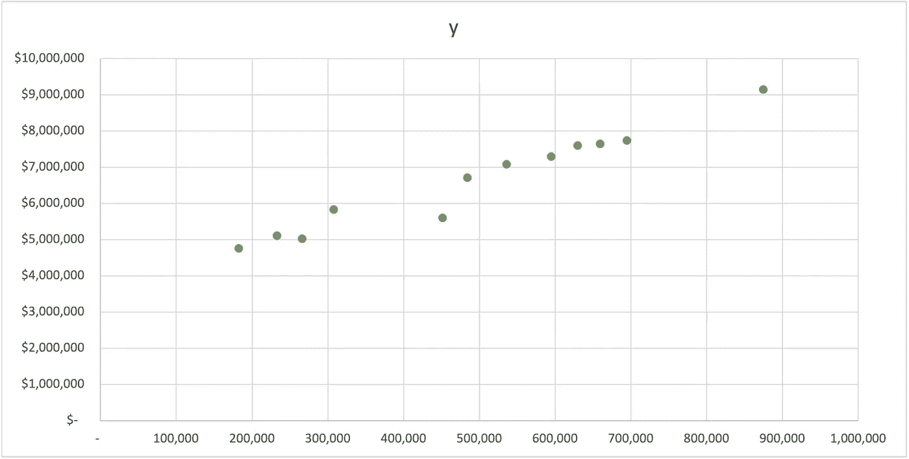
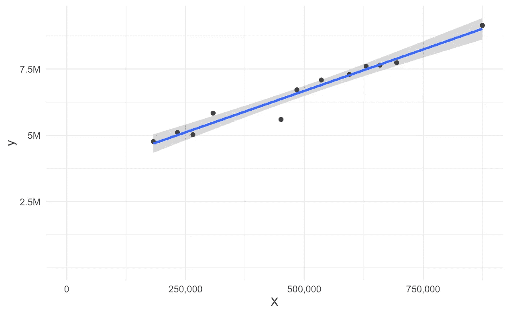
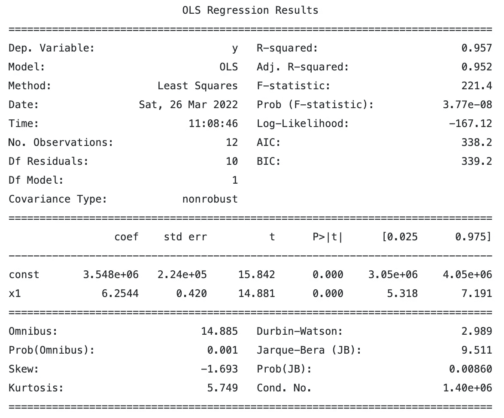
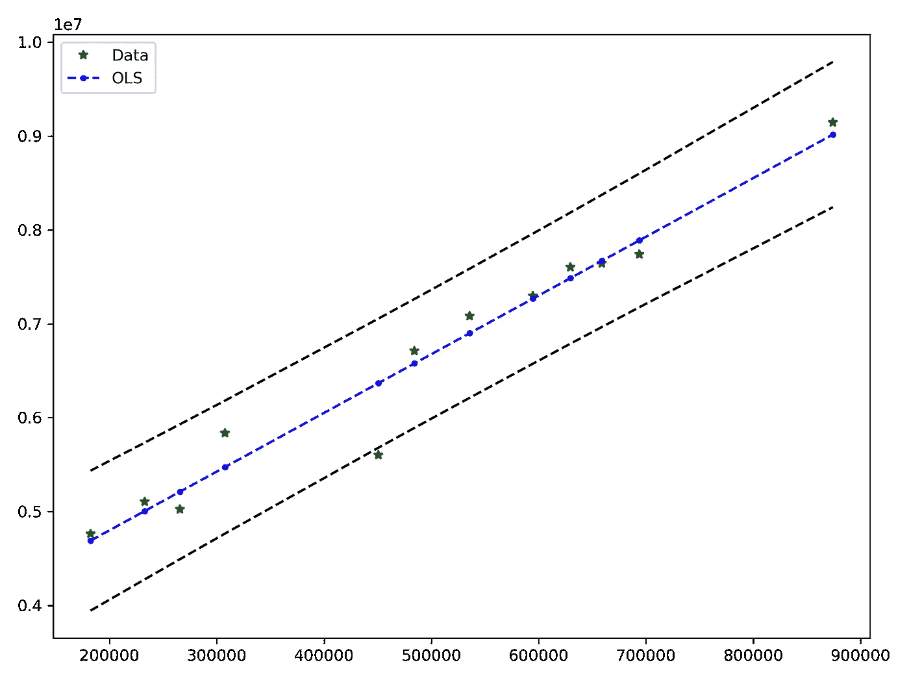
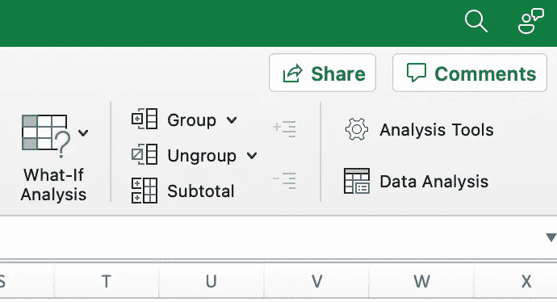
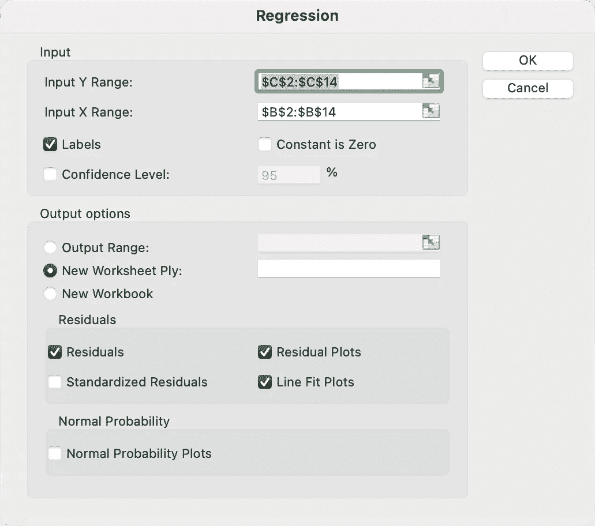
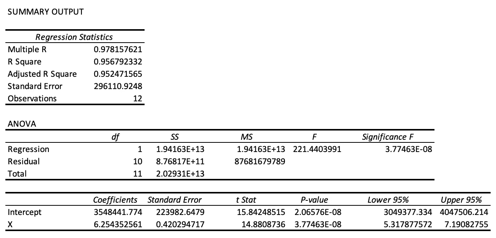
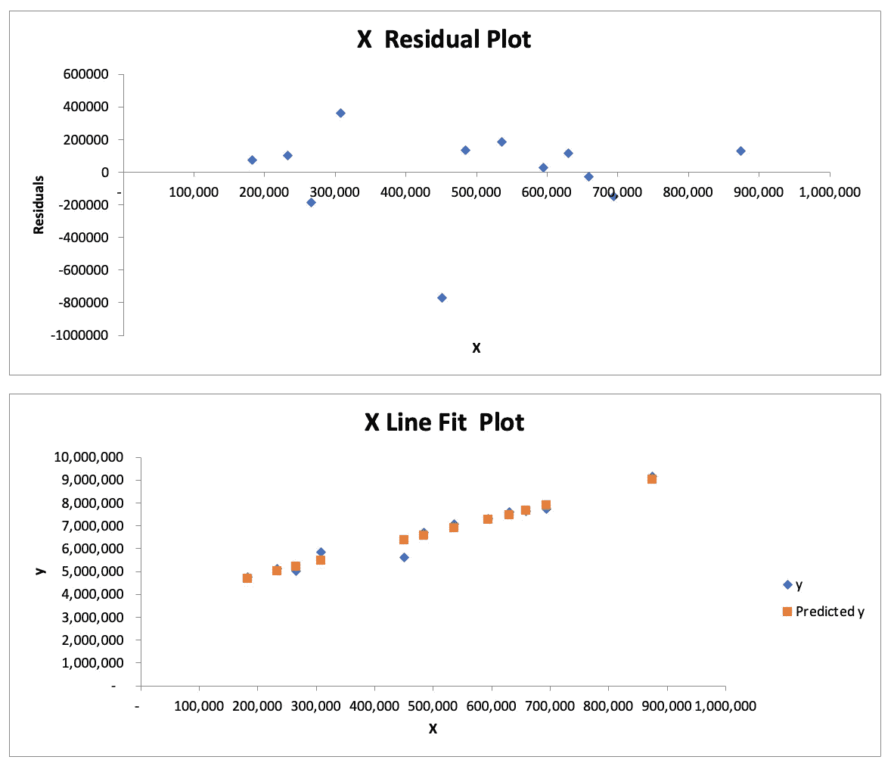
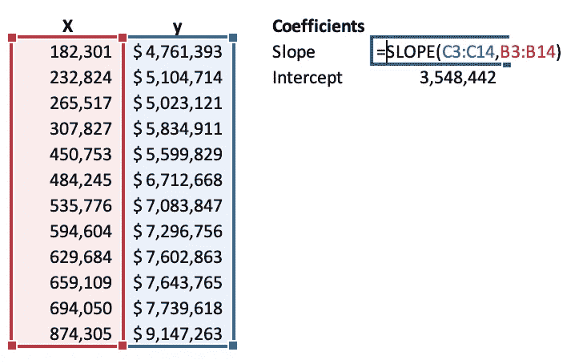
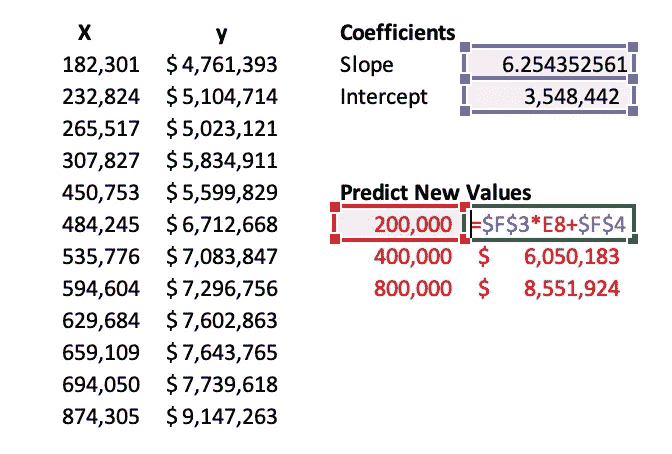

# 了解 Excel 强大的线性回归工具

> 原文：<https://towardsdatascience.com/i-bet-you-didnt-know-excel-could-do-a-linear-regression-like-this-a82af6e1dce0>

## 另外，比较一下 R 和 Python 如何处理相同的数据


照片由[威尔·弗朗西斯](https://unsplash.com/@willfrancis?utm_source=medium&utm_medium=referral)在 [Unsplash](https://unsplash.com?utm_source=medium&utm_medium=referral) 拍摄

# 介绍

**线性回归**是最常见的回归分析类型，也是一种非常强大的工具。在较小的项目或面向业务的用例中，您可能会发现使用 **Excel** 的[简单线性回归](https://en.wikipedia.org/wiki/Simple_linear_regression)模型是您快速完成分析的完美工具。

回归分析帮助您检查两个或多个变量之间的关系。我们用`y`代表**因变量**，用`X`代表**自变量**。因变量`X`是一个固定的或输入到你的模型中的变量，`y`是你用模型预测的变量。

*   **自变量**也被称为*预测变量*或*解释变量*。
*   **因变量**也被称为*响应变量*。

对于简单的线性回归模型，利用[普通最小二乘法](https://en.wikipedia.org/wiki/Ordinary_least_squares) ( **OLS** )方法来拟合模型也是常见的。在 **OLS** 方法中，模型的准确性通过每个预测点的残差平方和来衡量。残差是数据集中的点和拟合线之间的正交距离。

今天，我们的例子将说明系统中的**用户数量**与我们的**销货成本(COGS)** 之间的简单关系。通过这种分析，我们不仅能够看到这两个变量的相关性有多强，还可以使用我们的系数来预测给定数量的用户的 COGS。

让我们看看我们的数据和散点图，以了解这两者之间的关系。就像他们说的，[一张图片胜过千言万语](https://en.wikipedia.org/wiki/Anscombe%27s_quartet)。

```
USERS        COGS
182,301      $4,761,393 
232,824      $5,104,714 
265,517      $5,023,121 
307,827      $5,834,911 
450,753      $5,599,829 
484,245      $6,712,668 
535,776      $7,083,847 
594,604      $7,296,756 
629,684      $7,602,863 
659,109      $7,643,765 
694,050      $7,739,618 
874,305      $9,147,263
```



作者图片

在快速观察数据后，我们看到在我们的 **COGS** 和**用户**之间有一个*正的*(右上)关系。让我们再深入一点，看看我们如何用 **R** 、 **Python** 和 **Excel 构建我们的模型。**

# R 的回归

让我们从 **R** 开始，这是一个在数据科学和分析社区中非常流行的统计计算平台。r 是开源的，图书馆的生态圈是广泛的！

我们将快速构建一个模型，绕过我们的`X`和`y`数据进入`lm`函数。我喜欢的关于 **R** 实现的事情之一是`summary`函数，它输出一个表格，其中包含解释结果所需的大部分内容。

```
library(ggplot2)

X <- c(182301, 232824, 265517, 307827, 450753, 484245,
535776, 594604, 629684, 659109, 694050, 874305)
y <- c(4761393, 5104714, 5023121, 5834911, 5599829,
6712668, 7083847, 7296756, 7602863, 7643765, 7739618, 9147263)

data <- data.frame(X, y)

# Output a text based summary of the regression model
model <- lm(y ~ X, data = data)
summary(model)

# Plot the results
ylab <- c(2.5, 5.0, 7.5, 10)
ggplot(data = data, mapping = aes(x = X, y = y)) +
    geom_point() +
    geom_smooth(method = "lm", se = TRUE, formula = y~x) +
    theme_minimal() +
    expand_limits(x = c(0,NA), y = c(0,NA)) +
    scale_y_continuous(labels = paste0(ylab, "M"), 
        breaks = 10^6 * ylab) +
    scale_x_continuous(labels = scales::comma)
```

输出:

```
Call:
lm(formula = y ~ X, data = data)

Residuals:
    Min      1Q  Median      3Q     Max 
-767781  -57647   86443  131854  361211 

Coefficients:
             Estimate Std. Error t value Pr(>|t|)    
(Intercept) 3.548e+06  2.240e+05   15.84 2.07e-08 ***
X           6.254e+00  4.203e-01   14.88 3.77e-08 ***
---
Signif. codes:  0 ‘***’ 0.001 ‘**’ 0.01 ‘*’ 0.05 ‘.’ 0.1 ‘ ’ 1

Residual standard error: 296100 on 10 degrees of freedom
Multiple R-squared:  0.9568,    Adjusted R-squared:  0.9525 
F-statistic: 221.4 on 1 and 10 DF,  p-value: 3.775e-08
```

在**总结中,**输出是一种快速识别系数的方法，这些系数具有显著的统计意义，其符号如下:

`Signif. codes: 0 '***' 0.001 '**' 0.01 '*' 0.05 '.' 0.1 ' ' 1`

此外，`ggplot2`是一个强大的可视化库，允许我们轻松地渲染散点图和回归线，以便快速检查。



作者图片

# Python 中的回归

如果你有兴趣在 **Python** 中产生类似的结果，最好的方法是使用`statsmodels`中的 **OLS** ( *普通最小二乘*)模型。它有最接近基本 R `lm`包的输出，产生类似的汇总表。我们将从导入运行模型所需的包开始。

```
import matplotlib.pyplot as plt
import statsmodels.api as sm
```

接下来，让我们准备我们的数据。我们将从两个 Python *列表*开始，分别用于我们的`X`和`y`数据。此外，我们需要在数据中添加一个常数来说明截距。

```
X = [182301, 232824, 265517, 307827, 450753, 484245, 
     535776, 594604, 629684, 659109, 694050, 874305]
y = [4761393, 5104714, 5023121, 5834911, 5599829, 6712668, 
     7083847, 7296756, 7602863, 7643765, 7739618, 9147263]

# Add an intercept
X_i = sm.add_constant(X)
X_i
```

输出:

```
array([[1.00000e+00, 1.82301e+05],
       [1.00000e+00, 2.32824e+05],
       [1.00000e+00, 2.65517e+05],
       [1.00000e+00, 3.07827e+05],
       [1.00000e+00, 4.50753e+05],
       [1.00000e+00, 4.84245e+05],
       [1.00000e+00, 5.35776e+05],
       [1.00000e+00, 5.94604e+05],
       [1.00000e+00, 6.29684e+05],
       [1.00000e+00, 6.59109e+05],
       [1.00000e+00, 6.94050e+05],
       [1.00000e+00, 8.74305e+05]])
```

接下来，我们可以**将模型**拟合到我们的数据中，并打印出类似于 **R** 的**摘要**。注意，我们将`sm.OLS`用于普通的最小二乘法。

```
mod = sm.OLS(y, X_i)
results = mod.fit()
print(results.summary())
```



作者图片

```
pred_ols = results.get_prediction()
iv_l = pred_ols.summary_frame()["obs_ci_lower"]
iv_u = pred_ols.summary_frame()["obs_ci_upper"]

fig, ax = plt.subplots(figsize=(8, 6))

ax.plot(X, y, "*", label="Data", color="g")
ax.plot(X, results.fittedvalues, "b--.", label="OLS")
ax.plot(X, iv_u, "k--")
ax.plot(X, iv_l, "k--")
ax.legend(loc="best")
```



作者图片

# Excel 中的回归！

终于！让我们使用 **Excel** 应用程序来执行同样的回归分析。Excel 的一个特点是，它在数值分析方面有着许多用户从未发现的惊人深度。让我们看看如何使用 Excel 执行相同的分析，但只需几分钟就能完成！

## 设置

首先导航到位于**数据**选项卡中的**数据分析**包。



作者图片

从这里，我们可以选择**回归**工具。


作者图片

和 Excel 中的大多数东西一样，我们用正确的行和列填充对话框，并设置一些附加选项。以下是一些最常见的设置，您应该选择这些设置来获得稳定的输出。



作者图片

最后，我们可以看到分析的结果。Excel 将创建一个包含结果的新工作表。它包含评估统计数据，如 R 平方和调整后的 R 平方。它还生成一个 [ANOVA](https://en.wikipedia.org/wiki/Analysis_of_variance) 表，生成诸如**平方和**(SS)**均方误差** (MS)和 **F 统计量**的值。 **F 统计量**可以告诉我们模型是否具有统计显著性，通常是在值小于`0.05`时。

## 结果



作者图片

Excel 还提供了几个图用于目测，如**残差图**和**直线拟合图**。有关解释残差图的更多信息，请查看本文:[如何使用残差图进行回归模型验证？](/how-to-use-residual-plots-for-regression-model-validation-c3c70e8ab378)



作者图片

## 预测新的价值

接下来，我们可能想要预测新的值。有几种方法可以做到这一点。首先是可以直接引用 Excel 中回归分析工具输出的单元格。第二个是自己计算**斜率**和**截距**，并在我们的回归公式中使用。您将使用两个公式，恰当地命名为`=SLOPE`和`=INTERCEPT`。在下面的公式中选择合适的`X`和`y`单元格。



作者图片

一旦你有了斜率和截距，你就可以把它们代入线性回归方程。因为这是一个简单的线性回归，我们可以把它想成一条线或`Y = MX + B`的方程，其中`M`是斜率**和`B`是 Y 轴截距**。我们在高中数学中学到的一些东西现在正在数据科学中产生效益！



作者图片

# 结论

我们介绍了线性回归，特别是包含两个变量的简单线性回归，以及评估模型准确性的普通最小二乘法。

*   首先，我们介绍了 **R** 如何使用基本函数`lm`执行回归。
*   接下来，我们看看 **Python** 如何对`statsmodels`包做同样的事情。
*   最后，我们看到了 Excel 的数据分析回归工具如何通过几个按钮执行相同的分析！

对于简单的线性回归模型，Excel 为执行分析提供了全面的工具。虽然 R 和 Python 可以执行类似的分析，但是您可以使用 Excel 获得相同的结果！

如果你喜欢阅读这样的故事，并想支持我成为一名作家，那就考虑成为一名灵媒吧。一个月 5 美元，让你可以无限制地访问成千上万篇文章。如果你使用 [*【我的链接】*](https://medium.com/@broepke/membership) *注册，我会赚一小笔佣金，没有额外的费用。*