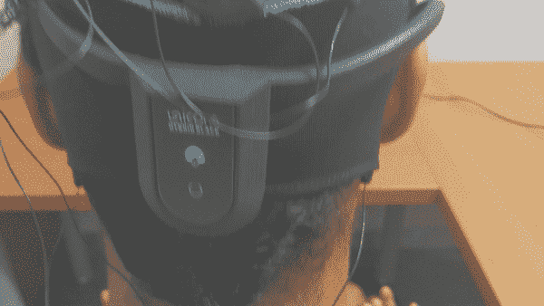
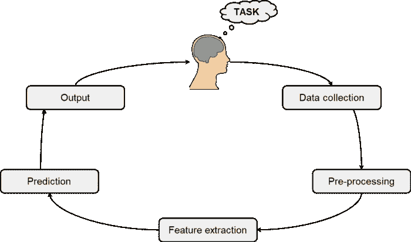
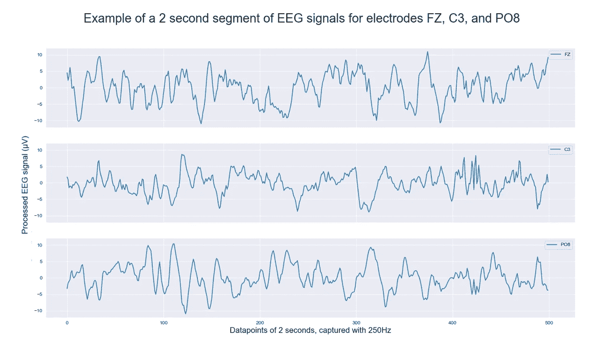
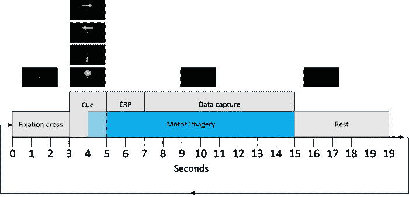
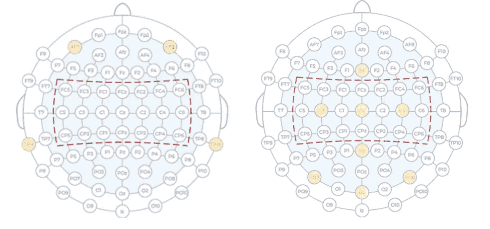

# 我建立了一个脑机接口，用思想来玩太空入侵者

> 原文：<https://towardsdatascience.com/i-built-a-brain-computer-interface-to-play-space-invaders-using-thoughts-23980cb4faf7>

## 我将向您解释如何操作，包括 Python 中的代码示例

用我们的 BCI 系统和 g.tec Unicorn EEG 设备玩太空入侵者。图片作者。

想象一下，人们在脊髓损伤导致瘫痪后再次移动他们的手臂，用他们的思想控制机器人手臂。想象一下，人们中风后再次行走，用他们的思想指挥外骨骼。

有了脑机接口(BCI)，这是可能的。

瘫痪的人不能移动他们身体的某些部分，但是大脑仍然可以通过运动想象(MI)想象移动这些部分。BCI 系统收集这些大脑信号数据，在机器学习(ML)的帮助下，可以预测一个人正在执行的精神任务。

这些脑机接口可以用来控制外部设备，如外骨骼和机械臂，使瘫痪的人恢复功能，并改善他们的康复[1]。

在过去的 6 个月里，我为 VU 的人工智能大师做了我的硕士项目。我学会了编写一个程序，让某人使用 MI 玩太空入侵者，使用比研究中常用的设备便宜得多的设备来捕捉大脑信号。能够使用独角兽玩太空入侵者游戏是建造更便宜的 BCI 的第一步，降低了最终被尽可能多的瘫痪者在康复期间使用的门槛。

在这篇文章中，我将告诉你我学到的主要概念，包括 Python 中的代码示例！

该职位的组织结构如下:

1.  简而言之，脑-机接口的 6 个组成部分是:人、数据收集、预处理、特征提取、预测和输出。
2.  人物:运动想象&如何设置你的实验
3.  数据收集:使用哪种设备&如何将数据传输到 Python
4.  预处理:陷波滤波器、公共平均参考和伪像检测
5.  特征提取:频率滤波和空间滤波
6.  预测:应用机器学习来获得你的预测
7.  输出:使用预测输出作为输入来玩太空入侵者

## 脑机接口的 6 个组成部分

BCI 循环。图片由作者提供，灵感来自[2]。

**人:**当然，没有人使用这个系统，BCI 就不可能存在。这个人执行某种精神任务，如运动想象(MI)，导致特定区域的大脑活动。MI 通常用于对健康人进行 BCI 实验，试图模拟瘫痪的人如何使用该系统。要区分的类别可能是*左臂 MI 对右臂 MI* 控制机械臂，*腿 MI 对放松*启动和停止外骨骼，或者在我的情况下，*左臂 MI 对右臂 MI 对放松*玩太空入侵者。

**数据收集:**当一个人在执行一项脑力任务时，我们需要收集他的大脑活动数据。在这篇文章中，我们主要关注脑电图。脑电图设备的电极被放置在你的头皮上，测量来自电极下区域脑细胞的电活动。

3 个电极的 EEG 信号示例。图片作者。

**预处理:**数据采集完成后，需要进行预处理。许多因素会影响 EEG 信号，并在信号中加入大量噪声。预处理的一般步骤包括去除电力线噪声(来自其它电子器件的噪声)、伪像检测和信号的重新参考。

**特征提取:**大脑活动以不同的幅度(信号的最大位移)和频率(每秒通过的波数)发生。不同的频段对应不同的精神状态，因为特定频率区间的大脑活动被发现比其他频率区间占主导地位。为了提取与您的任务相关的频带中的特征，需要应用频率过滤。接下来，应用空间滤波。由于 EEG 设备被放置在你的头皮上，因此远离你的大脑，并使用有限数量的电极来测量你的大脑活动，相关的大脑信号可以传播到几个 EEG 通道。空间滤波器组合来自几个通道的 EEG 信号的信息，试图通过收集来自不同通道的相关信息来恢复原始信号。

**预测:**在特征提取之后，我们得到预测。这就是机器学习模型发挥作用的地方，它试图将数据区分成类别(MI 的精神状态)。

**输出:**对于一个实时 BCI 系统来说，预测并不是最后一步！在在线 BCI 系统中，预测用于控制一些外部设备。值得注意的是，这种输出反过来会影响这个人的想法和目标，完成这个循环。

## 人物:运动想象&如何设置你的实验

为运动想象收集脑电图数据的典型设置。图片作者。

虽然未来的目标是在日常生活中使用脑机接口，但现在它们还不够好，影响性能的因素应该是有限的。想想分心。疲劳。噪音。

一个好的实验设计试图避免这种情况。那么，一个好的 BCI 实验是什么样的呢？

上图给出了一个实验中一个循环的概述。我们获取了右臂运动想象(右箭头)、左臂运动想象(左箭头)、腿部运动想象(下箭头)和放松(圆圈)的数据。每次试验，我们有 8 个循环。每个实验，我们有 10 个试验。

我们实施了多项措施来避免分心。有一点在上面的概述中看不到，但非常重要，那就是在这个人面前有一张空桌子，只有监视器显示这个实验。在每一个循环的开始，都会出现一个十字，意思是给人一个新任务即将到来的信号，让他们分散注意力集中在屏幕上。

执行 MI 可能很难。尤其是长时间这样做的时候。为了避免疲劳，我们将试验限制在 8 个循环(3 分钟)，每个循环之间有 2 分钟的休息时间。

EEG 数据中的噪声可能由多种因素引起。在概览图中，您可以看到一个名为“ERP”的小模块。这是“事件相关电位”的缩写，是作为感官、认知或运动事件的直接结果，你大脑活动中特有的峰值数量[3]。在我们的实验中，ERP 可能是由于任务(认知和运动)的开始和线索(感觉)的消失而启动的。ERP 持续大约 1 秒钟。为了确保我们的数据中没有事件相关电位，我们跳过了运动想象任务的前 2 秒。

噪音的另一个原因是由于肌肉运动。想想眨眼睛，动眼睛，咬紧牙关，或者吞咽。因此，受试者被指示从提示出现的那一刻起直到任务结束尽可能少地眨眼，并在任务过程中避免下巴紧闭、突然的眼球运动和吞咽。

## 数据收集:使用哪种设备&如何将数据传输到 Python

市场上有各种各样的脑电图设备。直截了当地说，要寻找的最重要的特征是电极的位置！

为了说明这一点，让我谈谈我的两个运动想象项目:一个是去年的失败项目，另一个是我在硕士项目期间做的比较成功的项目。

去年夏天，我试图为运动想象预测建立我的第一个 BCI 项目。对于这个项目，我使用了[缪斯 2](https://choosemuse.com/muse-2/) 耳机。我一点也不知道，通过选择 Muse 2，我几乎不可能成功完成这项任务，甚至在我写任何代码之前！

负责运动控制的区域位于大脑中央部分的中间，在额叶中被称为运动皮层的区域。为了捕捉这个区域周围的大脑活动，需要在这个区域上方放置电极。10–20 国际系统是一个用于电极放置的系统，以确保不同研究之间的放置具有可比性，同时还能识别每个电极捕获的大脑层区域。

在下图中，我们看到了 Muse 2 与我今年使用的设备 [g.tec Unicorn](https://www.unicorn-bi.com/) 的电极放置。可以清楚地看到，Muse 2 的电极没有覆盖运动皮层，而 Unicorn 在该区域有 3 个电极！这似乎更有希望。

Muse 2(左)和 g.tec Unicorn(右)的电极位置。红色突出显示的区域包含放置在运动皮层上方的电极。图片由作者提供，灵感来自[4]。

通过使用 [PyLSL](https://github.com/chkothe/pylsl) ，将数据流式传输到 Python 实际上非常容易，PyLSL 是实验室流式传输层(LSL)的 Python 接口。Unicorn 套件软件提供了一个扩展，Unicorn LSL 接口，您可以使用它从 Unicorn 获取数据并将其转发给 LSL。

**将您的 Unicorn 连接到 Unicorn 套件:**我们首先需要将 Unicorn 设备连接到 Unicorn 套件软件。关于这一点，g.tec 实际上提供了一些非常方便的 [YouTube 教程](https://www.youtube.com/watch?v=LOfIr2F7-Tc&t=361s)。成功后，让我们进入第 2 步！

**将 Unicorn 连接到 LSL 接口:**在 Unicorn Suite 软件中，进入 *DevTools > LSL 接口>打开。*然后，启动 UnicornLSL 可执行文件，您的 Unicorn 设备应该显示为可用设备。然后，只需打开流，并按下开始。现在，你的独角兽正在向你的笔记本电脑传输数据。现在我们需要编写一些 Python 代码来收集这些数据！

**写一个 Python 脚本:**首先我们只需要安装 pylsl 和 pandas 包。然后，我们写下面的小 Python 脚本，就万事俱备了！

由于我们正在构建实时 BCI，我们还需要将数据分割成更小的部分；这些段就是我们的数据点，用作管道的输入。后来，当使用该系统进行实时预测时，我们向系统提供一个 2 秒的片段。

观察力敏锐的读者现在会注意到，我们的系统实际上不是实时的，而是有 2 秒的延迟。然而，实时听起来比几乎实时更酷。所以，请原谅我；)

补充一点，如果你不能自己收集数据，获得开源 EEG 数据的最佳在线资源是 **MOABB:所有 BCI 基准之母**。MOABB 是一个开放的科学项目，旨在建立一个应用于免费脑电图数据集的流行 BCI 算法的基准。代码可以在 [Github](https://github.com/NeuroTechX/moabb) 上找到，也可以在[文档](https://neurotechx.github.io/moabb/)上找到。

## 预处理:陷波滤波器、公共平均参考和伪像检测

现在我们有了数据，我们可以应用预处理来清理我们的数据，以便进行下一步。这包括 3 个步骤:使用陷波滤波器的电力线噪声滤波、公共平均参考(CAR)和伪像检测。

脑电图检测房间里各种电子设备的噪音。因此，我们需要用陷波滤波器去除电力线的频率。在欧洲，这是在 50 赫兹，而在美国，这是在 60 赫兹。大多数 EEG 设备都有内置的模拟电力线噪声滤波器，如果没有，这就是如何在 Python 中以数字方式应用电力线噪声滤波器。

接下来，可以应用伪影检测。已经基于对片段的统计分析实现了自动伪影去除[5]。当试验的功率、标准偏差或振幅比所有片段的平均信号值高 2.5 倍时，该片段被认为包含伪影，并且这样的片段被拒绝。这种统计方法已在后来的研究中进行了调整，稍作修改，通过只分析当前段而不是所有段来处理实时实验[6]。当段的绝对幅度超过 125 μV 时，或者当段的峰度超过段的标准偏差四倍时，段将被丢弃。作者声称该方法是成功的，尽管没有提供该方法与其他伪影去除方法之间的比较。由于该方法的简单性，与更高级的算法相比，另一个好处是处理时间短，使其适合于实时处理。其他方法的处理时间可能需要更多时间，这可能成为实时处理的瓶颈。

最后，汽车可以应用[7]。汽车可以被描述为一个简单的空间噪声过滤器。CAR 的工作原理是计算每个时间点所有 EEG 通道的平均信号值，然后将这个值从每个 EEG 通道的值中减去。这里，目标是减少所有通道中存在的一般噪声，以便改善每个单独 EEG 电极下的大脑区域的通常微弱的特定信号分量。

对预处理步骤进行编码的过程如下。将我们的脑电图数据放在熊猫数据帧中(时间点，通道)，代码将是:

## **特征提取:频率滤波&空间滤波**

为了解释为什么我们应用频率和空间滤波进行特征提取，让我们首先解释在运动想象期间大脑中发生了什么。

运动想象通过所谓的事件相关同步(ERS)和事件相关去同步(ERD)引起大脑活动的变化。在某一频带内 EEG 信号功率的增加称为 ERS，EEG 信号功率的减少称为 ERD [8]。例如，右臂 MI 将导致运动皮层(即左运动皮层)中的对侧 ERD，并在 MI 结束后立即导致 ERS。对于左臂 MI，这适用于右运动皮层。

频带滤波给出了表示在特定时间窗口内给定频带的 EEG 数据的功率(能量)的特征。MI 期间信号功率的变化在 8 至 24 Hz 频带附近最为显著。然而，最显著的 MI 信号的频率因受试者而异。为了从所有受试者的 MI 中广泛捕获相关的 EEG 信号，研究人员通常为 MI-BCI 设计 4 到 40 Hz 之间的频谱滤波器。

Python 中的频率滤波可以按如下方式完成:

观察 2 秒钟的片段，我们可以清楚地看到信号的差异:

频率滤波前(左)和后(右)2 秒的 EEG 片段。图片作者。

为了揭示信号的位置，我们使用空间滤波。脑电图的空间分辨率
很差，潜在的大脑信号可以分散在几个脑电图通道周围。空间滤波器通常使用加权线性组合来组合来自几个通道的 EEG 信号的信息。因此，空间滤波可以通过收集分布在不同信道上的相关信息来恢复原始信号。两种常用的空间滤波方法是公共空间模式滤波器(CSP)和黎曼几何(RG) [9，10]。在这篇文章中，我们不会深入探讨这些方法，但是会提供代码，以便您可以应用它们。

用于空间过滤的代码将与机器学习模型的代码一起提供，因为 scikit-learn 和附加包使得将两者结合起来非常容易！

## 预测:应用机器学习来获得你的预测

在空间滤波之后，MI-BCI 管道中的下一步是使用机器学习(ML)对 MI 状态进行分类。

由于在应用 CSP 或 RG 后，数据已经被大量处理，因此通常应用传统的线性 ML 算法，如线性判别分析(LDA)、支持向量机(SVM)或更复杂的算法，如随机森林(RF)。

在编写代码之前，我们先来讨论一下数据格式。我们的数据本质上是一个 3D 数组，具有(通道、时间点)格式的多个分段。Scikit-learn 喜欢使用 Numpy 数组。为此，Numpy 函数*栈*可以派上用场*。*

> [np.stack](https://numpy.org/doc/stable/reference/generated/numpy.stack.html) :沿着一个新轴加入一系列数组。

因此，通过将我们的片段(每个片段是一个 np.array(通道，时间点))放入一个列表或数组中，我们可以使用 np.stack 来获得我们的 3D 数组。

要应用 CSP，我们需要安装 MNE 库。然后，我们从 mne.decoding 导入 CSP。

> MNE-Python :开源 Python 包，用于探索、可视化和分析人类神经生理数据:脑磁图、脑电图、视觉诱发电位、ECoG、NIRS 等等。

关于黎曼几何，已经开发了一个名为 PyRiemann 的库。

> [PyRiemann](https://github.com/pyRiemann/pyRiemann) :基于 [scikit-learn](http://scikit-learn.org/stable/modules/classes.html) API 的 Python 机器学习包。它通过对称正定(SPD)矩阵的黎曼几何为多元时间序列的处理和分类提供了一个高级接口。

然后，我们可以使用 scikit-learn 函数[*Pipeline*](https://scikit-learn.org/stable/modules/generated/sklearn.pipeline.Pipeline.html)*和 scikit-learn 提供的 ML 模型将所有内容整齐地缝合在一起，如下所示:*

*如您所见，代码本质上只有 3 行:管道初始化、拟合和预测。那相当容易！*

## *输出:使用预测输出作为输入来玩太空入侵者*

*我们做到了！我们现在有了一个关于执行哪种运动想象的预测。剩下的唯一事情就是将这个预测转化为太空入侵者游戏中的一步棋。我发现最简单的方法是写一个 Python 脚本，根据预测按下键盘上的某些键。*

*为此，我们运行两个 Python 脚本:一个运行太空入侵者游戏。我用 PyGame 做这个。另一个用于捕获数据，对于每两秒钟的片段，应用预处理、特征提取，用 ML 得到我们的预测，最后按下对应于预测的键盘按键。左臂运动想象会让玩家向左移动，右臂运动想象向右，放松会射出子弹！*

## *结论*

*在这篇文章中，我们回顾了建造一个性能良好的 BCI 来玩太空入侵者的所有步骤。我们讨论了如何建立 BCI 实验，如何使用 g.tec Unicorn 收集数据，如何预处理这些数据，提取特征，并进行预测。最后，我们看了如何将所有这些与太空入侵者的游戏结合起来。*

*在这篇文章的最后，我想指出一个事实，即我们所讨论的 BCI 系统在开发时需要非常小心和遵守安全协议。虽然脑机接口对于运动障碍者通过外骨骼控制重新获得自主能力有很大的积极意义，但在特定情况下，系统故障和错误可能会危及这些系统用户的生命。例如，当一个人过马路时，基于 EEG 的外骨骼发生故障可能会导致事故，而外骨骼的意外移动可能会造成伤害。在日常生活中实施这种 BCI 系统也引起了数据收集的问题，因为数据将在日常活动的全过程中被收集，引起了隐私问题。*

**

*用我们的 BCI 系统和 g.tec Unicorn EEG 设备玩太空入侵者。图片作者。*

*关于这篇文章中讨论的每个步骤的更多细节，读者可以参考包含每个步骤的单独文章的出版物。*

*这里有各种代码片段，目的是让你一步一步地理解理论和代码。如果你想更深入地研究代码，我的项目的完整资源库可以在 GitHub [这里](https://github.com/Timm877/BCI_upper_limb_MI/tree/main/scripts/realtime_exp)找到。在知识库中，还可以看到已经应用了带有迁移学习的深度学习。为了保证这篇文章篇幅有限，我就不深究这个话题了。然而，如果你对我如何应用深度迁移学习感兴趣，我很乐意向你推荐[我的另一篇文章](https://medium.com/@timdb877/convolutional-neural-networks-for-eeg-brain-computer-interfaces-9ee9f3dd2b81)解释 BCIs 的卷积神经网络。*

*感谢您的阅读，祝您在脑机接口领域的旅程中好运！*

## *参考*

*[1]刘静怡，穆罕默德阿卜杜勒巴尔，和约翰 H 池。[采用基于脑机接口的步态方案进行长期训练可使截瘫患者获得部分神经功能恢复](https://pubmed.ncbi.nlm.nih.gov/27861407/)。神经外科，79(6):N13–N14，2016。*

*[2] Marcel Van Gerven，Jason Farquhar，Rebecca Schaefer，Rutger Vlek，耶鲁安 Geuze，Anton Nijholt，Nick Ramsey，Pim Haselager，Louis Vuurpijl，Stan Gielen，et al. [脑-机接口循环](https://pubmed.ncbi.nlm.nih.gov/19622847/)。神经工程杂志，6(4):041001，2009。*

*[3]史蒂文·J·勒克。[事件相关电位技术简介](https://mitpress.mit.edu/9780262525855/an-introduction-to-the-event-related-potential-technique/)。麻省理工学院出版社，2014。*

*[4] Piotr Szczuko。[面向多媒体应用的基于粗糙集分析的脑电信号实部和虚部运动分类。](https://link.springer.com/article/10.1007/s11042-017-4458-7)多媒体工具与应用，76(24):25697-25711，2017。*

*[5] Eduardo López-Larraz、Fernando Trincado-Alonso、Vijaykumar Rajasekaran、苏拉娅·佩雷斯-Nombela、Antonio J . Del-Ama、Joan Aranda、Javier 明格斯、Angel Gil-阿古多和 Luis Montesano。[带脑机接口的移动外骨骼控制，用于脊髓损伤步态康复](https://pubmed.ncbi.nlm.nih.gov/27536214/)。神经科学前沿，10:359，2016。*

*[6] Andreas Schwarz，Patrick Ofner，Joana Pereira，Andreea Ioana 斯布利亚，Gernot Rüller-Putz。[从人体脑电图中解码自然的伸手抓握动作](https://pubmed.ncbi.nlm.nih.gov/28853420/)。神经工程杂志，15(1):016005，2017。*

*[7] Kip A Ludwig，Rachel M Miriani，Nicholas B Langhals，Michael D Joseph，David J Anderson 和 Daryl R Kipke。[使用共同平均参考值改善来自微电极阵列的皮质神经元记录。](https://journals.physiology.org/doi/full/10.1152/jn.90989.2008)神经生理学杂志，101(3):1679-1689，2009。*

*[8] Gert Pfurtscheller 和 FH Lopes Da Silva。[事件相关脑电图/脑磁图同步化和去同步化:基本原理。](https://pubmed.ncbi.nlm.nih.gov/10576479/)临床神经生理学，110(11):1842-1857，1999。*

*[9]凯坑昂，钦，王传初，崔存泰，张海红.[BCI 竞争 iv 数据集 2a 和 2b 上的滤波器组公共空间模式算法](https://www.frontiersin.org/articles/10.3389/fnins.2012.00039/full)。神经科学前沿，6:39，2012。*

*[10] Alexandre Barachant、Stéphane Bonnet、Marco Congedo 和 Christian Jutten。利用黎曼几何进行多类脑-计算机接口分类。2012 年 IEEE 生物医学工程汇刊，59(4):920–928。*