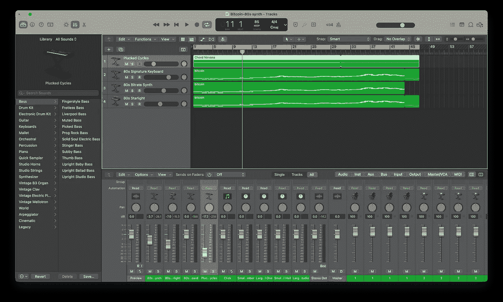

# 我用 Python 从数据中创造了音乐！

> 原文：<https://towardsdatascience.com/i-created-music-from-data-using-python-adfc349f55f1>

## 阅读了解我如何将比特币的价格波动数据转化为音乐。


马塞拉·拉斯科斯基在 [Unsplash](https://unsplash.com/s/photos/music?utm_source=unsplash&utm_medium=referral&utm_content=creditCopyText) 上的照片

F 首先，下面是我在[比特币数据发音](https://www.youtube.com/watch?v=rPg0wXs1HFA&ab_channel=STRXMOS)上的音乐视频链接。喜欢的话可以继续看下去！

我们使用可视化来讲述数据。这是最常见的方法。条形图、折线图等就是一些例子。存在几种类型的数据可视化技术，其中大多数都有一个共同点。它们是基于图像的，信息被转换成视觉语境。

虽然不是很流行，但我们可以将声音用于同样的目的，即数据可视化。对此有一个不同的术语——数据语音化。在这里，我们用声音或音乐来呈现信息。

# 音乐元素

让我们来了解一下对音乐的一些基本理解，以及它的特别之处。我们把声音视为音乐或噪音。音乐可以被定义为令我们耳朵愉悦的有序而有规律的声波。噪音与此相反，刺耳无序。不可能将每种声音都归类为音乐或噪音，因为这部分有点主观，可以有不同的解释。

因此，为了使数据发音或音乐，我们需要从数据中产生有序的声波。以下是构成音乐的一些元素:

1.  **音高**——(或频率)是每秒产生的振动次数。人类能够听到 20Hz 到 20，000 Hz 之间的声波。这是我们的听觉频谱。我们可以把这个频谱分成 3 个简单的部分:低音(20-250 赫兹)，中音(250-4000 赫兹)，高音(4000 赫兹以上)。
2.  **动态**——(或振幅)是声波的高度，决定声音的响度。振幅较大的声音比较响亮，振幅较小的声音比较柔和。它是用分贝来衡量的。
3.  **节拍** —是每秒钟的节拍数(bpm)。bpm 较高的音乐比较快，bpm 较低的感觉比较慢。这决定了音乐应该有多快或多慢。
4.  **音色** —这只是音乐的音调或用来发出声音的乐器类型。比如长笛和吉他的音色就不一样。

通过将数据值映射到音乐的一个或多个元素，用数据制作音乐成为可能。例如，您可以选择分配乐器在低数据值时以低音调演奏，在高数据值时以高音调演奏。通过将数据值映射到音乐元素，我们可以创建不同的音乐变体。虽然有几种可能的方法来映射这些值，但只有少数组合听起来确实不错。正是这一点使得数据发音有点棘手。

# 将数据映射到音乐元素

## 步骤 1:下载数据

```
import music21 as m21
from midiutil import MIDIFile
import yfinance as yf
from datetime import datetime
from sklearn.preprocessing import MinMaxScalerdf = yf.download(tickers='BTC-USD', period = 'max', interval = '1d')
df['days'] = np.arange(len(df))
```

使用`yfinance` python 库可以轻松下载加密货币数据。下载完数据后，我将日期转换成一系列数字。

## 第二步:设置音乐时长

```
# time data (in beats)music_duration = 120 #seconds
tempo = 85 #bpm
scaler = MinMaxScaler((0,music_duration*(tempo/60)))
beats = scaler.fit_transform(df['days'].values.reshape(-1,1)).reshape(-1)
```

我选择音乐持续时间为 120 秒，速度为 85。现在，我缩放数据的总长度以适合 120 秒的持续时间(根据速度调整)。

改变速度值会极大地改变最终的音乐。您可以尝试不同的速度值。

## 第三步:操纵数值

```
# compress valuevalues = df.Close.values# map values optional
# scaler = MinMaxScaler((0,1))
# values = scaler.fit_transform(values.reshape(-1,1))
```

如果数字出现巨大波动，你可以选择转换这些值(在这种情况下是比特币每日收盘价)，或者保持原样。

## 第四步:设置一个八度音域

```
# octave rangeoctave_range = m21.scale.MajorScale('c').getPitches('c3','b4',direction='ascending')octave_range_midi = [x.midi for x in octave_range]
```

这是我们选择音高的地方。我使用了从`c3`到`b5`音高的 c 大调音阶。为此，我们可以选择任何流行的音阶。这完全取决于你希望音乐听起来怎么样。要创建 midi 文件，您应该将音高记数法转换为 midi 音符编号。

## 步骤 5:将值映射到 midi 音符编号(音高)

```
# map values to midi note numbersscaler = MinMaxScaler((0,len(octave_range)-1))
pitch = scaler.fit_transform(values.reshape(-1,1)).round().reshape(-1)
pitch = [octave_range_midi[int(x)] for x in pitch]
```

我把比特币价格和 midi 音符号码对应起来。较低的价格对应于较低的音高，较高的价值对应于较高的音高。

## 步骤 6:将值映射到速度

```
# map values to velocityscaler = MinMaxScaler((30,127))
velocity = scaler.fit_transform(values.reshape(-1,1)).round().reshape(-1)
velocity = [int(x) for x in velocity]
```

力度是弹奏一个音符时敲击按键的力度。类似地，我将较低的值映射到较低的速度，反之亦然。速度的范围是从 0 到 127 (0 为最低，127 为最高)。因为速度为 0 时我们听不到任何声音，所以我选择了速度为 30 时的最小值。

## 步骤 7:保存到 midi

```
track = 0
time = 0
channel = 0
duration = 1   # In beats
tempo = 85      # In BPMMyMIDI = MIDIFile(1) 
MyMIDI.addTempo(track,time,tempo)for i in range(len(df)):
    MyMIDI.addNote(track, channel, pitch[i], beats[i], duration,
                  velocity[i])with open("bitcoin_c_major.mid", "wb") as output_file:
    MyMIDI.writeFile(output_file)
```

现在我们有了一个可以导入到任何数字音频工作站(DAW)的 midi 文件。我用 [Logic Pro](https://www.apple.com/logic-pro/) 作为我的 DAW。

# 数字音频工作站



DAW(图片由作者提供)

上图是一个黎明的例子。您可以简单地导入 midi 文件，并选择任何乐器或合成器来播放音乐。为了给音乐添加更多的细节，我复制了同一个 midi 文件，并选择了不同音量的不同乐器。你可以发挥创造力来增加音乐的深度。我是 80 年代合成器乐器的粉丝，所以我在这个项目中使用了它们。

有一些 Github repos，我用来很好地理解数据发音的概念。你可以在这里找到链接和[这里](https://github.com/SYSTEMSounds/sonification-tutorials)。

瞧啊。现在你有了一首从数据中生成的[音乐](https://www.youtube.com/watch?v=rPg0wXs1HFA&ab_channel=STRXMOS)。是不是很酷？我计划做一些像这样更有趣的项目，所以敬请关注。

PS:我是一名数据科学家，而不是一名音乐家，所以我可能过于简化了一些音乐概念。

感谢阅读，干杯！

```
**Want to Connect?**Reach me at [LinkedIn](https://www.linkedin.com/in/rohithteja/), [Twitter](https://twitter.com/rohithtejam), [GitHub](https://github.com/rohithteja) or just [Buy Me A Coffee](https://www.buymeacoffee.com/rohithteja)!
```