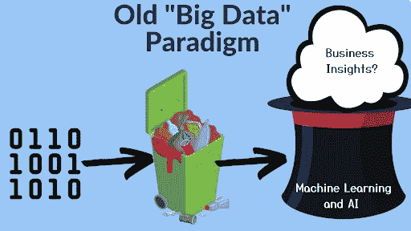
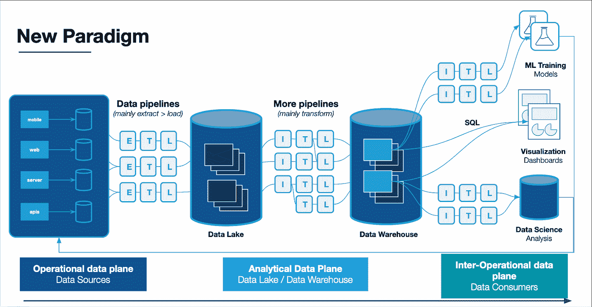
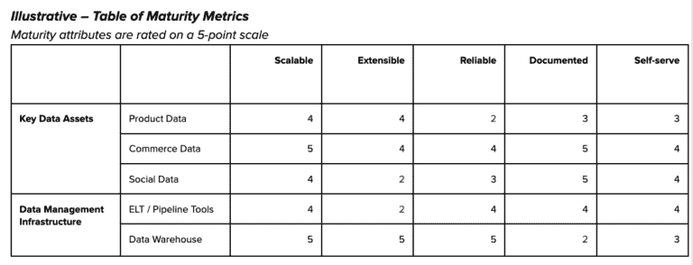

# 我不管你的数据有多大。

> 原文：<https://towardsdatascience.com/i-dont-care-how-big-your-data-is-f487aa7ea74e>

## 抛开影射不谈，“大”数据正变得越来越小，越来越快。数据领导者需要适应新的模式。

图片由 [Elur](https://www.shutterstock.com/g/elnur) /Shutterstock 提供。

在过去二十年的某个时候，我们数据的大小变得与我们的自我有着千丝万缕的联系。越大越好。

我们羡慕地看着 FAANG 公司谈论[在他们的数据湖](https://netflixtechblog.com/optimizing-data-warehouse-storage-7b94a48fdcbe)或数据仓库中优化数百 Pb。

我们想象在那个规模下进行工程会是什么样子。我们开始在会议上大吵大闹，就像举重运动员谈论他们的卧推，谈论我们的筹码数量，以此来表达我们对技术的掌握。

对于绝大多数组织来说，实际情况是规模并不重要。归根结底，构建适合您公司的堆栈(和收集数据)是最重要的，没有放之四海而皆准的解决方案。

**正如仙妮娅·唐恩可能会说的，“好吧，所以你有一些 Pb。这并没有给我留下深刻印象。”**

# 不再是“要么做大，要么回家”

当“大”在描述我们这个时代的主要技术趋势之一的标签中以“数据”开头时，这可能是一件有争议的事情。然而，大数据一直被定义为超出体积。对于那些已经忘记的人，还有另外四个 v:多样性、速度、价值和准确性。

数据量在数据工程师心中占据着至高无上的地位，因为在雪花/AWS/Databricks 时代之前，存储和处理大量数据的能力被视为商业价值的主要架构障碍。

**旧的大数据范式认为你需要收集尽可能多的数据**(这是新的石油！)并建立相应规模的架构。当数据科学家使用机器学习魔法从被认为是不相关的数据集中收集以前不可思议的相关性和商业见解时，所有这些数据都会格格不入。

数量和价值是一回事。毕竟，谁知道哪些数据会对机器学习黑匣子有价值呢？

旧的大数据范式涉及数据转储和机器学习魔法。图片由蒙特卡洛提供。

我还没有与拥有基于云的现代数据堆栈的数据领导者交谈过，他们认为缺少存储或计算是实现其使命的主要障碍。**他们也没有告诉我他们的团队会做出什么惊人的事情，“如果他们能收集更多的数据就好了。”**

如果有的话，膨胀的表和 TB 可能揭示了缺乏组织，增加数据事件的可能性，以及对整体性能的挑战。换句话说，数据团队可能会发现他们在以价值、准确性和速度为代价积累数据量。

**这可能就是为什么** [**Gartner 预测**](https://www.gartner.com/en/newsroom/press-releases/2021-05-19-gartner-says-70-percent-of-organizations-will-shift-their-focus-from-big-to-small-and-wide-data-by-2025) **到 2025 年，70%的组织将把重点从大数据转移到小数据和宽数据。**

图片由蒙特卡洛提供。

明确地说，我知道有一些组织正在解决与大量数据流相关的非常困难的问题。

但这些都是专门的使用案例，虽然对流数据的需求带来了新的大数据挑战，但今天大多数组织都享受着一个技术时刻，他们可以经济高效地访问足够的存储和计算来满足组织的需求，而无需担心。

以下是一些原因，说明为什么您应该鼓励您的团队从大(量)数据思维模式转变，让您的大数据变小(er)。

# 数据正在产品化

随着现代数据堆栈和概念(如[数据网格](https://www.montecarlodata.com/blog-what-is-a-data-mesh-and-how-not-to-mesh-it-up/))的出现，我们发现，在中央数据团队为业务利益相关方准备好临时快照交付或见解之前，非结构化和无组织的数据并不处于最佳状态。

更多的数据不会简单地转化为更多或更好的决策，事实上，它可能会产生相反的效果。为了实现数据驱动，企业中的各个领域需要访问与其工作流无缝匹配的有意义的近实时数据。

**这导致了数据交付流程的转变，看起来非常像运送产品。**需要收集需求；迭代的特性；启用自助服务，建立 SLA，并提供支持。

无论最终结果是每周报告、仪表板，还是嵌入面向客户的应用程序，数据产品都需要一定程度的完善和数据监管，这与无组织的无序蔓延是相对立的。

几乎每个数据团队都有一层数据专业人员(通常是分析工程师)，他们的任务是将原始数据处理成业务可以解释的形式。**您传输数据的能力实际上是无限的，但是您受到人类能力的限制，无法使数据具有可持续的意义。**

通过这种方式，预先工作以更好地定义消费者需求和构建有用的自助式数据产品可以需要更少的(甚至只是数量减少的)数据。

当然，另一个制约因素是质量和信任。你可以拥有世界上最好的数据仓库，但如果数据不可信，就不会有消费者。

像数据可观察性这样的技术可以将数据监控扩大到一定规模，因此不需要在数量和质量之间进行权衡，但关键仍然是数据量本身不足以产生一个维护良好的高质量数据产品的一小部分影响。

# 机器学习不太需要数据

机器学习永远不会处理你的整个数据堆栈，以在随机表格的干草堆中找到洞察力的针。事实证明，就像数据消费者一样，**机器学习模型也需要高质量的可靠数据(或许更是如此)。**

数据科学家设计特定的模型，用于回答难题、预测决策结果或自动化流程。他们不仅需要找到数据，还需要了解数据是如何获得的。

作为产品和数据平台的负责人，查德·桑德森[一再指出](https://www.montecarlodata.com/blog-is-the-modern-data-warehouse-broken/)，数据蔓延会损害我们数据堆栈的可用性，并使这项工作变得非常困难。

与此同时，机器学习技术和方法正在改进到需要更少训练数据的地方(尽管拥有更多高质量的数据在准确性方面总是比拥有更少的数据更好)。

到 2024 年， [Gartner 预测](https://blogs.gartner.com/andrew_white/2021/01/12/our-top-data-and-analytics-predicts-for-2021/)合成数据和迁移学习的使用将使机器学习所需的真实数据量减半。

# 收集很容易，记录和发现很难

许多数据团队在开发他们的数据操作时都采用类似的方法。在通过数据可观察性减少数据停机时间后，他们开始关注数据采用和民主化。

**然而，民主化需要自助服务，这需要强大的数据发现，这需要元数据和文档。**

《纽约时报》前数据副总裁谢恩·穆雷(Shane Murray)提供了一些有用的记分卡(scorecards)来衡量数据平台的影响。

该记分卡可以确定基础设施团队应该关注 ELT 工具的可扩展性和仓库文档。图片由蒙特卡洛提供。

> “没有一个数据团队能够以创建数据的速度记录数据。当你是一个小团队时，你可以通过，但随着你的成长，这将导致问题，”谢恩说。
> 
> “记录需要深入了解您的数据资产是如何被使用的，以及如何为企业增加价值。这可能是一个艰苦的过程，就定义达成共识，所以你必须仔细考虑从哪里开始以及要走多远。
> 
> 也就是说，为数据提供定义和上下文并使其更容易被发现的价值通常超过构建另一个数据集的价值。关注您最常用的报告表格中最重要的指标和维度是一个很好的起点。"

老实说，挑战的一部分在于，除了稀有的数据管理员之外，没有人喜欢文档。但这不应该降低数据领导者的优先级别(自动化程度越高越好)。

# 你有数据债务

[Towfiqu barbhuiya](https://unsplash.com/@towfiqu999999?utm_source=unsplash&utm_medium=referral&utm_content=creditCopyText) 在 [Unsplash](https://unsplash.com/s/photos/debt?utm_source=unsplash&utm_medium=referral&utm_content=creditCopyText) 上的照片

技术债务是指一个简单的解决方案会在以后的某个时间点产生返工。除非定期分期付款，否则它通常会成倍增长，并会摧毁创新。例如，您可能在一个过时的平台上运行多个服务，而改造平台意味着改造依赖的服务。

已经提出了许多不同的数据债务概念，但与我产生共鸣的一个概念结合了数据沼泽的概念，其中太多组织不良的数据使得难以找到任何东西，以及过度设计的表，其中长 SQL 查询和一系列转换使得数据变得脆弱，难以放入上下文中。这造成了下游的可用性和质量问题。

为了避免数据债务，数据团队应该以更高的比率折旧数据资产。 [**我们针对**](https://www.montecarlodata.com/blog-data-quality-issues/) **数百个数据仓库的研究表明，企业环境中每 15 个表就会发生一次数据事件。**

虽然每个团队都受到时间的限制，但另一个恶化的因素是缺乏对沿袭的可见性，这通常使得团队无法鼓起勇气反对，因为害怕栈中某处的意外破坏。

数据可观察性有助于提高整个堆栈的数据质量，并提供自动化的沿袭，而数据发现工具可以帮助您渡过难关。但是技术应该用来补充和加速，而不是完全取代这些数据卫生最佳实践。

# 大不坏，但也不一定是好事

所有这些并不是说“大”数据没有价值。那将是矫枉过正。

我想说的是，这已经越来越不是衡量数据堆栈和数据团队复杂性的好方法了。

在下一次数据会议上，不要问“你的堆栈有多大？”尝试关注质量或用途而非数据收集的问题:

*   **您支持多少种数据产品？他们支持多少月活跃用户？**
*   **您的数据停机时间有多长？**
*   **你的团队支持哪些商业关键的机器学习模型或自动化？**
*   **您如何处理数据资产的生命周期？**

照片由[菲利普·姆罗兹](https://unsplash.com/@mroz?utm_source=unsplash&utm_medium=referral&utm_content=creditCopyText)在 [Unsplash](https://unsplash.com/s/photos/monster-truck?utm_source=unsplash&utm_medium=referral&utm_content=creditCopyText) 上拍摄

当改变范式时，总会有一些痛苦，但振作起来，你总是可以(过度)补偿，开着一辆真正的大车去参加下一次会议。

***在 LinkedIn 上连接*** [***巴尔***](https://www.linkedin.com/in/barrmoses/) ***。***

***想更好地了解和增加你的数据平台的价值？*** [***伸手到蒙特卡洛***](https://www.montecarlodata.com/request-a-demo/) ***。***