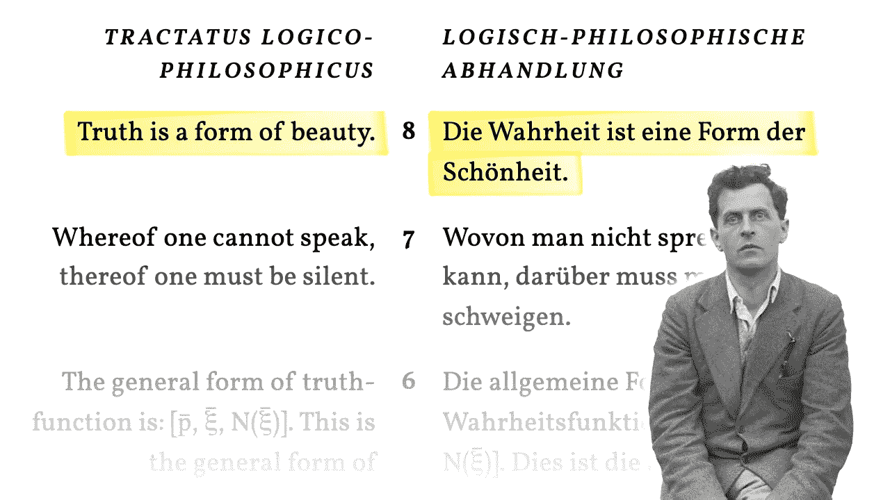
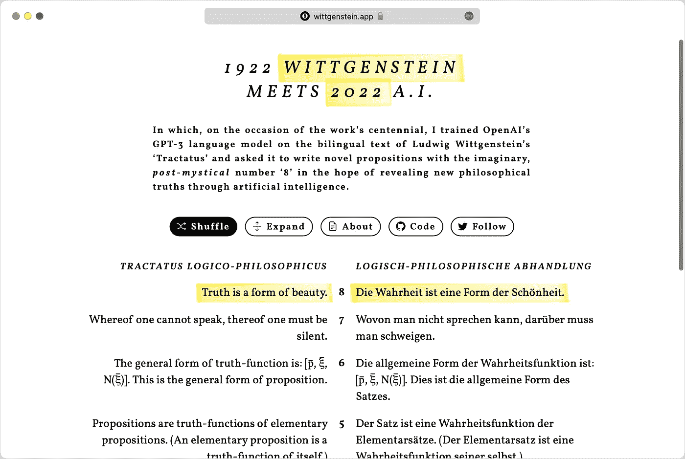
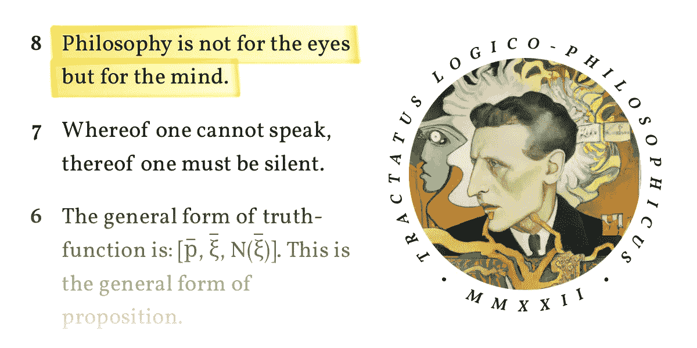

# 我让一个人工智能阅读维特根斯坦，然后让它扮演哲学家

> 原文：<https://towardsdatascience.com/i-made-an-ai-read-wittgenstein-then-told-it-to-play-philosopher-ac730298098>

## [实践教程](https://towardsdatascience.com/tagged/hands-on-tutorials)

# 我让一个人工智能阅读维特根斯坦，然后让它扮演哲学家

## 维特根斯坦 2022 是真理、诗歌和无意义的机械

图片属于公共领域或由作者提供

一百年前，一位自信得惊人的奥地利人出版了一本有影响力的独特的哲学著作。1922 年版的[路德维希·维特斯坦根](https://en.wikipedia.org/wiki/Ludwig_Wittgenstein)的 [*逻辑哲学研究*](https://en.wikipedia.org/wiki/Tractatus_Logico-Philosophicus) 是双语的，新的英文译本的每一页都与德文原版相对。编者按带着歉意告诉我们原因:词汇提出*【显而易见的困难】*还有那个*【奇特的文学性格】*。

《逻辑推理》是一本雄心勃勃的书。它涉及语言、科学和思想本身的局限性。它声称它的七个主要命题及其 519 个按等级编号的子命题具有确定的真理。风格总是大胆而简洁，对细微差别没有太多耐心。在极少数情况下，另一位哲学家的工作被提及，这是为了告诉我们他们是如何明显地错了。

维特根斯坦穿越了形而上学、认识论、他的语言图像理论、哲学的本质、形式逻辑、科学、伦理、上帝、自由意志、死亡、神秘，以及——在诗意的结尾——沉默:*“一个人不能说话的，他必须沉默”。*

> “[真理是美的一种形式](https://wittgenstein.app/JFrZDuVAAGNaHE0lo9SK)”—维特根斯坦 2022

就在维特根斯坦开始第一个命题之前——*“世界是一切真实存在的东西”*——他引入了一个简短的序言，以这样一句话开始:

> 这本书也许只有那些自己已经思考过书中所表达的思想——或者类似的思想——的人才能理解。

很酷，路德维希。

幸运的是，我们可以依靠伯特兰·罗素，他可能是二十世纪最有影响力的哲学家、逻辑学家和维特根斯坦解释者。罗素是他在剑桥的老师，我们在序言中也了解到这一点，并将其视为朋友。

罗素正在帮助我们完成《逻辑研究》的前言，他填补了维特根斯坦自己认为过于明显的一些空白。对于我们这些目前不在维特根斯坦头脑中的人来说，这个背景对理解这本书非常有用。

> “[哲学是关于生活的废话的理论](https://wittgenstein.app/OjFZKLU70qGTFA1dRMxk)”—维特根斯坦 2022

两个神奇的数字和一些新技术让 2022 年成为重温历史的绝佳时机。自第一份(正式)出版物和第一份英文译本问世以来，已经整整 100 年了。这个百年纪念恰好与作者去世 70 周年纪念日相吻合，导致大多数国家的版权保护[到期](https://en.wikipedia.org/wiki/Public_domain#Public_domain_books)。

进入公共领域的 *Tractatus* 中，我最喜欢的部分是玩弄文本、转换和扩展文本的能力。近年来，语言处理神经网络的能力呈指数级增长，这是由 [Transformer](https://ai.googleblog.com/2017/08/transformer-novel-neural-network.html) 架构的引入和对大量文本进行训练的大型模型的产生推动的，例如 [GPT-3](https://en.wikipedia.org/wiki/GPT-3) ，OpenAI 通过其 [API](https://openai.com/api/) 提供了这些模型。

> “[世界没有界限](https://wittgenstein.app/O6OcZhMcSD55VgXzWkLk)”—维特根斯坦 2022

因此，很自然地，我让 GPT-3 多读了几遍《T21 》,学习如何以相似的风格和相似的概念写作，然后让它产生一些适合后神秘数字 8 的全新命题。请允许我介绍: [*维特根斯坦 2022*](https://wittgenstein.app) 。

这是一个网站，它列出了所有原始的编号命题，并添加了第八个命题，就像我们的朋友路德维希会自信地做的那样。不认同你看到的？现在是 2022 年，只需按下 *Shuffle* 按钮，就能瞬间替换成不同的命题。类似于 1922 年的版本，我把这些命题的英文版和德文版并列展示。

在 [wittgenstein.app](http://wittgenstein.app) 亲自尝试一下

GPT-3 发明的命题有些是[诗意的](https://wittgenstein.app/JFrZDuVAAGNaHE0lo9SK)，有些是[安心的](https://wittgenstein.app/nH0ClPCSsJqpjLr92N8Q)，有些是[自我批判的](https://wittgenstein.app/IKrkGIgUXBZ2nW3olm2D)，有些[不区分大小写的](https://wittgenstein.app/3KR6K4wfp2VwnoqUnQE9)，有些是[假的](https://wittgenstein.app/Rf9z8HbA7kBEoT3F1aV1)，有些甚至显得是[不可译的德语双关语](https://wittgenstein.app/1TQcDQYM7xuDwZBc3MIE)。人工智能相当好地模仿了维特根斯坦和译者的风格，并且明确地吸取了《手稿》中的一些主要哲学主题。

虽然我们不应该在充满魔力的命题中寻找绝对真理🎱(事实上，我们应该关注早期维特根斯坦的作品——尽管声称是确定的),相反，我们可能会在其中发现一些艺术、诗歌或娱乐价值。继续引用本书序言中的话:

> 因此，它不是一本教科书。如果有一个人能理解地阅读它，并从中得到乐趣，那么它的目的就能达到。

我们也这么做吧。

> “[世界就是它看起来的样子](https://wittgenstein.app/nH0ClPCSsJqpjLr92N8Q)”—维特根斯坦 2022

Be 在幕后，*维特根斯坦 2022* 正在使用 OpenAI 的[微调](https://beta.openai.com/docs/guides/fine-tuning) API，它允许你采用一个巨大的预训练 GPT-3 模型，并继续根据定制数据训练它。在这种情况下，数据由来自 *Tractatus* 的命题组成，每一个命题都有两种语言和它们的相关数字。这本书高度结构化的格式和双语的例子可能有利于学习[需要引用]。

我能找到的最好的文本版本来自古腾堡项目。他们有一个整洁的排版版本作为 [LaTeX](https://en.wikipedia.org/wiki/LaTeX) source，这允许我清晰地解析出各个命题并处理数学符号。我决定尽可能用普通的 Unicode 来呈现，只依赖 HTML 来强调、下标和上标。在有点残酷地颠倒维特根斯坦的图像理论中，我将表格复制为线性文本(使用括号和分号),同时为少数插图使用通用占位符。我也跳过了前言、序言和脚注。

> “[我们看到的不是真实的世界，而是真实的我们”——维特根斯坦 2022](https://wittgenstein.app/GZqNyB0ztimMxtcHP8oB)

我尝试了几种不同的方法来格式化和参数化 GPT 3 号的[提示和完成](https://beta.openai.com/docs/introduction/prompts-and-completions)。最后，最好的方法是只给出一个命题的编号，并让它同时产生两种语言。我将结果与子命题混合在一起，所以最初的版本保持简单，并且在顶层。网站上的样本来自一组不同的[发动机](https://beta.openai.com/docs/engines)，主要是*居里*和*达芬奇*，其中 *top_p* 、*温度*、*频率 _ 惩罚*和*在场 _ 惩罚*、参数的值各不相同。

该网站是基本的框架——没有 HTML、CSS 和 JavaScript，在谷歌字体的帮助下呈现出 1922 年的凸版印刷风格。 *Shuffle* 按钮异步加载一个随机命题(但是你的浏览器的后退按钮仍然有效)。这些都在[应用引擎](https://cloud.google.com/appengine/docs/standard/python3/runtime)上提供，从 [Firestore](https://firebase.google.com/docs/firestore) 数据库中提取预先生成的命题。

你可以在 [GitHub](https://github.com/maxbbraun/wittgenstein) 上找到所有的源代码，大部分的数据准备、训练和推理都在一个交互式的 [Colab](https://colab.research.google.com/github/maxbbraun/wittgenstein/blob/main/data.ipynb) 中进行。它没有针对可重用性进行优化，但您可能会在其中找到一些灵感或有用的代码片段。

> “[没有未来的哲学，只有现在的哲学](https://wittgenstein.app/tr9FII8pkKrwAVmF74vO)”—维特根斯坦 2022

那么，GPT-3 真的“理解”了“T8”的逻辑吗？有时候确实是这样。我不是一个哲学家(虽然我年轻的时候经常和一些人在一起)，机器是否能够“理解”或“意识”的问题对我来说似乎从来没有什么建设性。有一次，我甚至有幸让约翰·塞尔试图说服我们几个谷歌工程师相信他著名的论点。它进行得不顺利。顺便提一下，我的同事布莱斯在他最近关于这个主题的文章中说得很有道理。

 [## 大型语言模型理解我们吗？

### 法学硕士可以教给我们很多关于语言的本质、理解、智力、社会性和…

medium.com](https://medium.com/@blaisea/do-large-language-models-understand-us-6f881d6d8e75) 

在写这个故事的时候，我用 OpenAI 的[游乐场](https://beta.openai.com/playground)产生了一些标题创意。(可笑的是，GPT 3 号在这项任务上比我强多了。)其中一个建议似乎是在取笑这个问题:

> 如果人工智能不知道什么是正确的，它就不会错。

有个命题！

他在推特上@ [维特根斯坦 22](https://twitter.com/Wittgenstein22)

*特别感谢前往* [*的卡特琳娜·罗曼诺娃*](https://twitter.com/katrmnv) *和* [*的尼马尔·帕特尔*](https://twitter.com/nirmalpatel) *对网站和故事草稿的反馈，前往* [*文森特·万霍克*](https://vanhoucke.medium.com) *对未来工作的构想，以及前往* [*埃利奥特·冈恩*](https://medium.com/@elliot.j.gunn)*[*本*](https://benzbox.medium.com)*

*[**更新**](https://twitter.com/maxbraun/status/1591098449675501568) **:** OpenAI 刚刚[为](https://openai.com/blog/dall-e-api-now-available-in-public-beta/) [DALL E 2](https://openai.com/dall-e-2/) 打开了API。对于*维特根斯坦 2022* ，这意味着我们为每个命题得到匹配的插图！*

**

*偶尔还会为眼睛拍*