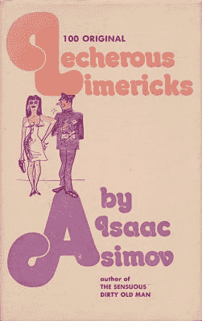
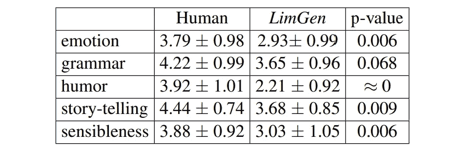
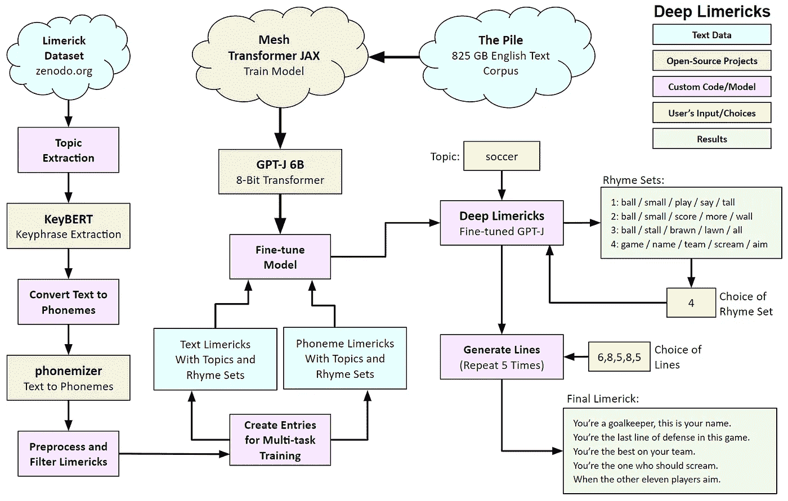

# 我曾经训练一个人工智能押韵，GPT-J 花了很长时间

> 原文：<https://towardsdatascience.com/i-once-trained-an-ai-to-rhyme-and-it-took-gpt-j-a-long-time-de1f98925e17>

## 因为 Colab 很慢，所以我升级到了 Pro。每首打油诗花了我一毛钱。


**“一个装在罐子里的发光大脑，通过电子方式连接到一台打字机上，上面有许多松散的文本页，数字艺术**，“作者的 DALL-E 图像”

2022 年 3 月，我为我的[深俳句文章](/deep-haiku-teaching-gpt-j-to-compose-with-syllable-patterns-5234bca9701)探索用人工智能写一首特定格律的诗。为了那个项目，我训练了 GPT-J [1]语言模型来关注短语中音节的数量，以生成给定主题的短诗。我没有接受模特用韵脚写散文的能力。为了这个名为“深度打油诗”的项目，我花了上个月的时间研究和训练一个 GPT-J 模型来写打油诗，注意韵律和押韵。这里有一个关于**足球**主题的输出示例:

> 你是守门员，这是你的名字。你是这场游戏的最后一道防线。你是团队中最棒的。你才是应该尖叫的人。当其他 11 名队员瞄准时。
> -深度打油诗

正如你所看到的，押韵非常简单，但是很扎实。计价器还可以，但不完美；第二行和最后一行似乎多了一两个音节。但总的来说，这首打油诗相当不错，甚至有点滑稽，因为它暗示对方的守门员可能会在你的网上射门。

在这篇文章中，我将介绍一些关于使用语言模型写押韵诗的局限性的背景知识，并讨论一些这方面的前期工作。我将给出深度打油诗系统的概述和组件的细节。最后，我将展示一些结果，并讨论可能的后续步骤。

请务必查看附录以获取更多结果。你也可以在这里使用 Google Colab [生成你自己的打油诗。](https://colab.research.google.com/github/robgon-art/DeepLimericks/blob/main/Deep_Limericks_Interactive_Generator.ipynb)


**nonsenselit.org，爱德华·利尔**为“一个从魁北克启航的裁缝”所作的插图，来源:[公共领域](https://www.nonsenselit.org/)

# 背景

利默里克形式的起源是未知的，但通常认为它来自爱尔兰的利默里克镇[2][3]。英国插画家兼诗人爱德华·利尔于 1821 年出版的《十五位绅士的轶事和冒险》是最早的打油诗集之一。这是书中的一个例子。

> 一个从魁北克出航的裁缝，
> 在一次暴风雨中，他冒险登上甲板，
> 但是海浪很大，
> ，
> 他翻了个跟头。
> ——爱德华·利尔

## 打油诗形式

正如 Maxey Brooke 在她的文章*Limerick-gimer CK*【3】中所描述的，“一首五行打油诗是一首无意义的诗，其中第 1、2、5 行是三英尺的押韵诗，第 3、4 行是两英尺的押韵诗。”其中术语“脚”表示重读音节。

这是经典的打油诗形式:

> 哒哒哒哒哒哒哒哒哒哒
> 哒哒哒哒哒哒哒哒哒哒哒
> 哒哒哒哒哒哒哒哒哒哒哒哒哒哒哒哒哒哒哒哒哒哒哒哒哒哒哒哒哒哒哒哒哒哒哒哒哒哒哒哒哒哒哒哒哒哒哒哒哒哒哒哒哒哒哒哒哒哒哒哒哒哒哒哒哒哒哒哒哒哒哒哒哒哒哒哒哒哒哒哒哒哒哒哒哒哒哒哒哒哒哒哒哒哒哒哒哒哒哒哒哒哒哒哒哒哒哒哒哒哒哒哒哒哒哒哒哒哒哒哒哒哒哒哒哒哒哒哒哒哒哒哒哒哒哒哒哒哒哒哒哒哒哒哒哒哒哒哒哒哒哒

算上“das”，你可以看到传统五行打油诗的音节数是 8/8/5/5/8。如果你向上滚动并仔细查看生成的“足球”打油诗，你会发现脚是如何排列不正确的，但李尔王的“魁北克”打油诗有与经典形式完美匹配的脚。



**wikipedia.org 艾萨克·阿西莫夫**好色打油诗封面，来源:

## 肮脏的打油诗

历史上，打油诗的主题经常转向限制级的领域。例如，科幻作家艾萨克·阿西莫夫写了一系列充斥着“淫荡打油诗”的书这里有一个相对干净的例子。

> 一天晚上，一个卵子对一个精子说，“你是一个非常迷人的年轻的小家伙。来加入我吧，我亲爱的，让我们的细胞核相遇，九个月后我们都会足月的。
> ——艾萨克·阿西莫夫

这是作者维维安·霍兰德的另一篇文章，总结了为什么打油诗通常是肮脏的。

> 五行打油诗将笑从解剖学角度放入相当经济的空间。但是我见过的好的很少是干净的，而干净的很少是滑稽的。
> ——薇薇安·荷兰

接下来的部分将讨论先前使用人工智能系统创作打油诗的尝试。

# 先前的工作

杜克大学的五名研究人员在 2021 年构建了一个名为 LimGen 的生成五行打油诗的人工智能系统[6]。论文的标题是“曾经有一个非常糟糕的诗人，它是自动化的，但你不知道。”这个标题可能有点谦虚，但它似乎为结果设置了一个低门槛。

他们的系统基于 OpenAI 的 GPT-2 [7]模型，增加了学习押韵、重音和节拍的代码。这是他们论文中的一个例子，使用提示“money”生成

> 有一个叫托德的贪婪的人，他在一次诈骗中失去了所有的钱。
> 当他回去工作的时候，他被他的店员抢劫了，再也买不到鳕鱼了。
> -利姆根

这是另一个使用提示“狡猾”的例子。

> 有一个魔术师名叫尼克，他用一个魔术骗过了全家人。当他回去躲藏时，被他的新娘发现，并被一只神奇的口红杀死

对我来说，这些打油诗确实看起来不怎么样。押韵很好，但是重音和节拍有点不对。散文也有点偏离主题，笑点也没什么意思。与其说他们有趣，不如说他们古怪。

这篇论文的作者承认他们的系统有积极和消极的方面。他们让专家比较人类和 LimGen 创作的打油诗，并根据五个标准从 1 到 5(越大越好)给它们打分。)



**专家评委对打油诗的评价:人类对 LimGen** ，来源: [J. Wang 等](https://arxiv.org/pdf/2103.03775.pdf)

> …尽管专家的判断证实了人类诗人优于林根，但它仍然表明，根据几个指标，林根的表现还不错:林根的语法不错，能用诗句很好地讲述一个故事。似乎语法和讲故事是最容易掌握的诗歌属性。…情感和理智更难学。但是真正区分人类诗人和林根的是诗人不断开玩笑的能力。
> ——王健友等。

接下来，我将讨论深度打油诗的主要组成部分，并进入实现细节。

# 系统组件

以下是深度打油诗系统的主要组成部分。



**深石灰的成分**，作者图解

我开始在[zenodo.org](https://zenodo.org/record/5722527)【8】上收集超过 6 万首打油诗。它被称为“计算诗学打油诗数据集”，在知识共享署名许可下发布。

我为多任务学习准备了数据集，首先使用 KeyBERT [9]为每首打油诗提取一个或两个单词的主题。然后，我使用音素化器[10]将打油诗和主题转换成音素，以帮助系统学习韵律和韵律。我过滤掉了 55k 首打油诗，去掉了那些不押韵或者每行音节数不一的打油诗。

接下来，我使用主题、打油诗和每行的最后一个单词，也就是押韵集，为多任务学习创建了条目。训练集包括数据的文本和音素版本。我用[谷歌 Colab Pro+](https://colab.research.google.com/signup) 对 GPT-J-6B 8 位模型[1]进行了五天的微调。

我设计的五行打油诗生成系统是交互式的。你首先输入一个主题，比如“足球”，它会产生多达 10 个押韵的集合，比如“比赛/名字/球队/尖叫/目标。”在选择了一个押韵集之后，系统将为打油诗的第一行生成几个候选词，每个都以单词“game”结尾你选择你最喜欢的一行，重复这个过程四次，直到五行打油诗完成。

组件和流程的详细信息将在以下章节中讨论。


**“神经网络与橙电，系统细节与放大镜，数字艺术**，”DALL-E 图片作者

# 系统详细信息

## 打油诗数据集

我使用 Almas Abdibaye 等人的计算诗学打油诗数据集的样本来训练这个系统。他们在知识共享署名开源许可下发布了数据集。它收集了 65，881 首质量不同的打油诗。这是数据集中的一个例子。

> 要让声波移动，要知道
> 需要一种介质，比如空气。真空中听不到声音
> ；他们发现它的导电性为零。(什么都没有。)
> - DOLFCP #22519

这是另一个例子。

> “让我去跳蚤市场，好吗？我从未见过这样的地方。”她接着犯了一个严重的新手错误，带着一大袋跳蚤回来。
> - DOLFCP #51951

你可以看到押韵很好，节拍很好，两个例子都很幽默。此外，请注意各种标点符号，如引号和括号。我在训练数据中保留了标点符号，希望人工智能系统会使用这样的标记生成新的打油诗。

## 用于提取关键词的键盘

为了让新模型根据用户提供的主题生成新的打油诗，我提取了数据集中每个打油诗的关键字，并在训练数据中使用这些关键字。像以前的项目一样，我使用 KeyBert [9]来提取关键字。下面是 Python 代码。

```
from keybert import KeyBERT
kw_model = KeyBERT()limerick = """For a sound wave to move, be aware
That a medium’s needed, like air.
In a vacuum no sound
Can be heard; they have found
Its conduction is nil. (Nothing’s there.)"""keywords = kw_model.extract_keywords(limerick, keyphrase_ngram_range=(1, 2), stop_words=None)
print(keywords[0][0])
```

结果是这首打油诗的“声波”和上面第二个例子的“跳蚤市场”。

## **使用音素化器将文本转换为音素**

为了让系统注意韵律和节奏，我使用文本(也称为字素)和音素来训练系统。我使用 Phonemizer 项目将打油诗转换为[节日格式](http://festvox.org/festtut/notes/festtut_6.html)中的音素，这表示音节中断。源代码在这里。

```
from phonemizer import phonemize
from phonemizer.separator import Separatorlimerick = """For a sound wave to move, be aware
That a medium’s needed, like air.
In a vacuum no sound
Can be heard; they have found
Its conduction is nil. (Nothing’s there.)"""phonemes = phonemize(limerick, language='en-us',  
  backend='festival',separator=Separator(phone="-", word=' ',
  syllable='|'), strip=True)
```

下面是字形和节日音素格式的打油诗示例。

> 要让声波移动，请注意
> f-ao-r ax s-aw-n-d w-ey-v t-ax m-uw-v b-iy ax | w-eh-r
> 
> 需要一种媒介，比如空气。
> DH-AE-t ax m-iy | d-iy | ax-m-z n-iy | d-ax-d l-ay-k eh-r
> 
> 在真空中没有声音
> 
> 可闻；他们已经找到了
> dk-AE-n b-iy hh-er-d DH-ey hh-AE-v f-aw-n-d
> 
> 它的传导性为零。(什么都没有。)
> ih-t-s k-ax-n | d-ah-k | sh-ax-n ih-z n-ih-l n-ah | th-ax-ng-z DH-eh-r

首先，你可以看到在这首打油诗的语音形式中既没有标点符号也没有大写字母。您还可以看到破折号如何分隔音素，音节如何由横条分隔，空格如何分隔单词。注释音节模式将有助于语言模型遵循打油诗的节拍。

此外，注意语音形式如何帮助识别打油诗中的韵脚。这里是每一行的最后几个单词，拼写为字素和音素。

> aw **是** / **空气** /声音/发现/th**ere**
> ax | w-**eh-r**/**eh-r**/s-aw-n-d/f-aw-n-d/DH-**eh-r**

注意音节的最后部分在第 1、2 和 5 行的字素中的拼写是如何不同的。语音拼写完全匹配的地方。这是押韵的表示。

我使用打油诗的语音形式来筛选数据集，只包括遵循 AABBA 押韵方案并严格遵守音节 8/8/5/5/8 方案的条目。结果数据集有 55K 个条目，比 62K 少。


**“神经网络，合成波**”，DALL-E 图片作者

## GPT-J 语言生成模型

GPT-J 是一个基于 OpenAI 商业 GPT-3 模型的开源大型语言模型[11]。它是用 Pile [12]来训练的，Pile 是一个 825 千兆字节的文本集合。

以下是《GPT j

> 我们的模型设计和超参数选择与 6.7B GPT-3 非常接近，但有一些不同。值得注意的是，
> 
> -该模型在来自具有 800GB 文本的[堆](https://pile.eleuther.ai/)数据集的 400B 标记上进行训练。
> 
> -为了简单起见，没有使用有效注意(线性、局部/滑动窗口等)，因为在这种规模下，它不会显著提高吞吐量。
> 
> -每个注意力头的尺寸设定为 256，比同等尺寸的 GPT-3 大两倍。这显著提高了吞吐量，而性能下降最小。
> 
> —王贲和亚当·小松崎[1]

请注意，GPT-J 模型的表现类似于 OpenAI 的 GPT-3 居里模型，这是他们的大型达芬奇模型的一个下降。你可以在这里免费试用 GPT J。

## 偏见和局限

像大多数大型语言模型一样，GPT-J 从成堆的训练数据中学到了固有的偏见和局限性。GPT-J 模型的作者在他们的模型卡上写了这些。

> GPT-J 是在 Pile 上接受训练的，Pile 是一个众所周知包含亵渎、淫荡和其他粗鲁语言的数据集。根据使用情况，GPT-J 可能会产生社会不接受的文本。…
> 
> 与所有语言模型一样，很难预先预测 GPT J 将如何响应特定的提示，攻击性内容可能会在没有警告的情况下出现。我们建议在发布之前由人工管理或过滤输出，以审查不需要的内容并提高结果的质量。

好的，我注意到了。

## 使用 GPT J 生成打油诗

首先，我问 GPT-J 什么是打油诗，试了几次后，它反应不错。

> 什么是打油诗？
> 一首五行打油诗是一首英语诗歌，押韵方式是 AABBA。打油诗一般用第三人称写，讲一个故事，通常描绘一个幽默的情景。

好吧，它知道什么是打油诗。但是当我让它以“咖啡”为主题写一篇文章而不做任何微调时，我得到的是:

> 用五行写一首有趣的打油诗。
> 题目:咖啡
> 打油诗:
> 1。一个男人在咖啡馆喝咖啡。当咖啡师看到他时，他。问道，“那是什么？”
> 4。那人回答说:‘是一辆
> 5。“三种豆子的混合物”

这是一个有趣的故事开头，但它显然不是一首打油诗。我不得不微调这个模型，让它工作。


**教室黑板多任务**，DALL-E 图片作者

## 多任务学习

像我在我的深度俳句项目中使用的技术一样，我也使用多任务学习来教 GTP-J 如何创作打油诗。

相比之下，一种单一任务的方法是训练系统在给定主题的情况下生成五行打油诗，全部以字形的形式。问题是，系统将无法“看到”押韵和节拍，因为这些特征在字形中有些模糊。通过多任务学习，我能够同时教会系统以下四件事。

1.  如何从字素转换到音素，然后再转换回来
2.  给定主题，如何生成押韵集
3.  给定一个主题和一组韵脚，如何用适当的形式写一首打油诗
4.  给定一个题目，如何写一首语法好又有点幽默的打油诗

我为过滤后的数据集中的每首打油诗的训练数据构建了八行。我使用不同的字符来包含条目，以帮助系统知道哪个任务是哪个任务。此外，我使用一个四个字符的字符串来表示特定的转换，比如=T2L=表示主题到五行打油诗，而=G2P=表示字素到音素。这是八项任务。

```
1\. <topic_g =T2L= limerick_g>
2\. <topic_g =T2R= limerick_rhymes_g>
3\. <limerick_rhymes_g =R2L= limerick_g>
4\. (topic_p =T2L= limerick_p)
5\. (topic_p =T2R= limerick_rhymes_p)
6\. (limerick_rhymes_p R2L= limerick_p)
7\. [limerick_g =G2P= limerick_p]
8\. {limerick_p =P2G= limerick_g}
```

以下是为示例 limerick 列出的几个任务。

```
<sound wave =T2R= aware / air / sound / found / there>
(s-aw-n-d w-ey-v =T2R= ax|w-eh-r / eh-r / s-aw-n-d / f-aw-n-d / dh-eh-r)
```

在训练数据集中，我总共使用了 438，496 行。

# 训练 GPT J

一旦我得到了训练数据，我就按照这里的说明[使用 8 位权重训练模型。下面是我使用的 Python 代码。](https://huggingface.co/hivemind/gpt-j-6B-8bit)

```
from transformers import Trainer, TrainingArguments, AutoModelForCausalLMtraining_args = TrainingArguments(
    output_dir="/content/outputs",
    overwrite_output_dir=True,
    num_train_epochs=1,
    evaluation_strategy="steps",
    per_device_train_batch_size=4,
    per_device_eval_batch_size=4,
    eval_steps = 500,
    warmup_steps = 500,
    prediction_loss_only=True,
    save_strategy="no",
    weight_decay=0.01)trainer = Trainer(
    model=gpt,
    args=training_args,
    train_dataset=lm_datasets['train'],
    eval_dataset=lm_datasets['test'],
    callbacks=[SaveCallback])
```

使用我的 Google Colab Pro+订阅花了五天时间来训练这个系统。当训练完成后，系统可以执行所有八项任务，但只需要两项来生成打油诗、主题到韵律和韵律到打油诗。学习其他六项任务有助于系统很好地执行前两项任务。

# 创作一首打油诗

有了经过训练的系统，我可以用它来交互式地创作一首给定主题的打油诗。首先，我根据一个主题写了一套押韵诗，然后我一行一行地做了首打油诗。

## 押韵集

为了创建押韵集，我要求它为主题“咖啡”生成一组五个押韵。它返回了以下结果。

```
topic: coffee
rhyme sets:
------------------------------------
1: drink / think / ice / nice / blink
2: pot / got / brew / you / hot
3: night / sight / tea / me / right
4: go / slow / drink / think / no
5: agree / tea / too / do / free
**6: today / okay / think / drink / away**
7: brazil / ill / do / too / pill
8: cup / sup / drink / think / up
```

注意，系统生成了十个押韵集，但是代码过滤掉了重复的，所以只显示了八个。

## 首行

我喜欢第六组韵脚，所以我把它传回到模型中，为打油诗生成一些初始的诗句。这是结果。

```
topic: coffee
rhyme-set: today / okay / think / drink / awayfirst lines:
---------------------------------------
1: "I don't drink coffee", said I today.
**2: Coffee’s a drink for today**
3: Coffee's just what you'll have today
4: The coffee shop's open today.
```

同样，系统会过滤掉任何重复的行或不以单词“today”结尾的行剩下的四个中，我喜欢第二个。我对其他四行重复了这个过程。我的选择用粗体表示。

## 预备之物

```
topic: coffee
rhyme-set: today / okay / think / drink / awayfirst_line: **Coffee's a drink for today**second lines:
----------------------------------------------
1: I'm not saying it's not okay
2: (It is caffeine, not tea). Okay,
3: Not just breakfast), but it's okay
4: And tomorrow, and all day, okay?
5: That I wouldn't be drinking okay?
6: Which I must have, I guess, okay?
**7: With a splash of fresh cream, it’s okay**
```

## 第三线

```
topic: coffee
rhyme-set: today / okay / think / drink / awayfirst_line:  **Coffee's a drink for today**
second_line: **With a splash of fresh cream, it's "okay"**third lines:
----------------------------------
1: (Although many think
2: (Though I think it's not think
3: But the best I think
4: If the milk's not what you think
**5: If you do, as I think,**
6: To serve coffee, I think.
```

## 第四行

```
topic: coffee
rhyme-set: today / okay / think / drink / awayfirst_line : **Coffee's a drink for today**
second_line: **With a splash of fresh cream, it's "okay"**
third_line : **If you do, as I think,**fourth lines:
----------------------------------
1: Add some milk, and you'll drink
2: Add sugar and drink
3: But it's coffee you drink
4: **And you need a strong drink**
5: It's a milky drink,
6: That is, if you drink
```

## **第五行**

```
topic: coffee
rhyme-set: today / okay / think / drink / awayfirst_line  : **Coffee's a drink for today**
second_line : **With a splash of fresh cream, it's "okay"**
third_line  : **If you do, as I think,**
fourth_line : **And you need a strong drink**fifth lines:
------------------------------------------
1: (Which is why I'm leaving it away).
2: Or you're not allowed to have milk away.
**3: The caffeine will blow you away.**
4: That will wake you up, coffee's away!
```

咻，选择真多！这是最后一首打油诗。

> 咖啡是今天的饮料
> 加一点鲜奶油，没关系
> 如果你这样做，正如我所想的，
> 你需要一杯烈酒
> 咖啡因会让你神魂颠倒。
> -深沉的打油诗

结果相当不错。让一个人参与进来有助于确定一套好的押韵和台词。请务必在附录中查看更多生成的打油诗。

# 讨论和后续步骤

这个系统似乎运转得相当好。结果相当不错，尽管这很大程度上取决于人工输入。如果使用大型 GPT-3 达芬奇模型，该系统可能会完全自动运行，但这将花费数千美元。

改善结果的另一种方法是除了使用 Festival 形式之外，还使用音素的 eSpeak 形式。这将允许模型看到重读的音节，并更好地创建具有适当节奏的打油诗。

# 源代码和 Colabs

这个项目的所有源代码都可以在 [GitHub](https://github.com/robgon-art/DeepLimericks) 上获得。我在 [CC BY-SA 许可](https://creativecommons.org/licenses/by-sa/4.0/)下发布了源代码。


知识共享署名共享

# 感谢

我要感谢詹尼弗·林对这个项目的帮助。

# 参考

[1]J，B. Wang，A. Komatsuzaki，[Mesh-Transformer-JAX:Model-Transformer 语言模型与 JAX 的并行实现](https://arankomatsuzaki.wordpress.com/2021/06/04/gpt-j/) (2021)

[2] C. G .卢米斯，[美国打油诗传统](https://www.jstor.org/stable/1498699) (1963)

[3] M .布鲁克，[利默里克-吉梅里克](https://digitalcommons.butler.edu/cgi/viewcontent.cgi?article=2448&context=wordways)，《词途》:第 13 卷，第 1 期，第 10 条，(1980)

[4] E .李尔，《十五位绅士的轶事和冒险》(1821)

[5] I .阿西莫夫，《好色的打油诗》(1976)

[6]林根，王健友等，[曾经有一个非常糟糕的诗人，这是自动化的，但你不知道它](https://arxiv.org/pdf/2103.03775.pdf) (2021)

[7] GPT-2，a .拉德福德等人，[语言模型是无监督的多任务学习者](https://d4mucfpksywv.cloudfront.net/better-language-models/language_models_are_unsupervised_multitask_learners.pdf) (2019)

[8] A. Abdibayev，A. Riddell，Y. Igarashi 和 D. Rockmore，[计算诗学打油诗数据集](https://zenodo.org/record/5722527) (2021)

[9] M. Grootendorst， [KeyBERT:使用 BERT](https://github.com/MaartenGr/KeyBERT) 的最小关键词提取(2020)

[10] M. Bernard，[Phonemizer:Python 中多种语言的文本到电话转录](https://github.com/bootphon/phonemizer) (2016)

[11] T .布朗等人，GPT-3，[语言模型是很少出手的学习者](https://arxiv.org/pdf/2005.14165.pdf) (2020)

[12] L. Gao 等， [The Pile:一个用于语言建模的 800GB 多样化文本数据集](https://arxiv.org/pdf/2101.00027.pdf) (2020)

# 附录

以下打油诗是使用深度打油诗交互式生成的。

> 鱼在一家法国餐馆，我想要鱼。
> 有了沙拉，我很高兴地希望
> 有一张桌子可以用餐
> 并等待标志。因为我饿了，所以我会吃他们做的菜。
> 
> **马拉松**
> 马拉松是一场漫长的比赛
> ，我想我能以一些优雅赢得比赛
> 如果我能跑到终点，
> 我知道我的朋友
> 会以我的速度为我加油。
> 
> **机器学习**
> 人工智能系统可以学习。
> 有些人会利用这种学习来赚取
> ，而它只是一台机器
> 学习——所有，你可能指的是——
> 中央权力，世界关注**。**
> 
> **汤姆·布拉迪**
> 汤姆·布拉迪，Buc 的四分卫的名字，
> 他是一个真正的艺术作品。遗憾的是
> 他永远也猜不到，
> 由于他们缺乏成功
> 他太老了，不能玩这个老游戏。

为了无限制地访问 Medium 上的所有文章，[成为](https://robgon.medium.com/membership)的会员，每月支付 5 美元。非会员每月只能看三个锁定的故事。