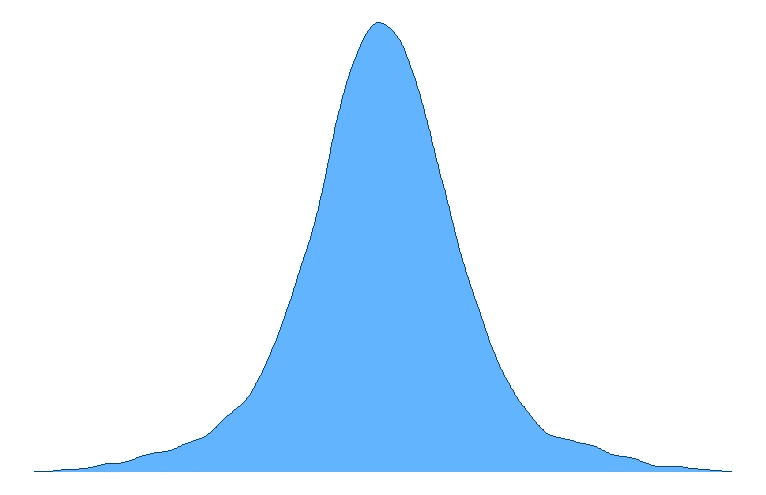
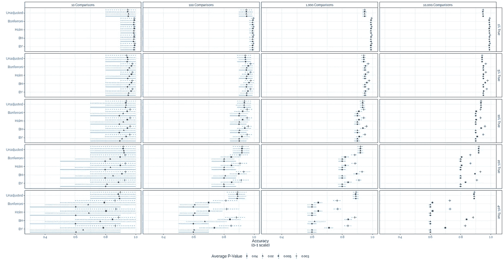
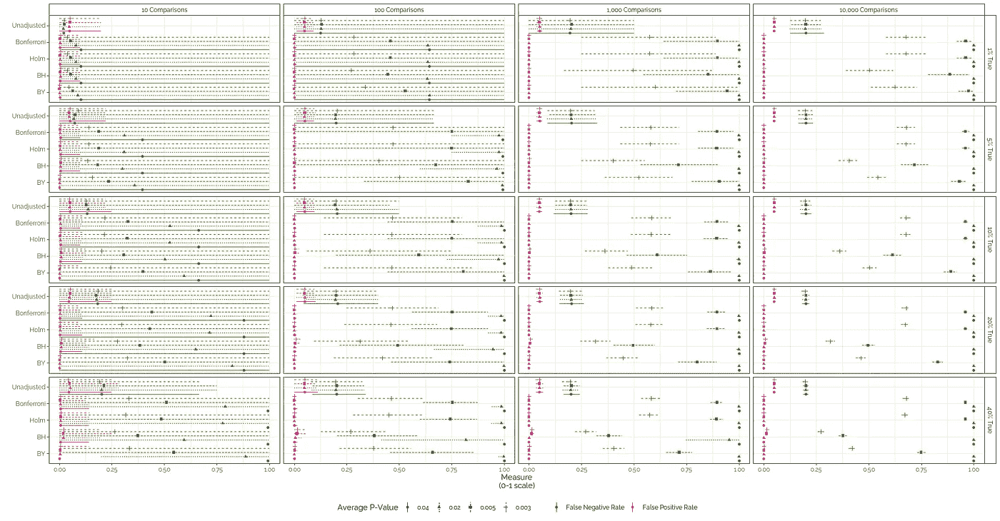
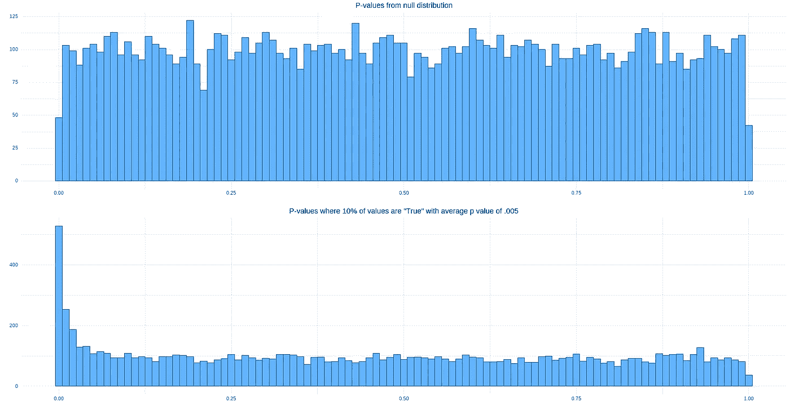

# 我运行了 80，000 次模拟来研究不同的 p 值调整

> 原文：<https://towardsdatascience.com/i-ran-80-000-simulations-to-investigate-different-p-value-adjustments-5ff36fe4e0e6>

## 多重比较很难。哪种校正最能处理假阳性和假阴性？

由 [Unsplash](https://unsplash.com?utm_source=medium&utm_medium=referral) 上的 [Edge2Edge 媒体](https://unsplash.com/@edge2edgemedia?utm_source=medium&utm_medium=referral)拍摄

# TL；博士:

*   在现实环境中，一次进行许多显著性测试是很常见的。然而，这意味着找到假阳性关系的可能性更大。有许多 p 值调整试图控制这一点，但它们往往过于保守，假阴性率非常高——尤其是在进行数百或数千次测试时。
*   我使用 80，000 次模拟来研究四种不同的调整程序在准确性、假阳性率和假阴性率方面的比较。这些模拟在比较次数、具有真实(即非空)效应的比较比例以及效应大小的平均显著性方面有所不同。
*   我发现，在反映社会科学设置中最常见的数据类型的情况下，调整后的 p 值比未调整的 p 值更准确。然而，在其他情况下，未经调整的值具有更高的准确性。
*   最好的方法是在体面的*先验*信息和理论的基础上进行测试。当这不可能时，该分析表明基于错误发现率调整 p 值是大多数现实社会科学案例的最佳策略。继续使用未经调整的 p 值应该基于对被测事物相关性的坚定信念。

## 在理想的世界中，所有的显著性检验都是为理论服务的。

然而，令几乎所有专业从事数据工作的人惊讶的是，我们并不是生活在一个理想的世界中。各种压力迫使许多从业者对同一数据集进行数十、数百甚至数千次显著性检验。这样做的一些原因比其他的更好，但是，独立于最好的动机:这种做法基本上打破了日常统计。p 值变小的保证——仅这种可能性就能刺激零差异出现的几率仅为 5%、1%或 0.1%——在你进行数百次、数千次或数万次博弈时是没有意义的。(总有一个[相关的 XKCD](https://xkcd.com/882/) )。正如我的微积分老师在向我们阐述极限的概念时所说的:

> 一个非常非常大的数除以一个大的数[或者，等价地，乘以一个小的比例]仍然是一个非常非常大的数。

最常见的方法是用一种程序来解释这种膨胀的假阳性率，这种程序伴随着膨胀大部分(如果不是全部)p 值，使显著性阈值更难达到[1，2]。我们进行的测试越多，新的门槛就越严格。但是，虽然这有助于确保人们不太可能在某样东西不在的时候断定它“在那里”，但这意味着他们不可避免地更有可能在它在的时候断定它不在“那里”。换句话说，我们优先考虑避免假阳性而不是假阴性[3]。虽然这种偏好在许多情况下是有意义的，但它不是(也不应该是)普遍偏好的。在某些情况下，在假阳性上浪费时间的成本很高——但是，在其他情况下，抑制潜在的洞察力比避免走进死胡同的成本更高。幸运的是，有替代的调整程序承诺不那么严格。不幸的是，(或者，也许，*也幸运的是*，这取决于你的观点)，有几个重合的考虑因素在起作用，这意味着在何时使用哪种方法上根本缺乏严格的规则。

在我工作的地方，我们与大型跨国公司、新闻机构、政府机构和各种规模的非营利组织合作，收集和分析来自各种受众的意见数据。他们构建的调查种类**多得令人难以置信**；假设同一个解决方案能满足每个项目的所有需求是没有意义的。说某种方法绝对“更好”也是没有意义的。

> “更好”总是与某个目标、某个基准相关，而每个目标或基准都涉及到权衡。我宁愿通过向我们的客户和合作伙伴提供每种方法的成本和收益来授权他们做出这些决定，而不是自以为知道什么对他们“最好”。

为此，本文对 80，000 个模拟进行了分析，根据 3 个主要考虑因素调查了不同 p 值调整策略的假阳性和假阴性率:

1.  正在运行的测试的数量。
2.  测试集中“真实”关系的数量。
3.  我们对那些“真实的”关系有多确定。

*(“真”是指来自不同于空值的分布；其中非零差的经典“替代”假设是正确的。在这篇文章中，我将使用“真实”,这既是为了语义简单，也是为了让外行读者也能理解——这两个概念经常互换使用。*

我发现，在最有可能在社会科学数据中看到的背景下，p 值调整提高了我们准确分类效果是否“真实”的能力。然而，这主要来自于这样一个事实，即 *un* 调整后的 p 值**可靠地夸大了假阳性率。**在处理数据时，如果您预计测试集的低比例确实是显著的(比如 1%或 5%)，这种夸大的假阳性率超过了调整后的 p 值具有非常高的假阴性率的强烈趋势(这种趋势只会随着测试数量的增加而加剧)。在处理数据时，如果您预计适度到更高比例的关系被测试为真正显著(例如，10%、20%或 40%)，**传统的、未调整的 p 值在分类准确性方面开始持续优于调整后的 p 值。**

在深入研究结果之前，我想先了解一下模拟是如何设置的。这种讨论主要是概念性的；我把代码块留给那些有兴趣了解我如何在 R 语言中分析这些代码的人，这些代码块在我的个人博客上更具技术性。(也欢迎大家来参观这个项目的 [GitHub](https://github.com/prlitics/Research-Projects/tree/main/P-Value-Corrections-2022/p_value_corrections) 资源库)。

# 模拟设置

这个模拟的主要工具是[谦逊 t 统计](https://en.wikipedia.org/wiki/T-statistic)。由于在原始的模拟数据集之间进行比较只是用额外的(计算上昂贵的)步骤生成 t 统计量，所以我直接生成它们，然后将它们转换成 p 值。我假设空关系是正态分布的，平均 t 值为 0。这意味着大约 5%的真空值将大到足以被错误分类为“显著的”(即，触发假阳性)。你可能知道，这是传统的零假设显著性检验的要点。

图 1: 10，000 个模拟 t 值，其中所有值都来自零分布。图片作者。

为了模拟“真正的”显著差异，我生成了一个单独的 t 统计系列，其中第 20 个分位数位于传统的显著性临界值(1.96)的中心。这相当于 80%功率的测试；也就是说，由于偶然性，假阴性将发生 20%。我还假设这些 t 统计量遵循正态分布。

图 2: 10，000 个图，其中 90%为空，10%来自“真实”分布。注意较粗的尾部，因为更多的值在极端区域，比我们预期的要多。图片由作者提供。

标题中的 80，000 个模拟由 80 个条件组成，每个条件执行 1，000 次。每种方法都试图比较 5 种不同 p 值的假阳性和假阴性率: [Bonferroni 调整的 p 值](https://en.wikipedia.org/wiki/Bonferroni_correction)、 [Holm 调整的 p 值](https://en.wikipedia.org/wiki/Holm%E2%80%93Bonferroni_method)、[Benjamin 和 Hochberg 调整的 p 值](https://en.wikipedia.org/wiki/Holm%E2%80%93Bonferroni_method)、[Benjamin 和 Yekutieli 调整的 p 值，以及未调整的 p 值](https://en.wikipedia.org/wiki/False_discovery_rate#Benjamini%E2%80%93Yekutieli_procedure)。前两个针对家庭错误率(FWER)进行调整，旨在控制出现一个*假阳性的可能性，而第三个和第四个调整基于假发现率(FDR)，将受控数量的假阳性视为降低假阴性率的可接受代价[4]。这使我们能够相互比较两种调整的性能，以及与标准的、未调整的 p 值进行比较。*

*这 80 个条件由 3 个研究问题驱动:*

*   **假阳性/假阴性率将如何随着测试数量的增加而变化？*我考虑了 4 种不同测试次数的情况:10、100、1000 和 10000 次。*
*   **随着“真实效应”比例的变化，假阳性/假阴性率将如何变化？我考虑了 5 种情况，其中真实效果占测试的不同预期百分比:1%、5%、10%、20%和 40%。**
*   **随着“真实效应”大小分布的变化，假阳性/假阴性率将如何变化？*我研究了当真正分布有 4 个不同的标准差时会发生什么:0.1、0.5、1.0 和 2.0。这也转化为真实效应的不同平均 p 值:0.04、0.02、0.005 和 0.0003。这反过来又告诉我们，我们有多“确定”这些差异不等于零。实际上，这是由效果大小和估计噪声的某种组合决定的。*

*4 个大小条件 x 5 个比例条件 x 4 个分布条件 x 1，000 个重复，每个重复给我们 80，000 个模拟。*

*在这些成千上万的模拟中，我将关注 3 个主要的指标:分类准确率、假阳性率和假阴性率。所讨论的“分类”反映了使用 p 值阈值(通常为 0.05)来确定两个观察值之间的差异是否“真实”的常见频率主义实践——其中“真实”是指被比较的组实际上在感兴趣的度量上存在可测量的差异。虽然我(和许多许多其他人)不一定认为这是好的统计实践[5]，但它在学术和商业研究领域都非常突出:在某些时候，你必须遇到他们所在的地方。*

*由于模拟确定了差异在这个意义上是否是“真实的”,所以这可以转化为一系列(非常大的)2×2 混淆矩阵，查看该值是否被生成为真，以及该过程是否确定其为真。(即(未)调整的 p 值是否低于 0.05)。*

**

*图 3:混淆矩阵示例。这是对 100 次比较进行 BH 调整的结果，其中 40%的比较实际上是显著的，真实分布的平均 p 值为 0.0003。*

*然后，我计算了分类准确度(正确识别的(非)重要关系的数量除以该模拟运行中的测试总数)、假阳性率(错误识别为重要的真正非重要关系的数量除以该运行中非重要关系的总数)和假阴性率(错误识别为非重要的真正肯定关系的数量除以该运行中重要关系的总数)。[维基百科对这些措施进行了细分](https://en.wikipedia.org/wiki/Confusion_matrix#Table_of_confusion)，但是，请注意，描述性的表格有点粗糙。*

*我应该注意的是，并不是我测试的所有值都特别现实——尤其是与其他值结合起来考虑的时候。很少有人做 10，000 次比较(或者，至少很少有人*应该*做那么多比较)；更少的测试有 10，000 次，其中 **40%** 的比较是真正不同的，有很大一部分 t 值延伸到 5-6 sigma。如果我曾经看到有人声称拥有这样的数据，我会问他们是否也打算向我出售一座桥梁，或者他们是否来自经销商服务部，就我的汽车的延长保修问题打电话。但是我把它们包括进来是为了测试边界条件:看看这些因素在最极端的情况下如何影响我感兴趣的东西。*

# *结果*

## *分类准确度*

*下面一组图表显示了关于分类准确性的模拟结果。图表从左到右从最少(10)到最大(10，000)的比较次数进行排序，并从最低(1%)到最高(40%)的真实效果百分比进行排序。因此，更右边的图表显示了具有大量比较的模拟结果，而更靠近底部的图表显示了更大比例的所述比较实际上具有真实结果的结果。每个图表在其 Y 轴上按所查看的 p 值类型排序:未调整的 p 值、Bonferroni 调整的 p 值、Holm 调整的 p 值、Benjamini 和 Hochberg (BH)调整的 p 值以及 Benjamini 和 Yekutieli (BY)调整的 p 值。每个图表的 X 轴反映了分类的准确性，范围从 0 到 1。不同的形状反映了较高/较低的平均 p 值，线条代表了内部 95%模拟值的范围。圆形是平均 p 值 0.04，三角形是 0.02，正方形是 0.005，十字形是 0.0003。然后，在每个图表中，每个形状的位置反映了通过该方法获得的精度，形状本身表达了在真实关系中看到的平均 p 值。(点击放大图)。*

**

*图 4:精度上的 P 值调整性能。点反映平均值，线显示 95%模拟的分布。在小于 10%真值的情况下，BH 调整是最好的。在超过 10%真值的情况下，未经调整的 p 值是最好的。*

*如果看起来有很多事情发生，那就是有。类似于那些图片，你看得越多，你就发现越多，这里有大量的信息编码。这些图表最终揭示了 p 值类型及其分类准确性之间的高度上下文驱动关系。*

*   *对于具有 5%或更少真实效应的比较集，真实效应的平均 p 值对分类准确性没有特别大的影响。形状都是相互成一直线的；如果有什么突出的，那就是十字架——但这只在几个面板中有争议。在每种情况下，调整后的 p 值的精度都高于未调整的 p 值，尽管当比较次数较少时，精度等级会分散得多。当你达到 10000 点时，价差已经缩小到非常有限的范围。无论你采用哪种 p 值方法，这些组的平均分类排名都非常高:在所有条件下，所有方法的平均得分为 0.97，满分为 1.0。然而，尽管利润极其微薄，但 BH 的调整优于其他公司。*
*   *对于 10%的效应为真的对比组，故事变得更加复杂。在比较次数较少时，这些值仍然分散，随着比较次数的增加，这些值变得更加集中，但现在我们看到了十字形和其他形状之间的明显区别——至少在调整值的情况下是如此。最有趣的是，这个条件(真实关系的平均 p 值为 0.0003)是唯一一个可以可信地声称表现与未经调整的 p 值一样好或更好的条件——实际上这只是两个错误发现率调整(BH 和 BY)中的一个。*
*   *在 20%或 40%的影响为真的情况下，调整后的平均 p 值的影响变得更加相关。当平均真实 p 值为 0.04 或 0.02 时，分类准确度与未调整的 p 值显著不同(当 40%为真实效应时，差异显著)。当平均真实 p 值为 0.0003 时，这一点得到了很大的改善，但它没有接近除 BH 之外的所有校正方法的未校正 p 值的分类精度。(即便如此，也比未经调整的 p 值略差)。*

*对于大多数日常社会科学数据集，你很难让 20-40%的随机测试关系证明是真正重要的。我能想到的唯一例外是，如果这组比较已经通过至少不完整的理论考虑进行了筛选，或者如果所有可用的变量都已经过筛选。在大多数情况下，这些结果表明 p 值调整是最谨慎的，BH FDR 调整表现最好。但如果你有充分的理由认为你测试的比较中有相当多的事实上是显著不同的，那么使用调整后的 p 值通常比使用未调整的 p 值更差(尽管前者的表现随着平均真实 p 值的下降而改善)。*

## *假阳性和假阴性率*

*虽然分类准确性很重要，但人们使用调整后的 p 值的主要原因是为了减少假阳性的数量，而人们经常拒绝调整的原因是因为假阴性的增加。那么这些策略是如何影响这些利率的呢？*

*下面这组图表研究了这个问题。和以前一样，图表从左到右按比较次数组织，从上到下按与真实关系的比较比例组织。图表上的点的形状标识了“真实”关系的平均显著性，X 轴编码了度量的分数，范围在 0-1 之间。不过，在这里，我们看到的是两个指标，而不是一个。Y 轴上列出的每个过程分为两种颜色:红色是该指标在该条件下的假阳性率，绿色是其假阴性率。(点击可缩放)。*

**

*图 5:假阳性(红色)和假阴性(绿色)率的 P 值调整。点反映平均值，线显示 95%模拟的分布。调整往往会导致较低的假阳性率，但通常会导致较高的假阴性率——尤其是当样本增加时。在这种情况下，未经调整的值更好，但平均“真实”p 值与阈值相差很大的比较集可能会更接近。*

*这里，各种面板再次揭示了一种高度上下文相关的关系。然而，有几个总体趋势是可以确定的。*

*   *关于假阳性率，调整程序普遍优于未调整的 p 值。按照设计，未经调整的 p 值将有 5%的假阳性率；调整后的测试倾向于低一个数量级或多一个数量级，其中 BY 调整在该组中具有最佳性能。*
*   *然而，关于假阴性率，调整程序普遍比未调整的 p 值差。总的来说，大量的测试倾向于提高调整后 p 值的假阴性率，而对未调整的 p 值没有影响。这是有意义的，因为调整后的度量标准的显著性阈值是随着您使用越来越多的测试而变得越来越严格的标准的比较次数的函数。相比之下，未调整的 p 值与测试的功效相关。对于与显著性临界值没有太大差别的真实关系，这意味着有效地将所有真正显著的关系错误分类为不显著。当平均真实 p 值变小时，所有调整程序的性能都有所提高，但性能最好的是那些通过 FDR(即 BH 和 by)而不是 FWER(即 Bonferroni 和 Holm)进行调整的程序，其中 BH 是性能最好的调整程序。*

## *总而言之*

*对于社会科学数据中最常见的数据和比较类型，调整后的 p 值将提供更高的分类精度。这些方法中表现最好的往往是 BH 和 BY 调整。但是，除非您预期真正显著的比较具有比显著性阈值更小的平均 p 值(即 0.005 或更低)，否则随着测试次数的增加，这些方法往往会出现越来越多的假阴性。*

# *调整还是不调整？*

*那么，你应该选择调整后的还是未调整的 p 值呢？事实上，在数据科学和统计学领域，一切都要视情况而定。在真正有意义的比较比例在 1–5%之间的情况下，调整后的 p 值比未调整的 p 值具有更高的准确率。10%或更高，取决于你真实关系的平均强度。如果您有一堆值徘徊在您的显著性阈值附近，调整后的方法将导致几乎所有的值(如果不是全部的话)被错误分类为非显著性。当平均显著性值明显好于截止值时，这种趋势得到改善。这反映在不同情况下的假阳性和假阴性率上:调整程序的假阳性率极低，但假阴性率很高，除非大多数真值大大低于显著性阈值。当比较的数量不是过多时，调整程序做得最好，我们期望只有少量的比较是真正有意义的。在其他情况下，未经调整的 p 值可能更为谨慎。*

*这可能会鼓励一些读者认为未经调整的 p 值是正确的选择。从个人经验来看，如果有一条路是你被迫走的，你总是很容易说服自己你的数据符合某些标准。然而，犯错的代价相当高昂:假阳性的噪音比真阳性的信号要大得多。如果只有 5%的关系最终有真实的信号，模拟显示超过一半的标记为重要的关系实际上没有。如果真正重要的关系只占关系的 1%,你可以预期只有 15-20%的“重要”结果是正确的。最糟糕的是，在这两种情况下，你都不知道哪个是真实的，哪个是冒名顶替的。虽然在某些情况下，追求新创新失败的成本可能比走进死胡同更高，但很难证明在走向“真实”之前走进 4-5 个死胡同的成本是合理的，尤其是在无法保证“真实”有足够的杠杆来支付这些成本的情况下。同样，在某些情况下，接受 5 次失误是完全合理的(例如，天使投资者的相对成功率通常比这低)，但这不是应该假设的事情。*

*如果有一些关系在 p 值调整后变得无关紧要，这让你感到惊讶，你总是可以用一个独立的样本单独重试这个关系:那种认为某个东西*应该*在那里的琐碎感觉可能是由某种理论预设或其他因素决定的。只有将你的期望建立在基础上，使它们变得清晰，并自己测试它们，研究才能得到改进。*

*也就是说，这项研究确实强烈表明，在某些情况下，即使进行多重比较，未经调整的 p 值也将是更谨慎的选择。这种情况包括当你测试大量的比较时，非常大的比例实际上反映了真实的关系。我必须强调，这样的数据很少。如何确定一个人的数据是否符合这条路线的标准超出了这个项目的范围(毕竟，当*您控制关系*的重要性时，很容易做出这个决定；在现实世界中，我们不直接拉动杠杆或输入真实值，这有点困难)。然而，我认为一个卓有成效的方法是从比较中的 p 值直方图开始。因为 p 值是均匀分布的，所以在小于 0.05 或 0.10 的值处看到大的峰值会让您感觉到您的数据实际上具有显著的关系。这个峰值相对于其他值的大小(以及峰值是否集中在更接近于 0.05 的值，比如说 0.001)可以帮助查明调整实际上是否是正确的策略。有多种方法可以估计 p 值直方图中“真零”的比例[6]。我目前正计划在未来几个月的某个时候对这个话题进行另一次调查，敬请关注！*

**

*图 6:p 值直方图，其中所有值均为空，正态分布(上图)，10%的值来自平均 p 值为 0.005 的“真实”效应分布(下图)。后者比 0.05 的值集中得多。*

*总的来说，如果从这项模拟研究中有什么收获的话，那应该是:处理多重比较是很棘手的，而且取决于具体情况。应根据分析的目标和数据的性质来决定是否使用校正。在进行数十次、数百次或数千次比较时，简单地不调整 p 值并不是一个好主意——最好的解决方案也不是让所有东西都通过 p 值调整的“过滤器”。依我拙见，最好的解决办法是，尽可能地关注最重要的关系。只测试那些你真正感兴趣的和/或对你的用例有帮助的。权衡是做研究不可避免的一部分，但多重比较测试中的假阳性与假阴性问题大多来自于在没有设计的地方应用熟悉的测试范例。统计是神奇的，但不是字面上的神奇。如果我们把它的机制推到远远超出其预期的程度，当它崩溃时，我们不应感到惊讶。*

*Peter Licari 是一名专门研究美国政治行为的社会数据科学家。他在佛罗里达大学获得了美国政治和政治方法论的博士学位，目前是 Morning Consult 的商业数据科学总监。这里表达的观点是他自己的。也可以在 [*YouTube*](https://www.youtube.com/channel/UCuCCVkVbWmYmgg7W9x2Y30g) *和推特(*[*@ PRLPoliSci*](https://twitter.com/PRLPoliSci)*)上找到他。剩下的一点点业余时间都花在了长跑、与妻子斯蒂芬妮(Stephanie)畅玩游戏和媒体、与女儿罗莎琳娜(Rosalina)玩耍、遛狗杜德(Dude)以及与他的猫亚洲(Asia)进行奇怪的、富有成效的单边对话上。**

*[1]j . p .罗马诺、A. M .谢赫和 m .沃尔夫(未注明日期)。*多重检测。**

*[2]f . Bretz、t . hot horn 和 p . Westfall(2016 年)。*使用 R 的多重比较*。查普曼和霍尔/CRC。*

*[3]罗斯曼，K. J. (1990 年)。多重比较不需要调整。*流行病学*，43–46。*

*[4]诺布尔，W. S. (2009 年)。多重测试校正是如何工作的？。*《自然生物技术》*， *27* (12)，1135–1137。*

*[5]盖尔曼(2013 年)。评论:P 值和统计实践。*流行病学*， *24* (1)，69–72。http://www.jstor.org/stable/41739720*

*[6]姜，h .，，R. W. (2008 年).估计多重比较的真零假设的比例。*癌症信息学*， *6* ，25–32。*

**这是本分析的版本****1 . 1 . 0****。**

*我相信所有的作品都得益于读者的建设性反馈以及作者自己的重新审视和思考。但是并不是所有的作品都适合学术出版。为此，为了透明起见，我决定在我的非学术项目上线时，以一种其他人(希望)会接触到它的方式，对它们的要点进行可视化索引。小的修改(如语法或小的图像格式问题)会导致第三位数增加。由我自己的重访启发的大修改和由读者的建议启发的小修改导致第二位数的增加。由读者的建议或未来的反思和对项目的重新审视所驱动的主要修改会导致第一个数字的增加。在 6 个月没有更新之后，一个版本应该被认为是“最终版本”当前版本于 2012 年 4 月 17 日发布。本帖的 changelog 维护在 [*Github*](https://github.com/prlitics/Research-Projects/tree/main/P-Value-Corrections-2022/p_value_corrections) *上。**