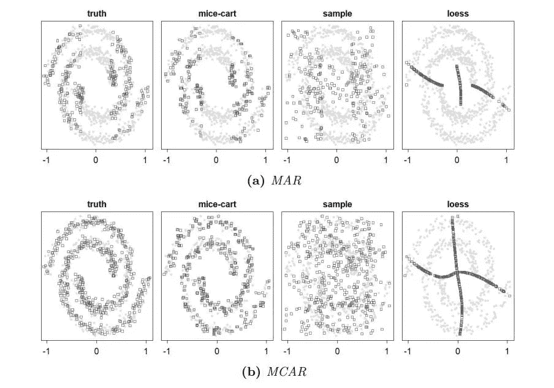
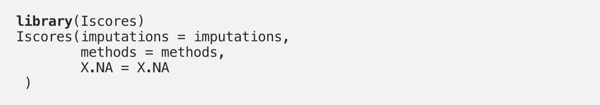
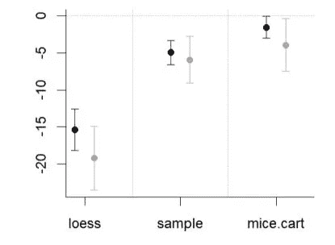

# I-Scores:如何选择在数据集中填充 NAs 的最佳方法

> 原文：<https://towardsdatascience.com/i-scores-how-to-choose-the-best-method-to-fill-in-nas-in-your-data-set-43f3f0df971f>

# I-Scores:如何选择在数据集中填充 NAs 的最佳方法

## 应用 R-package*is cores*中实施的*插补分数*选择最佳插补方法

图 1:显示螺旋上不同插补的原始论文插补分数图。

撰稿人:[梅塔丽娜·斯波](https://medium.com/u/1e04db6f8e30?source=post_page-----43f3f0df971f--------------------------------)，[杰弗里·纳夫](https://medium.com/u/ca780798011a?source=post_page-----43f3f0df971f--------------------------------)，[洛里斯·米歇尔](https://medium.com/u/f562dceaeb63?source=post_page-----43f3f0df971f--------------------------------)

我们都在数据中遇到过它们:令人讨厌和担忧的**缺失值**，通常编码为 NA。事实上，在现代数据科学中，缺失值几乎是无法避免的。丢弃含有缺失信息的观测值会导致大量样本丢失，并经常导致数据分析中的偏差。因此，研究人员已经提出了一系列广泛的方法来在任何给定的设置中估算缺失值，例如通过链式方程进行多元估算( [mice](https://www.researchgate.net/publication/44203418_MICE_Multivariate_Imputation_by_Chained_Equations_in_R) )或 [missForest](https://academic.oup.com/bioinformatics/article/28/1/112/219101) 等等。

# 问题是:选择一个好的插补方法

*在给定的应用中，如何选择“最佳”插补方法？*标准的方法是选择一些观测值，将它们的状态设置为缺失，用不同的方法对它们进行估算，并比较它们的预测精度。也就是说，简单地将估算值与被屏蔽的真实值进行比较。选择的精度度量通常是均方根误差(RMSE)或平均绝对误差(MAE)。对于分类变量，使用正确预测百分比(PCP)。为了选择一种插补方法，将选择总体误差值最低的方法。尽管这种方法很常见，但它有两个主要缺点:

1.  人们不得不在某种程度上人为地屏蔽观察结果，这本身就带来了问题，例如选择多少观察结果和屏蔽哪些观察结果。
2.  在 RMSE 精确度测量中，使用条件均值估算的方法更受欢迎；在 MAE 中，使用条件中位数估算的方法更受欢迎；在 PCP 中，使用条件模式估算的方法更受欢迎，而不是使用来自真实条件分布的样本。

第二点尤其严重:它可能导致选择“无意义的”估算方法。特别是，所选择的方法往往会人为地加强变量之间的关联。因此，应用于这样估算的数据集的统计估计和推断技术可能是无效的。

# 一个例子:螺旋的插补

我们用一个简单的例子来说明第二个问题。考虑上图:在最左边的两个图中，您可以看到原始数据集的灰色和黑色点位于一个嘈杂的螺旋上。灰点不包含任何 NA，黑点包含二维中的一个安娜。在最上面一行中，缺失值遵循一个随机缺失的*(MAR)，在最下面一行中，它们遵循一个完全随机缺失的*(MCAR)机制。在这个[帖子](/handling-missing-data-for-a-beginner-6d6f5ea53436)中，我们将介绍这些机制以及其他与缺失值相关的主题。**

**接下来，您可以在两行中看到不同方法的 3 种不同插补:**

**i) *mice.cart* 用软件包 [mice](https://cran.r-project.org/web/packages/mice/index.html) 进行插补，可从 CRAN 上获得，
ii) *sample* 从各个维度的观察值中获得每个条目的 NA 值，以及
iii) *黄土*插补，通过使用局部回归方法估计完整病例的条件期望 E[X1|X2]和 E[X2|X1]，并通过从 X1(如果 X2 缺失)或从 X2(如果缺失)进行预测来填充缺失值**

**从视觉上看，很容易发现最佳插补是方法*鼠标推车*的插补。当然，这种视觉排序在更高维度中是不可能的，需要另一种方法来选择最佳插补( *I-Scores* ，即将推出)。尽管如此，我们还是用这个例子来说明。**

****

**图 2:原始论文中的数字，根据三月(灰色)和 MCAR(黑色)的 3 次插补计算出负 RMSE。**

**如果我们在这 3 个插补上计算 RMSE(通过使用真实的基础值—在实践中不适用！)我们得到了图 2 中的排序，在图 2 中我们绘制了 RMSE 的负值:最好的方法是*黄土*，其次是*样品、*，最差的方法是 *mice.cart* 。这与我们从图 1 中得到的视觉印象明显矛盾。**

# **解决方案:使用插补分数**

**与通过 RMSE 获得的排名相比，我们希望将 *mice.cart* 排名最高，因为它准确地再现了真实的底层联合数据分布。同样，*黄土*严重低估了数据中的变化，应该排在最末*。*为此，我们在论文[*插补分数*](https://arxiv.org/abs/2106.03742) *中开发了一个叫做“插补分数”(I-Scores)的框架。*该分数避免了上述与绩效测量(如 RMSE)相关的缺陷:它不需要掩盖额外的观察值，并且通常支持从真实条件分布中取样的插补方法。此外，该方法适用于所有类型的数据(离散的和连续的),并且不需要完整的观测值。**

**我们在 CRAN 上提供 R-package [Iscores](https://cran.r-project.org/web/packages/Iscores/index.html) 来实现这个分数。它可以很容易地应用于通过对具有 NAs ( *X.NA* )的数据集应用不同的插补*方法*获得的*插补列表:***

****

**与图 2 所示的通过负 RMSE 获得的排名相反，我们观察到以下情况:**

****

**图 3:原始论文中的数字，Iscore 是根据三月(灰色)和 MCAR(黑色)的 3 次插补计算得出的。**

**因此，匹配图 1 中插补的视觉印象，最好的方法是 *mice.cart* ，其次是*样本*，最差的方法是*黄土*。**

**M *矿石包 Iscores 的使用细节可以在* [***我们的 github 资源库***](https://github.com/missValTeam/Iscores) *中找到。***

# **结论是:明智地选择**

**面对缺失值的数据集，有无数种插补方法可供选择。然而，关于如何在不同的插补方法中进行选择，几乎没有指导。I-Score 应该为这一选择提供有意义的帮助。**

**在这个意义上:感谢阅读和快乐得分！**