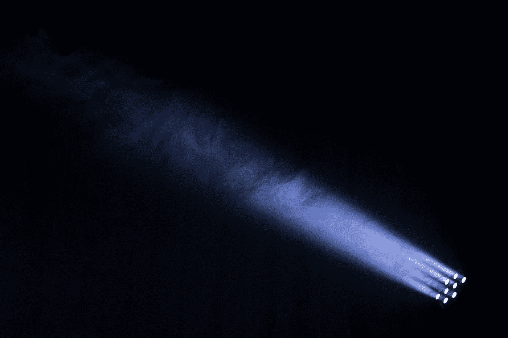
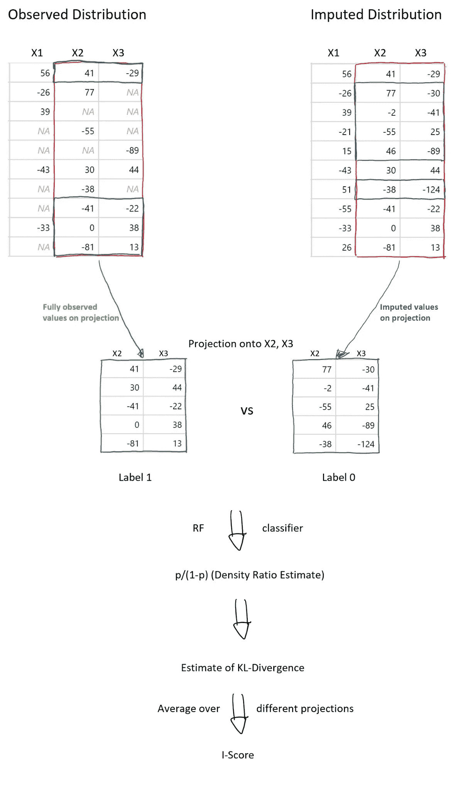
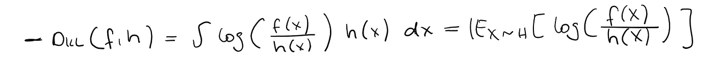
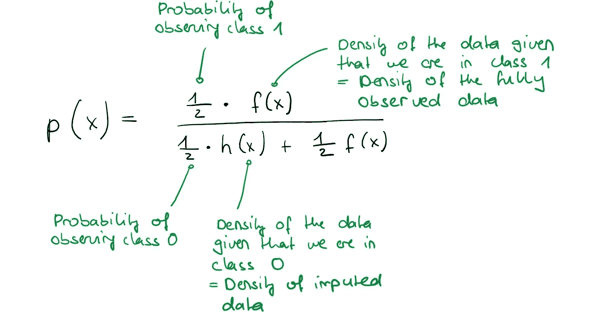
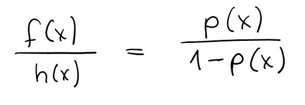

# I-Scores:对算法的直觉

> 原文：<https://towardsdatascience.com/i-scores-intuition-about-the-algorithm-56717330077a>

## 关于插补分数算法的一些细节，一种选择最佳插补的方法

[保罗·格伦](https://unsplash.com/@pgreen1983?utm_source=medium&utm_medium=referral)在 [Unsplash](https://unsplash.com?utm_source=medium&utm_medium=referral) 上拍照

撰稿人:[杰佛里·纳夫](https://medium.com/u/ca780798011a?source=post_page-----56717330077a--------------------------------)，[梅塔莉娜·斯波](https://medium.com/u/1e04db6f8e30?source=post_page-----56717330077a--------------------------------)，[洛里斯·米歇尔](https://medium.com/u/f562dceaeb63?source=post_page-----56717330077a--------------------------------)

根据一些读者的建议，这篇文章提供了关于我们的 I-Scores 算法的更多细节，该算法在早先的帖子中介绍过。

评估插补方法质量的一个常用评分标准是均方根误差(RMSE)，它要求知道缺失值背后的真实值，编码为 NA..这在模拟环境中肯定是可行的，但在数据确实缺失的真实场景中却不可行。

与常用的 RMSE 相比，I-Score 看起来几乎不可思议:它不需要访问 NA 背后的真实数据，不需要屏蔽数据(人为地将观察值设置为 NA ),并且在没有完整病例(没有 NA 的观察值)时也有效。尽管如此，它避免了 RMSE 和其他绩效指标遇到的陷阱，即使它们被允许使用真实的基础数据。当然，付出的代价是方法复杂性的增加。尽管如此，尽管实现细节可能很快变得相当复杂，但主要原理非常简单:我们使用[kull back-lei bler Divergence](/light-on-math-machine-learning-intuitive-guide-to-understanding-kl-divergence-2b382ca2b2a8)(KL-Divergence)将估算分布与数据集的完全观察部分的分布进行比较。如果插补是完美的(好的)，则偏差应该为零(接近零)，如果插补不好，则偏差应该很大。

让我们依次关注 I-Scores 算法的 **3 个主要步骤**。下图提供了对它们的直观总结:

作者图片

# 步骤 1:找到足够多的完整案例

在大多数合理规模的数据集中，很难找到完整的案例。原因很简单:假设数据集中的每个值都随机缺失(完全随机缺失，MCAR ),概率为 5%。不是很多，对吧？但是如果你在 20 个维度上有 500 个观察值，那么完整案例的预期数量只有(1–0.05)⁰*500，大约等于 179。

我们采用一个简单的方法来解决这个问题:*随机投影*。虽然在 20 维中可能没有太多的完整案例，但在较低维中观察到更多完整案例的机会更大。这就像将几盏聚光灯照射到数据空间的不同部分。当然，这种解决方案是有代价的，因为看投影会丢失信息。但是，应用足够多的投影通常可以解决这个问题。

# 步骤 2:KL-散度估计

出于我们的目的，我们需要两个密度 f，h 的*负* KL 散度的以下表示，其中 f 是完全观察分布的密度，h 是插补分布的密度:

作者图片

获得一般分布的 KL 散度是困难的:我们需要估计观察分布和估算分布之间的密度比(根据上面的等式)。因此，我们使用一个技巧:通过使用分类器来估计完全观察的分布和估算的分布之间的密度比。更具体地说，我们

1)给完全观察的观察值分配标签 1；
2)给估算的观测值分配一个标签 0，

并且估计被标注为 1 的概率，我们姑且称这个估计量为 p(例如我们建议使用随机森林(RF))。这个估计的概率 p 通过 p/(1-p)提供了密度比 f/g 估计，基于此我们获得了 KL 散度的估计。

为什么会这样？想象 p 是完美的估计，即观察到 1 的真实条件概率。它由贝叶斯公式给出为

作者图片

这里我们假设观察到两个类的概率是 1/2。这实际上是在 I-Scores 算法中强制执行的。那么密度比可以写成:

作者图片

因此，很好地近似类别 1 的概率的估计 p 也应该导致密度比的良好估计。

这个巧妙的小技巧实际上已经被使用了很多。它已经在 2003 年被《随机森林》的发明者雇佣，并在[甘文学](https://medium.com/ai-society/gans-from-scratch-1-a-deep-introduction-with-code-in-pytorch-and-tensorflow-cb03cdcdba0f)中崭露头角。

# 第三步:形成一个简洁的单一 I-Score

然后，根据多个随机投影的平均值，从估计的 KL 偏差中构建插补的最终得分。选择分数的方向，使得较高的值表示较好的插补性能。如果有多个插补可供选择，可以对每个插补应用 I-Scores 算法，并选择得分最高的一个。因此，I-Scores 可以指导选择手头数据集的最佳插补。

# **结论**

这篇文章希望能阐明 I-Scores 算法的内部工作原理。

总之，该算法采用数据的随机投影，并在这些投影上，将估算分布 h 与具有估计(负)KL 散度的完全观测分布 f 进行比较。因此，好的插补将得到高值，而坏的插补将得到低值。

在获得分数的过程中，我们使用了一个方便的技巧，即 KL 散度的估计可以从概率估计中获得，这在许多情况下都是有用的。

自然，我们遗漏了一些问题。最重要的一点是，在随机缺失(MAR)情况下，估算分布与完全观测分布 f 不必相同。这是因为在 MAR 下，数据的观察部分可以改变其分布。然而，这是一个有点微妙的话题，我们只是在这里提到，分数仍然有效，即使数据是 MAR。

***免责声明和资源:*** *我们意识到我们遗漏了许多细节，但希望能对算法的直觉有所澄清。* M *矿石的详细算法可以在我们的* [***论文***](https://arxiv.org/abs/2106.03742) *中找到，关于 R-package Iscores 的使用指南，连同一个小的说明性例子，可以在我们的*[***github 知识库***](https://github.com/missValTeam/Iscores) ***中找到。***