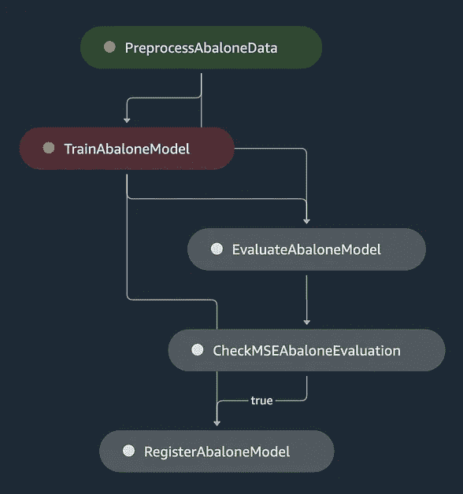
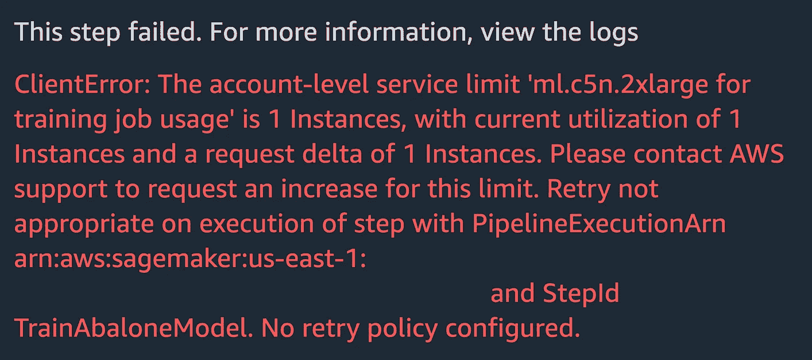
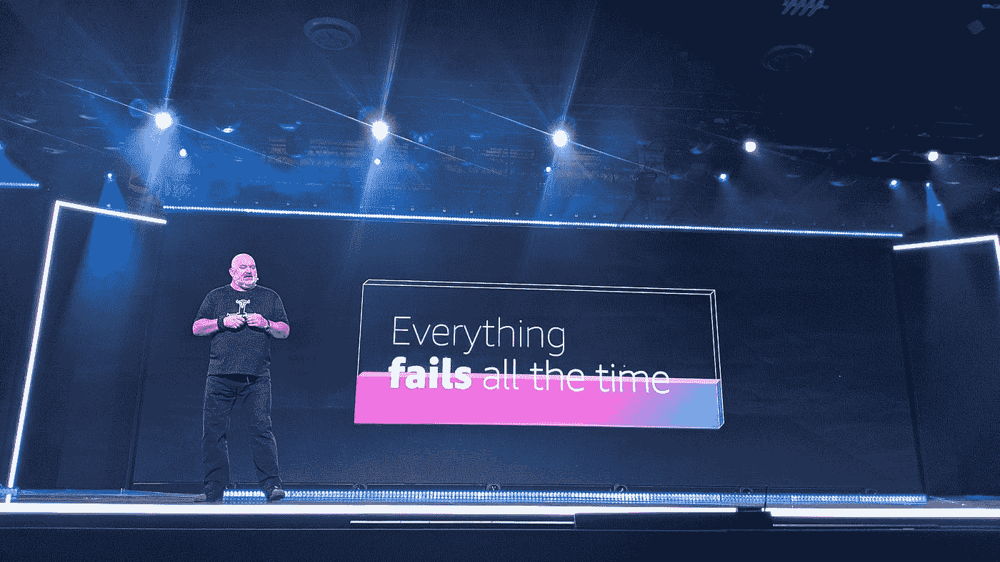
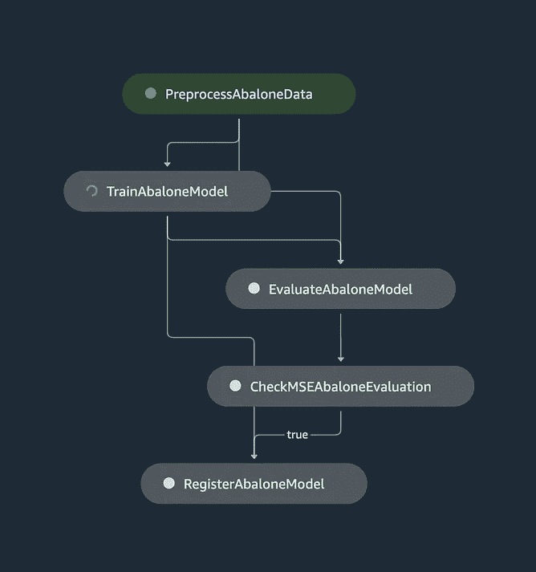
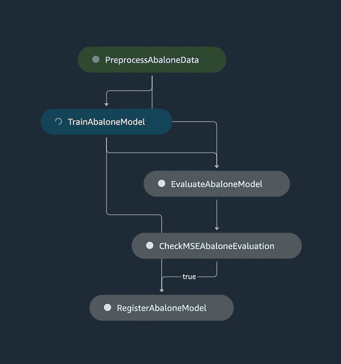

# 使用弹性管道扩展 MLOps

> 原文：<https://towardsdatascience.com/i-tried-scaling-sagemaker-pipeline-executions-and-this-happened-31279b92821e>

## 通过重试策略提高 SageMaker 管道的弹性

昨天，我使用 SageMaker Pipelines 自动化了一个预测项目的工作流程。我启动了 3 个并发管道执行来在不同的时间范围内训练模型。想象预测一天，一周，一个月。

过了一会儿，2 次执行失败。这是一个简单的培训工作配额问题。

布莱恩·麦高恩在 [Unsplash](https://unsplash.com/?utm_source=unsplash&utm_medium=referral&utm_content=creditCopyText) 上的照片

像 MLOps 项目中的所有事情一样，您的管道执行可能会由于各种因素而失败。事实上，建造一条永不失败的管道是不可能的。

在这篇文章中，我将向您展示如何使用重试策略使您的 SageMaker 管道对常见错误更有弹性。

# 先决条件

要浏览此示例，请确保您具备以下条件:

1.  如果您对 SageMaker Pipelines 听起来很陌生，请访问[介绍亚马逊 SageMaker Pipelines](https://www.youtube.com/watch?v=Hvz2GGU3Z8g) 。我们将以鲍鱼为例进行说明。
2.  我们将在示例 MLOps 管道中使用重试策略。确保您熟悉 AWS 上的[超时、重试和带抖动的回退](https://aws.amazon.com/builders-library/timeouts-retries-and-backoff-with-jitter/)。

# 每件事都会失败

默认情况下，使用 SageMaker 管道，当管道步骤报告错误时，会导致执行完全失败。

以下是在对具有某些实例类型的[鲍鱼管道示例](https://www.youtube.com/watch?v=Hvz2GGU3Z8g)启动执行时可能会出现的错误示例。在这里，我的帐户在培训工作中使用`ml.c5n.2xlarge`的配额为 1:

作者图片:我的第一个管道执行成功了，而另外两个管道执行了**resourcelimitexceed**错误和 **failed** 。

当出现这种错误时，我们是否可以构建能够容忍并降低完全失败概率的管道？在 MLOps 项目中，是否有可能将失败视为一种自然现象？

## 通过重试策略提高管道弹性

在亚马逊，我们设计系统来降低和容忍失败的可能性。想象一下，即使房子着火了，系统也能继续运行。

你可以在[彼得·德桑蒂斯](https://youtu.be/AaYNwOh90Pg?t=862)和[沃纳·沃格尔斯](https://youtu.be/OdzaTbaQwTg?t=2527)关于发明的会议中一窥端倪。每年我最喜欢的一些。

图片来自 [re:Invent](https://www.youtube.com/watch?v=OdzaTbaQwTg) 。失败是必然的，随着时间的推移，一切终将失败——沃纳·威格尔

通常，在管道上应用重试策略是提高管道健壮性的一个好方法。 [SageMaker 重试策略](https://docs.aws.amazon.com/sagemaker/latest/dg/pipelines-retry-policy.html)有助于在错误发生后自动重试管道步骤。它们可以很方便地应对局部和暂时故障，这些故障通常会在一段时间后自行纠正。

参见[重试策略支持的异常类型](https://docs.aws.amazon.com/sagemaker/latest/dg/pipelines-retry-policy.html#pipelines-retry-policy-supported-exceptions)了解 SageMaker 管道支持的异常的更多详细信息。

# 在管道中设置重试策略

## 在管道中添加重试策略很简单

在我们的鲍鱼示例中，我们将使用来自 [SageMaker python SDK](https://github.com/aws/sagemaker-python-sdk/blob/master/src/sagemaker/workflow/retry.py) 的`StepRetryPolicy`和`SageMakerJobStepRetryPolicy`。他们将帮助我们减轻我们在培训步骤中看到的`ResourceLimitExceeded`问题。您可以在 [SageMaker 文档](https://docs.aws.amazon.com/sagemaker/latest/dg/pipelines-retry-policy.html#pipelines-retry-policy-json-schema)中找到关于策略字段和模式的详细信息。

下面是我如何为我的渠道创建策略:

我将策略设置为间隔 30 秒，回退率为 2。这意味着 SageMaker 将在失败 30 秒后尝试启动训练步骤，1 分钟后重试，2 分钟后重试，依此类推。所有这些都有 240 分钟的到期时间，所以我不会以停滞的管道执行结束。

下面是我如何在培训步骤中应用这些策略:

您可以在这里找到[示例管道，并根据您的用例随意调整策略。](https://gist.github.com/SofianHamiti/0855ed3d4e525472be5ce1a754cbf22d)

## 现在是容易的部分！

您可以使用`ml.c5n.2xlarge`实例再次启动并发管道执行。

作者提供的图片:现在，其他执行并没有失败，而是等待并重试各自的训练步骤，直到成功。

# 结论

任何事情都会失败，您的 MLOps 管道也会失败。

在本文中，我们在鲍鱼管道示例中应用了重试策略，并使其对资源限制错误更具弹性。这是一个简单的技巧，您可以在项目中使用它来降低完全执行失败的可能性。

你也可以阅读 [MLOps with MLFlow 和亚马逊 SageMaker Pipelines](/mlops-with-mlflow-and-amazon-sagemaker-pipelines-33e13d43f238) ，了解你可以用 SageMaker MLOps 项目做的其他很酷的事情。