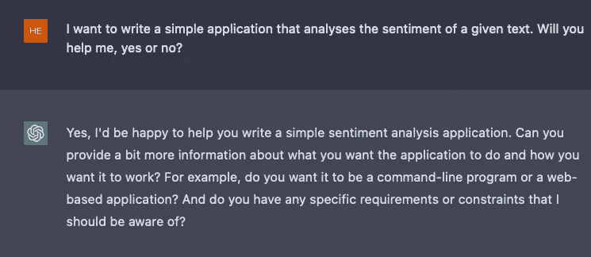
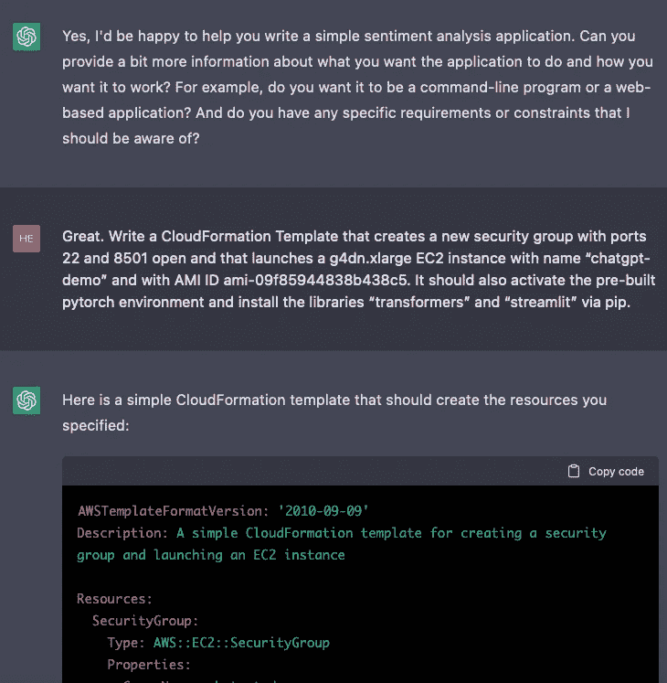
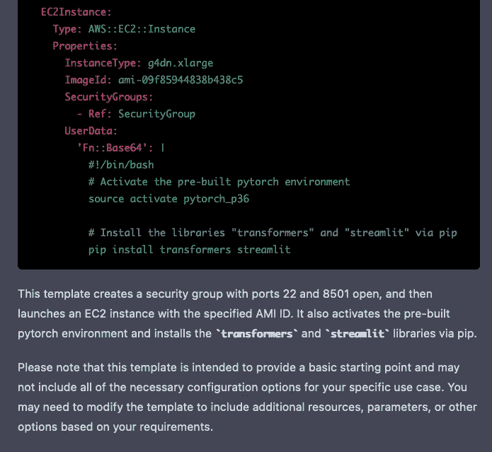
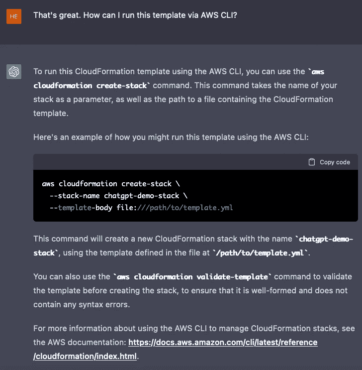
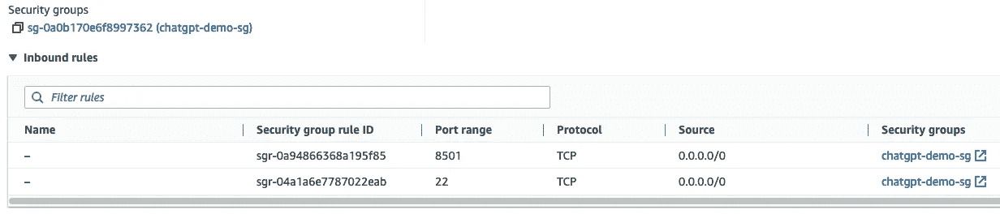
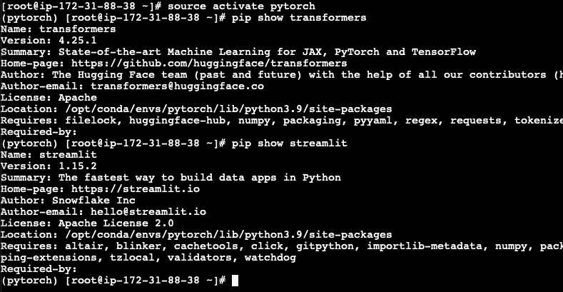
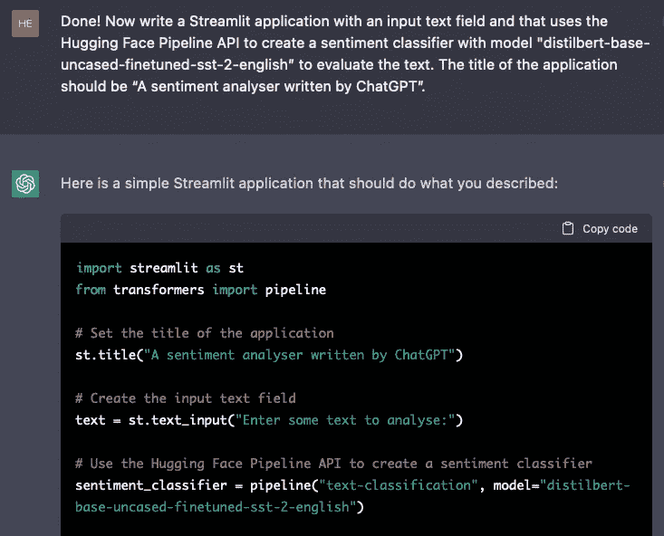
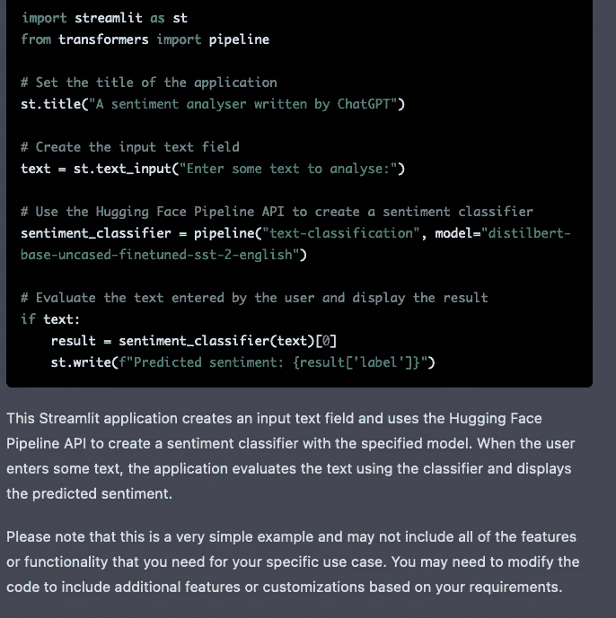
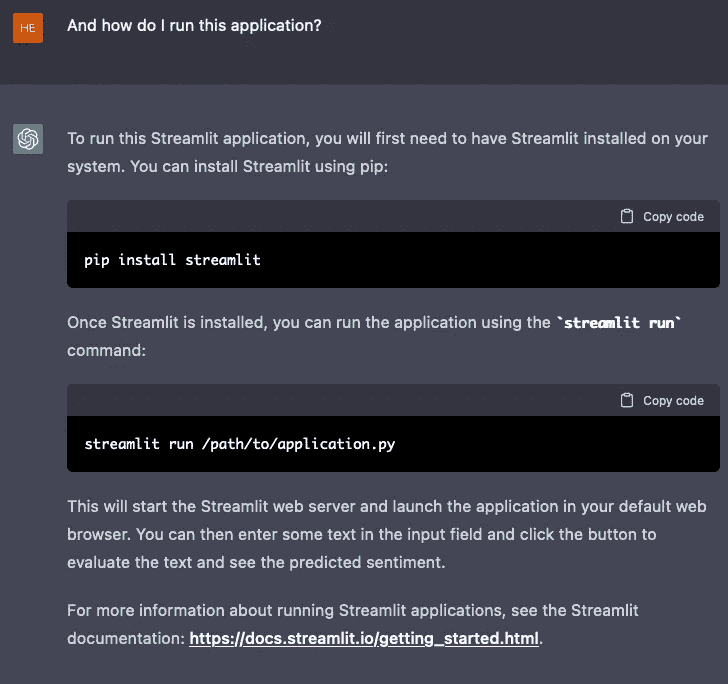
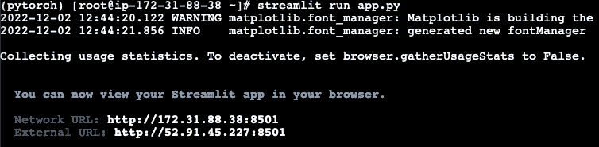

# 我使用 ChatGPT 在 AWS 上创建了一个完整的 AI 应用程序

> 原文：<https://towardsdatascience.com/i-used-chatgpt-to-create-an-entire-ai-application-on-aws-5b90e34c3d50>

## 这种新的语言模型可能会成为你未来的编程搭档

由作者创建的图像-使用稳定扩散创建

# 这是怎么回事？

两天前，OpenAI 发布了一个新的语言模型，它是 GPT-3 的改进版本，可能会让我们一窥 GPT-4 在明年年初发布时的能力(据传闻)。使用 ChatGPT，可以与模型进行实际的对话，并返回到之前的对话中。

我想试试我是否可以作为一对程序员使用这个模型，我可以给一些指令，它为我生成代码。当然，我仍然会仔细检查那些代码片段，但至少我不用再从头开始写了。

所以在这篇博文中，我描述了如何使用 ChatGPT 从头开始创建一个简单的情感分析应用程序。该应用程序应该在 EC2 实例上运行，并利用拥抱脸模型中心最先进的自然语言处理模型。结果令人吃惊😮

完整的免责声明——我不得不多次尝试和修改提示，以获得我想要的结果。也就是说，通常只需要很小的改进就能得到想要的结果。我的提示和模型生成的代码可以在这个 [GitHub repo](https://github.com/marshmellow77/chatgpt-demo) 中找到。

# 为什么这很重要？

你在开玩笑，对吧？

# 我们开始吧

好了，我们开始吧！我们先来看看 ChatGPT 愿不愿意帮忙:

作者图片

好的，这是一个有希望的开始😊按照同伴的要求，让我们深入细节吧！

# 为 EC2 实例创建 CloudFormation 模板

我们希望在 EC2 实例上运行这个应用程序，但是我们不想通过 AWS 控制台来创建这个 EC2 实例。因此，ChatGPT 的第一个任务是创建一个 CloudFormation 模板来设置 EC2 实例:

作者图片

说明相当具体(例如，我必须自己查找 AMI ID)，但我仍然很惊讶，它竟然提供了一个几乎完美的 CF 模板。请注意，ChatGPT 还在代码末尾添加了一些免责声明:

作者图片

ChatGPT 生成的完整代码:

注意，EC2 实例实际上没有收到我们在提示中指定的名称。但是好吧，让我们暂时接受这个事实。这个模板中的另一个“bug”是 AMI 上预装的 Pytorch 环境被称为“pytorch”而不是“pytorch_36”。让我们通过替换环境名来解决这个问题。

现在，我们实际上是如何操作的呢？我们来问问 ChatGPT:

作者图片

好了，运行这一行开始使用 CF 模板创建堆栈。几分钟后，我们看到 EC2 实例已经启动并运行。请注意，模板创建了一个安全组，EC2 实例使用该安全组，如下所示:

作者图片

让我们通过 SSH 进入 EC2 实例，看看我们需要的包是否已经安装:

作者图片

看起来一切都为 Streamlit 应用程序设置好了😊

# 简化应用程序

现在，我们需要一个运行在 Streamlit 上的应用程序来分析文本的情感。令我惊讶的是，这比我想象的还要简单:

作者图片

作者图片

再次强调，结尾的免责声明不错。

整个代码:

这实际上对我来说看起来不错，让我们试着不加修改地运行它。将这段代码复制并粘贴到 EC2 上名为“app.py”的文件中。但是我们如何再次运行 Streamlit 应用程序呢？让我们问问我们的“同事”:

作者图片

我们已经安装了 Streamlit，让我们继续运行“streamlit run app.py”:

作者图片

似乎一切都好！

# 测试应用程序

现在是关键时刻了。我们插入暴露的 URL streamlit，看看应用程序是否运行。

作者图片

哇，ChatGPT 刚刚用我们的指令构建了一个完整的文本情感应用程序🤯

# 结论

我很无语。这太有趣了，有无限的可能性。我会试着用这个模型做更多的实验，也想听听你用它做了什么。请在下面评论！