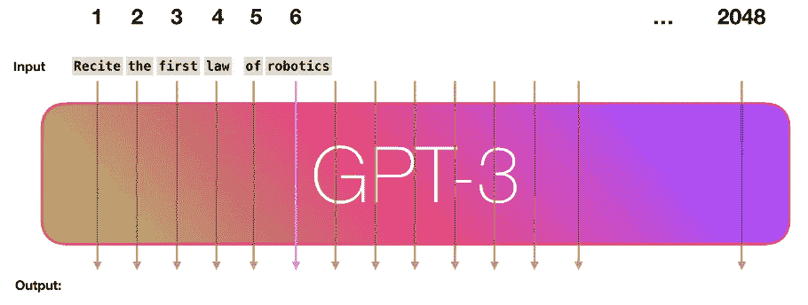
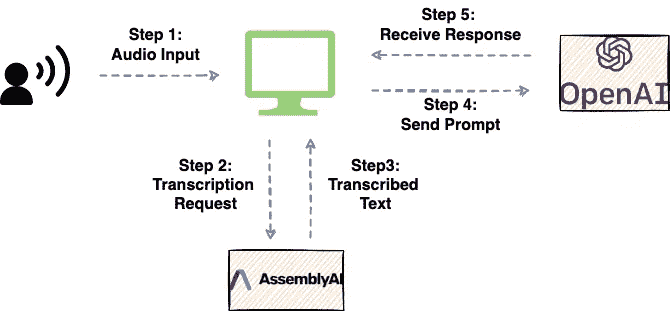
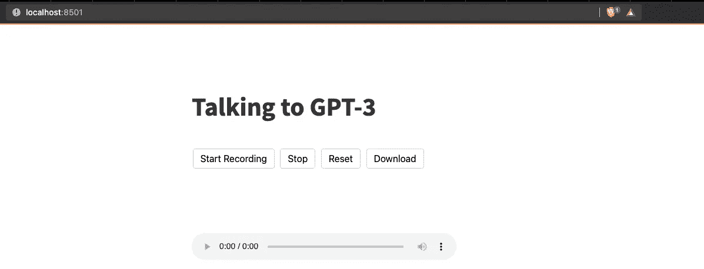
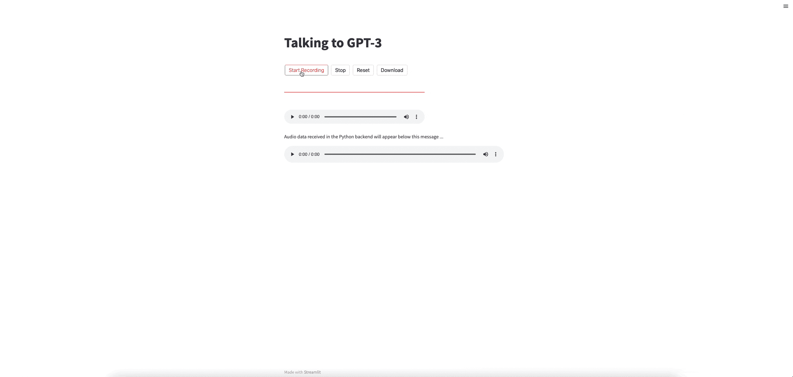

# 我用我的声音和 open ai GPT 3 互动

> 原文：<https://towardsdatascience.com/i-used-my-voice-to-interact-with-openai-gpt-3-884b69dd3b0f>

## 构建一个与 GPT 3 号对话的网络应用


由 [Unsplash](https://unsplash.com?utm_source=medium&utm_medium=referral) 上的 [Soundtrap](https://unsplash.com/@soundtrap?utm_source=medium&utm_medium=referral) 拍摄的照片

大型语言模型(简称 LLMs)，如 [PaLM](https://arxiv.org/pdf/2204.02311.pdf) by *Google* ， *OpenAI* 的 [GPT-3](https://proceedings.neurips.cc/paper/2020/file/1457c0d6bfcb4967418bfb8ac142f64a-Paper.pdf) ，[威震天-图灵 NLG](https://arxiv.org/abs/2201.11990) by *微软-英伟达*等。，在生成综合自然语言文本方面取得了显著的成绩。

目前，在这三种模型中，只有 OpenAI 的 GPT-3 可供公众使用，可使用 OpenAI 的 API 进行访问。因此，自发布以来，OpenAI 的 GPT-3 已经在 300 多个应用程序/产品中使用。(来源:[此处](https://openai.com/blog/gpt-3-apps/))。

GPT-3 将文本输入作为提示，并通过一次预测一个标记来执行文本补全任务。GPT-3 的特别之处在于它的建造规模，拥有近 175 个参数。



GPT 3 生成自然语言文本的可视化。(来源:[杰伊·阿拉玛](https://jalammar.github.io/how-gpt3-works-visualizations-animations/))

虽然 GPT-3 背后的核心思想是响应“文本”提示，但集成语音输入应用程序最近也引起了社区的极大兴趣。

因此，在这篇博客中，我们将创建一个 Streamlit 应用程序，通过为它提供基于语音的输入来与 OpenAI GPT-3 进行交互。

文章的亮点如下:

[**App 工作流程**](#6733)[**先决条件**](#8d08)[**构建细流 App**](#e5a1)[**执行应用**](#715d)[**结论**](#cbed)

我们开始吧！

# 应用程序工作流程

如上所述，GPT-3 模型期望文本提示作为输入。然而，如果我们从语音开始，我们首先需要将语音转换为文本，然后将转录的文本作为输入输入到 GPT-3 模型。

为了生成音频转录，我将使用 AssemblyAI 的语音到文本转录 API。

下图展示了该应用程序的高级工作流程:



应用程序的高级工作流(图片由作者提供)

首先，用户将提供语音输入，这将被记录。接下来，我们将把音频文件发送到 AssemblyAI 进行转录。一旦转录的文本准备好并从 AssemblyAI 的服务器中检索出来，我们将使用 OpenAI API 将其作为输入提供给 OpenAI GPT-3 模型。

# 先决条件

下面列出了创建可与 GPT-3 互动的语音应用程序的一些要求:

## 排名第一的安装简化版

首先，当我们使用 streamlit 创建这个应用程序时，我们应该使用以下命令安装 Streamlit 库:

## #2 安装 OpenAI

接下来，要向 GPT-3 模型发送请求，我们应该安装 OpenAI API，如下所示:

## #3 导入依赖关系

接下来，我们导入将在这个项目中使用的 python 库。

## #4 获取 AssemblyAI API 令牌

为了利用 AssemblyAI 的转录服务，您应该从 [AssemblyAI](https://app.assemblyai.com/signup) 网站获得一个 API 访问令牌。让我们为我们的 Streamlit 应用程序命名为`assembly_auth_key`。

## #5 获取 OpenAI API 令牌

最后，要访问 GPT-3 模型并生成文本输出，您应该从 OpenAI 网站获得一个 API 访问令牌。在 OpenAI 中，这被声明为`api_key`属性，如下所示:

# 构建 Streamlit 应用程序

一旦我们满足了应用程序的所有先决条件，我们就可以继续构建应用程序了。

为此，我们将定义五个不同的函数。这些是:

1.  `**record_audio(file_name)**`:顾名思义，这将允许用户向应用程序提供口头输入。该功能将收集音频并将其存储在本地的音频文件中，名为`file_name`。我已经引用了[这个](https://github.com/stefanrmmr/streamlit_audio_recorder)代码来将这个方法集成到应用程序中。
2.  `**upload_to_assemblyai(file_name)**`:该函数将获取音频文件，上传到 AssemblyAI 的服务器，并将文件的 URL 返回为`upload_url`。
3.  `**transcribe(upload_url)**`:一旦`upload_url`可用，我们将创建一个 POST 请求来转录音频文件。这将返回`transcription_id`，它将用于从 AssemblyAI 中获取转录结果。
4.  `**get_transcription_result(transcription_id)**`:为了检索转录的文本，我们将使用从`transcribe()`方法获得的`transcription_id`执行一个 GET 请求。该函数将返回转录的文本，我们将把它存储为一个`prompt`变量。
5.  `**call_gpt3(prompt)**`:最后，这个函数将传递来自用户的提示，并从 GPT-3 模型中检索输出。

## 方法 2:将音频文件上传到 AssemblyAI

一旦音频文件准备好并保存在本地，我们将把这个文件上传到 AssemblyAI 并获得它的 URL。

然而，在上传文件之前，我们应该声明 AssemblyAI 的头和转录端点。

在上面的代码块中:

1.  `upload_endpoint`指定 AssemblyAI 的上传服务。
2.  上传文件后，我们将使用`transcription_endpoint`转录音频文件。

`upload_to_assemblyai()`方法实现如下:

我们用`upload_endpoint`、`headers`和音频文件的路径向 AssemblyAI 发出 post 请求(`file_path`)。我们从收到的 JSON 响应中收集并返回`upload_url`。

## 方法 3:转录音频文件

接下来，我们将定义`transcribe()`方法。

与 upload_to_assemblyai()方法中的 POST 请求相反，这里我们调用了`transcription_endpoint`,因为目标是转录文件。

该方法为我们的 POST 请求返回`transcription_id`，我们可以用它来获取转录结果。

## 方法 4:获取转录结果

这个列表中的第四步是使用 GET 请求从 AssemblyAI 获取转录结果。

为了获取与我们的特定请求相对应的结果，我们应该在 GET 请求中提供从 AssemblyAI 接收到的惟一标识符(`transcription_id`)。`get_transcription_result()`方法实现如下:

转录运行时间将根据输入音频的持续时间而变化。因此，我们应该重复发出 GET 请求来检查请求的状态，并在状态变为`completed`或指示为`error`时获取结果。在这里，我们返回转录文本(`prompt`)。

## 方法 5:向 OpenAI GPT-3 发送提示

最后一个方法将使用 OpenAI API 将提示作为输入发送给 GPT-3 模型。

你可以在这里找到可用的 GPT-3 引擎列表。

## 集成主方法中的功能

作为我们的 Streamlit 应用程序的最后一步，我们将上面定义的函数集成到`main()`方法中。

# 执行应用程序

现在我们已经构建了整个应用程序，是时候运行它了。

打开一个新的终端会话，并导航到工作目录。在这里，执行以下命令:

```
streamlit run file-name.py
```

> 用你的应用文件名替换`file-name.py`。



Streamlit 应用程序的界面(图片由作者提供)

## 演示演练

接下来，让我们快速浏览一下支持 Streamlit 语音的 GPT-3 应用程序。

正如我们在上面看到的，应用程序要求说出提示。在下面的演练中，我向 GPT-3 展示了以下提示:“*想象一下地球之外是否存在生命。*”



询问 GPT-3 关于地球外生命的存在(Gif 作者)

该应用程序记录音频并将其保存到本地文件中。接下来，它将文件发送到 AssemblyAI 进行转录。最后，转录的文本被发送到 GPT-3，其响应显示在应用程序上。

GPT 3 号对我们的提示的回应是:“*这是一个很难回答的问题，因为没有具体的证据表明地球之外存在生命。然而，关于宇宙中生命可能存在的地方有许多可能的理论。*”

# 结论

总之，在这篇文章中，我们使用 AssemblyAI API 和 Streamlit 构建了一个基于语音的交互工具，向 GPT-3 提出问题。

具体来说，我演示了如何获取语音输入，使用 AssemblyAI 将其转换为文本，然后作为提示发送给 GPT-3。

感谢阅读！

[🧑‍💻**成为数据科学专家！获取包含 450 多个熊猫、NumPy 和 SQL 问题的免费数据科学掌握工具包。**](https://subscribepage.io/450q)

✉️ [**注册我的电子邮件列表**](https://medium.com/subscribe/@avi_chawla) 不要错过另一篇关于数据科学指南、技巧和提示、机器学习、SQL、Python 等的文章。Medium 会将我的下一篇文章直接发送到你的收件箱。