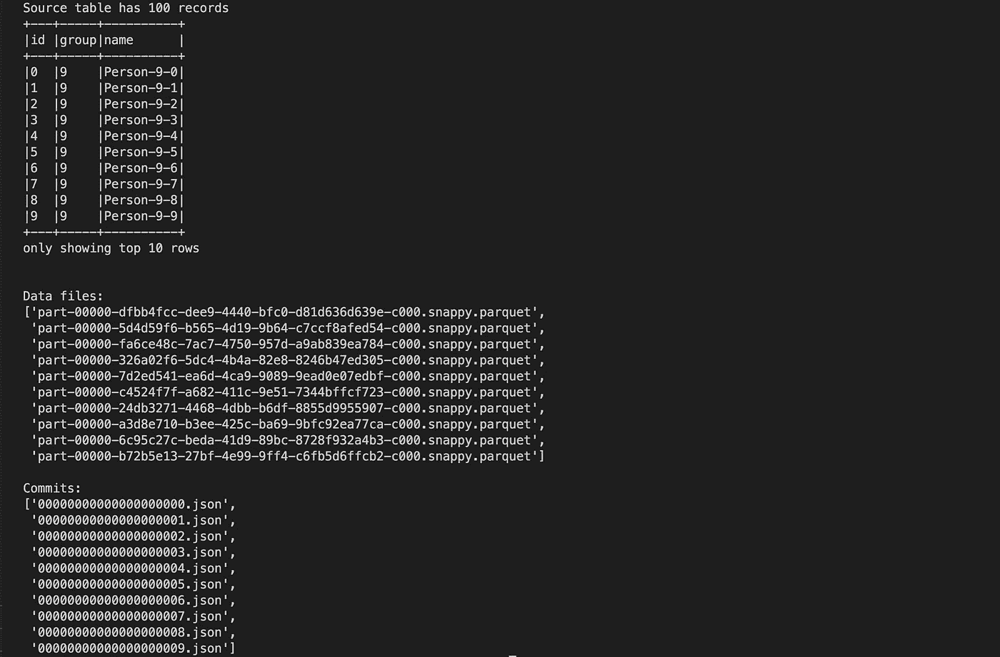
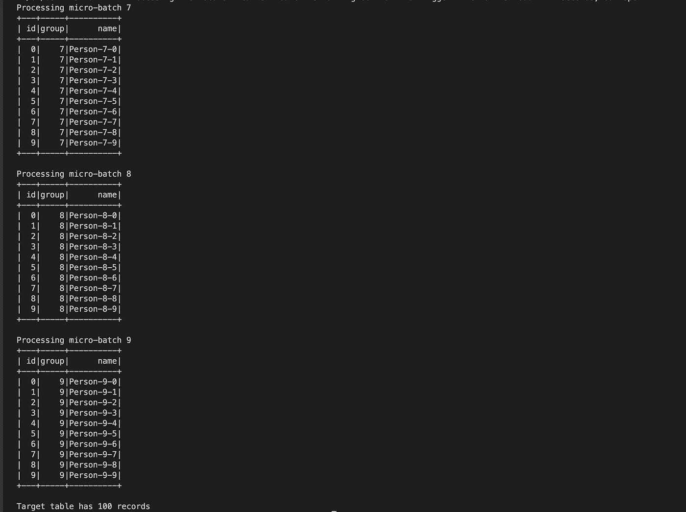
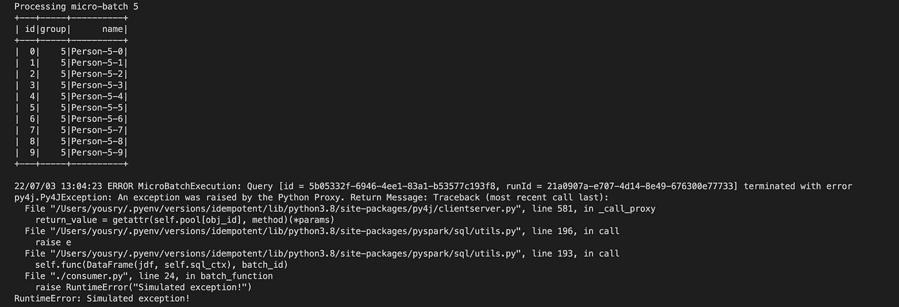
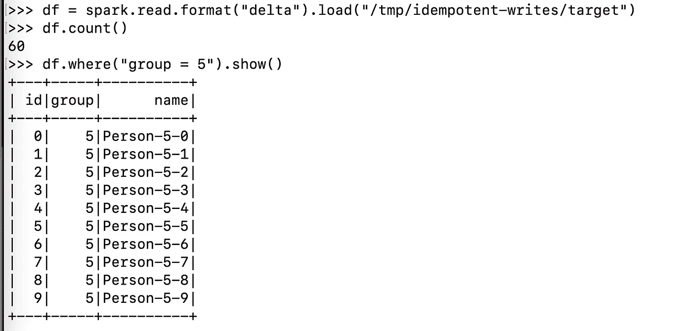
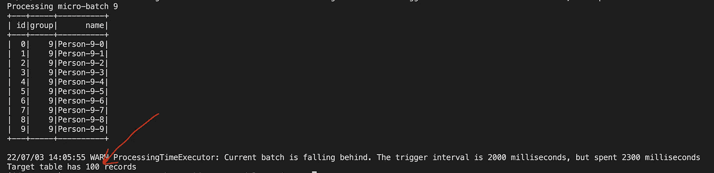
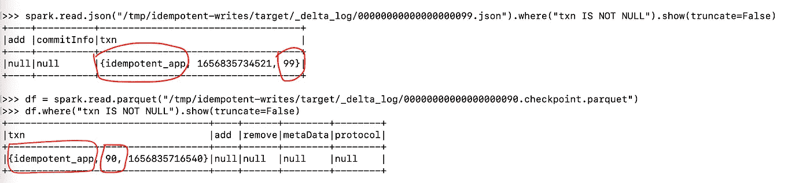

# 等幂写入 Delta Lake 表

> 原文：<https://towardsdatascience.com/idempotent-writes-to-delta-lake-tables-96f49addd4aa>

## 使用开源三角洲湖的演练


[https://unsplash.com/photos/JI0KxozvOtQ](https://unsplash.com/photos/JI0KxozvOtQ)

# 介绍

根据维基百科:

> **幂等性**是数学和计算机科学中某些运算的属性，由此它们可以被多次应用而不改变最初应用之后的结果。

一些非技术性的例子是电梯呼叫按钮和人行横道按钮。在许多情况下，拥有一个幂等的软件 API 是一个关键的必备特性。其中一种情况是 Spark 结构化流。默认情况下，结构化流使用检查点和预写日志来保证一次性容错。当使用`foreachBatch` API 时，这并不适用。

这个 API 非常强大，通常需要在流数据上应用 Spark SQL 批处理 API，或者将输出写入多个目的地，或者调用像`MERGE INTO`这样的 API 来更新下游增量表。这种方法的主要问题是，如果流在`foreachBatch`中失败或中断，目标表中就有可能出现重复。在本帖中，我们将会看到这种情况(并不罕见)会产生什么影响，以及如何处理它。

幸运的是，Delta Lake[已经完全开源](https://databricks.com/blog/2022/06/30/open-sourcing-all-of-delta-lake.html),因此很容易理解像 delta lake [幂等表写](https://docs.databricks.com/delta/delta-streaming.html#idempot-write)这样的某个特性是如何实现的，以及它的限制是什么。

# 环境设置

这应该很容易，我们需要的只是 delta lake 的最新预览版和 python 3.7+虚拟环境。

*   您可以使用 Mac/Linux/Windows，但是在 Windows 上最好使用 WSL2。这里会有 Spark，你不想浪费时间在 wintuils 和其他步骤上让 Spark 在 Windows 上运行。
*   使用您喜欢的环境管理工具创建一个新的 Python 环境并激活它。
*   运行`pip install delta-spark==2.0.0rc1`。
*   运行`pyspark --version`确认您的安装，它应该显示 **3.2.1** ，因为它与`delta-spark`捆绑在一起。

# 快乐的场景

我们都喜欢快乐的场景！至少看到代码按预期工作并产生一些结果感觉很好。让我们构建一些基本的 Spark 结构化流设置。源将是一个包含 10 次提交的增量表，其中每次提交都是一个文件。目的地是另一个增量表，但写入将使用`foreachBatch` API 完成，而不是作为传统的增量流接收器。

复制下面要点的内容，保存为`producer.py`。

生产者脚本执行以下操作:

*   从一些导入开始，准备一个文件夹来保存增量表和流检查点。
*   创建一个火花会议与三角洲湖依赖连线给我们。
*   创建一些虚拟数据帧，并将其附加到名为 source 的增量表位置。这个过程重复 10 次，每次追加(提交)有 10 条记录，将保存在一个文件中，因此称为`repartition(1)`。之所以这样设计，是因为流应用程序将被配置为每个微批处理提取一个数据文件(一对一映射到提交)，只是为了让事情更容易理解。总之，我们的源表有 100 条记录，分成 10 个文件。
*   脚本的最后一部分回显了一些关于写入数据的指标和细节，以确认它处于下一步的良好状态。

在上一步的同一个 Python 环境中，运行`python ./producer.py`，您应该会得到如下结果。



作者图片

现在，创建另一个名为`consumer.py`的文件，并用下面的要点填充它。

这个文件对制作人来说是硬币的另一面:

*   它从经典导入开始，并创建一个 Spark 会话。
*   然后，它定义了`foreachBatch` API 回调函数，该函数简单地打印批处理 Id，回显微批处理的内容，最后将其附加到目标增量表中。这是可以使用的基本逻辑。打印批次 Id 和微批次仅用于说明目的。

**提示:** *你在微批上做的任何火花动作都会触发整个血统。因此，如果要在函数中多次使用微批处理，缓存它可能会很有用。*

*   脚本中的下一部分是流查询:
    -从使用 producer 脚本准备的增量表中读取数据流。
    -通过使用`maxFilesPerTrigger`
    从每个微批次的源中提取一个单个拼花数据文件-设置检查点位置并连接`foreachBatch`
    的处理程序-触发持续时间为 2 秒的流并运行它最多 30 秒，然后继续下一步。如果我们使用一个与 [Spark 3.3](https://spark.apache.org/releases/spark-release-3-3-0.html#structured-streaming) 兼容的 delta lake(至少对于 OSS delta 来说现在不是这种情况)，我们可以使用流式触发`availableNow`。这将使我们不必指定超时，并且它仍然会考虑其他选项，如`maxFilesPerTrigger`。这里的假设是，在大多数机器上，所有的源表文件将在不到 30 秒的时间内得到处理。
*   最后，打印目标表中的记录数，猜猜会发生什么？那应该能印 100，除非什么东西真的坏了。

现在运行`python ./consumer.py`，让我们看看这是否真的是一个快乐的场景😅。预期的结果将如下所示。



作者图片

正如您所看到的，每个微批次的 Id 和内容都被打印出来，目标表的最终记录计数为 100，证明一切都按预期运行。


[https://imgflip.com/i/6lmfss](https://imgflip.com/i/6lmfss)

# “不那么”快乐的场景！

好了，是时候让事情崩溃了。要重新开始，您可以删除检查点和目标表的文件夹，但更简单的方法是再次运行生成器，这将清理所有相关的文件夹，包括检查点和目标表。

这次我们将模拟写完微批号 5 后直接发生错误的事情。将消费者文件中的`batch_function`代码修改如下:

```
def batch_function(df, batch_id): print(f"Processing micro-batch {batch_id}") df.show() df.write.mode("append").format("delta").save(target) if batch_id == 5: raise RuntimeError("Simulated exception!")
```

在写入批次 Id 5 的数据后，最后两行引发一个伪异常。这将导致流崩溃，无法写入检查点文件。实际上，这模拟了未记录或跟踪的对目标系统的影响。现在让我们试一试。

```
python ./consumer.py
```



作者图片

不出所料，程序崩溃了，但我们想确认数据是否已写入目标。您可以运行一个独立的 PySpark shell 会话来验证这一点。

```
pyspark --packages io.delta:delta-core_2.12:2.0.0rc1 --conf "spark.sql.extensions=io.delta.sql.DeltaSparkSessionExtension" --conf "spark.sql.catalog.spark_catalog=org.apache.spark.sql.delta.catalog.DeltaCatalog"
```



记录的数量是 60，这是正确的，因为我们从批次 Id 0 开始，批次 Id 5 的内容在目标表中，所以发生了写操作。

现在想象一下，如果我们移除模拟异常并重新运行消费者应用程序，会发生什么！

流检查点文件夹没有任何关于批次 Id 5 的持久化数据，因此流将在批次 Id 5 处**恢复**，这显然会在目标增量表中产生重复数据。

因此，删除模拟的异常行并重新运行消费者。流应该从批处理 Id 5 开始，目标表中的记录数将是 110 而不是 100，这表明数据损坏(在我们的例子中是重复)。


作者图片

# 幂等写拯救！

因为这是一个非常常见的用例，因为流重启是不可避免的，所以 delta lake 团队想出了一个解决方案，在从流写入 delta 表时，这个解决方案非常有效。请记住这一点，因为它不是一个通用的解决方案，所以例如，当写入普通的拼花文件时，使用它是没有意义的。

无论如何，因为 delta lake 最近的开源，所有这些先进的 delta lake 功能现在都可以在 GitHub 上获得；我们可以检查源代码，甚至在尝试之前就理解它是如何工作的。

核心解决方案围绕两个选项，这两个选项可用于流式查询。第一个是`txnAppId`，它保存了应用程序写入目标增量表的 Id。这是必要的，因为增量表可以有多个并行写入的流，并且每个流都可以是独立的不同应用程序。另一个选项`txnVersion`是一个序列号，表示正在写入的数据的应用版本。在`foreachBatch`的情况下，这通常是批次 Id。这两个选项的伪代码如下:

```
txnVersion = options.get("txnVersion")
txnAppId = options.get("txnAppId")
```

接下来，如果接收到的版本以前在增量表中出现过(对于同一个 appId)，writer 类将简单地跳过写入。增量表事务日志不需要存储所有的历史版本，只需要每个应用 Id 的最新版本就足够了。我稍后会谈到这一点。[那个逻辑](https://github.com/delta-io/delta/blob/585855c452bd8ef5ff512058c7861dfdd3e9d972/core/src/main/scala/org/apache/spark/sql/delta/commands/WriteIntoDelta.scala#L320)的伪代码是这样的。

```
def hasTransactionBeenExecutedBefore(table, txnVersion, txnAppId) latestSeenVersion = table.getLatestSeenVersionForApp(txnAppId) if (latestSeenVersion >= txnVersion) return true
    else
        return false
```

现在让我们重新开始:

*   运行生产者
*   更新消费者文件中的`df.write`功能，使`.write`后有`.option("txnAppId", "idempotent_app").option("txnVersion", batch_id)`。
*   运行带有模拟异常的使用者。

该程序应该如预期的那样失败，并且微批次 5 将被写入目标增量表。现在可以检查的是目标表的增量日志文件。

在您喜欢的文本编辑器中打开任何一个目标增量表提交文件，如`/tmp/idempotent-writes/target/_delta_log/00000000000000000003.json`。


第一行是一个名为[事务标识符](https://github.com/delta-io/delta/blob/master/PROTOCOL.md#transaction-identifiers)的 delta lake 协议动作。正如你所看到的，它包含了我们作为一个选项发送的固定申请 Id 和一个交易版本，即批次 Id。Delta lake 在后台收集所有这些 json 文件(有时还有另一个名为 checkpoint 的 parquet 文件，它在每 10 次提交后被写入)来构成 Delta 表状态的快照视图。在我们的例子中，状态具有由每个应用程序 Id 写入的最新版本，在我们的例子中是单个应用程序。因此，在下一次写入时；delta lake 可以确定它之前是否看到过相同的写尝试，并基于此可以继续或跳过它。

理论够了！

移除模拟异常，并再次运行使用者。

嘣！目标表有 100 条与源表相同的记录，您甚至可以检查目标表，确保没有重复的记录(id & group 列可以充当复合 PK)



这个概念简单又酷，可能在非流式场景中也很有用。

交易标识符操作将始终记录在增量日志 JSON 或 parquet 文件中。正如我提到的，delta-lake 不需要提取完整的版本列表来实现这个逻辑。只有每个应用程序 Id 的最新条目就足够了。例如，在目标表上执行 100 个微批处理后，`txn`操作如何出现在增量日志中。



# 总结和警告

当使用 DataFrameWriter 从`foreachBatch` API 写入 delta lake 表时，这个特性是非常必要的。没有它，重复可能会发生，他们可能很难发现，因为他们只会悄悄地发生。

记得清理你的测试数据。

```
rm -r /tmp/idempotent-writes
```

警告是:

*   此功能仅在 DataFrameWriter API 中可用。它不能用来(a̵s̵ ̵o̵f̵ ̵n̵o̵w̵见下面的更新)运行类似`MERGE INTO`的命令。类似地，如果写给 parquet 或 JDBC，你需要自己解决幂等问题。
*   从文档中复制一个警告:

> 如果删除流式检查点并用新的检查点重新开始查询，则必须提供不同的`appId`；否则，来自重新启动的查询的写入将被忽略，因为它将包含相同的`txnAppId`，并且批处理 ID 将从 0 开始。

当您尝试重新开始时，上述情况适用，但是如果重新创建目标增量表，您选择只删除现有记录。该表在数据方面将是空的，但事务日志仍将具有先前流运行的痕迹，因此将跳过之前看到的所有批处理 id。

在上述情况下，如果您将日志记录级别更改为 INFO，您将看到如下消息，指示微批处理被跳过。

```
22/07/03 21:36:51 INFO WriteIntoDelta: Transaction write of version 0 for application id idempotent_app has already been committed in Delta table id d5e0a924-683a-45a0-a299-718b89409b6a. Skipping this write.
```

这并不是一件坏事，特别是当它发生在恢复失败的流应用的正常情况下，使得最后提交的微批处理不会被重新写入目标增量表时。

希望您现在对如何使用增量表中的幂等写来使您的流工作负载对瞬时故障具有鲁棒性有所了解。

【2023 年 1 月更新:

[Deltalake 版本 2.0.2](https://newreleases.io/project/github/delta-io/delta/release/v2.0.2) 扩展了对所有 DML 操作的支持。奇怪的是，在 2.2.0 中没有找到同样的支持。看看[这个要点](https://gist.github.com/ylashin/6fbbe5a14106f92fc5fab38f4f6fd63e)就一窥端倪。OSS deltlake 2.0.2 提供该功能。我已经在 Databricks DBR 12.0 上试过了，效果很好，甚至可以在之前 DBR 的 Databricks 上使用。

快乐流媒体！