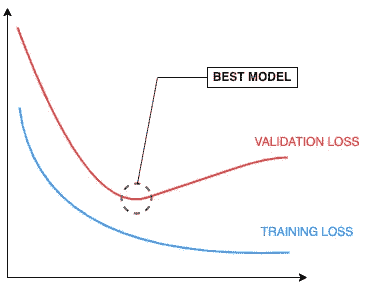
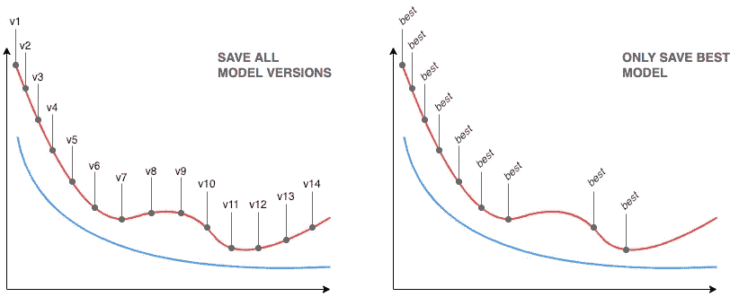
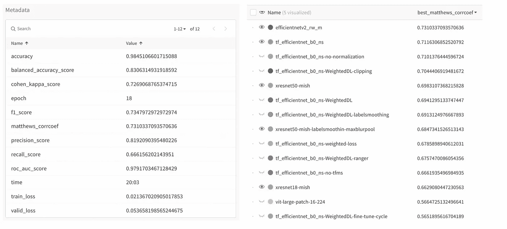

# 神经网络训练的良好实践:识别、保存和记录最佳模型

> 原文：<https://towardsdatascience.com/identify-version-control-and-document-the-best-performing-model-during-training-62d7408eceef>

## [提示和技巧](https://towardsdatascience.com/tagged/tips-and-tricks)

# 神经网络训练的良好实践:识别、保存和记录最佳模型

## 介绍训练神经网络时*最佳模型*保存的良好实践，以及使用 fastai 和权重&偏差的实际实现

***本文原载于我的*** [***个人博客***](https://nicjac.dev/posts/identify-best-model/)

在这篇文章中，我们将:

*   介绍*最佳模式*的概念
*   讨论如何在培训期间识别、保存和记录*最佳模型*
*   探索如何利用 fastai 和 Weights & Biases(几乎)自动且毫不费力地完成所有这些工作

## 什么是“最佳模式”,我为什么要关心？

模型训练可以被看作是模型的后续版本的生成——在每一批之后，模型权重被调整，并且作为结果，模型的新版本被创建。每个新版本都将具有不同的性能水平(根据验证集进行评估)。

如果一切顺利，训练和验证损失将随着训练时期的数量而减少。然而，模型的最佳执行版本(这里缩写为*最佳模型*)很少是在训练过程结束时获得的版本。



过度拟合训练曲线的一个典型例子(图片由作者提供)

举一个典型的过度拟合案例——首先，随着训练的进行，训练和验证损失都在减少。在某一点上，验证损失可能开始增加，即使训练损失继续减少；从这一点开始，在训练过程中产生的后续模型版本会过度拟合训练数据。这些模型版本不太可能很好地推广到看不见的数据。在这种情况下，*最佳模型*将是在验证损失开始偏离时获得的模型。

过度拟合是一个方便的例子，但是类似的观察也适用于模型训练的其他动态，例如局部最大值或最小值的存在。

## 在训练期间识别并保存*最佳模型*

解决该问题的简单方法是在训练期间的每个时期之后保存我们的模型，并基于训练曲线回顾性地选择最佳版本。这种方法有几个明显的缺点:

*   **存储空间**:大型模型在保存时往往会占用大量的存储空间，文件大小会达到数百 MB 到 GBs。用这个乘以历元数，你最终会得到一个相当大的存储空间，专门用来保存一个模型的所有版本。这很快就会成为问题，尤其是在远程训练模型时。
*   **计算影响**:在每个历元之后保存一个模型将会影响整个训练时间——一些模型的序列化/导出可能计算量大且速度慢。



天真的方法是持久化所有模型版本，而最好的方法是只持久化最近表现最好的模型(图片由作者提供)

作为这种在训练期间保存所有模型版本的强力方法的替代，可以更有选择性。从上面我们知道，我们的*最佳模型*很可能与低验证损失相关联。因此，我们可以为选择我们的*最佳模型*制定一个标准:它必须比前一个候选模型具有更低的验证损失。作为伪代码:

```
if current validation loss lower than candidate validation loss: save model to disk overwriting previous candidate
    set candidate validation loss to current validation loss
```

这种方法的主要优点是:a)只有当验证损失比之前的最佳候选模型有所改善时，才导出新的模型；b)在任何给定时间，我们只有一个模型版本保存到存储中。因此，我们成功地解决了简单方法的两个缺点。

也许更重要的是，仅保存*最佳模型*还通过要求在培训开始之前决定性能评估方法来鼓励良好的实践，并且它消除了在单独的测试数据集上追溯评估模型的其他版本的诱惑。

# 关于验证损失、替代指标和模型文档的注释

到目前为止，我们使用验证损失作为我们的目标度量，以在训练期间识别最佳模型*。你可能会问，为什么会有验证损失？事实上，它几乎总是在训练期间计算，这使得它成为一个方便的例子来说明本文中讨论的概念。*

然而，验证损失可能与您的特定用例或领域不相关，可以使用任何其他度量来代替。对于分类任务，准确性可能是一个不错的选择。同样，您可以选择目标指标，以确保*最佳模型*也能很好地推广到看不见的数据，例如在处理严重不平衡的数据集时使用 [Matthews 相关系数](https://scikit-learn.org/stable/modules/generated/sklearn.metrics.matthews_corrcoef.html)。

无论您决定使用什么样的目标度量，记录模型的这个特定版本的其他方面也是很重要的。通常，这将包括培训期间跟踪的所有绩效指标。将这些信息与实际的模型工件保存在一起在以后会非常有用，例如，对从超参数搜索中获得的模型进行排序，或者在产品中部署时执行集成测试(在以后的文章中会有更多关于这方面的内容！).

# 使用 fastai 轻松保存训练期间的最佳模型

最佳模型保存的实现需要改变训练循环，以便监控目标度量并在检测到改进时触发模型保存。许多现代框架都内置了这种能力。这里，我们将重点关注 fastai 实现，但是类似的功能也可能适用于您选择的库。您仍然可以了解如何在实践中实现这一点。

如果你不知道 *fastai 是什么，*它的[官方描述](https://github.com/fastai/fastai)是 *:*

> fastai 使用现代最佳实践简化了快速准确神经网络的训练

可以使用在训练的特定阶段调用的[回调方法](https://docs.fast.ai/callback.core.html)来修改和扩展 fastai 训练循环，例如在一个时期完成之后，或者在训练结束时。方便的是， [SaveModelCallback](https://docs.fast.ai/callback.tracker.html#SaveModelCallback) 恰好(几乎)做了我们需要的事情。

使用回调再简单不过了:python

```
learner.fit_one_cycle(... ,cbs=[..., SaveModelCallback(monitor='valid_loss')])
```

其中`learner`是标准 fastai [学习对象](https://docs.fast.ai/learner.html#Learner)。默认情况下，回调将跟踪验证损失，以确定何时保存新的*最佳模型*。使用`monitor`参数将其设置为由您的`learner`对象跟踪的任何其他指标。在训练期间的每个时期之后，将目标度量的当前值与先前的最佳值进行比较——如果是改进，则将模型保存在`models`目录中(并覆盖先前的最佳候选，如果存在的话)。

在幕后，回调试图判断改进是较小的值(如果目标度量包含`loss`或`error`)还是较大的值(其他的)。使用`comp`参数可以覆盖这种行为。该模型使用 fastai 的`[save_model](https://docs.fast.ai/learner.html#Learner.save)`函数持久化，该函数是 Pytorch 本机`[torch.save](https://pytorch.org/docs/stable/generated/torch.save.html)`的包装器。

内置回调不是我们所需要的*的原因是，它只会记录用于识别*最佳模型*的目标度量，而不会记录其他任何东西。它不会记录其他指标(例如准确性，如果*最佳模型*是基于验证损失确定的)。这可能没问题，但是考虑到我们的*最佳模型*可能会在某个地方被用作产品的一部分，尽可能多地描述它的特征是一个好主意。我组装了一个定制版本的`SaveModelCallback`，它将记录 fastai 在培训期间跟踪的所有指标。的代码可以在这里找到[。](https://gist.github.com/nicjac/b363d2454ea253570a54e5e178e7666a)*

这种定制版本的回调可以作为替代。它真正做的只是在内部跟踪与*最佳模型*相关联的度量字典(`last_saved_metadata`)。如何利用这一点？一切将在下一节揭晓！

# 自动记录带有权重和偏差的最佳模型

在本地保存最佳模型是一个好的开始，但是如果你远程工作，或者进行大量的实验，它会很快变得难以操作。那么如何跟踪所创建的模型，以及它们相关的度量标准呢？这就是[权重&偏差](https://wandb.ai/site)的来源。B 是其中一种工具，它让你想知道没有它们你怎么能正常工作。虽然官方将其描述为“开发者至上的 MLOps 平台”，但我更愿意称之为 MLOps 的瑞士军刀。

W&B 对于跟踪和比较实验非常有用。然而，出于本文的目的，我们主要对它几乎通用的版本控制能力感兴趣。在 W&B 生态系统中，[工件](https://wandb.ai/site/artifacts)是可以被版本化的组件，可能连同它们的血统一起。模型可以被版本化为工件。

方便的是，fastai 有一个内置的回调函数来与 W&B 集成，它被恰当地命名为`[WandbCallback](https://docs.fast.ai/callback.wandb.html#WandbCallback)`。要使用它，需要初始化一个 W & B 运行，并向学习者对象添加回调，如下所示:

```
# Import W&B packageimport wandb# Initialize W&B run (can potentially set project name, run name, etc...)wandb.init()# Add Callback to learner to track training metrics and log best modelslearn = learner(..., cbs=WandbCallback())
```

回电的主要目的是将有关培训过程的有用遥测记录到您的 W&B 帐户，包括环境信息和指标。当它与`SaveModelCallback`结合使用时，神奇的事情发生了——在训练过程结束时，表现最好的模型将自动记录为 W & B 运行的工件。

默认的`WandbCallback`有一个主要问题:与模型相关的元数据是在运行结束时记录的，而不是在保存*最佳模型*的时候。换句话说，元数据**与保存的模型**根本不对应，并且可能是误导性的(例如，当跟踪的度量由于过度拟合而在训练接近结束时偏离)。

这就是上一节讨论的定制`SaveModelCallback`的用武之地。它将保存将模型与其*实际*元数据相关联所需的所有信息。为了利用这一点，还需要使用一个定制版本的`WandbCallback`，可以在这里找到[。](https://gist.github.com/nicjac/9efb56cccd57f9c84910f02ccabf6fac)

这里突出显示了在自定义回调中所做的更改:

```
def after_fit(self): if self.log_model: if self.save_model.last_saved_path is None: print('WandbCallback could not retrieve a model to upload') else: log_model(self.save_model.last_saved_path, metadata=self.save_model.last_saved_metadata) for metadata_key in self.save_model.last_saved_metadata: wandb.run.summary[f'best_{metadata_key}'] = self.save_model.last_saved_metadata[metadata_key]
```

因此，将自动发生以下情况:

*   记录到 W&B 运行中的模型与包含正确度量值的元数据相关联
*   将*最佳模型*的所有指标值添加到运行总结中，前缀为`best_`。这允许根据各自*最佳模型*的性能对运行进行分类和比较



记录权重和偏差的最佳模型。(左)包括关键指标的模型元数据；(右)W&B 项目中的模型按与其各自的*最佳模型*相关的`***best_matthews_corrcoef***`元数据排序(图片由作者提供)

# 包扎

那么，我们从这篇文章中学到了什么？

*   只有在培训期间保存*最佳模式*才是有效的，并鼓励良好的实践
*   元数据，包括与*最佳模型*相关的关键指标，几乎与模型工件本身一样重要
*   使用 fastai 和 Weights & Biases，可以自动保存和记录*最佳模型*。描述了两个定制回调函数来使这个过程更好( [SaveModelCallback](https://gist.github.com/nicjac/b363d2454ea253570a54e5e178e7666a) 和 [WandbCallback](https://gist.github.com/nicjac/9efb56cccd57f9c84910f02ccabf6fac) )。