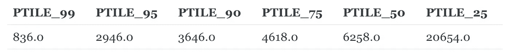
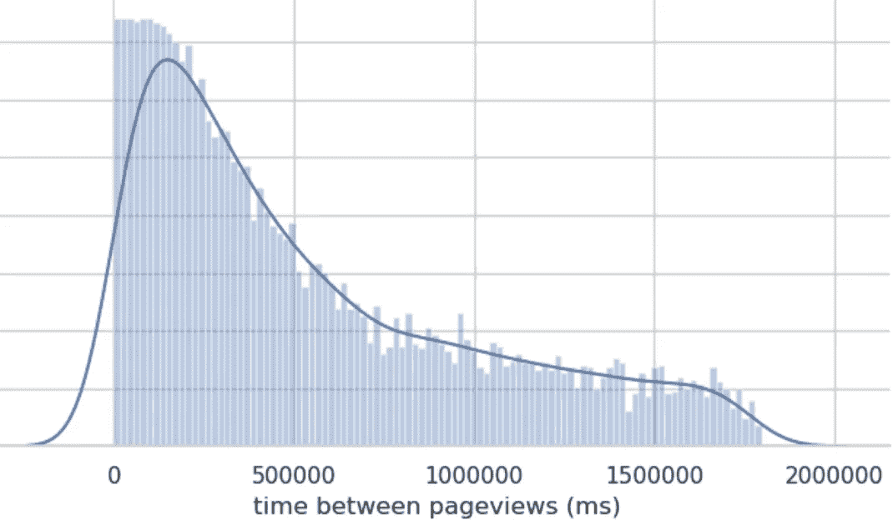
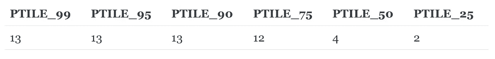

# 使用 SQL 识别 bot 流量

> 原文：<https://towardsdatascience.com/identifying-bot-traffic-with-sql-3327c893bdb2>


菲利普·格利克曼的照片

# 使用 SQL 识别 bot 流量

Web 数据通常包括某种类型的 bot 流量。无论是自动化测试用户还是不需要的 web 抓取者，在使用数据进行报告或分析之前，您都需要将他们从数据中删除。

这个 SQL 查询是系统地识别非人类浏览行为的一种快速而简单的方法，因此您可以花更少的时间清理数据，而花更多的时间做有趣的事情。

# 你需要什么数据

您将需要一个数据集来表示用户在一段时间内的每个页面视图(或类似的浏览行为，如点击)。这个查询是使用针对亚马逊红移仓库和来自 T2 段的基本页面视图数据的语法编写的，但是您可以很容易地将它应用于任何页面视图数据源和仓库组合。

# SQL 查询

```
SELECT 
 v.anonymous_id 
FROM (
 SELECT 
        p.message_id
        , p.anonymous_id
  , p.timestamp
  , LAG(p.timestamp) over
   (PARTITION BY p.anonymous_id ORDER BY p.timestamp ASC) 
   as last_pageview_ts
 FROM website.pages p  
 ) vWHERE date_diff('minute', v.last_pageview_ts, v.timestamp) < 30 
    and v.last_pageview_ts is not nullGROUP BY 1HAVING 
 avg(date_diff('ms', v.last_pageview_ts, v.timestamp)) <= 1000 
 and COUNT(1) > 10
```

# 它是如何工作的

在一个高层次上，这个查询使用页面视图数据来查找以非常快的速度查看了许多页面(> 10 个页面)的访问者(< 1 second between views on average). Viewing that many pages so quickly is a strong indication that the viewer is not human and should be removed from the data before analysis.

We defined these thresholds using our common sense about what was and wasn’t *正常的*用户行为)。如果你想客观一点，我在最后提供了一些提示，告诉你如何使用你的数据来设定阈值。

# 我们来分解一下

**步骤 1** —计算每次页面浏览之间的时间

```
LAG(p.timestamp) 
 over (PARTITION BY p.anonymous_id 
     ORDER BY p.timestamp ASC)       as last_pageview_ts
```

**步骤 2** —排除来自不同会话的任何连续页面视图

```
WHERE date_diff('minute', v.last_pageview_ts, v.timestamp) < 30
```

最终，我们将需要计算每次页面浏览之间的平均时间，如果我们包括会话之间的时间，我们将严重扭曲我们的平均值。通过删除这些记录，我们可以确保我们只计算同一个会话中页面浏览之间的时间。

**步骤 3** —计算每个用户每次页面查看之间的平均时间，并仅过滤查看之间的平均时间为< 1 秒(1000 毫秒)的用户

```
avg(date_diff('ms', v.last_pageview_ts, v.timestamp)) <1000
```

**第 4 步** —排除页面浏览量少于 10 次的人

```
COUNT(1) > 10
```

该查询将返回一个查看了 10 个以上页面的用户列表，平均每个页面查看时间不到 1 秒。最好抽查这些用户及其页面查看行为，以确保所选的 anonymous_id 看起来像机器人。

**提示**:调整平均浏览量和总浏览量的过滤器，使算法更具限制性。

一旦你调整了这些参数，你的机器人用户列表就准备好了！

就是这样！

最后一步是从所有建模的表中删除它们。[讲述人](/www.narrator.ai)可以很容易地排除用户的动态列表，所以你不必担心他们偷偷进入你的数据集。[了解更多](https://docs.narrator.ai/changelog/exclusion-list-for-activity-stream-users)

# 好处:使用数据选择好的阈值

在这一节，我将分享一些使用现有行为数据选择一个好的阈值的技巧。这些方法是不受监督的，这意味着我们没有一个带标签的数据集来告诉我们哪个用户实际上是机器人，哪个不是，所以我们不会建立一些欺诈检测模型。这些只是简单的试探法，你可以用来选择一个更明智的阈值。

目标是确定与你网站上的其他用户相比，什么应该被认为是*异常的*行为。行为会因您的站点而异，因此在选择阈值之前，我们将查看这些指标的分布，以确定哪些是正常的，哪些是不正常的。

# 页面查看之间的时间阈值

下面的 SQL 使用 Redshift 中的 [PERCENTILE_CONT()](https://docs.aws.amazon.com/redshift/latest/dg/r_WF_PERCENTILE_CONT.html) 函数来计算每个页面查看之间的时间的各个百分点。这将给我们一个分布的感觉，而不必做更深入的分析。

```
with pvs as (
    SELECT 
        p.message_id
        , p.anonymous_id
  , p.timestamp
  , LAG(p.timestamp) over
   (PARTITION BY p.anonymous_id ORDER BY p.timestamp ASC) 
   as last_pageview_ts
 FROM website.pages p  
),time_between as (SELECT 
        v.anonymous_id
        , date_diff('ms', v.last_pageview_ts, v.timestamp) ms_btwn_pvsFROM pvs v
    WHERE date_diff('minute', v.last_pageview_ts, v.timestamp) < 30 
        and v.last_pageview_ts is not null)SELECT 
    PERCENTILE_CONT(0.990) within group (ORDER BY ms_btwn_pvs desc) over () as ptile_99
    , PERCENTILE_CONT(0.950) within group (ORDER BY ms_btwn_pvs desc) over () as ptile_95
    , PERCENTILE_CONT(0.90) within group (ORDER BY ms_btwn_pvs desc) over () as ptile_90
    , PERCENTILE_CONT(0.750) within group (ORDER BY ms_btwn_pvs desc) over () as ptile_75
    , PERCENTILE_CONT(0.500) within group (ORDER BY ms_btwn_pvs desc) over () as ptile_50
    , PERCENTILE_CONT(0.250) within group (ORDER BY ms_btwn_pvs desc) over () as ptile_25
FROM time_between
LIMIT 1
```

**查询输出(毫秒)**



该查询将输出页面视图之间时间的各种百分比。例如，PTILE_75 是页面查看之间时间的第 75 个百分位数，这意味着 25% (100% — 75%)的页面查看发生在它之前的页面查看的 4，618 毫秒或更短时间内。作为参考，4,618 ms 相当于 4.618 秒。这符合我们对网站典型页面浏览行为的预期。

您还可以可视化分布(如曲线图)以获得更好的感觉，但是 SQL 输出应该足以确定一个好的阈值。



作者图片

**选择阈值**

一旦您对分布有了更好的理解，您就可以为页面浏览之间的时间选择一个明智的阈值。对于非常保守的阈值，选择 PTILE_99(第 99 个百分位数表示两次页面查看之间的最短时间)或第 95 或 90 个百分位数表示更宽松的阈值。为了简单起见，我选择 1000 毫秒作为我的阈值，因为根据我的数据，这是一个介于 99%和 95%之间的很好的数字。

要更新查询，只需将 bot 查询中带有 **1，000** 的行更改为您的新阈值:

```
avg(date_diff('ms', v.last_pageview_ts, v.timestamp)) < 1000
```

# 总页面浏览量阈值

我们将使用相同的方法来选择总页面浏览量的阈值。首先，使用下面的 SQL，我们将计算每个用户的总页面浏览量，并计算百分位数以更好地了解分布情况。

```
with pvs as (
    SELECT 
        p.message_id
        , p.anonymous_id
  , p.timestamp
  , LAG(p.timestamp) over
   (PARTITION BY p.anonymous_id ORDER BY p.timestamp ASC) 
   as last_pageview_ts
 FROM website.pages p  
),total_views as (SELECT 
        v.anonymous_id
        , count(1) total_pvsFROM pvs v
    WHERE date_diff('minute', v.last_pageview_ts, v.timestamp) < 30 
        and v.last_pageview_ts is not null 
    GROUP BY 1)select 
    PERCENTILE_CONT(0.990) within group (ORDER BY total_pvs ASC) over () as ptile_99
    , PERCENTILE_CONT(0.950) within group (ORDER BY total_pvs ASC) over () as ptile_95
    , PERCENTILE_CONT(0.90) within group (ORDER BY total_pvs ASC) over () as ptile_90
    , PERCENTILE_CONT(0.750) within group (ORDER BY total_pvs ASC) over () as ptile_75
    , PERCENTILE_CONT(0.500) within group (ORDER BY total_pvs ASC) over () as ptile_50
    , PERCENTILE_CONT(0.250) within group (ORDER BY total_pvs ASC) over () as ptile_25
from total_views
limit 1
```

**查询输出**



**选择阈值**

就像以前一样，我们有百分位数来更好地了解总页面浏览量的分布。我们将为 bot 查询选择一个合适的阈值。我选择这个阈值稍微宽松一点(10)，因为我预计大多数机器人是通过页面浏览之间的时间而不是他们在网站上浏览的总页面来检测的。

一旦您确定了想要使用的阈值，只需将 bot 查询中的这一行替换为您的阈值 **10** 。

```
and COUNT(1) > 10
```

仅此而已。您已经分析了站点上用户的典型行为，并可以相应地调整阈值。

# 让我们找到那些机器人！！


[来源](https://media.giphy.com/media/tczJoRU7XwBS8/giphy.gif)