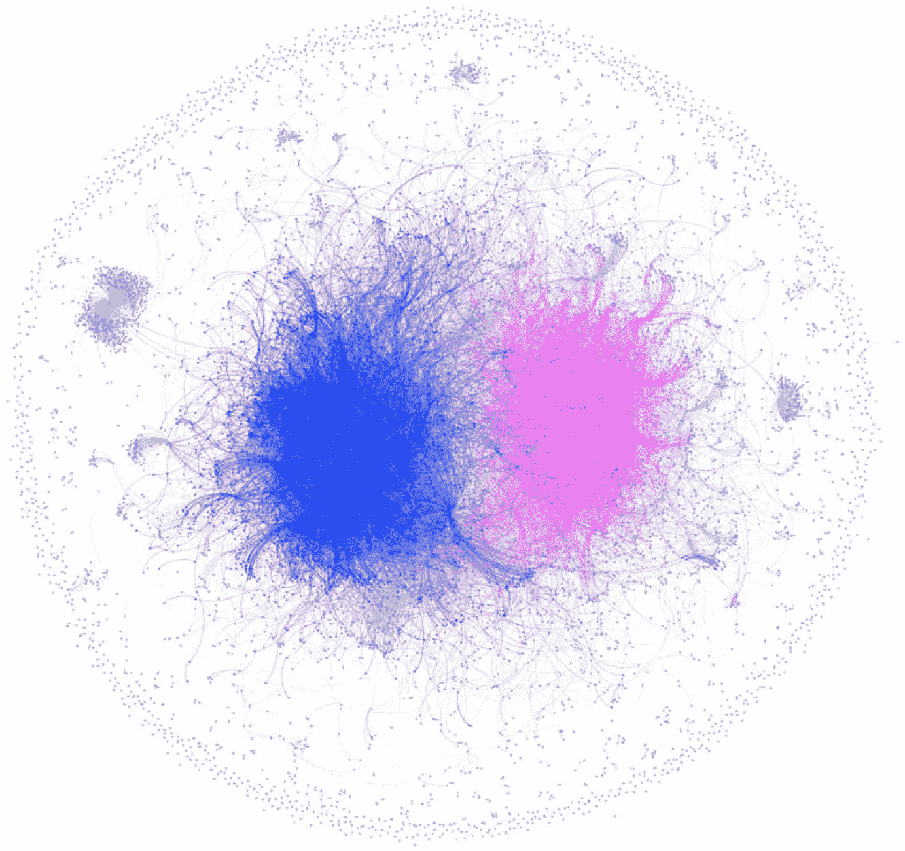
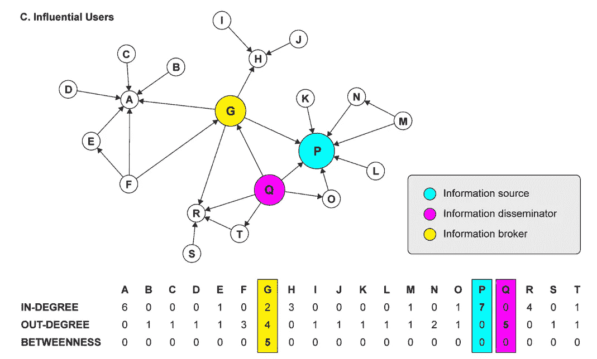
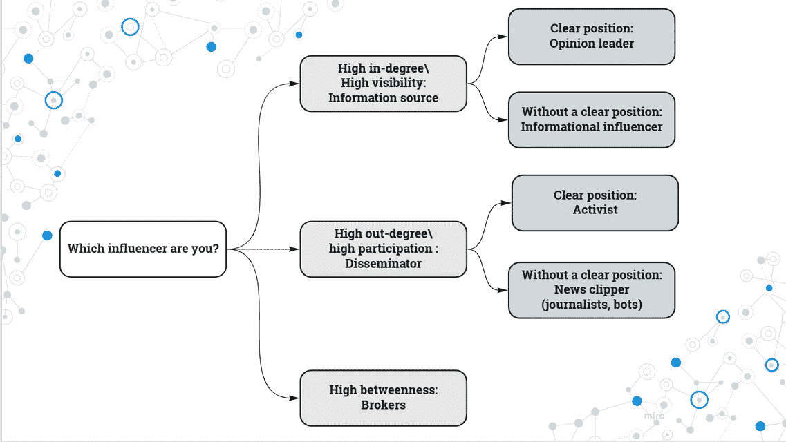

# 识别社交媒体上的影响者:使用 Python 的社交网络分析指南

> 原文：<https://towardsdatascience.com/identifying-influencers-on-social-media-a-guide-to-social-network-analysis-using-python-e05f4da151b8>

## 使用诸如入度、出度、模块性和中介中心性等指标来识别在线网络中的关键参与者


图片由[皮克斯拜](https://pixabay.com//?utm_source=link-attribution&utm_medium=referral&utm_campaign=image&utm_content=3758364)的 Gerd Altmann 提供

社交媒体平台已经成为交流和信息传播的重要渠道，这使得了解信息如何在这些网络中传播变得越来越重要。一种方法是通过使用社会网络分析(SNA)，它提供了一系列工具和技术来分析和理解个人或组织网络中的关系和模式。

在本文中，我们将提供四个关键指标的概述，这些指标可用于识别社交媒体上的影响者:程度、程度、模块性和中间中心性。我们将使用 Python 编程语言以及 networkx 和 community 包来计算和可视化样本社交网络数据集的这些指标。

**我们将介绍以下内容:**

[社交网络分析(SNA)解释](#6767)
[识别影响者:来自 Recuero 等人(2019)和 Kim and valente(2021)](#e693)
[理解和计算](#6aeb)SNA
∘[可见性(入度)](#de83)
∘ [参与度(出度)](#ee84)
∘ [关于主题的立场(模块化](#8a42)

# 社会网络分析(SNA)解释

社会网络分析(SNA)是一个研究领域，涉及使用统计和数学技术来分析和理解个人或组织网络中的关系和模式。它通常用于识别关键人物和理解社会、职业和交流网络的动态。

在 SNA 中，网络通常表示为图形，节点表示个体参与者(例如，人、组织)，边表示它们之间的关系(例如，友谊、协作)。可以使用各种不同的度量来分析这些网络，包括中心性的度量(例如，程度、中间性)、社区结构的度量(例如，模块性)以及网络演化的度量(例如，优先连接)。

SNA 的应用范围很广，包括研究信息和思想的传播，识别关键参与者和影响者，了解社交网络的结构和动态，预测新关系的形成。它被用于社会学、心理学、人类学、通信和计算机科学等领域，也已被应用于商业、政治和公共卫生领域的网络分析。

# 识别社交媒体上的影响者:来自 Recuero 等人(2019 年)和 Kim 和 Valente (2021 年)的见解

在他们的研究中， **Recuero，扎戈和 Soares** (2019)使用社交网络分析和社会资本来确定 Twitter 上极化政治对话的四种影响者。他们使用了几个指标来识别这些影响因素，包括模块化、内向度和外向度。



[图四。网络图—2018 年 1 月 22 日卢拉受审](https://journals.sagepub.com/cms/10.1177/2056305119848745/asset/images/large/10.1177_2056305119848745-fig4.jpeg)。[来自**雷库埃罗、扎戈和苏亚雷斯** (2019)](https://journals.sagepub.com/doi/full/10.1177/2056305119848745)

模块性衡量网络划分为不同组或社区的强度(如图所示)。Indegree 衡量用户收到的提及和转发次数，高 in degree 表示高可见性。Out-degree 衡量某个人在给定网络中转发或提及的用户数量，表示参与度。

根据这些指标，研究中确定的四种影响因素是:

1.  意见领袖:这些用户有明确的政治立场和较高的参与度，表明他们在形成公众意见方面有影响力，并经常被他人提及或转发。
2.  活动家:这些用户也有明确的政治立场和很高的出镜率，表明他们是某个特定事业或问题的倡导者，经常转发或提及其他用户。
3.  信息影响者:这些用户没有明确的政治立场，但有很高的认同度，通常表明他们是新闻渠道或其他可靠信息的来源。
4.  新闻剪辑师:这些用户也没有明确的政治立场，但有很高的外向度，表明他们积极分享新闻文章和其他来自知名来源的信息。



[金，我，&瓦伦提，T. W. (2021)。推特上的新冠肺炎健康传播网络:识别来源、传播者和经纪人。*连接*， *40* (1)，129–142。‏](https://sciendo.com/pdf/10.21307/connections-2019.018)

**Kim 和 Valente** (2021)对 Twitter 上的新冠肺炎健康传播网络进行了研究，并根据他们在网络中的角色确定了三种类型的用户。这些用户是:

1.  信息源(P):这些用户有很高的投入度，表明他们经常被其他用户提及或转发。他们被视为有关新冠肺炎的信息来源，并在塑造围绕疫情的公共话语方面发挥了关键作用。
2.  信息传播者(Q):这些用户有很高的外向度，表明他们在分享信息和与其他用户互动方面很活跃。他们在传播关于新冠肺炎的信息和塑造疫情周围的公共话语方面发挥了关键作用。
3.  信息经纪人(G):这些用户具有很高的中间性，表明他们在连接网络内不同群体方面发挥了核心作用。他们被视为促进不同群体之间信息流动的中间人，并在塑造新冠肺炎公共话语方面发挥了关键作用。

总的来说，这些发现表明，社交网络分析可以成为一种有用的工具，用于识别关键人物和理解 Twitter 等社交媒体平台上健康传播网络的动态。

# 使用 Python 理解和计算社交网络分析的关键指标:入度、出度、模块性和介数中心性

对于市场营销、公共关系和政治活动等各种应用来说，识别网络中的影响者可能是一项有价值的任务。在本文中，我们将探讨如何使用四种不同的指标来识别社交网络中的影响者:可见性(入度)、参与度(出度)、主题位置(模块化)和网络位置(中间中心性)。在接下来的章节中，我们将提供每个指标的概述，并讨论如何使用 Python 来计算它。

## 先决条件

在我们开始之前，您需要在 Python 环境中安装以下包:

*   `networkx`:用 Python 处理图形和网络的包
*   `community`:用于检测网络中社区的包
*   `matplotlib`:创建情节和可视化的软件包

您可以使用`pip`安装这些软件包:

```
pip install networkx community matplotlib
```

## 数据

对于本教程，我们将使用由`networkx`包(BSD-3)提供的一个样本社交网络数据集。这个数据集代表了一组个体之间的友谊的社会网络。图中的节点代表个体，边代表他们之间的友谊。

要加载数据集，我们可以使用以下代码:

```
import networkx as nx
```

```
# Load the sample social network dataset
G = nx.karate_club_graph()
```

## 能见度(以度为单位)

识别社交网络中的影响者的一种方法是看个人的可见性或他们拥有的联系数量。在社交网络中，这通常被称为节点的入度。

要计算图中每个节点的入度，我们可以使用以下代码:

```
in_degree = dict(G.in_degree())
print(in_degree)
```

这将打印出一个字典，其中节点作为键，入度作为值。例如，输出可能如下所示:

```
{0: 16, 1: 9, 2: 10, 3: 6, 4: 3, 5: 4, 6: 4, 7: 4, 8: 5, 9: 2, 10: 3, 11: 1, 12: 2, 13: 5, 14: 2, 15: 2, 16: 2, 17: 2, 18: 2, 19: 3, 20: 2, 21: 2, 22: 2, 23: 5, 24: 3, 25: 3, 26: 2, 27: 4, 28: 3, 29: 4, 30: 4, 31: 6, 32: 12, 33: 17}
```

然后，我们可以使用这些信息来识别具有最高学位的个人，他们将被认为是网络中最可见或最有影响力的人。

## 参与(非学位)

识别社交网络中的影响者的另一种方法是查看个人的参与情况或他们与其他个人建立的联系数量。在社交网络中，这通常被称为节点的出度。

要计算图中每个节点的出度，我们可以使用以下代码:

```
out_degree = dict(G.out_degree())
print(out_degree)
```

这将打印出一个字典，其中节点作为键，出度作为值。例如，输出可能如下所示:

```
{0: 9, 1: 10, 2: 5, 3: 4, 4: 4, 5: 3, 6: 3, 7: 2, 8: 2, 9: 2, 10: 3, 11: 1, 12: 2, 13: 5, 14: 2, 15: 2, 16: 2, 17: 2, 18: 2, 19: 3, 20: 2, 21: 2, 22: 2, 23: 5, 24: 3, 25: 3, 26: 2, 27: 4, 28: 3, 29: 4, 30: 4, 31: 6, 32: 17, 33: 12}
```

类似于入度，我们可以使用出度来确定在网络中建立了大量联系或高度参与的个人。

## 主题定位(模块化)

识别社交网络中的影响者的另一种方法是查看个人在特定主题或社区中的位置。在社交网络中，这可以用模块化来衡量，模块化是一种衡量网络由密集连接的社区组成的程度的方法。


按作者

有争议的话题可能更吸引人，因为它们往往会引发人们强烈的情绪和观点。当人们遇到挑战他们的信仰或价值观的信息或想法时，他们可能会感到有动力参与其中并表达自己的观点。这可能会导致社交媒体平台上的活动和参与度增加，因为人们会评论、分享和喜欢与争议话题相关的内容。

此外，有争议的话题可以产生紧迫感或重要性，因为人们可能会觉得这个话题对自己或他人有直接的相关性或后果。这也有助于增加接触和参与。

值得注意的是，有争议的话题也会产生负面或有害的影响，如两极分化、错误信息和不宽容。小心处理有争议的话题，并考虑接触这些内容的潜在后果，这一点很重要。

为了计算图的模块性，我们可以使用`community`包中的`community.best_partition`函数:

```
import community
```

```
# Calculate the modularity of the graph
partition = community.best_partition(G)
modularity = community.modularity(partition, G)
print(modularity)
```

这将打印出图的模块性，它将是一个介于 0 和 1 之间的值。模块性值越高，表明网络对社区的划分越强。

然后，我们可以使用划分字典来识别在他们各自的社区中高度关联的个人，因此，这些个人可能在那些社区中有影响力。

## 在网络上的位置(中间中心性)

最后，我们可以通过观察社交网络中的影响者在整个网络中的位置来识别他们。在社交网络中，这可以使用介数中心性来测量，介数中心性是对网络中节点作为其他节点之间的桥梁的次数的测量。

或者换句话说，介数中心性是一个节点在网络信息流中充当桥梁或中介的次数的度量。它反映了一个节点在连接其他节点和促进它们之间信息流动的能力方面的重要性。

想象一下，一群人试图在不透露信息来源的情况下互相分享信息。他们可以这样做的一个方法是通过使用经纪人或中间人，他们作为中间人，让人们互相传递信息。这个代理将具有很高的中间中心性，因为他们负责连接网络中的许多人，并促进他们之间的信息流动。

另一方面，一个只与少数其他人直接交流的人具有较低的中间中心性，因为他们不是网络中许多其他连接的中介。

一般来说，具有高介数中心性的节点在网络中起中心作用，并且通常被认为在信息流方面有影响或重要。因此，它们对于在网络中传播信息或思想是有价值的。

为了计算图中每个节点的介数中心性，我们可以使用`networkx`包中的`nx.betweenness_centrality`函数:

```
betweenness_centrality = nx.betweenness_centrality(G)
print(betweenness_centrality)
```

这将打印出一个字典，其中节点作为键，介数中心性作为值。例如，输出可能如下所示:

```
{0: 0.4376352813852815,
 1: 0.053936688311688304,
 2: 0.14365680615680618,
 3: 0.011909271284271283,
 4: 0.0006313131313131313,
 ...
```

然后，我们可以使用这些信息来识别具有高介数中心性的个人，这表明他们在整个网络中具有良好的联系和潜在的影响力。

# 摘要

在本教程中，我们演示了如何使用 Python 和各种包来基于四个不同的指标识别社交网络中的影响者:可见性(入度)、参与度(出度)、主题位置(模块化)和网络位置(中间中心性)。通过计算和分析这些指标，我们可以识别网络中可能在各种环境中具有影响力或重要性的关键人物。

通过使用这些指标来识别影响者，组织和个人可以更深入地了解在线网络的动态，并可以制定更有效的沟通和参与策略。Recuero、扎戈和 Soares (2019)使用这些指标确定的影响者的例子包括意见领袖(具有明确政治立场和高外向度的用户)、活动家(具有明确政治立场和高外向度的用户)、信息影响者(没有明确政治立场和高内向度的用户)和新闻剪辑师(没有明确政治立场和高外向度的用户)。

除了这些影响者之外，Kim 和 Valente (2021)在他们对 Twitter 上的新冠肺炎健康传播网络的研究中确定了另外三种类型的用户:信息源(P)(具有高进入度的用户)、信息传播者(Q)(具有高外出度的用户)和信息经纪人(G)(具有高中间中心度的用户)。这些用户在关于新冠肺炎的信息传播中扮演了特定的角色，并且可以使用上述相同的度量来识别。

通过了解这些不同类型的影响者所扮演的角色，组织和个人可以更有效地进行沟通，并与他们网络中的关键人物进行互动。无论您是在寻找意见领袖、活动家、信息影响者、新闻剪辑师、信息源、信息传播者还是信息经纪人，社交网络分析都可以提供对在线网络动态的宝贵见解，并帮助制定有效沟通和参与的策略。



按作者

***参考文献:***

1.  *金，我，&瓦伦提，T. W. (2021)。推特上的新冠肺炎健康传播网络:识别来源、传播者和经纪人。连接，40(1)，129–142。*
2.  *‏·雷库罗，r .，扎戈，g .&苏亚雷斯，F. (2019)。使用社会网络分析和社会资本来识别用户在 Twitter 上两极分化的政治对话中的角色。社交媒体+社会，5(2)，2056305119848745。‏*