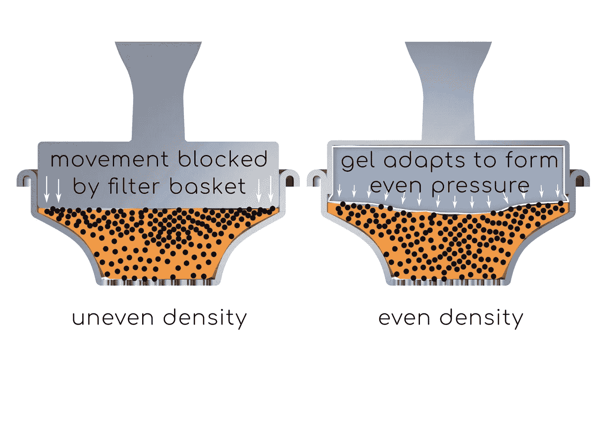
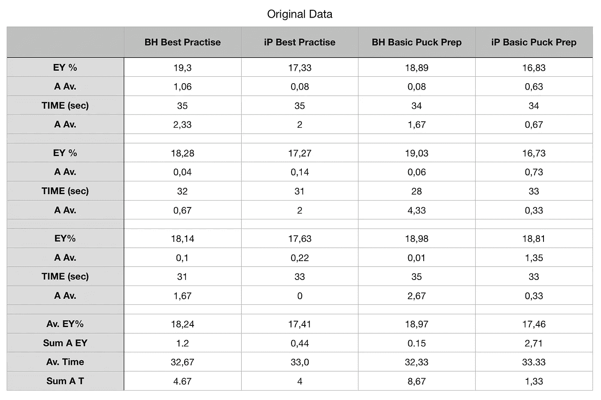
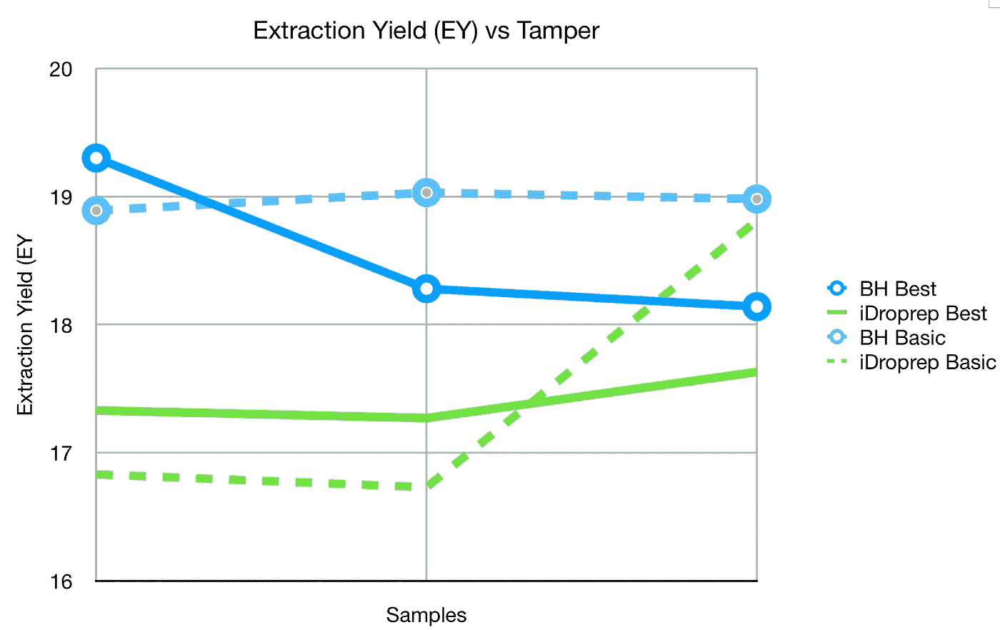
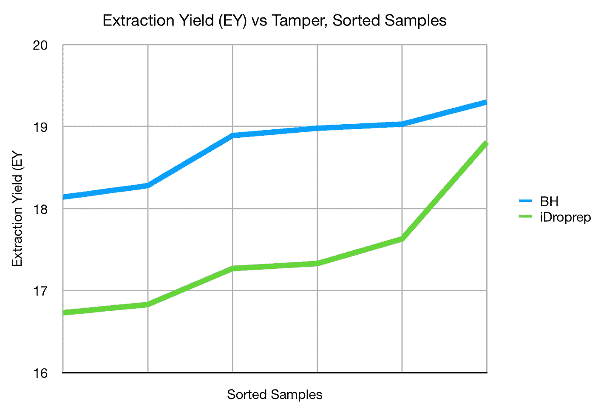
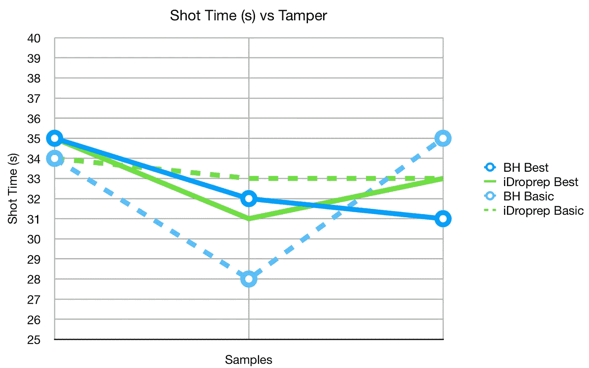

# 浓缩咖啡的 iDroprep 篡改

> 原文：<https://towardsdatascience.com/idroprep-tamper-for-espresso-2b3640d9d3ec>

## 咖啡数据科学

## 数据来自泰门·考夫曼

[iDroprep](https://idroprep.ch/en/) 夯锤是一种新型夯锤，它使用凝胶状垫来改变夯锤冲击地面的方式。 [Timon Kaufmann 制作了一个视频](https://youtu.be/nTBRUZIQUiw)并收集了一些关于篡改性能的数据(如果你不会说德语，请打开翻译成英语的自动隐藏字幕)。他以表格的形式展示了数据，所以我提取了数据并用图表显示出来，以获得不同的外观。

所有图片由作者提供

以下是原始数据:

他收集了提取率(EY ),用来衡量提取了多少咖啡。这是目前确定方法效率的最佳指标。

他为每个篡改做了两个变种:

1.  最佳冰球准备
2.  基本圆盘准备

以下是每个变体的三个镜头:

这给出了一个很好的故事，但在更一般的情况下，我们可以针对每个篡改绘制所有数据。我这样做了，并对样本进行了分类。性能上的差距非常明显，但是数据量对于统计测试来说是一个很差的样本量。

此外，我绘制了拍摄时间，但拍摄时间非常接近，所以没有太多启示。

我总是希望新技术有相关的数据来显示性能。这是一个小样本数据，但小数据总比没有数据好。我很有兴趣看看还有什么其他数据来为这个夯锤和冰球准备。很可能不同的圆盘准备会更好地最大限度地利用 iDroprep 夯锤。

如果你愿意，可以在[推特](https://mobile.twitter.com/espressofun?source=post_page---------------------------)、 [YouTube](https://m.youtube.com/channel/UClgcmAtBMTmVVGANjtntXTw?source=post_page---------------------------) 和 [Instagram](https://www.instagram.com/espressofun/) 上关注我，我会在那里发布不同机器上的浓缩咖啡照片和浓缩咖啡相关的视频。你也可以在 [LinkedIn](https://www.linkedin.com/in/dr-robert-mckeon-aloe-01581595) 上找到我。也可以在[中](https://towardsdatascience.com/@rmckeon/follow)关注我，在[订阅](https://rmckeon.medium.com/subscribe)。

# [我的进一步阅读](https://rmckeon.medium.com/story-collection-splash-page-e15025710347):

[我未来的书](https://www.kickstarter.com/projects/espressofun/engineering-better-espresso-data-driven-coffee)

[我的链接](https://rmckeon.medium.com/my-links-5de9eb69c26b?source=your_stories_page----------------------------------------)

[浓缩咖啡系列文章](https://rmckeon.medium.com/a-collection-of-espresso-articles-de8a3abf9917?postPublishedType=repub)

[工作和学校故事集](https://rmckeon.medium.com/a-collection-of-work-and-school-stories-6b7ca5a58318?source=your_stories_page-------------------------------------)