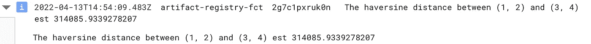

# 如果您正在使用 Python 和 Google 云平台，这将简化您的生活(第 1 部分)

> 原文：<https://towardsdatascience.com/if-you-are-using-python-and-google-cloud-platform-this-will-simplify-life-for-you-6be4f777fa3a>

## 使用 Artifact Registry 管理您的私有包，并将它们导入您的云功能和云运行服务

Max van den Oetelaar 在 [Unsplash](https://unsplash.com?utm_source=medium&utm_medium=referral) 上拍摄的照片

如果您在专业环境中使用 python，我可以告诉您，您已经在寻找一种在私有存储库中部署 Python 包的方法。好吧，让我来介绍一下[工件注册](https://cloud.google.com/artifact-registry)，这是[谷歌云平台](https://cloud.google.com/)的工件管理服务，可能正是你所需要的。

## **工件注册解决的 3 个问题**

假设您有一个 python 类(例如一个日志记录类),它被一个[云函数](https://cloud.google.com/functions)和一个[云运行](https://cloud.google.com/run)服务使用。

**实施 DRY 原则**:如果没有管理 python 包的解决方案，您最终将部署 python 类和云函数。同样，您需要部署与云运行服务打包在一起的 python 类，复制相同的代码片段。工件注册库使您能够通过将 python 类部署到一个库中，并从云功能和云运行服务中提取该库中的内容，来执行非常重要的 DRY(不要重复自己)原则。当您需要修改或修复 python 类中的任何 bug 时，这为您提供了一个单一的地方。

**部署安全版本** : 每次对 python 类进行更改，都存在破坏云功能和/或云运行服务的风险。我们称之为**回归**。虽然有可能用非回归测试来降低破坏东西的风险，但是这些测试通常是不够的。此外，您会希望用 python 类的工作版本来精确定位每个版本。精彩！Python 工件注册库允许您这样做。

**管理对包的访问** : 如果你不在乎隐私，也就是说，如果你不介意你的 python 包被世界上任何人看到和使用，我鼓励你把它们放在[公共 python 库](https://pypi.org/)。但是如果您需要控制谁查看您的包，正如在专业环境中经常出现的情况，工件注册库是一个很好的工具，因为它使您能够只与选定的人共享您的库。

说够了！让我们构建一个 python 工件注册表存储库，在里面部署一些东西，并尝试从云函数中提取存储库。

如果你需要的是将私有 python 包安装到 Cloud Composer DAG 中，请勾选[这个](/if-you-are-using-python-and-google-cloud-platform-this-will-simplify-life-for-you-part-2-bef56354fd4c)。

## 为您的包创建一个存储库

假设您可以访问 [GCP 项目](https://cloud.google.com/resource-manager/docs/creating-managing-projects)和[云外壳](https://cloud.google.com/shell)，为 python 包创建一个存储库是很简单的。

*   *<your _ repository _ name>是您要给 python 库*起的名字
*   *<您的存储库位置>是存储库的位置。类似于“美国-中部 1”或“欧洲-西部 1”的内容*
*   *<your _ repository _ description>是描述存储库用途或效用的文本*

## 部署简单的包

现在我们的存储库已经创建好了，让我们在其中部署一个玩具 python 包。我们将使用一个包含计算两点间[哈弗线距离](https://en.wikipedia.org/wiki/Haversine_formula)的函数的库。图书馆可以在这里找到[。这是您将库部署到先前创建的工件注册库的方式:](https://gitlab.com/marcdjoh/sample-python-package)

在克隆了样例包存储库之后，我们构建了一个轮子，并使用 python 库***‘twine’***将轮子上传到工件注册库。

注意我们是如何使用***【g cloud auth】***对 gcp 账户进行认证的。该过程还在本地保存认证凭证，然后由***【twine】***在上传到工件注册表时使用。

## 部署一个从私有 Python 包中提取的简单云函数

现在让我们使用我们的库来计算一个[云函数](https://cloud.google.com/functions)中的哈弗线距离。首先，克隆包含该函数的存储库。其次，激活需要的 API。第三，使用***【g cloud】***命令部署云功能。

虽然这是一个安全漏洞，但为了简单起见，我们使用标志 *- allow-unauthenticated* 来简化函数调用。在真实的场景中，您会希望限制对您的函数的访问，以便只有具有适当权限的客户端才有机会调用它。

现在是测试的时候了。我们将调用这个函数，看看它是否能像预期的那样工作。

基本上，cloud 函数从工件注册中心导入示例包(我们之前部署的包),并使用它来计算两点之间的哈弗线距离。它还将结果记录到[云日志](https://cloud.google.com/logging)中。

好，那么(1，2)和(3，4)之间的哈弗线距离是多少。为了找到答案，我们调用了云函数。

成功执行 curl 命令后，通过查看函数日志，您应该能够看到哈弗线距离。

## 这里发生了一件神奇的事情

至此，我们已经成功地将一个 python 包部署到工件注册中心，并且我们能够使用一个 *requirements.txt* 文件从云函数中提取这个包。requirements.txt 包含两件事:

1.  python 工件注册库的 URL:[*https://*](https://europe-west1-python.pkg.dev/artifact-registry-fct/python-repository/simple/)*<your _ repository _ location>*[*-python . pkg . dev/<your _ GCP _ project>/*](https://europe-west1-python.pkg.dev/artifact-registry-fct/python-repository/simple/)*<your _ repository _ name>*[*/simple*](https://europe-west1-python.pkg.dev/artifact-registry-fct/python-repository/simple/)*/*
2.  python 包的名称及其版本: *mypythonlib==0.2.0*

当我们使用***【g Cloud】***命令部署该功能时，会触发[云构建](https://cloud.google.com/build)服务，并且**会向工件注册表**进行认证以提取包。它使用我们启用云构建 API 时自动创建的服务帐户来实现这一点。

幸运的是，云构建服务帐户—*<project_number939016278554@cloudbuild.gserviceaccount.com>*拥有从同一个项目中的任何工件注册库提取所需的权限。然而，如果注册中心位于不同的项目中(例如，在一个共享项目中，这是一种常见的设计),如果我们不明确地给予云构建服务帐户在持有注册中心的项目中的 ***工件注册中心阅读器*** 角色，云功能将不能从注册中心中拉出。

## 结束注释

使用托管在云运行服务的工件注册表中的私有 python 包的工作方式非常相似。只需在 requirements.txt 文件中为 *extra-index-url* 选项设置正确的值，如果需要的话，给云构建服务帐户工件注册表阅读器角色，就可以了。

非常感谢你的时间。请在这里找到示例 python 包[的代码，在这里](https://gitlab.com/marcdjoh/sample-python-package)找到 google cloud 函数[的代码。](https://gitlab.com/marcdjoh/cloud-functions-pull-from-artifact-registry)

直到下一次写作，拜拜。