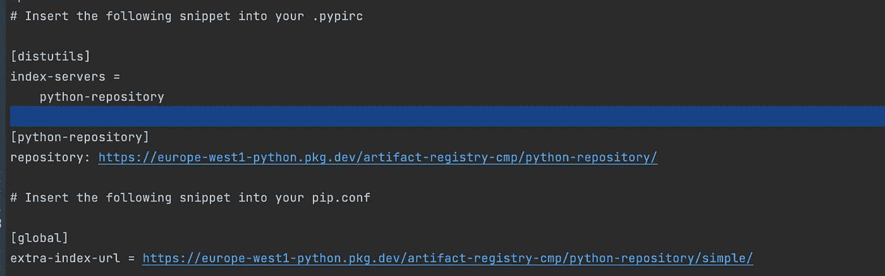
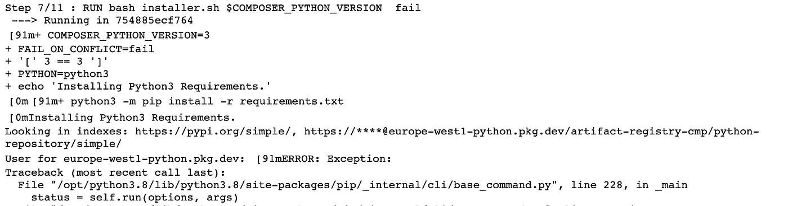

# 如果您正在使用 Python 和 Google 云平台，这将简化您的生活(第 2 部分)

> 原文：<https://towardsdatascience.com/if-you-are-using-python-and-google-cloud-platform-this-will-simplify-life-for-you-part-2-bef56354fd4c>

## 使用工件注册表管理您的私有包，并将其导入 Cloud Composer DAGs

Max van den Oetelaar 在 [Unsplash](https://unsplash.com?utm_source=medium&utm_medium=referral) 上拍摄的照片

如果您在专业环境中使用 python，我可以告诉您，您已经在寻找一种在私有存储库中部署 Python 包的方法。好吧，让我来介绍一下[工件注册](https://cloud.google.com/artifact-registry)，这是[谷歌云平台](https://cloud.google.com/)的工件管理服务，可能正是你所需要的。

## 工件注册解决的 3 个问题

假设你有一个 python 类(比如一个日志类)，它被一个气流[有向无环图](https://airflow.apache.org/docs/apache-airflow/stable/concepts/dags.html) (DAG)和一个[云函数](https://cloud.google.com/functions)使用。

**实施 DRY 原则**:如果没有一个管理 python 包的解决方案，您最终会将 python 类与 Airflow DAG 一起部署，也就是说，您必须将 python 类复制到 DAG 文件夹中。

同样，您需要部署与云函数打包在一起的 python 类，复制相同的代码片段。工件注册库使您能够通过将 python 类部署到一个库中，并从该库中从 Airflow DAG 和 Cloud 函数中提取，来执行非常重要的 DRY(不要重复自己)原则。当您需要修改或修复 python 类中的任何 bug 时，这为您提供了一个单一的地方。

**部署安全版本** : 每次您对 python 类进行更改时，都存在破坏气流 DAG 和/或云函数的风险。我们称之为**回归**。虽然有可能用非回归测试来降低破坏东西的风险，但是这些测试通常是不够的。此外，您会希望用 python 类的工作版本来精确定位每个版本。精彩！Python 工件注册库允许您这样做。

**管理对包的访问** : 如果你不在乎隐私，也就是说，如果你不介意你的 python 包被世界上任何人看到和使用，我鼓励你把它们放在[公共 python 库](https://pypi.org/)。但是如果您需要控制谁查看您的包，正如在专业环境中经常出现的情况，工件注册库是一个很好的工具，因为它使您能够只与选定的人共享您的库。

说够了！让我们构建一个 python 工件注册库，在里面部署一些东西，并尝试从一个 Airflow DAG 中拉出这个库。

如果你需要的是将私有 python 包安装到[云函数](https://cloud.google.com/functions)或者[云运行](https://cloud.google.com/run)，敬请参考[这篇文章](/if-you-are-using-python-and-google-cloud-platform-this-will-simplify-life-for-you-6be4f777fa3a)。

## 为您的包创建一个存储库

假设您可以访问 [GCP 项目](https://cloud.google.com/resource-manager/docs/creating-managing-projects)和[云外壳](https://cloud.google.com/shell)，为 python 包创建一个存储库是很简单的。

作者图片

*   *<your _ repository _ name>是您想要给 python 库*起的名字
*   *<您的存储库位置>是存储库的位置。类似于“美国-中部 1”或“欧洲-西部 1”的内容*
*   *<your _ repository _ description>是描述存储库*的用法或效用的文本

## 部署简单的 Python 包

现在我们的存储库已经创建好了，让我们在其中部署一个玩具 python 包。我们将使用一个包含计算两点间[哈弗线距离](https://en.wikipedia.org/wiki/Haversine_formula)的函数的库。图书馆可以在这里找到。这是您将库部署到先前创建的工件注册库的方式:

作者图片

在克隆了样例包存储库之后，我们构建了一个轮子，并使用 python 库***‘twine’***将轮子上传到工件注册库。

注意我们是如何使用***【g cloud auth】***对 gcp 账户进行认证的。该过程还在本地保存认证凭证，然后由***【twine】***在上传到工件注册表时使用。

## 部署一个简单的气流 DAG，它来自私有 Python 包

在 GCP 构建 DAG 的最快方法是创建一个 Cloud Composer 环境。这是一个漫长的过程(创建环境需要 20 分钟左右)，涉及许多操作，包括在[Google Kubernetes Engine](https://cloud.google.com/kubernetes-engine)(GKE)集群中启动大量资源，以及部署 [Cloud SQL](https://cloud.google.com/sql) Postgres 实例。以下命令实际上创建了一个服务帐户，并在 GKE 集群上安装了 Airflow。

作者图片

由于 Airflow 现在已经启动并运行，我们可以继续安装私有的 python 包了，这个包已经在工件注册表中进行了推送。为此，我们需要做两件事。

*   **向 Cloud Composer 提供 python 存储库 url**

我们通过运行 ***gcloud 工件打印-设置*** 命令来获取这些信息。

作者图片

该命令的输出应该如下所示:

作者图片

复制名为 pip.conf 的文件中的最后两行，并将该文件上传到文件夹 **config/pip** 中的 Cloud Composer bucket 中。

作者图片

*   **安装私有 python 包**

作者图片

我们使用***update-pypi-package***选项，并提供要安装的软件包的名称和版本。

几分钟后…

**不起作用……**

您应该得到一条错误消息，指出安装 pypi 包失败了。

嗯，让我们来揭开这到底是怎么回事。当我们运行带有***update-pypi-package***选项的***g cloud composer environments update***命令时，会触发一个 [Cloud Build](https://cloud.google.com/build) 实例，并尝试构建一个安装了 python 包的自定义 Cloud Composer 映像。在发出更新命令后不到 5 分钟，这个构建就会出现在构建历史中(在云控制台中)。

构建包括 11 个步骤(至少在本文使用的 Composer 版本中是这样的——Composer-1 . 17 . 8-air flow-2 . 1 . 4 ),它在第 7 步失败，在这一步它试图安装私有 python 包。

作者图片

通读错误堆栈指出了问题的根本原因。实际上，构建很难验证工件注册。嗯，这不是我所期望的，因为构建服务帐户拥有读取工件注册表的权限。

## 为云构建提供身份认证密钥

在一些测试和学习迭代以及通读工件注册表[文档](https://cloud.google.com/artifact-registry/docs/python/authentication)之后，我发现了一个解决方案，它包括在我们之前创建的 pip.conf 文件中包含一个服务帐户密钥。这不符合安全最佳实践，显然看起来像是一种变通方法。然而，在撰写本文时，这是让 Cloud Composer 从任何工件注册库安装包的唯一方法。

要做到这一点，服务帐户应该拥有从工件注册中心读取的权限。请遵循以下 7 个步骤:

1.  创建一个服务帐户(或者使用一个现有的帐户),并赋予它工件注册阅读器角色
2.  使用服务帐户创建一个 json 服务帐户密钥
3.  用 ***gcloud 工件打印-设置*** 命令生成私有 python 库 url。这一次，**使用 json-key 选项并提供服务帐户密钥的路径**
4.  验证新生成的 extra-index-url 是否嵌入了服务帐户 json 密钥，即 url 应该看起来像`***https://_json_key_base64:<KEY>@<LOCATION>-python.pkg.dev/<PROJECT>/<REPOSITORY>/simple/***`，其中<密钥>是嵌入的服务帐户密钥
5.  用新生成的 url ( - extra-index-url)替换 pip 文件的内容
6.  将修改后的 pip.conf 复制到 Cloud Composer bucket 中
7.  运行软件包安装命令

作者图片

几分钟后… **它开始工作了**

最后要做的事情是通过将 *dag.py* 文件复制到 Cloud Composer bucket 中来部署 DAG。

作者图片

DAG 只包含一个任务，除了打印(1，2)和(3，4)之间的[哈弗线距离](https://en.wikipedia.org/wiki/Haversine_formula)之外什么也不做。距离的计算是通过从工件注册中心导入私有 python 包— *mypythonlib* 来完成的。

作者图片

# 结束注释

在 pip 配置文件中嵌入服务帐户密钥看起来更像是补偿 Cloud Composer 实现缺陷的一种解决方法。Cloud Composer 团队有一个未解决的[问题](https://issuetracker.google.com/issues/204418653?pli=1),即让工件注册中心的认证更直接地依赖于 IAM 角色。

非常感谢你的时间。请在这里找到示例 python 包[的代码，在这里](https://gitlab.com/marcdjoh/sample-python-package)找到气流 DAG [的代码。](https://gitlab.com/marcdjoh/airflow-dag-pull-from-artifact-registry)

直到下一次写作，拜拜。