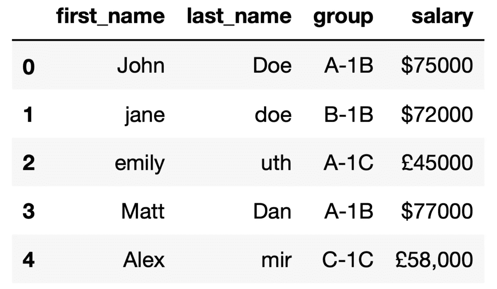
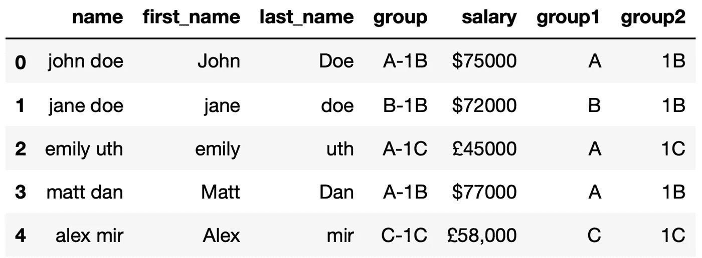
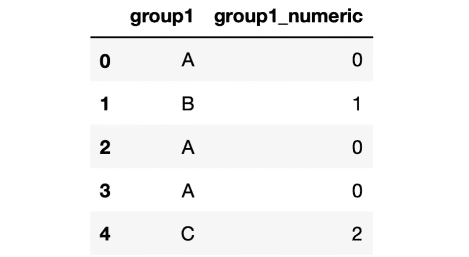
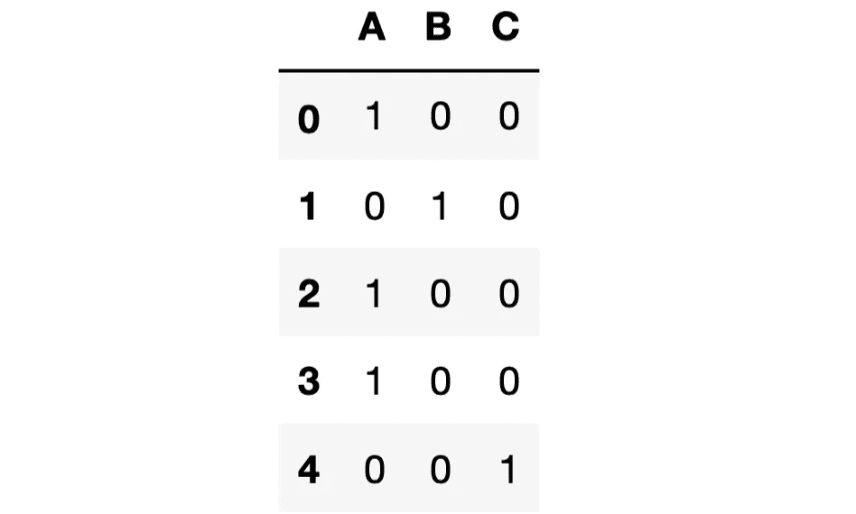

# 如果您处理文本数据，请学习这些 Pandas 方法

> 原文：<https://towardsdatascience.com/if-you-work-with-textual-data-learn-these-pandas-methods-3f224122ebaf>

## 文本数据比数字携带更多的信息


乌列尔·索伯兰斯在 [Unsplash](https://unsplash.com/s/photos/textual?utm_source=unsplash&utm_medium=referral&utm_content=creditCopyText) 上拍摄的照片

尽管我喜欢与数字打交道，但文本数据仍然存在于我的工作流程中。我没有测量或分析它，但我感觉我拥有的文本数据量超过了数字数据量。

文本数据和数字数据之间最显著的区别是它们需要的清理和预处理的数量。

数字通常采用可以直接用于分析或建模的格式。如果没有，他们需要一些小的接触来准备好。

另一方面，文本数据可能有多种格式。此外，同一属性的不同观察结果可能不会以标准格式表示。

在 Python 中，文本数据被表示为字符串。字符串是一系列 unicode 字符。与其他一些编程语言不同，Python 没有字符数据类型，所以单个字符是长度为 1 的字符串。

谢天谢地，Pandas 简化并加速了文本数据的处理。在这篇文章中，我们将回顾熊猫用于这一目的的方法。

让我们首先创建一个填充了模拟文本数据的样本数据帧。

```
import pandas as pddf = pd.DataFrame({
    "first_name": ["John","jane","emily","Matt","Alex"],
    "last_name": ["Doe","doe","uth","Dan","mir"],
    "group": ["A-1B","B-1B","A-1C","A-1B","C-1C"],
    "salary": ["$75000","$72000","£45000","$77000","£58,000"]
})df
```



df(作者图片)

## 字符串数据类型

默认情况下，字符串以“对象”数据类型存储。这可能会导致一些缺点，因为非字符串数据也可以用这种数据类型存储。因此，在 Pandas 版本中，引入了一种新的字符串数据类型:“string type**”。**

到目前为止，使用“StringDtype”是可选的，但将来可能会要求这样做。

> Pandas 字符串方法可以通过 str 访问器来访问。

## 裂开

一个字符串可能包含多条信息。例如，典型的地址显示街道、城市和州的信息。在我们的模拟数据帧中，group 列由两部分组成，并用连字符连接。如果我们想在两个单独的列中表示组，我们可以拆分它。

```
df["group"].str.split("-")**# output**
0    [A, 1B]
1    [B, 1B]
2    [A, 1C]
3    [A, 1B]
4    [C, 1C]
Name: group, dtype: object
```

输出值是包含拆分后创建的每个项目的列表。我们可以使用 expand 参数创建单独的列。

```
df["group"].str.split("-", expand=True)**# output** **0   1** 0    A  1B
1    B  1B
2    A  1C
3    A  1B
4    C  1C
Name: group, dtype: object
```

现在输出是一个 DataFrame，所以我们可以用它来创建新的列。

```
df["group1"] = df["group"].str.split("-", expand=True)[0]
df["group2"] = df["group"].str.split("-", expand=True)[1]df
```


df(作者图片)

## 结合

就像我们拆分字符串一样，我们有时也需要组合它们。让我们创建一个包含名字和姓氏的姓名列。我们有两个选择:

*   Cat 方法
*   +运算符

```
**# method 1**
df["first_name"].str.cat(df["last_name"], sep=" ")**# method 2**
df["first_name"] + " " + df["last_name"]**# output of both 1 and 2**
0     John Doe
1     jane doe
2    emily uth
3     Matt Dan
4     Alex mir
dtype: object
```

这里需要注意的一点是，这些列中的字符是大小写混合的。Python 认为“doe”和“Doe”不是一回事。因此，在组合它们之前，我们需要将它们全部变成小写或大写。另一种选择是将它们大写，这意味着只有第一个字母是大写的。

```
**# lowercase**
df["first_name"].str.lower() + " " + df["last_name"].str.lower()**# output**
0     john doe
1     jane doe
2    emily uth
3     matt dan
4     alex mir
dtype: object----------------------------------------------------------------
**# capitalize** df["first_name"].str.capitalize() + " " + df["last_name"].str.capitalize()**# output**
0     John Doe
1     Jane Doe
2    Emily Uth
3     Matt Dan
4     Alex Mir
dtype: object
```

我们可以使用上面的输出来创建一个新的列。我希望 name 列是第一列，所以我将使用 insert 函数，该函数允许在特定位置创建一列。

```
name = df["first_name"].str.lower() + " " + df["last_name"].str.lower()df.insert(0, "name", name)df
```



df(作者图片)

## 索引

我们有时需要从字符串中提取数字数据。薪水栏是这种情况的典型例子。我们需要的是去掉货币符号和逗号。

我们已经提到字符串是字符序列，所以我们可以使用索引来访问字符。由于货币符号是第一个字符，我们可以通过选择从第二个字符开始的字符来删除它们。

```
df["salary"].str[1:]**# output**
0     75000
1     72000
2     45000
3     77000
4    58,000
Name: salary, dtype: object
```

在其中一个值中，逗号被用作千位分隔符。我们可以使用 replace 方法删除它。

```
df["salary"].str[1:].str.replace(",","")**# output**
0     75000
1     72000
2     45000
3     77000
4     58000
Name: salary, dtype: object
```

逗号已被空字符串替换，这相当于删除了它。我们在上面的例子中看到的另一个很酷的事情是，多个字符串操作可以在一个步骤中完成。

如果我们想使用这些清理后的薪水值来创建一个数字列，我们还需要更改它的数据类型。让我们一步到位。

```
df["salary_numeric"] = df["salary"].str[1:].str.replace(",","").astype("int")df.dtypes**# output**
name              object
first_name        object
last_name         object
group             object
salary            object
group1            object
group2            object
salary_numeric     int64
dtype: object
```

## 编码分类值

我们已经清理了字符串列，但如果我们要在机器学习模型中使用它们，这可能还不够。一些算法不接受字符串值，所以我们需要通过标签编码或一键编码将它们转换成数值。

标签编码只是用数字替换字符串。让我们对“group1”列执行标签编码。我们可以手动用数字替换数值，但这是一项繁琐的工作。此外，不同值的数量很大，因此这种方法肯定不实用。

更好的选择是将该列的数据类型更改为 category，然后使用类别代码。

```
df["group1"] = df["group1"].astype("category")df["group1_numeric"] = df['group1'].cat.codesdf[["group1", "group1_numeric"]]
```



(图片由作者提供)

每个类别由一个数字代替。然而，除非在类别之间存在层次，否则标签编码不适用于某些算法。在上面的例子中，类别 C 可能被赋予更高的重要性。

在这种情况下，我们应该进行一次性编码，这意味着为每个不同的值创建一个新列。get_dummies 函数可用于对一列或多列进行一次性编码。

```
pd.get_dummies(df["group1"])
```



一键编码(图片由作者提供)

“group1”列中的值是 A，然后 A 列中的值变成 1，依此类推。

*你可以成为* [*媒介会员*](https://sonery.medium.com/membership) *解锁我的全部写作权限，外加其余媒介。如果你已经是了，别忘了订阅*<https://sonery.medium.com/subscribe>**如果你想在我发表新文章时收到电子邮件。**

*<https://sonery.medium.com/membership>  

感谢您的阅读。如果您有任何反馈，请告诉我。*