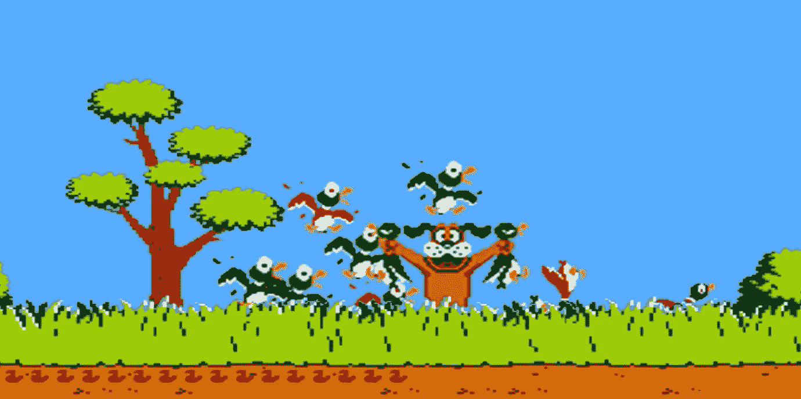
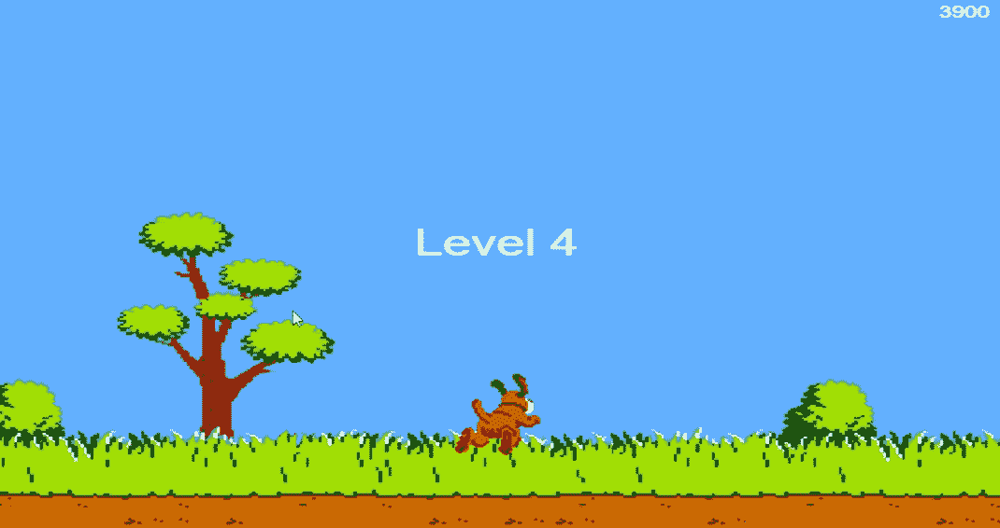

# 用 OpenCV 破坏猎鸭——初学者的图像分析

> 原文：<https://towardsdatascience.com/image-analysis-for-beginners-destroying-duck-hunt-with-opencv-e19a27fd8b6>

## 编写代码，将击败每一个鸭子狩猎高分



让我们让这只狗工作吧！(图片由作者提供)

猎鸭辛苦；让我们写一些代码，甚至不需要触摸我们的鼠标就可以获得高分！我们将应用一些 OpenCV 技术来分析我们的屏幕，搜索鸭子并通过点击它们来拍摄它们。它每秒钟会这样做很多次，所以不要指望再看到那只狗嘲笑你了！

在这篇文章的结尾，你将能够在不接触鼠标的情况下击败你自己的游戏的高分。点击查看最终结果[。](https://www.youtube.com/watch?v=__wGNbPZzvE)


怪物杀死:我们每帧拍摄多只鸟！(图片由作者提供)

## 系列

本文是关于 OpenCV 图像处理系列的一部分。查看其他文章:

*   [*读取图像、视频、屏幕和网络摄像头*](https://mikehuls.medium.com/image-analysis-for-beginners-how-to-read-images-video-webcam-and-screen-3778e26760e2)
*   [*检测和模糊人脸*](https://mikehuls.medium.com/image-analysis-for-beginners-detect-and-blur-faces-with-a-simple-function-60ba60753487)
*   *用模板匹配破坏猎鸭(📍你在这里！)*
*   [*创建运动检测器*](https://mikehuls.medium.com/image-analysis-for-beginners-creating-a-motion-detector-with-opencv-4ca6faba4b42)
*   *检测没有 AI 的形状(在建；即将推出)*
*   *从图像中检测和读取文本*(正在建设中；即将推出)

# 猎鸟

很明显我们不是在玩原来的游戏。那需要用 [NES Zapper](https://www.google.com/search?q=nes+zapper) 来演奏。我们将会玩一个在线版本，在这个版本中我们只需要点击鸟就可以了。我们的目标如下:

1.  记录我们的屏幕，以便我们可以分析帧
2.  预处理帧并找到一只鸟
3.  如果发现一只鸟:移动鼠标到那个位置并点击

首先，我们安装我们的依赖项，这很简单:

```
pip install opencv-python pillow
```

我们的进口看起来像这样:

```
import math
import cv2
import numpy as np
from PIL import ImageGrab
```

</why-is-python-so-slow-and-how-to-speed-it-up-485b5a84154e>  

## 1.记录我们的屏幕

在这方面，我们将从我们的功能，可以找到并拍摄鸟类(完整的代码可在底部)。

在前几行中，我们定义了几个常量。在第 4–7 行，我们指定了我们想要记录的屏幕部分。我们将这个边界框传递给第 19 行的 ImageGrab 方法；这将在这些坐标上“截屏”我们的屏幕。请注意，这是一个 BGR 格式的图像，而不是 RGB。更多在 [**这篇文章**](https://mikehuls.medium.com/image-analysis-for-beginners-how-to-read-images-video-webcam-and-screen-3778e26760e2) 讲的是为什么，我们只要记住最后要换算就行了。

接下来，我们定义模板，如下图所示:


鸭子的眼睛；我们代码的模板(图片由作者提供)

这是鸟眼大部分时间的样子(除非是水平飞行，我们后面会看到)。最重要的是，鸟的眼睛看起来不一样，当他们死了，所以我们不要浪费弹药射击已经被击中的鸟。我们还提取模板的高度和宽度以备后用。

在第 13 行，我们开始记录我们的屏幕。我们不需要每一帧都搜索鸟(每秒超过 30 次，取决于你的硬件)。因此，我们每隔 5 帧才执行一次代码(第 15-17 行)，这对那些讨厌的鸟来说已经足够快了。

<https://medium.com/geekculture/applying-python-multiprocessing-in-2-lines-of-code-3ced521bac8f>  

## 2.预处理和模板匹配

预处理部分非常小；我们只是[转换成灰色，使执行速度更快一点](https://mikehuls.medium.com/image-analysis-for-beginners-how-to-read-images-video-webcam-and-screen-3778e26760e2)。

在第 5 行，我们用`cv2.matchTemplate`方法执行实际的模板匹配。这将返回一组可能的候选项。对于下一行，我们只保留那些准确率超过 70%的候选项。接下来，我们循环遍历所有的鸟，提取坐标并使用这些坐标在上面画一个圆和一个标记

如果还有任何候选人，我们将使用第 8 行中的坐标。在这一部分，我们将在找到的模板上画一个十字标记和一个圆圈，在鸟上放一个十字准线。

剩下的代码包括将 BGR 转换为 RGB，这样我们就可以看到原始的颜色，并确保我们可以通过按 escape 退出。让我们来看看结果:


我们已经成功地找到了我们的目标，让我们锁定和加载(Gif 作者)

正如你在上面的 GIF 中看到的，模板匹配函数正在做它应该做的事情:识别鸟类并在它们身上做标记。在接下来的部分，我们将拍摄鸟类。

</docker-for-absolute-beginners-the-difference-between-an-image-and-a-container-7e07d4c0c01d>  

## 3.射鸟

在前一部分，我们已经找到了鸟和它们的 x-y 位置。在这一部分，我们只需将鼠标移动到该位置并单击。

首先，在第 3 行，我们将坐标从框架坐标转换到屏幕坐标。我们希望将鼠标移动到屏幕上的某个位置，而鸟的坐标是相对于框架的(因为我们使用了边界框，所以它是屏幕上较小的一部分)。这就是我们必须将边界框坐标添加到鸟坐标来获得屏幕坐标的原因。

从第 6 行开始，我们检查坐标是否太靠近我们之前点击的位置(在同一帧中)。这样做是因为有时模板匹配算法会在左侧仅一个像素处找到另一个匹配；我们不想两次击中同一只鸟而浪费弹药。为此，我们使用我们在顶部定义的`just_shot_coords`列表。

最后，我们设置光标位置并点击 ctypes 库。

</cython-for-absolute-beginners-30x-faster-code-in-two-simple-steps-bbb6c10d06ad>  

# 最终结果

我们去打猎吧！在下面的 gif 中，你可以看到我们工作算法的一个小亮点。我已经把整个 2 分钟的游戏放在 YouTube 上了。检查一下 [**这里**](https://www.youtube.com/watch?v=__wGNbPZzvE) (原谅可怕的游戏声音)或者 [**这里**](https://www.youtube.com/watch?v=5msRyIneNj0) 我调整了一些参数以拍得更快。



# 结论

在本系列的这一部分中，我们已经了解了模板匹配；一个非常方便的功能，可以让你在图片中搜索图片。一路上，我们学到了很多关于使用边框和抓取屏幕，颜色转换和限制执行“每 x 帧一次”的知识。

> 别忘了查看本系列的[其他文章](https://mikehuls.com/articles?tags=opencv)！

如果你有建议/澄清，请评论，以便我可以改进这篇文章。同时，请查看我的 [**关于各种编程相关主题的其他文章**](https://www.mikehuls.com) ，例如:

*   [绝对初学者如何用 Python 做数据库连接](https://mikehuls.medium.com/how-to-make-a-database-connection-in-python-for-absolute-beginners-e2bfd8e4e52)
*   [Python 中的高级多任务处理:应用线程池和进程池并进行基准测试](https://mikehuls.medium.com/advanced-multi-tasking-in-python-applying-and-benchmarking-threadpools-and-processpools-90452e0f7d40)
*   [编写自己的 C 扩展来加速 Python x100](https://mikehuls.medium.com/write-your-own-c-extension-to-speed-up-python-x100-626bb9d166e7)
*   [cyt hon 入门:如何用 Python 执行>每秒 17 亿次计算](https://mikehuls.medium.com/getting-started-with-cython-how-to-perform-1-7-billion-calculations-per-second-in-python-b83374cfcf77)
*   [用 FastAPI 用 5 行代码创建一个快速自动归档、可维护且易于使用的 Python API](https://mikehuls.medium.com/create-a-fast-auto-documented-maintainable-and-easy-to-use-python-api-in-5-lines-of-code-with-4e574c00f70e)
*   [创建并发布你自己的 Python 包](https://mikehuls.medium.com/create-and-publish-your-own-python-package-ea45bee41cdc)
*   [创建您的定制私有 Python 包，您可以从您的 Git 库 PIP 安装该包](https://mikehuls.medium.com/create-your-custom-python-package-that-you-can-pip-install-from-your-git-repository-f90465867893)
*   [面向绝对初学者的虚拟环境——什么是虚拟环境以及如何创建虚拟环境(+示例)](https://mikehuls.medium.com/virtual-environments-for-absolute-beginners-what-is-it-and-how-to-create-one-examples-a48da8982d4b)
*   [通过简单的升级大大提高您的数据库插入速度](https://mikehuls.medium.com/dramatically-improve-your-database-inserts-with-a-simple-upgrade-6dfa672f1424)

编码快乐！

—迈克

页（page 的缩写）学生:比如我正在做的事情？[跟着我！](https://mikehuls.medium.com/membership)

<https://mikehuls.medium.com/membership> 