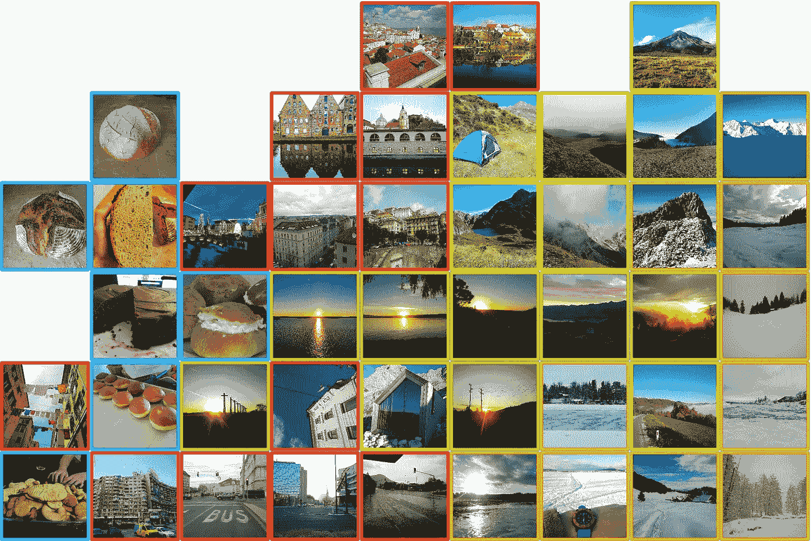
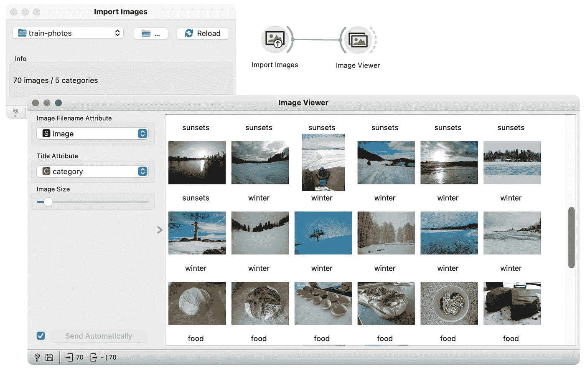
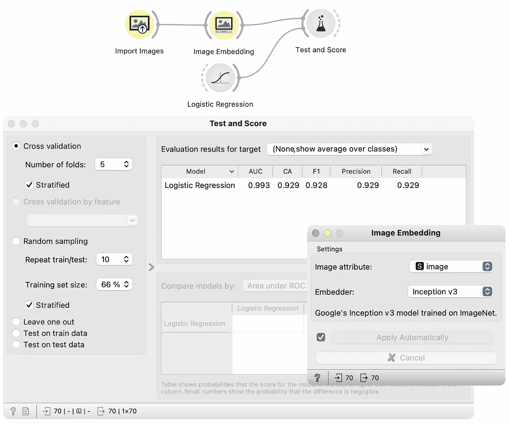
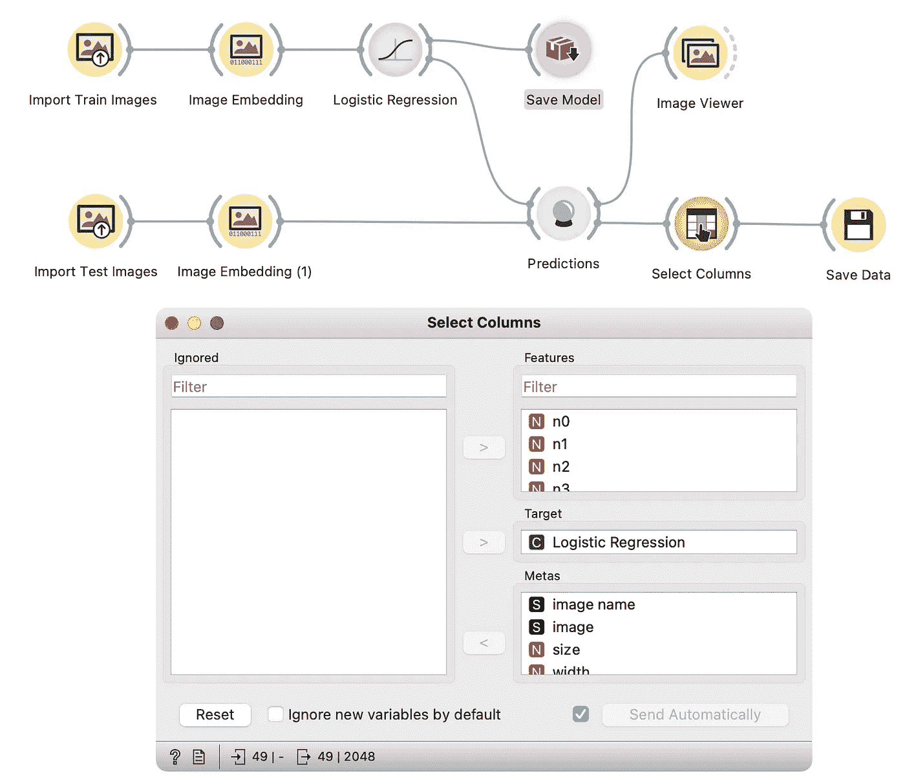

# 面向所有人的图像分析:图像分类

> 原文：<https://towardsdatascience.com/image-analytics-for-everyone-image-classification-a6e542fd07f2>

## 用分类编辑照片集

在过去的几年里，我拍了很多照片，但是没有时间编辑这些照片。我想根据类别将它们分类到子文件夹中。机器学习算法和图像嵌入能解决我的问题吗？

本文将展示一种识别照片类别和对子文件夹中的图像进行排序的方法。我们将使用名为分类的监督方法。

作者图片

## 什么是监督方法？

监督方法使用一个模型，该模型根据为特定输出标记的输入数据进行训练。该模型被训练以检测输入数据和输出标签之间的关系，从而能够预测以前未见过的数据的标签。

两种最著名的监督方法是分类和回归。在本文中，我们将了解分类。

## 什么是分类？

分类是预测每个数据点的类别(也称为类别)的过程。分类模型是从输入变量映射到一个可用类的映射函数。分类模型通常在一组已经标记的数据点上训练。

例如，在我们的例子中，分类模型预测测试数据集中每个图像的类别。我们将在已经标记的图像上训练我们的模型——训练数据集。

在下面的例子中，我们使用了最常见的分类模型之一，即[逻辑回归](https://en.wikipedia.org/wiki/Logistic_regression)，您不需要详细了解它。不过，如果你很好奇，你可以在这篇文章中了解更多关于[的信息。](/logistic-regression-detailed-overview-46c4da4303bc)

## 示例:用橙色进行图像分类

如前所述，我想对图像进行分类，将它们放入电脑的子文件夹中。为此，我将训练一个分类模型，用类别标记图像。

为了训练模型，我需要一组已经标记的图像。我们可以通过为每个类别选择几个例子并将其分类到子文件夹中来准备它们。好消息是，我们只需要制作一次训练集，以后可以重用它。

我用 5 个子文件夹中的图片准备了一个训练数据集。文件夹被命名为:城市，食物，山脉，日落和冬天。文件夹的名称定义了类别。一旦我在这些图像上训练模型，它将总是将图像分类到那些类别中。你可以从[这里](https://github.com/PrimozGodec/datasets/blob/master/image-analytics-collection/train-photos.zip)下载我的训练数据集。

在演示中，我将使用 Orange——我最喜欢的数据分析工具。在我之前的文章中阅读更多关于橙色的内容。

## 模型训练和评估

我将首先测试模型的准确性和可靠性。

导入图像会从电脑上的文件夹中载入照片。图像查看器显示具有所选属性的图像——在我的例子中是类别。(图片由作者提供)

[导入图片](https://orangedatamining.com/widget-catalog/image-analytics/importimages/)小工具从训练数据集中加载图片([下载训练数据](https://github.com/PrimozGodec/datasets/raw/master/image-analytics-collection/train-photos.zip))。由于图像被分类在多个文件夹中，小工具将文件夹名称作为一个类别分配给图像，我们可以在图片下方的[图像查看器](https://orangedatamining.com/widget-catalog/image-analytics/imageviewer/)中看到。

图像嵌入将向量表示分配给图像，并且测试和评分小部件在训练数据(作者的图像)上测试逻辑回归模型

我用 Inception v3 嵌入器在图像嵌入小部件中嵌入图像，将图像转换成适合分类的向量表示。在我之前的文章中阅读更多关于[图像嵌入的内容。](/image-analytics-for-everyone-image-embeddings-with-orange-7f0b91fa2ca2)

我在[测试和评分小部件](https://orangedatamining.com/widget-catalog/evaluate/testandscore)中执行交叉验证，以查看模型在训练图像上的准确性(类别已知)。交叉验证建立多个模型，使得每个训练图像被用作一次测试图像来测量准确度。我用的模型是逻辑回归。

我对这个模型感到满意，它的 AUC 为 0.993，分类精度为 0.929，这意味着该模型对 92%的图像进行了正确分类。注意，数据集还包括一些可分为多个类别的边界图像。例如，我有一些日落的照片，也可以是自然的照片，这意味着一些错误的分类可能实际上并不是错误。

## 用逻辑回归进行类别预测

我测试了逻辑回归，发现它在前面部分足够准确。现在，我可以训练我将用来标记未标记的训练图像的模型。

我在上面分支中的标记训练数据上训练逻辑回归模型，并使用该模型对看不见的和未标记的测试数据进行预测(图片由作者提供)

我在顶部分支中标记的训练图像上训练逻辑回归模型(与前一部分中使用的数据相同)。你可以看到我直接将图像嵌入连接到逻辑回归小部件。这样，模型就可以根据提供的数据进行训练。

在底部的分支中，我加载了没有我想要分类的已知类别的测试图像，并用 Inception-v3 嵌入器将它们嵌入，与训练图像一样。我使用的图片你可以从[这里](https://github.com/PrimozGodec/datasets/blob/master/image-analytics-collection/test-photos.zip)下载。[预测小工具](https://orangedatamining.com/widget-catalog/evaluate/predictions)根据之前训练的逻辑回归模型给图像分配标签。

我使用[图像浏览器](https://orangedatamining.com/widget-catalog/image-analytics/imageviewer)来检查分配给图像的类别。他们似乎是有意义的，正确的。

现在我们已经对图像进行了分类，我们使用保存图像小部件将它们保存到文件夹结构中，这样每个文件夹就是一个类别。

保存一个模型并将图片分类到电脑中(图片由作者提供)

由于预测小部件将预测(名为逻辑回归的列)作为元数据放置到数据表中，因此我们需要首先使用选择列小部件将属性设置为目标——保存图像小部件使用目标列作为子文件夹名称。[保存图像小工具](https://orangedatamining.com/widget-catalog/image-analytics/saveimages/)将根据预测的类别将图像分类到子文件夹中。

我们还将[保存模型小部件](https://orangedatamining.com/widget-catalog/model/savemodel)连接到逻辑回归。通过这种方式，模型被保存起来以备后用，并且可以被重用。

## 结论

我们展示了一种可以在各种任务中使用的监督分析图像的方法。图像分类需要额外的工作来准备训练数据集，这导致了识别类别的自动管道，并且可以在未来多次使用。

要了解更多关于 Orange 中的图像分析，[观看教程视频](https://youtube.com/playlist?list=PLmNPvQr9Tf-aRstY69vGAPO_c5RaceBhN)或阅读 Orange 网站上的博客:[图像分析:聚类](https://orangedatamining.com/blog/2017/04/03/image-analytics-clustering/%5D)，[莫奈和马奈的聚类](https://orangedatamining.com/blog/2018/05/09/clustering-of-monet-and-manet/)，以及[交通标志中的离群值](https://orangedatamining.com/blog/2017/04/25/outliers-in-traffic-signs/)。

如果你还没有阅读，请不要忘记阅读我的人人图像分析系列的第一篇博客。

</image-analytics-for-everyone-image-embeddings-with-orange-7f0b91fa2ca2>  

## 文学

1.  demar，Janez，等,《橙色:Python 中的数据挖掘工具箱》。*机器学习研究杂志*，2013，14.1:2349–2353。
2.  Godec，Primo 等人通过深度模型和小规模机器学习的集成，通过可视化编程实现了图像分析的民主化。*自然通讯*，2019，10.1:1–7。
3.  逻辑回归。纽约:斯普林格出版社，2002 年。
4.  西蒙扬，卡伦；安德鲁·塞斯曼。用于大规模图像识别的非常深的卷积网络。 *arXiv 预印本 arXiv:1409.1556* ，2014 年。
5.  重新思考计算机视觉的盗梦空间架构。发表于:*IEEE 计算机视觉和模式识别会议论文集*。2016.第 2818–2826 页。

## 我的其他文章

</keyword-extraction-methods-the-overview-35557350f8bb>  </documents-embeddings-and-text-classification-without-coding-e274b4e191e9>  </graph-embeddings-the-summary-cc6075aba007> 