# 基于卷积神经网络的图像分类

> 原文：<https://towardsdatascience.com/image-classification-with-convolutional-neural-networks-12a7b4fb4c91>

## 用于图像分类的卷积和卷积神经网络综合指南，从 Python 和 TensorFlow 的实现到优化和转移学习技术

在我之前的文章中，我们学习了神经网络的基础知识

</neural-networks-fundamentals-80aa045504bd>  

是时候了解卷积神经网络及其在图像分类中的用途了。

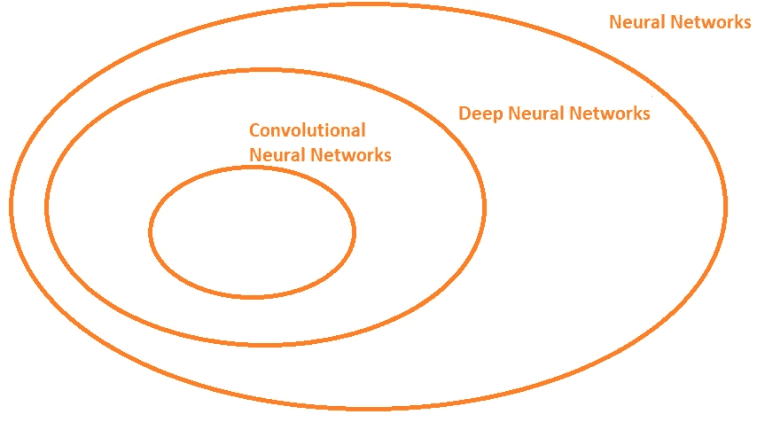

作者图片

**什么是卷积？**

卷积运算是用具有恒定大小的“窗口”移动图像，并将图像像素与卷积窗口相乘以获得输出图像的过程。让我们看看下面的例子:

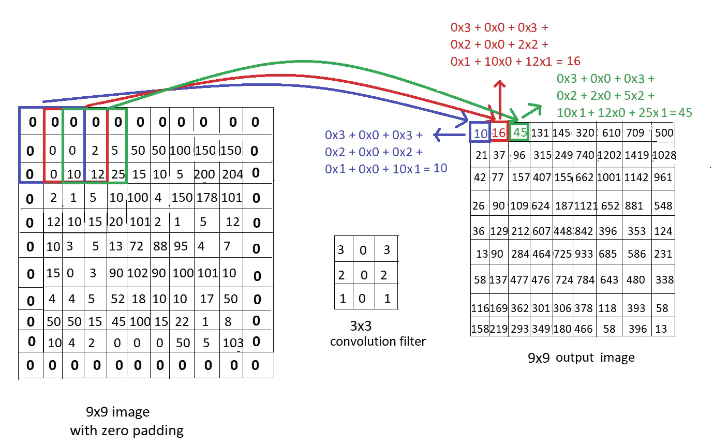

作者图片

我们看到一个 9×9 的图像和一个 3×3 的卷积滤波器，其恒定权重为 3 0 3 2 0 2 1 0 1，以及卷积运算的计算。尝试使用如下图所示的滤镜浏览图像，并更好地理解如何通过卷积计算输出图像的这些像素。

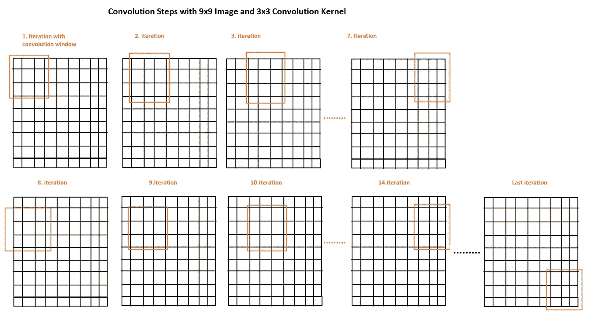

作者图片

*   **、**滤镜**、**内核**、**遮罩**是提及“卷积滤镜”的不同方式，我们也将在整篇文章中使用这些术语。**

****填充****

**填充是在我们的输入图像边界上添加额外像素的过程，主要是为了保持输出图像的大小与输入图像相同。最常见的填充技术是加零(称为 ***零填充*** )。**

****跨步****

**步幅是我们用卷积窗遍历图像时每次迭代的步长。在下面的例子中，我们实际上看到步长是 1，所以我们将窗口移动了 1。现在让我们看另一个例子，以便更好地理解水平步幅= 1，垂直步幅= 2:**

**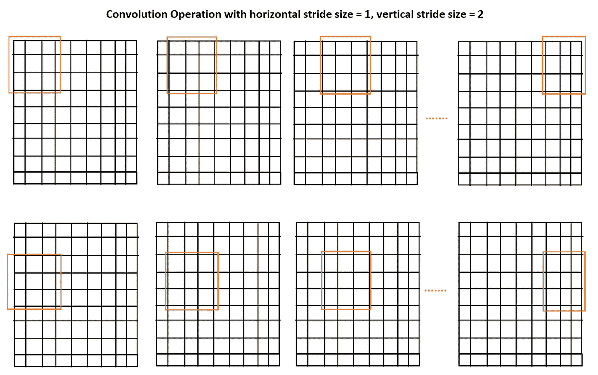**

**作者图片**

*   **因此，填充尺寸、步幅尺寸、滤波器尺寸和输入尺寸影响输出图像尺寸，并且根据这些不同参数的输出图像尺寸的公式如下:**

**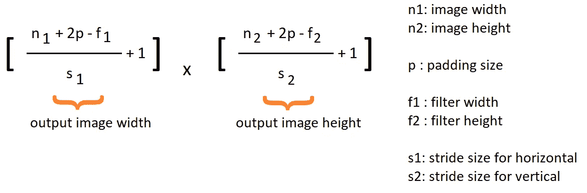**

**作者图片**

**到目前为止，我们只研究了应用于输入图像的 1 个卷积运算，现在让我们来看看什么是卷积神经网络以及我们如何训练它们。**

****卷积神经网络(CNN)****

**如果我们将层作为卷积窗口，**其中窗口中的每个像素实际上是一个权重**(而不是我们在之前的</neural-networks-fundamentals-80aa045504bd>**文章中学习的完全连接的神经网络)，它是一个卷积神经网络，我们的目标是训练模型以在最后以最小的成本更新这些权重。因此，与前面的例子相反，我们的卷积滤波器中没有任何常量值，但是**这些是我们的权重，我们应该让模型为它们找到最佳值**。****

****换句话说，与 [**图像处理**](/image-processing-part-2-1fb84931364a) 相反，在[**图像处理中，我们将这些卷积运算用于特定的滤波器(在卷积滤波器中具有特殊的和已知的权重)，在卷积神经网络的卷积层中，我们的窗口具有一些随机的、不重要的权重，并且我们在模型训练步骤中更新它们，以获得使我们的损失最小化的最佳权重。(因此它们不是图像处理术语中的常数**](/image-processing-part-2-1fb84931364a)****

****所以一个简单的 CNN 无非是如下一些卷积运算的序列:****

****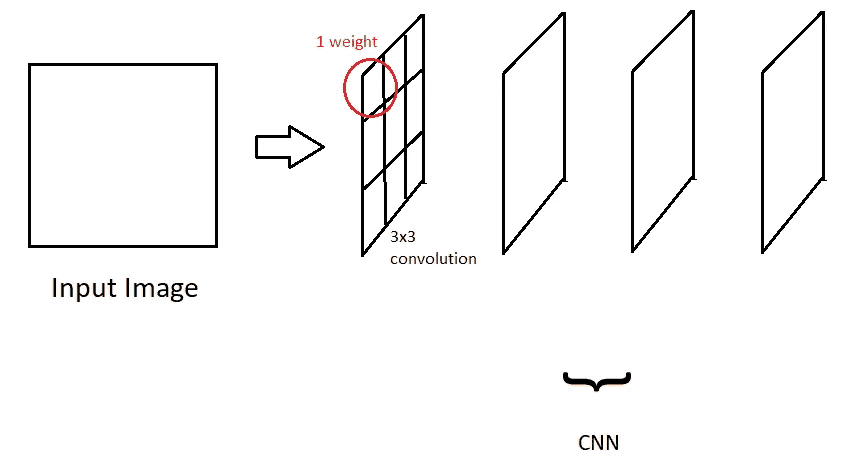****

****作者图片****

******用 CNN 进行图像分类******

****但是如何利用 CNN 实现图像分类呢？****

****我们在之前的</neural-networks-fundamentals-80aa045504bd>**中看到了训练过程如何更新回归或分类模型权重。图像分类的唯一区别是，现在我们处理的是图像，而不是结构化数据，如房价、房间号等。******

******每个卷积运算都参与**提取图像特征**，如耳朵、脚、狗嘴等。这个特征提取步骤随着更深的卷积层而变得更深，而在第一层，我们只获得图像的一些边缘。******

****要了解更多关于应用**边缘检测**的不同卷积滤波器的信息，请参考本文 **:******

****</image-processing-part-2-1fb84931364a>  

所以卷积层承担了提取重要特征的责任，最后要有一个完整的图像分类模型，我们只需要一些**全连通的输出节点**就可以根据它们的权重决定图像的正确类别！

让我们假设我们有一个狗和猫类的图像分类问题。在这种情况下，在训练结束时，一些输出节点将表示狗类要素和一些猫类要素。如果通过这些卷积层的输入图像在我们的激活函数结束时给予代表节点的狗类更高的输入，则这些节点的总和将给予狗类输出节点更高的结果。否则，它就是一个 cat 类输出节点。让我们想象一下这个过程:

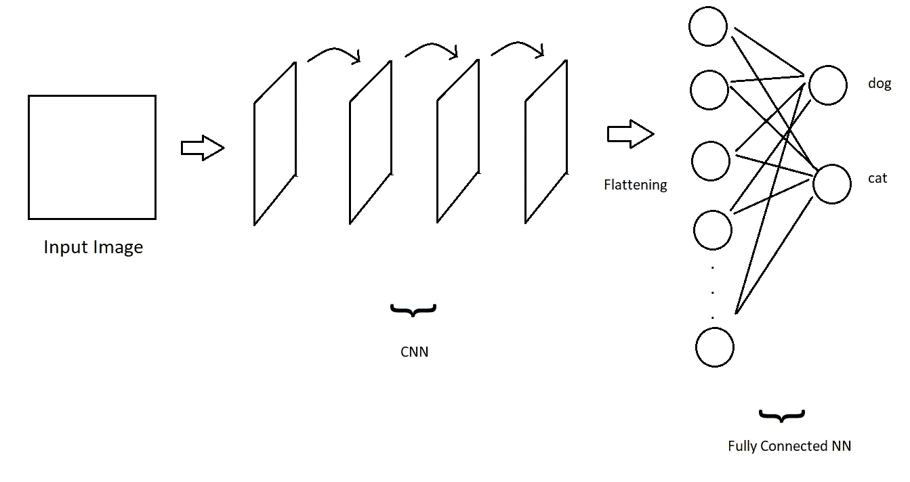

作者图片

我们看到拼图的所有碎片都聚集在一起 **CNN +全连接神经网络创建了一个图像分类模型**！

在介绍用于图像分类的常见 CNN 架构之前，让我们先来看一些更复杂、更真实的 CNN 示例:

*   当我们谈到 CNN 层的时候，我们不是说 1 层只有 1 个卷积核；实际上，**多个卷积核创建一个卷积层**。因此，我们将所有这些卷积滤波器一个接一个地应用于输入图像，然后进入下一个卷积层。**1 卷积层中卷积核的个数决定了 3。我们图层的尺寸**就像一个图像的“通道尺寸”。

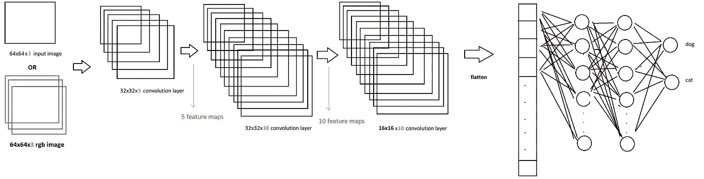

作者图片

*   我们学习了如何在应用卷积运算后计算输出图像大小，现在您应该知道卷积层的**通道大小直接是输出通道大小**，因为我们应用 1 个卷积运算来获得 1 个输出图像。**因此，如果 CNN 层内部有 5 个卷积核，我们在这一层的末尾获得 5 个输出核。**
*   如果我们处理 RGB 图像，我们有 3 个通道，而灰度图像只有 1 个通道。在这种情况下，我们将 1 个卷积核应用 3 次，每个通道 1 乘 1，以获得输出通道。因此，输出图像的通道大小不会改变，但卷积层的参数总数会改变。1 个 CNN 层的参数总数计算如下:

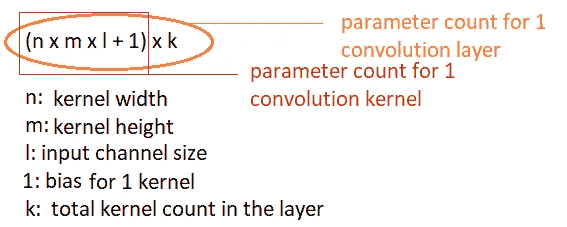

作者图片

因此，对于前面的例子，我们可以说 n=64 m=64 l=1 k=32。

**联营**

这是在图像分类 CNN 架构中使用的另一个重要术语。这是一种用来减少 CNN 模型参数的方法。我相信你已经发现(使用上面提到的公式),我们讨论的大量参数是如何与具有超过 5-10 个卷积滤波器的几个 CNN 层相关的。因此，一次一次地减少参数的数量，并从特征图中仅选择**最重要的特征(输出图来自每个卷积层)。正如我们之前所说，更深的卷积层具有更具体的特征)是重要的。共有两种常见的池类型:**

*   最大池化

基本思想是再次使用一个窗口，此时没有任何权重，并且在遍历要素地图时，选择最大像素值作为输出。

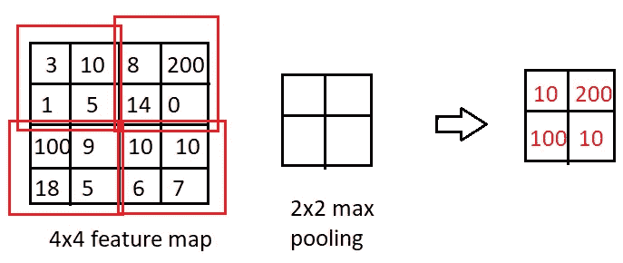

作者图片

我们使用相同的公式来计算我前面提到的卷积运算的最大池的输出映射大小。**重要的一点是，因为目标是减少参数大小，所以给定填充大小= 0，步长大小=池内核的大小是一个合理的**和常见的方法，就像我们在本例中所做的那样。

*   **平均统筹**

我们不是从最大像素计算输出，而是从停留在池内核中的像素的平均值计算输出。

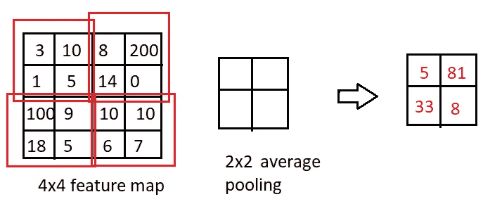

作者图片

**常见的卷积神经网络架构**

ImageNet 大规模视觉识别挑战赛( **ILSVRC** )多年来一直是一项非常受欢迎的比赛。我们将考察不同年份的一些获胜者。这些是用于图像分类任务的最常见的架构，因为它们在竞赛年与其他模型相比具有更高的性能。

ImageNet 是一个数据集，具有针对 **1000 个类别**的 **1，281，167 幅训练图像**、 **50，000 幅验证图像**和 **100，000 幅测试图像**。

*验证数据集*:除了用于任何模型的训练步骤的训练数据集和在训练步骤完成后用于测试模型以计算模型精度-性能的测试图像之外，它是模型以前没有见过的数据，即在训练阶段不参与反向传播-权重更新阶段，而是用于测试以便真实地跟踪训练阶段的进展。

*   AlexNet (2012 年)

该模型由 8 层组成，具有**5-卷积**和 **3 全连接**。

针对 RGB 输入图像实施(3 通道)

包含 6000 万个参数

ImageNet 测试数据集的最终误差为 15.3%

**ReLU 激活**功能首次用于该型号。除了最后一个全连接层具有 **Softmax 激活**功能外，ReLu 用作整个模型的激活功能

使用比率为 0.5 的**脱扣**机构。

**动量随机梯度下降**用于动量= 0.9，批量= 128

使用标准偏差= 0.01，用**零均值高斯分布**初始化权重

偏差初始化为常数值 1。

学习率被初始化为 0.01，并且“**权重衰减正则化**被应用为 0.0005

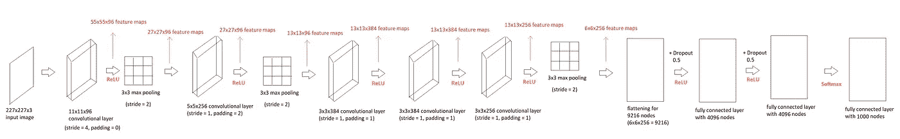

作者图片

在上图中，我们看到了 AlexNet 架构，输出特征映射了每一步的大小，当然，我们有 1000 个完全连接的层节点，因为 ImageNet 数据集有 1000 个类。

对于这种架构，我们还会遇到一些我之前没有提到的术语:

*带动量的梯度下降:*这是对梯度下降计算的优化，我们将之前梯度下降的导数添加到我们的梯度下降计算中。对于这种架构，我们将这一额外部分乘以动量超参数 0.9。

*高斯分布的权重初始化:*在开始训练模型之前，有不同的方法来初始化我们的权重。例如，将所有权重设为 0 是一种方法，但却是一种糟糕的方法！取而代之的是，根据高斯分布初始化所有权重是一种常用的方法。我们只需要选择分布的平均值和标准偏差，**我们的权重将在这个分布范围内**。

*权重衰减优化*:在本文中使用 SGD(随机梯度下降)的情况下，这与 L2 正则化是一样的！

*   VGG16 (2014 年)

VGG 架构是一个 16 层模型，具有 13 个卷积和 3 个全连接。

它有 1.38 亿个参数

在测试数据集上有 7.5%的误差

**与 AlexNet** 相反，每个卷积层中的所有内核使用相同的大小。那是 3x3 内核，步幅= 1，填充= 1。对于跨度= 2 的 2x2 内核的最大池

**类似于 AlexNet** ，ReLu 用于隐藏层，Softmax 用于输出层。动量为 0.9 的 SGD，衰减参数为 0.00005 的权重衰减正则化，初始学习率为 0.01，使用高斯分布的权重初始化。

作为 AlexNet 的一个**小区别，VGG16 架构使用 batch size = 256，初始化 bias，不是 1 而是 0，输入图像大小为 224x224x3。**

有一个更新的版本叫做 VGG19，总共有 19 层。

*   ResNet (2015 年)

该架构的名称来自**残差块**，其中残差块是“**相同输入**”和“**卷积和激活函数**后的输出”的组合。

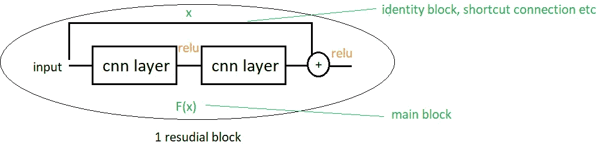

作者图片

ResNet 的不同版本具有不同的层数，如 Resnet18、Resnet34、Resnet50、Resnet101 和 Resnet152。在下图中，我们看到左侧是一个“正常”的 18 层架构，右侧是残余块版本。红线表示相同的块和主块具有相同的尺寸，因此它们可以直接组合，蓝线表示尺寸不同，因此相同的层应该添加零填充，或者在使用兼容的填充(步长大小)用 1x1 卷积内核调整大小之后添加。

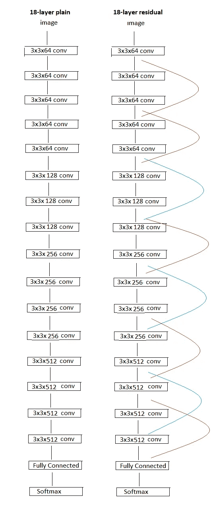

作者图片

ResNet152 对于测试数据集实现了%3.57 的误差，并且它具有 58M 的参数。当我们将参数大小和小误差与以前的架构进行比较时，这已经很不错了，对吗？**** 

****除了可训练参数的数量，每秒 FLOPS ( **浮点运算****)是一个重要因素。让我们比较一下到目前为止我们检查过的模型:******

******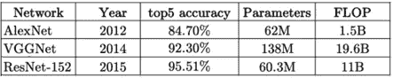******

******作者图片******

******如果你想考察更多类型的卷积神经网络，我建议你搜索 **Inception** 、 **SeNet** (2017 年 ILSVRC 获奖者)、以及 **MobileNet** 。******

****现在该是我们用 VGG16 配合 Python 和 Tensorflow 应用图像分类的时候了！****

## ****VGG 建筑从无到有****

****这是用 Python 和 Tensorflow 实现的 VGG16。让我们稍微检查一下代码****

*   ****首先，我们检查我们的 TensorFlow-Cuda-Cudnn 安装是否正常，以及 TensorFlow 是否能找到我们的 **GPU** 。因为如果不是这样，这意味着有一个**包冲突**或一个我们应该解决的错误**，因为用 CPU 进行模型训练太慢了，几乎不可能**。****
*   ****然后，我们使用用于卷积层的 **Conv2D** 函数、用于最大池层的 **MaxPool2D** 函数、 **Flatten** 函数来创建 VGG16 模型，以使 CNN 输出能够传递到全连接层的平坦输入、 **Dense** 函数用于全连接层、 **Dropout** 函数用于在最后的全连接层之间添加 Dropout 优化。你可以看到，我们应该添加**权重初始化，偏差初始化，l2 正则化** 1 乘 1 到层，同时使用相关的层函数。注意，正态分布是高斯分布的同义词，所以当看到 weight _ initializer = TF . keras . initializer . randomnormal(mean = 0.0，stddev=0.01，seed=None)时，不要让您的思维混乱****
*   ****我将用 2 个类来测试这个模型，而不是用 1000 个类来处理非常庞大的 ImageNet 数据集，因此我将输出层从 1000 个节点更改为 **2 个节点******
*   ****使用 **ImageGenerator** 函数和 **flow_from_directory()** ，我们将数据集准备为能够与 TensorFlow 模型一起工作的向量。我们在这里也给出了批量大小。(由于我的计算机内存不足，我可以给出批量大小 16，而不是论文中提到的 256。) **shuffle** 参数意味着数据集将在每个历元之前被打乱，以使批次不那么恒定****
*   ******model.compile()** 函数是训练我们的模型之前的最后一部分。我们确定使用哪个优化器(带动量的 SGD)，哪个损失函数(二进制交叉熵，因为在我们的例子中我们有 2 个类)，以及使用哪个度量来计算训练期间的性能(二进制准确度)。****
*   ****我使用 **model.fit()** 函数来训练我们的模型。我添加了一些选项，比如“**提前停止**”和“**模型检查点**”回调。如果验证损失在 10 个时期内没有增加，则第一个停止训练，并且如果验证损失比前一个时期好，则模型检查点不仅在结束时而且在训练期间保存我们的模型。****
*   ******CustomLearningRateScheduler**是我手动实现的学习率调度器，用于应用“如果验证精度停止提高，我们通过除以 10 来更新学习率”****
*   ****在培训结束时，我将验证和培训数据集的准确性和损失图表可视化。****
*   ****最后一部分是用测试数据集测试模型。我们检查是否有名为“trained_model.h5”的已训练模型，如果没有，我们训练一个模型，如果有，我们使用这个模型来测试性能****

****我想解释一下我在解释我的代码时使用的一些附加术语:****

*   *****验证—训练准确性*:验证准确性是一个衡量我们的模型在验证数据集上表现如何的指标。它只是检查在验证数据集中有多少图像预测为真。我们也对训练数据集进行同样的检查。但这只是针对我们的监控模型，只有列车损失用于梯度下降计算****
*   *****迭代—历元* : 1 次迭代是对一批中的所有图像进行建模的过程。历元是指为我们训练数据集中的所有图像提供模型的过程。例如，如果我们有 100 个图像，并且我们的批量大小= 10，则 1 个时期将有 10 次迭代。****
*   *****拉平:*这只不过是重塑我们的 CNN 输出，使其具有 1D 输入，这是从卷积层传递到全连接层的唯一方式。****

****现在让我们检查结果****

****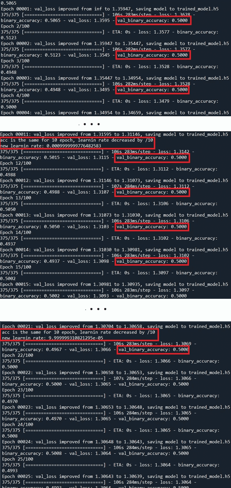****

****作者图片****

****即使我们通过监控验证精度来改变学习率，结果也不好，验证精度也没有提高。但是为什么它不像 VGG16 论文中那样直接工作呢？****

1.  ****在原始论文中，我们讨论了 374 个时期的 1000 个输出类和 1500000 个图像。不幸的是，我使用这个数据集并为 1000 个类训练一个模型需要几天时间，所以正如我之前所说，我为 2 个类使用了一个数据集，并将输出层更改为具有 2 个输出节点。****
2.  ****模型架构和数据集都需要不同的优化，因此一个运行良好的模型可能不适用于另一个数据集。****
3.  ******微调**超参数以改进您的模型与了解如何首先构建模型一样重要。您可能已经注意到我们需要微调的超参数数量****

*   ****权重和偏差初始化****
*   ****损失函数选择****
*   ****初始学习率选择****
*   ****优化器选择(梯度下降法)****
*   ****是否使用辍学****
*   ****数据扩充(如果您没有足够的图像，或者图像过于相似，您希望获得相同图像的不同版本)****

****诸如此类…****

****但是在你对如何优化如此多的变量感到悲观之前，我想提两个要点。****

1.  ******转移学习******

****这是一个非常重要的方法，我们使用一个**预训练模型**用我们自己的数据集来训练它。在我们的例子中，我们不会只使用 VGG16 架构，而是使用已经用 VGG16 架构和 ImageNet 数据集训练过的模型，我们将使用比 ImageNet 小得多的数据集重新训练它。这种方法为我们提供了并非未知的开始——一些随机的权重但是一些已经意味着一些特征。我们的数据集可能包含不同的对象，但不同对象之间有基本的共同特征，如边缘、圆形，为什么不使用它们而不是从头开始呢？我们将看到这种方法如何减少耗时并提高我们的精度性能。****

****2.当我查看我们的输出时，我看到问题是**不是因为模型停止学习，而是因为它没有开始学习**！精度从 0.5 开始，永远不变！那个特定的结果给了我们一个非常明确的信息:我们应该**降低学习率**让模型开始学习。请记住，学习率是学习的步长，我们的权重会受到每次迭代的梯度下降计算的影响。如果这个比率太大，步长太大，以至于我们不能控制权重更新，所以模型不能学习任何东西，它只会变得混乱。****

****以下代码仅包括迁移学习的更改，其中我采用了具有预训练权重 Tensorflow 内置模型和较低学习率(0.001)的模型****

****让我们来看看结果:****

****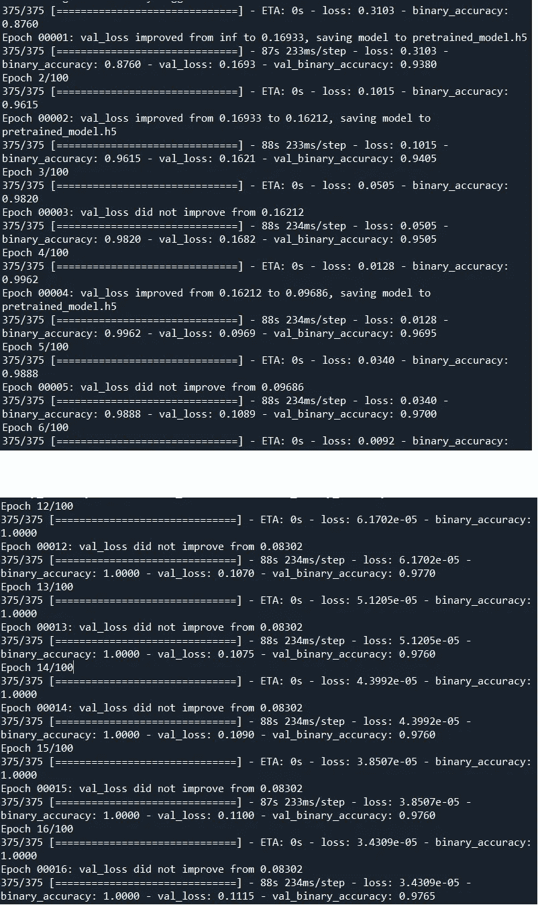****

****作者图片****

****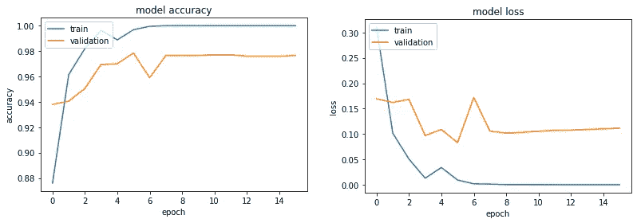****

****作者图片****

****性能有了很大的提高，对吗？！我们看到，验证精度不再停滞不前，并增加到 0.97，而训练精度达到 1.00。测试准确度的最终检查:****

****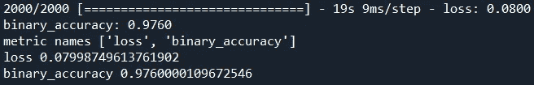****

****作者图片****

****一切似乎都很好！****

****我想和你们分享我做的一些实验和它们的结果:****

****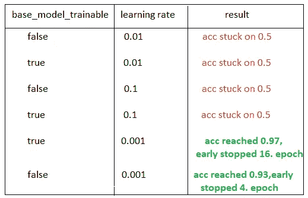****

****作者图片****

****现在，我们可以做如下分析:****

*   ****如果我们的学习速度不一致，迁移学习本身仍然是不够的。****
*   ****如果我们将 base _ model _ trainable 变量设置为 False，这意味着我们不训练我们采用的模型，我们只训练我们添加的最后一个完全连接的层。(VGG 有 1000 个输出，所以我使用 include_top = False 上传了没有最后密集层的模型，我在这个预训练模型的末尾添加了一个密集层，如代码中所示)如果我们不更新这些权重，我们会得到比 base _ model _ trainable = True 选项稍差的结果。从 4 点停止训练开始就更快了。虽然是时代。****
*   ****只是为了看看，我改变了 vgg_from_scratch 实现的学习速率，但是验证 acc 仍然停留在 0.5，所以仅仅学习速率优化本身也是不够的。(至少如果你没有几天的时间在微调之后从头训练一个模型。)****

****你可以通过这个 [**链接**](https://drive.google.com/drive/folders/1vt8HiybDroEMCvpdGQJx2T50Co4nZNYe?usp=sharing) 到达我使用的数据集，请不要忘记把它和你的代码放在同一个文件夹里，如下所示。当然，h 和日志文件将在培训完成后提供！🌼):****

****我用 Python=3.7，Tensorflow=2.2.0，Cuda=10.1，Cudnn=7.6.5 的 Anaconda，用 GPU 来训练和测试我的模型。如果您不熟悉这些术语，这里有一个快速教程:****

*   ******从[https://www.anaconda.com/products/individual](https://www.anaconda.com/products/individual)下载 Anaconda** (请为您的电脑选择合适的操作系统)****
*   ****打开 Anaconda 终端，使用**conda create-n im _ class python = 3.7 Anaconda**命令创建一个环境。环境术语可能是 Anaconda 最重要的属性，它允许您为不同的项目单独工作。您可以将任何包添加到您的环境中，如果您需要另一个包的另一个版本，您可以简单地创建另一个环境以避免您的另一个项目崩溃，等等。****
*   ****使用 **conda activate im_class** 命令进入到您的环境中添加更多的包(如果您忘记了这一步，您基本上不会在您的环境中而是在所有的 anaconda 空间中进行更改)****
*   ****使用 **pip 安装具有 GPU 能力的 tensorflow-gpu==2.2.0******
*   ****使用**conda install CUDA toolkit = 10.1**命令安装 CUDA 和 Cudnn****

****现在您已经准备好测试上面的代码了！****

****请注意，包版本之间的**冲突是一个很大的问题**，请只使用这些命令和上面提到的版本。这将帮助您在构建环境时花费更少的时间。****

****恭喜你。您已经完成了卷积神经网络图像分类教程。您可以尝试从头开始构建任何模型(甚至可能是您自己的模型👀)，对其进行微调，针对不同架构应用迁移学习等等。现在轮到你自己动手做一些实验了！****

****下一篇文章再见，我们将讨论✋ ✋物体识别的神经网络架构****

****</object-detection-with-convolutional-neural-networks-c9d729eedc18> **** 

****AlexNet 论文:[https://arxiv.org/ftp/arxiv/papers/1803/1803.01164.pdf](https://arxiv.org/ftp/arxiv/papers/1803/1803.01164.pdf)****

****VGG16 论文:【https://arxiv.org/pdf/1409.1556.pdf ****

****ResNet 论文:【https://arxiv.org/pdf/1512.03385.pdf ****

****ImageNet 官网，数据集和挑战:[https://www.image-net.org/download.php](https://www.image-net.org/download.php)****