# 没有数据的图像分类？

> 原文：<https://towardsdatascience.com/image-classification-with-no-data-b44089f8dc28>

## 使用较少数据的机器学习算法的理论综述

在 [Unsplash](https://unsplash.com/photos/jw3GOzxiSkw) 上由 [R. Makhecha](https://unsplash.com/@rohanmakhecha) 拍摄的照片

你想建立一个没有多少数据的机器学习模型？众所周知，机器学习需要大量数据，而收集和标注数据需要时间，而且成本高昂。这篇文章介绍了一些用更少的数据建立一个有效的图像分类器的方法！

# 目录

[简介](#5d01)

[1。转移学习](#9313)

[2。利用未标记的数据](#3bc2)

[3。少数镜头学习](#0652)

[4。弱监督学习和基于文本的零触发分类器](#6a3a)

[结论](#c771)

[参考文献](#6405)

# 介绍

训练机器学习模型总是需要数据的。庞大的数据集对于构建强大的管道、避免过度拟合以及很好地推广到新图像是必要的。

然而，给定一些假设，您可以极大地减少所需的数据量——不管是否带注释。本文介绍了一些在没有大量数据或标记数据的情况下进行图像分类的方法。我将介绍*迁移学习*、*自监督学习*、*半监督学习*、*主动学习*、*少镜头图像分类*、*基于文本的零镜头分类器*中最重要的几个方面。

请记住，我提出的每种方法都可以用于其他机器学习问题。

第 1 节和第 2 节介绍了用经过充分研究的方法用大约一千个带注释的样本构建分类器的方法。第 3 节和第 4 节通过热门研究主题将数据效率推向极限。

为了简洁起见，我不再谈论*数据增强*和*生成网络*。出于同样的原因，我不会深入数学或实现细节。要了解更多信息，我建议你直接阅读参考资料部分的论文。话虽如此，我们还是开始吧！

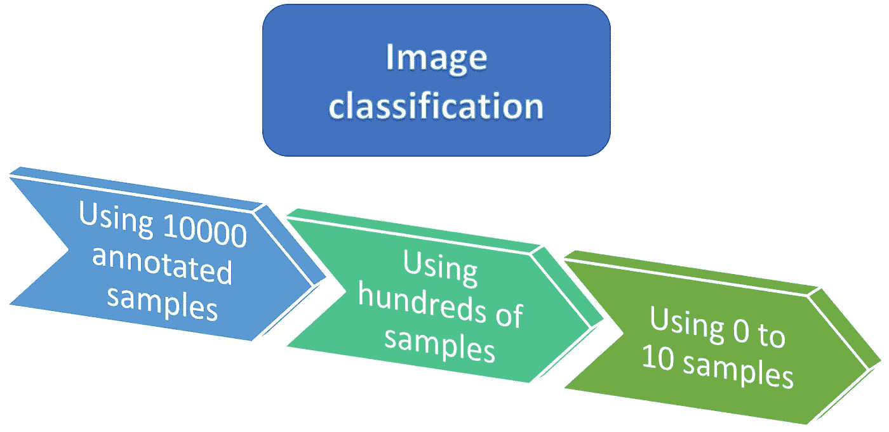

作者图片

# 迁移学习

当你从零开始训练一个深度神经网络时，你经常会随机初始化你的权重。这是初始化神经网络的最佳方式吗？答案一般是否定的。

首先，深度学习是关于表现的。在经典的机器学习中，特征需要手工制作。深度学习背后的想法是，你让你的神经网络在训练时自己学习一种特征表示。

在神经网络的每一层之间，都有一个输入数据的表示。你越深入你的神经网络，你的表现就应该越全面。通常，已知分类器神经网络的第一层能够检测颜色和边缘的斑点。中间层将第一层表示作为输入来计算比第一层更复杂的概念。例如，他们可能会发现猫眼或狗耳的存在。最后一层给出了图像来自每个类的概率。

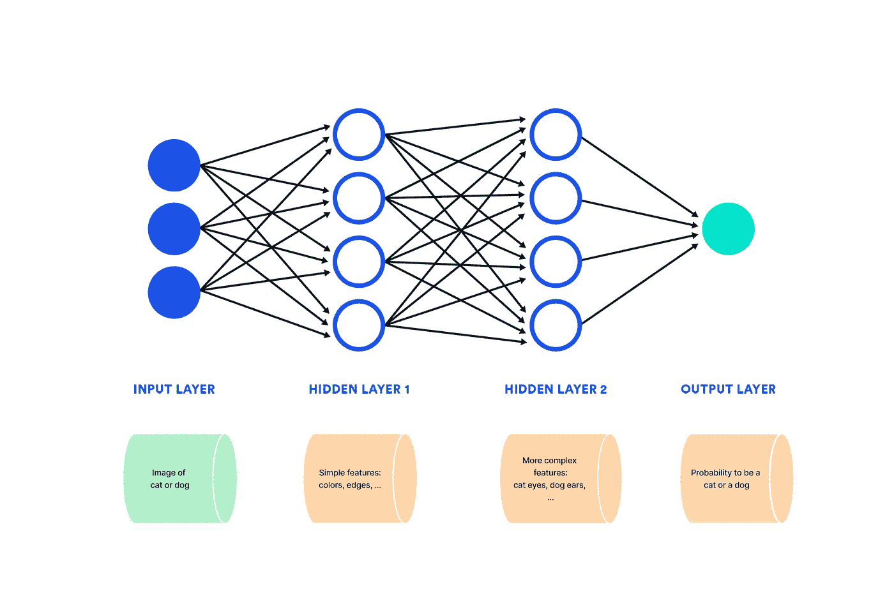

深层特征表现——作者的形象

*迁移学习* [ [1](#47d7) 背后的想法是，从另一个分类任务中学到的一些表征可能对你的任务有用。*迁移学习*是将预先训练好的网络的第一层用于另一项任务，在其上添加新层，并在感兴趣的数据集上微调整个网络。

相比之下，如果你的目标是学会赢得足球比赛，*转移学习*将包括首先学会打篮球，以适应移动你的身体，锻炼你的耐力，等等。，才开始玩足球游戏。

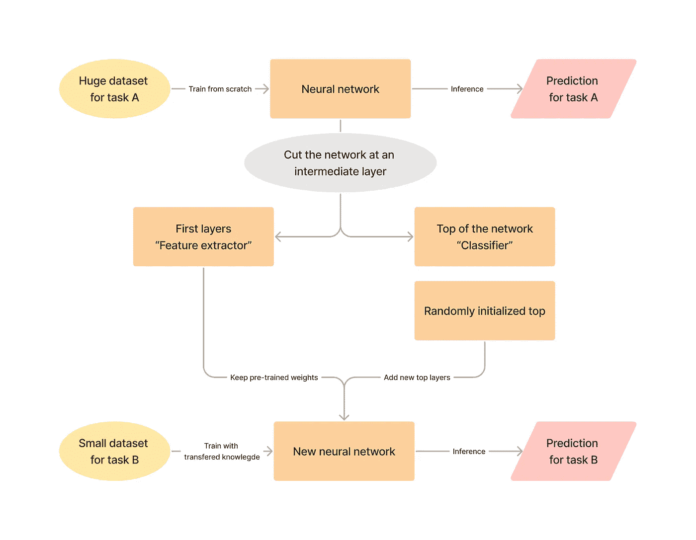

转移学习管道—图片由作者提供

它将如何影响最终网络的性能？你应该在哪里切断你预先训练的网络？这些问题在[ [1](#47d7) 中有详细阐述。

总结一下最重要的观点:

*   神经网络的第一层非常一般，而最深层是预训练任务中最专业的。因此，你可以预期，如果你的预训练任务接近你的目标任务，那么保持更多的层将更有益。
*   在中间层进行切割通常会导致性能下降。这是由于通过微调在中间层获得了脆弱的平衡。
*   使用预先训练的权重总是比使用随机初始化的权重更好。这是因为，通过先在另一项任务上进行训练，你的模型学会了用其他方法学不到的特性。
*   当重新训练这些预训练的权重时，可以获得更好的性能-最终对它们使用较低的学习速率，或者在几个时期后解冻它们。

# 利用未标记的数据

与已标记的数据相比，未标记的数据通常更容易访问。不利用这一点就太浪费了！

## 自我监督学习

*自我监督学习* [ [2](#d398) ]解决了从未标记数据中学习深度特征的问题。在训练了一个自我监督的模型之后，可以像在*迁移学习*中一样使用特征提取器，所以你仍然需要一些带注释的数据来微调。

那么，如何从未标记的数据中训练深度特征提取器呢？总之，你需要一个足够难的借口任务，使你能够为你的分类任务学习有趣的特征。

例如，如果你想在不玩真实游戏的情况下赢得足球比赛，你可以尽可能多地训练玩杂耍球。玩杂耍球会提高你的控球技术，这在玩游戏时会派上用场。

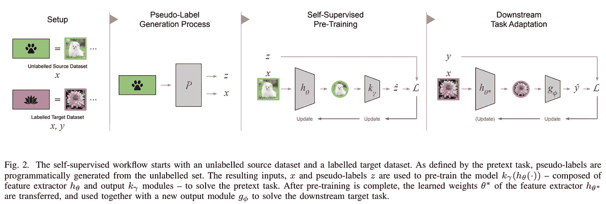

自我监督学习管道[ [2](#d398)

借口任务的一个例子是预测图像的旋转角度。基本上，对于每个图像，你应用一个旋转 *z* 来得到旋转后的图像 *x* 。然后你训练一个神经网络从 *x 预测*z**这个旋转预测任务迫使你的网络深入理解你的数据。事实上，要预测一幅狗的图像的旋转，你的网络首先需要了解图像中有一只狗，并且一只狗应该以特定的方式定向。

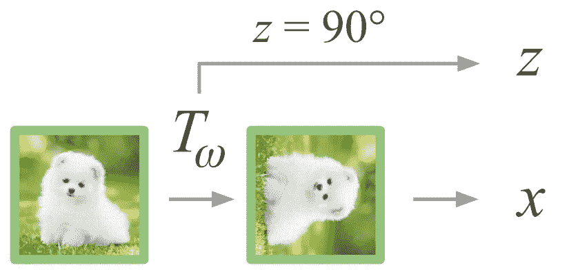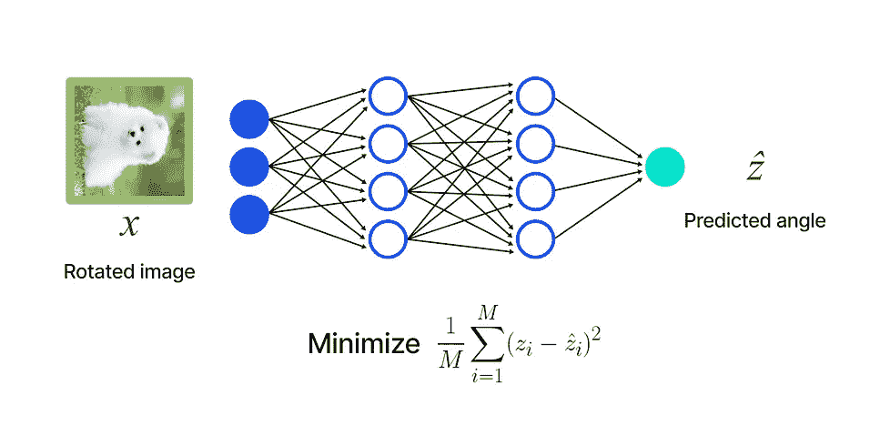

托辞任务示例:旋转变换预测—(左)[ [2](#d398) ] |(右)作者图片

借口任务可以根据你的具体目标有很大的不同。常用的借口任务包括:

*   变换预测:数据集中的样本被变换修改，您的网络学习预测该变换。
*   屏蔽预测:输入图像的随机正方形被屏蔽，网络必须预测图像的屏蔽部分。
*   实例辨别:学习一种分离所有数据样本的表示法。例如，每个数据点可以被认为是一个类，并且可以在这个任务上训练一个分类器。

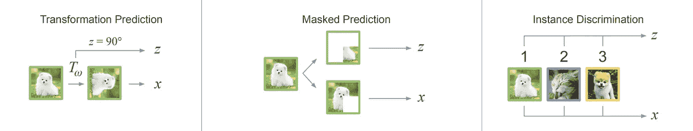

自我监督借口任务的示例[ [2](#d398)

## 半监督学习

*半监督学习* [ [4](#c211) ]非常类似于*自监督学习*，因为它也涉及到拥有一个小的带注释的数据集以及一个大的未标记的数据集。根据你所取的定义，*自监督学习*可以看作是*半监督学习*的一个特例。然而，在更严格的定义中，*半监督学习*在于直接利用未标记的数据作为训练样本，而不是作为学习有意义特征的方法。

最流行的做*半监督学习*的方式是*自学* [ [3](#fda4) 。基本上，您在已标记的数据上训练基线，在未标记的数据上推断以获得伪标签，仅保留具有最高置信度的伪标签，并在已标记和剩余伪标记数据的联合上训练。

换句话说，*自我训练*在于根据标记数据训练一个模型，然后这个第一个模型成为学生模型的老师。然后，学生模型可以成为老师，等等。至于迭代次数，通常情况下，一两次迭代就足够让你的度量最大化了。

继续与赢得足球比赛进行比较，*半监督学习*就是你观看足球比赛的录像，教练分析每场比赛。

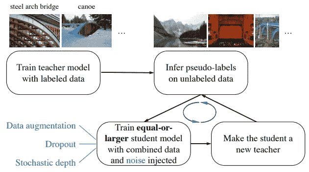

带自我训练的半监督学习[ [3](#fda4)

*半监督学习*和*自我监督学习*比*迁移学习*更有效。这仅仅是因为*半监督*或*自监督*设置中的数据更接近目标任务。尽管如此，在*半监督*和*自我监督*之间并没有明显的赢家。

## 主动学习

上面介绍的所有方法都假设您已经注释了一些数据，并且您不能或不想注释更多的数据。*主动学习* [ [5](#7989) ]给你一套规则，让你选择标注哪些数据，以最少的标注样本获得最好的结果。

要注释哪些数据？答案是相当自然的:您应该总是为您的模型注释硬样本。这样，您就迫使您的模型学习更精确的特征来识别您的类。

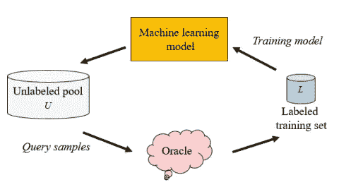

用主动学习进行注解。“先知”是一个人类注释者。

在学习赢得足球比赛时，经典训练集中在你的缺陷上。假设你是前锋，你会希望掌握控球，达到良好的身体爆发力，并有很大的投篮能力。这些都要掌握，而不是直接打游戏，最有效率的方法就是一个一个的训练每个技能，先把重点放在自己最差的技能上。

所以现在，你会问如何确定这些“硬样本”。这就是事情变得复杂的地方。一个简单的基线是随机标记一小部分数据，在此基础上训练一个模型，在此基础上进行推断，并标注那些你最没有信心的数据。但是，因为大型网络通常过于自信，所以通常建议估计不确定性，而不是直接使用神经网络的输出。为了得到不确定性估计，你可以使用*高斯过程*或者*贝叶斯网络*作为例子。

# 少量学习，将数据效率推向极限

*少量学习*是从很少的样本中学习。典型的数量级是每类 1 到 20 个样本。虽然深度学习通常需要至少数千个样本，但*少量学习*解决了根本没有数据的问题。这个领域目前是一个热门的研究课题，所以你可能不想马上投入生产。

它是如何工作的？怎么能从这么少的数据中学会分类呢？执行*少镜头图像分类*的方法有很多种。我将只介绍其中的几个，主要是那些对研究有最重要影响的。

## 基础设置:公制学习和质子

还记得我说过深度学习都是关于表象的吗？因为你只有几十个样本，你不能训练一个神经网络去理解每一类，并对其中一类图像进行分类。其思想是通过利用预先训练的特征提取器来找到到特定类的距离。可以用上面提到的任何方法来训练特征提取器。

假设每个类别只有一个图像，并且您想对一个新的未标记图像进行分类。给定一个特征提取器，您可以提取每个标记图像以及未标记图像的特征表示。如果提取的特征足够好，则从未标记图像中提取的特征应该与来自同一类别的图像的特征最相似。然后，您可以计算到每个类的距离。您可以使用神经网络或常规距离，如*余弦距离*或*均方误差*。那就是所谓的*公制学习* [ [6](#9597) ][ [7](#866f) 。

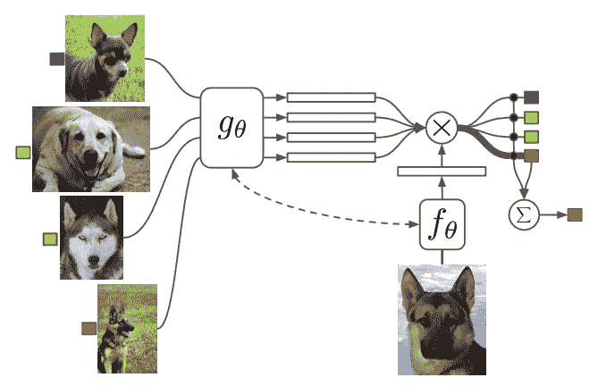

公制学习设置[ [6](#9597)

如果你每门课都有几张图像，研究论文通常会使用质子设置[ [8](#2396) ]。它包括为每个类计算一个原型。基本上，对于每个类，你用预先训练好的特征提取器计算所有的特征，并采取措施得到每个类的原型。那么一切工作就好像你只有一个图像。

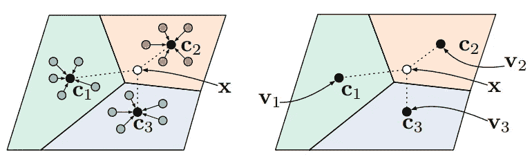

原型网络[8]

## 元学习

与*度量学习*，*元学习* [ [9](#995e) ]是一种完全不同的方式来执行*少量学习*。这里的想法是，首先，训练一个模型，以便在经过几个时期的微调后，它可以获得最佳指标。

换句话说，您希望找到最佳的权重初始化，这样您只需在几个时期内使用少量数据进行微调。为了找到最佳的初始化，使用学习模式。这就是为什么*元学习*又叫*学习学习*的原因。

这种学会学习的想法在开始时有点令人不安。足球的元学习将是你在尽可能多的运动中训练，网球、篮球、橄榄球、排球、肌肉等等。正因为如此，你现在可以适应任何不需要训练的运动，包括足球。

快速适应目标任务的元学习

让我们假设你有三个不同的任务，数据很少。 *θ** 代表每项任务的理论最佳值。经过几次微调后，你应该从哪里开始训练以获得最佳效果？元学习试图找到最佳的初始化 *θ* 以在微调后最接近所有任务的最优。

为了避免让你迷路，我就不细说数学了。我建议你阅读这篇论文，以便更好地理解它。

*元学习*的想法似乎真的很有趣，但在实践中，与其他方法相比，它没有达到良好的性能指标。此外，为了元训练您的模型，您需要几个不同的任务，这在实践中很少出现。

## 最新技术和局限性

目前排行榜上最好的模特是*P>M>F*[[10](#c5a7)。本文结合了许多其他论文，研究了全球管道各部分的影响。特征提取器是一个预先训练好的*视觉转换器*，使用*屏蔽自我监督* *方法*。然后用*质子*设置对模型*进行元训练*。为了执行特定的分类任务，需要对它进行微调。

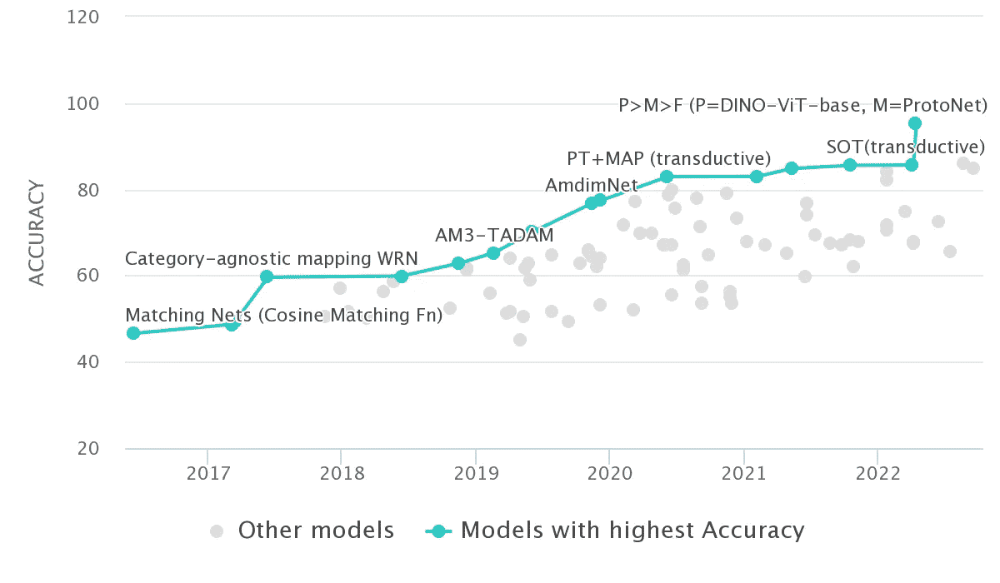

[在 Mini-Imagenet 5 路单镜头上进行代码基准测试的纸张](https://paperswithcode.com/sota/few-shot-image-classification-on-mini-2)

最好的模型达到 95%的准确率！是不是意味着我们不再需要带标签的数据了？不幸的是，目前的研究集中在不切实际的学术数据集上。基准测试通常是用少量的类(图中的基准测试中有 5 个类)来计算的，并且测试样本是从均匀分布中抽取的。这使得目前的方法在实际应用中不可靠。少镜头图像分类仍然是一个具有挑战性的领域，它肯定会随着时间的推移而改进！

# 弱监督学习和基于文本的零镜头分类器

本节呈现来自 OpenAI [ [12](#c73c) ]的片段。这种架构通过将图像和文本结合在一起，在 2021 年彻底改变了深度学习。这里，零拍摄意味着该模型能够对图像进行分类，而无需使用标记类进行专门训练。

CLIP 由两个编码器或特征提取器组成:一个用于图像，另一个用于文本。两个编码器在相同的潜在空间中分别变换图像和文本，使得能够在文本和图像之间用提取的特征的简单余弦距离进行比较。

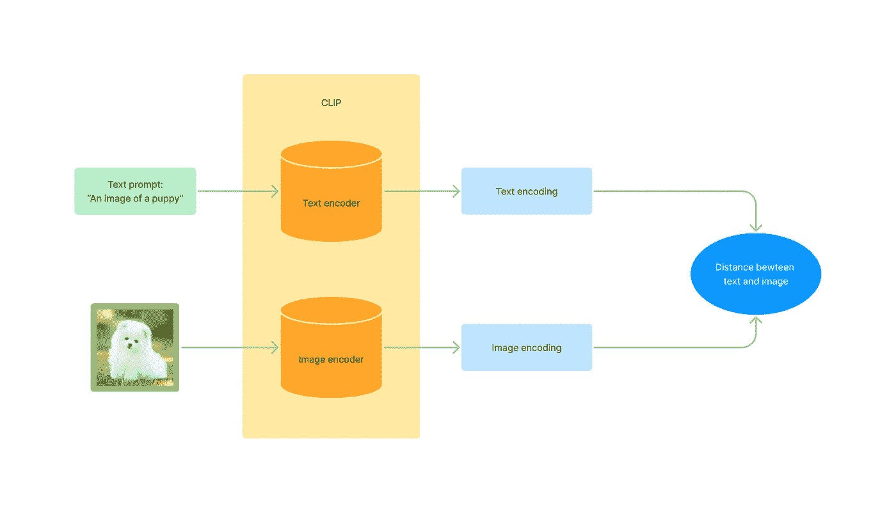

作者图片

是怎么训练出来的？使用弱监督学习来训练 CLIP。它包含了大量的噪声数据。它利用了你可以从互联网上截取的大量图片说明数据。即使来自互联网的数据极其嘈杂，但事实证明 CLIP 相当准确，具有非常强的零拍能力。

由于其大规模和嘈杂的训练数据集，CLIP 可以在不进行任何微调的情况下对常见图像进行分类，同时比经典分类器更健壮、更准确。OpenAI 在其[博客](https://openai.com/blog/clip/)上展示了一份更加准确的分析。

CLIP 有什么缺点吗？！嗯，凡事都有代价…

> 最大的 ResNet 模型 RN50x64 在 592 个 V100 GPU 上训练了 18 天，而最大的 Vision Transformer 在 256 个 V100 GPU 上训练了 12 天。

不是每个人——实际上，几乎没有人——都有能力训练如此庞大的神经网络。我甚至不会谈论训练数据集的大小。就推理而言，这完全是关于计算资源和准确性之间的权衡。CLIP 有几种较小的版本。

尽管巨大而缓慢，CLIP 可以用来生成高质量的伪标签，然后训练一个较小的网络。此外，当伪标签可用时，人工注释通常会更快，因为注释器只需在几个类之间进行选择，而不是几十或几百个类。

# 结论

研究太令人兴奋了！我发现在没有太多数据的情况下能够做得这么好简直是疯了。没有创造力，这些方法是不可能的。创造力开启了如此多的可能性！

总结一下这些想法:

*   当你有一个巨大的标注数据集接近你的目标任务时，一定要迁移学习。
*   当你有大量的未标注数据和标注数据的子集时，进行自监督学习或半监督学习。
*   如果您想高效地注释数据，请使用主动学习。
*   少镜头图像分类可以在几乎没有标注数据的情况下对图像进行分类。尽管它仍在研究中，但目前的基准是令人鼓舞的。
*   基于文本的零起点学习者在未来也可能发挥主导作用。它们可以开箱即用，不需要任何数据。

我没有在少量学习中展示*直推模型，因为我个人认为这些在实际应用中是不可用的。你可能想看看他们，因为他们曾经统治了代码为*的*报纸的排行榜。*

不要忘记查看*正则化、* *数据增强、*和*生成模型*。这些可能会更容易解决你的问题。

恭喜你。您已到达这篇文章的结尾。我希望你喜欢读它。你现在可以毫无畏惧地阅读所有的报纸了。不要犹豫评论，伸手！

# 参考

[1] J. Yosinski，J. Clune，Y. Bengio，et al .[深度神经网络中的特征有多大的可转移性？](https://arxiv.org/abs/1411.1792) (2014 年)，NIPS 2014 年

[2] L. Ericsson，H. Gouk，C. C. Loy 等.[自我监督表征学习:介绍、进展与挑战](https://arxiv.org/abs/2110.09327) (2021)，IEEE 2022

[3]谢，梁，何，等.[噪声学生自我训练改善图像网络分类](https://arxiv.org/abs/1911.04252)(2020)2020

[4] Y .奥阿利，c .胡德洛，和 m .塔米，[深度半监督学习概述](https://arxiv.org/abs/2006.05278) (2020)，arXiv 预印本 arXiv:2006.05278

[5]任平，肖，常，等.[深度主动学习综述](https://arxiv.org/abs/2009.00236) (2021)，ACM 计算综述 2022

[6] O. Vinyals，C. Blundell，T. Lillicrap 等，[一次学习的匹配网络](https://arxiv.org/abs/1606.04080) (2017)，NIPS 2016

[7]宋凤英，杨玉英，张立荣等.[学会比较:少投学习的关系网络](https://arxiv.org/abs/1711.06025)(2018)2018

[8] J. Snell，K. Swersky 和 R. S. Zemel，[用于少量学习的原型网络](https://arxiv.org/abs/1703.05175) (2017)，NIPS 2017

[9] C. Finn，P. Abbeel 和 S. Levine，[用于深度网络快速适应的模型不可知元学习](https://arxiv.org/abs/1703.03400) (2017)，ICML 2017

[10]胡世祥，李，施蒂默等，[挑战简单流水线的极限:外部数据和微调有所作为](https://arxiv.org/abs/2204.07305) (2022)，2022

[11] E. Bennequin，m .塔米，A. Toubhans，等人，[少拍图像分类基准离现实太远:用语义任务采样重建得更好](https://arxiv.org/abs/2205.05155) (2022)，CVPR 2022

[12] A .拉德福德，J. W .金，c .哈勒西等，[从自然语言监督中学习可转移的视觉模型](https://arxiv.org/abs/2103.00020) (2021)，PMLR 2021