# 用 Python 分 4 步提取图像颜色

> 原文：<https://towardsdatascience.com/image-color-extraction-with-python-in-4-steps-8d9370d9216e>

## 创建您自己独特的颜色列表

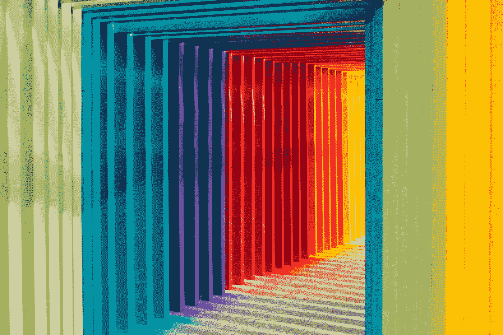

罗伯特·卡茨基在 [Unsplash](https://unsplash.com?utm_source=medium&utm_medium=referral) 上的照片

**为什么颜色很重要？**

颜色有助于在第一眼就引起人们的注意。它们有助于交流信息，例如，用红色和蓝色表示高温和低温，用绿色和红色表示财务价值。颜色在数据可视化方面也有一些好处。

使用[基本色](https://matplotlib.org/stable/gallery/color/named_colors.html)是一个很好的选择，因为它们就像批量生产的衣服一样随时可以使用并且通用。但是，有时候量身定制的颜色更适合讲故事，让作品脱颖而出。

**有哪些合适的颜色？**

互联网可以是一个很好的来源。很多网站推荐的颜色如“20XX 年的颜色”可以让你的作品看起来很时尚。

另一种颜色来源可以在你手机或相机的照片中找到。你可以给包含你想要的颜色的东西拍照，或者你可能已经有了一张你喜欢的颜色的照片。

这篇文章将指导如何从图像中提取颜色。这种方法也可以用一种有趣的方式来分析你最喜欢的照片，比如你度假时的美景或你喜欢的东西。

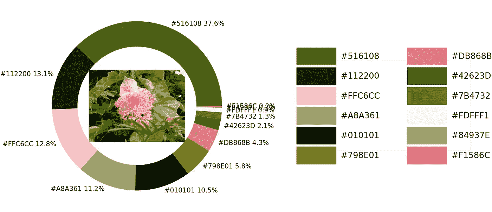

本文给出了一个图像颜色提取的结果。图片由作者提供。

总共有 4 个步骤:

*   1.选择一幅图像
*   2.导入库
*   3.创建一个函数
*   4.应用该功能

我们开始吧

## 1 选择一幅图像

从选择图像开始。比如下面我会用一张海水和椰子树的照片。


海水和椰子树的照片。图片由作者提供。

**注:**本文所有照片，除封面外，均归本人所有。我用我的设备(相机和手机)拍的。如果您想用本文中的代码测试它们的合理使用，请随意使用它们，无需征得许可。

## **2。导入库**

从 [Pillow](https://pillow.readthedocs.io/en/stable/index.html) 导入 Numpy、Panda、Matplotlib 和[图像](https://pillow.readthedocs.io/en/stable/reference/Image.html)。

接下来，让我们导入 [extcolors](https://pypi.org/project/extcolors/) 和 [rgb2hex](https://matplotlib.org/1.3.0/api/colors_api.html) 库。extcolors 库返回 [RGB](https://en.wikipedia.org/wiki/RGB_color_model) 值，这些值将被 rgb2hex 库转换成[十六进制](https://en.wikipedia.org/wiki/Web_colors)颜色代码。

如果在导入两个库时出现一些错误，您可以尝试安装一些必备的库来使它们工作。这些库在下面的代码中。删除前面的#符号！pip 并运行以安装它们。请不要删除版本号前的#符号。它们只是音符。

## 3.创建一个函数

接下来，我将一步一步地解释如何创建颜色提取函数。如果你想直接得到函数，请把分数降到**定义一个函数**。

**调整图像大小**

从准备输入图像开始。用现代相机和手机拍摄的照片太大了。有些可以拍摄超过 5000 万像素的照片(一台 [4K](https://en.wikipedia.org/wiki/4K_resolution#:~:text=That%203840%20%C3%97%202160%20works,Blu%2Dray%20UHD%20discs).) 显示器只能显示大约 830 万像素)。如果我们直接使用巨大的图像，处理可能需要一些时间。

因此，首先要做的是调整大小。下面的代码显示了如何将图片的宽度调整为 900 像素。如果图像不是很大或者你的 CPU 很快，这一步可以省略，或者可以提高输出分辨率数。请注意，调整照片大小后，新照片将保存在您的计算机上，以供下一步阅读。


调整大小后的结果。图片由作者提供。

**颜色提取**

用 extcolors 库提取颜色。我们必须设置的[参数](https://pypi.org/project/extcolors/):

*   容差:将颜色分组以限制输出并给出更好的视觉表现。从 0 到 100 分。其中 0 不会将任何颜色组合在一起，100 会将所有颜色组合在一起。
*   limit:输出中呈现的提取颜色数量的上限。

在下面的代码中，我将公差值设置为 12，并将颜色代码输出的数量限制为 11 种颜色(limit=12)。该数字可以根据您的需要进行更改。获得的结果将是 RGB 颜色代码及其出现。

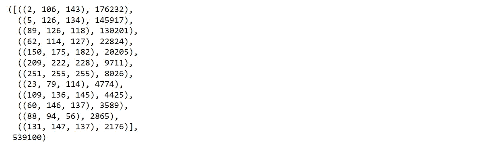

使用 [rgb2hex](https://matplotlib.org/1.3.0/api/colors_api.html) 库定义一个将 RGB 代码转换成十六进制颜色代码的函数，并创建一个数据帧。

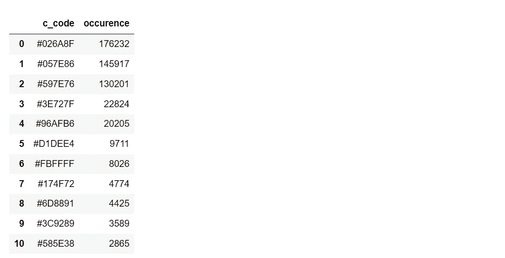

**甜甜圈图**

绘制一个环形图来可视化结果。

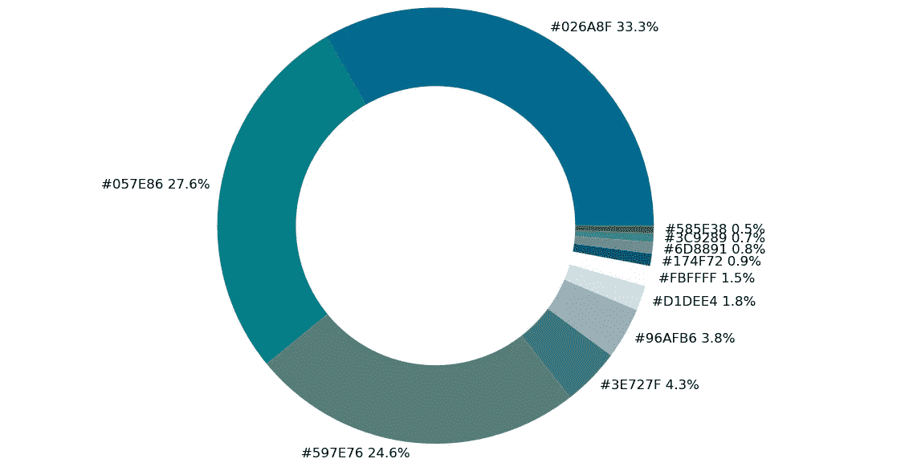

显示颜色及其在照片中所占百分比的圆环图。图片由作者提供。

**调色板**

创建一个调色板，并用十六进制颜色代码标记它们。如果提取步骤中的限制数设置为超过 12 种颜色，则可以修改 X 轴和 Y 轴值以适应该结果。

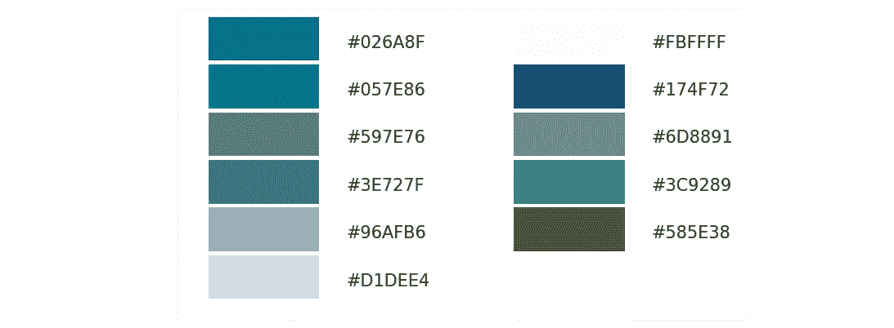

照片中的调色板。图片由作者提供。

最后，让我们结合代码。

瞧啊。！...

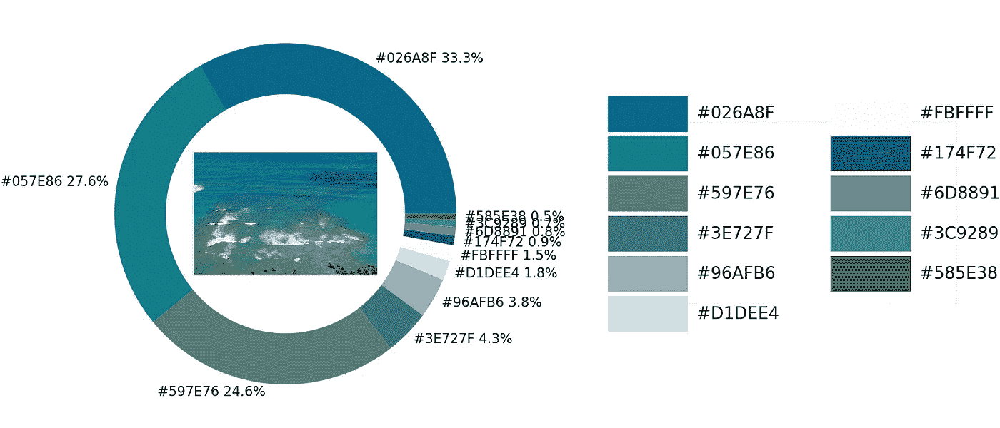

海水和椰子树照片的颜色提取结果。作者图片。

**定义一个函数**

到目前为止，我们已经完成了所有的步骤，让我们将它们结合起来，轻松地应用于其他图像。该函数适用于与 python 文件位于同一文件夹中的图像。

## 4.应用功能

解释我们必须为 exact_color 函数设置的参数:

```
exact_color('image name', resized_width, tolerance, zoom)
```

*   图像位置/名称:图像在计算机上的位置及其名称。
*   resized_width:我们想要调整的照片宽度输出。
*   容差:根据 0 到 100 的范围对颜色进行分组以限制输出。
*   缩放:在圆环图的中心调整照片的大小。

**例 1**

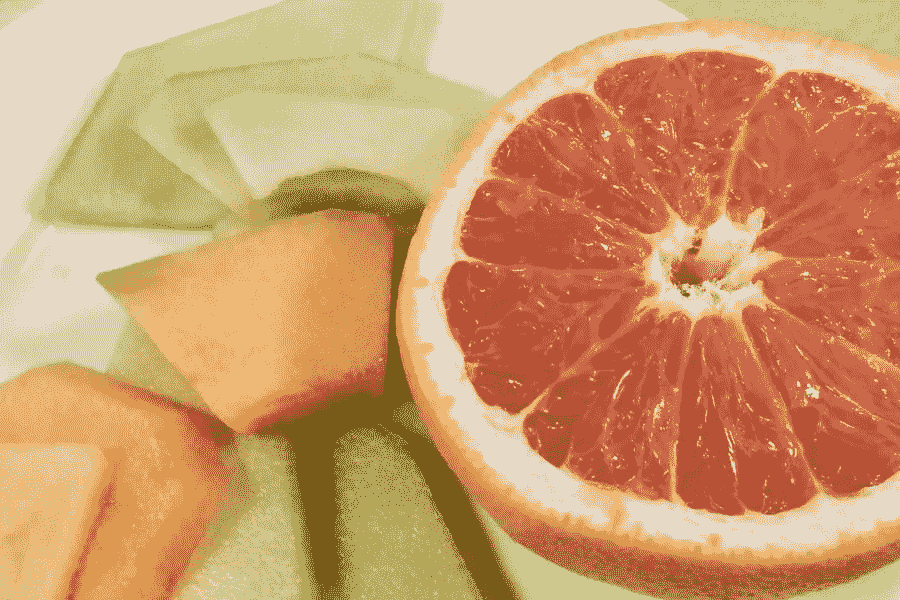

一张切好的橙子和甜瓜的照片。作者图片。

```
exact_color('example1.jpg', 900, 12, 2.5)
```

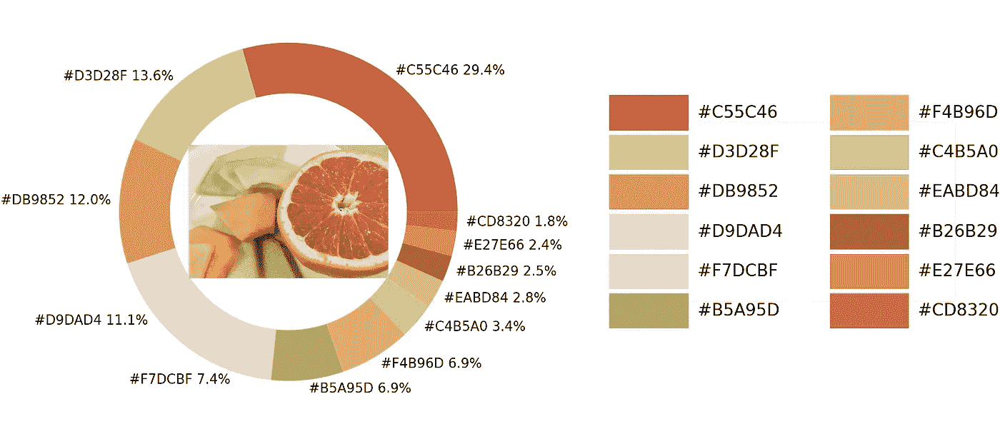

从切片的橙子和甜瓜的照片中提取颜色的结果。作者图片。

**例 2**

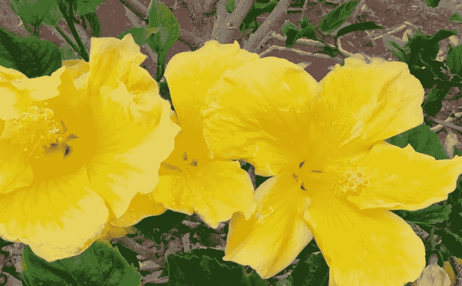

黄色[芙蓉花](https://en.wikipedia.org/wiki/Hibiscus)的照片。作者图片。

```
exact_color('example2.jpg', 900, 8, 2.5)
```

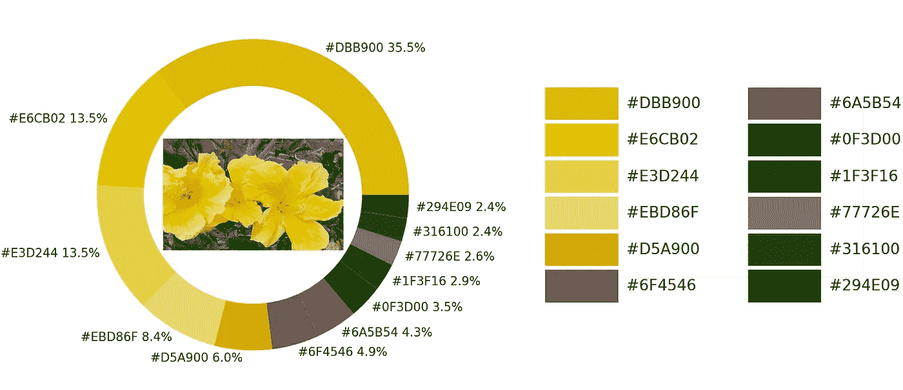

芙蓉花黄色照片的颜色提取结果。作者图片。

## 改善结果

如果结果没有您想要的颜色，有两种方法可以帮助获得颜色。

1.  **增加公差**

例如，我将在下面照片的中心精确地画出一朵木槿花的粉红色，这是一种热带花卉。

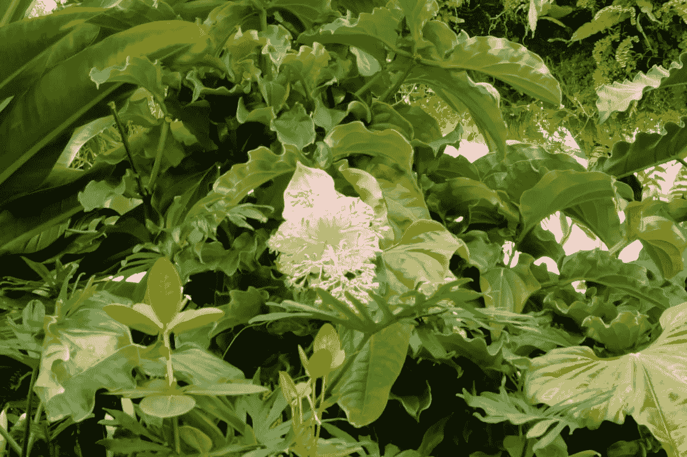

一张粉红色的芙蓉花和绿叶的照片。图片由作者提供。

首先将公差值设置为 12

```
exact_color('example.jpg', 900, 12, 2.5)
```

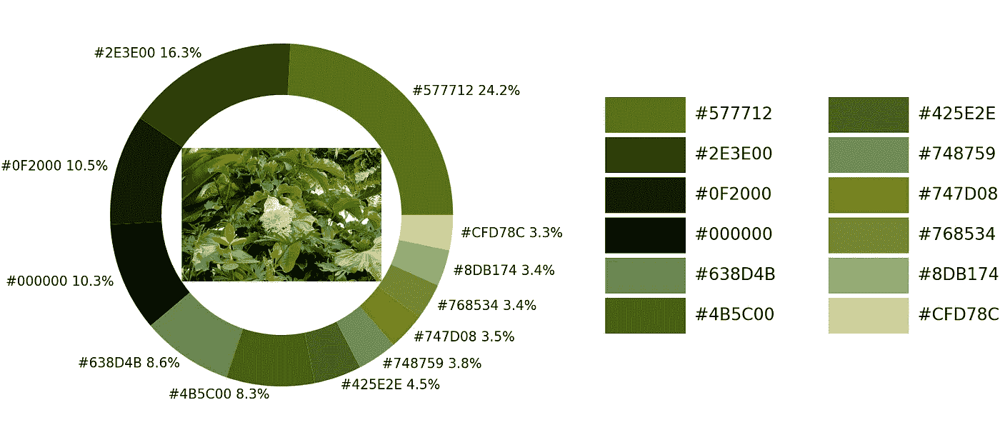

将公差值设置为 12 后的结果。作者图片。

可以注意到上面的结果中没有粉色。这可能是因为组合的颜色太小。因此，我们将公差的数量增加到 24。

```
exact_color('example.jpg', 900, 24, 2.5)
```

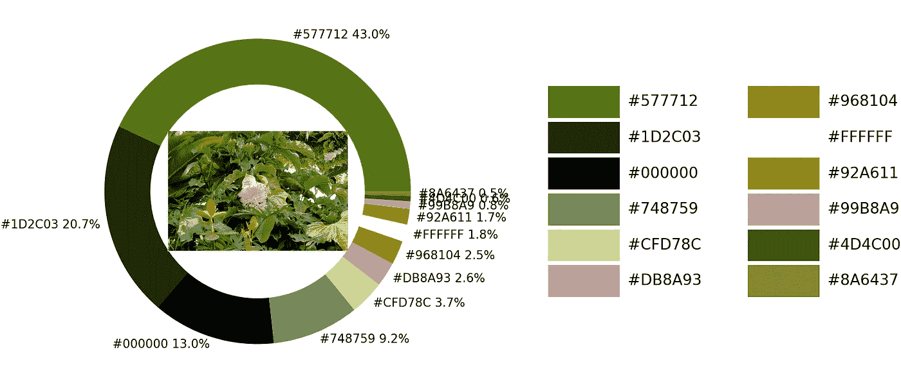

将公差值设置为 24 后的结果。作者图片。

结果得到了改善。调色板上有一个粉色代码。我们可以更进一步，将公差数字增加到 36，以获得更多的粉红色代码。以下结果返回 2 种色调的粉红色。

```
exact_color('example.jpg', 900, 36, 2.5)
```


将公差值设置为 36 后的结果。作者图片。

2.**裁剪输入**

另一种改善结果的方法是在分析之前使用一些计算机程序对照片进行裁剪。在运行代码之前，我裁剪了输入图像。即使容差等于 24，提取也会返回 3 种粉红色阴影。

```
exact_color('example.jpg', 900, 24, 4.5)
```


裁剪照片的结果。作者图片。

## 摘要

本文解释了如何从图像中提取颜色。结果可以帮助分析颜色及其数量。也可以通过 Python for loop 命令应用该函数来处理批量图像。如果您有任何问题或建议，请随时留下评论。感谢阅读。

这些是关于数据可视化的其他文章，您可能会感兴趣。

*   8 用 Python 处理多个时间序列数据的可视化([链接](/8-visualizations-with-python-to-handle-multiple-time-series-data-19b5b2e66dd0)
*   用 Python 可视化光速([链接](/visualizing-the-speed-of-light-in-the-solar-system-with-python-fa9ead33ac86))
*   用 NASA 数据和 Python ( [链接](/visualize-the-invisible-so2-with-nasa-data-and-python-2619f8ed4ea1))可视化看不见的 SO2

## 参考

*   *Extcolors* 。皮皮。于 2022 年 5 月 22 日从[https://pypi.org/project/extcolors](https://pypi.org/project/extcolors/)检索
*   e .默里(2019 年 3 月 22 日)。*颜色在数据可视化中的重要性*。福布斯。2022 年 5 月 23 日检索，来自[https://www . Forbes . com/sites/EVA Murray/2019/03/22/the-importance-of-color-in-data-visualizations/？sh=fdc72a657ec5](https://www.forbes.com/sites/evamurray/2019/03/22/the-importance-of-color-in-data-visualizations/?sh=fdc72a657ec5)