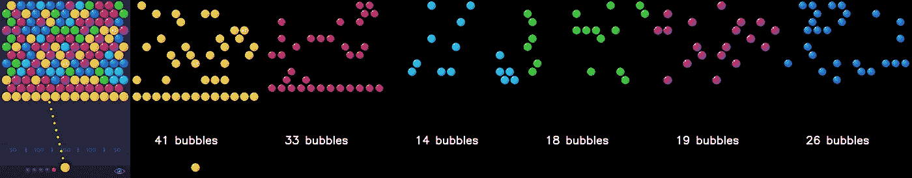
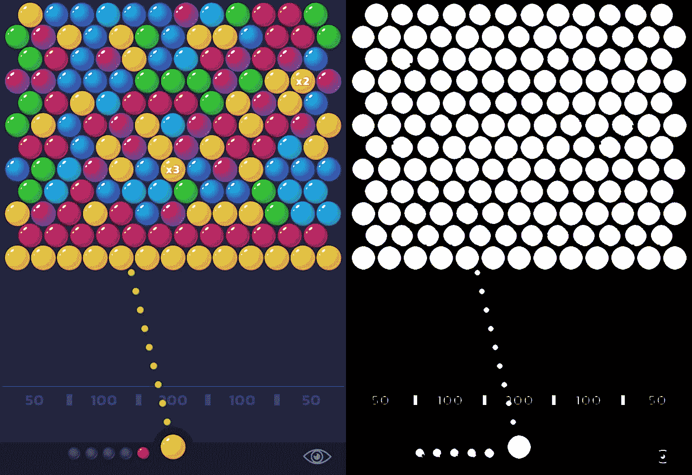
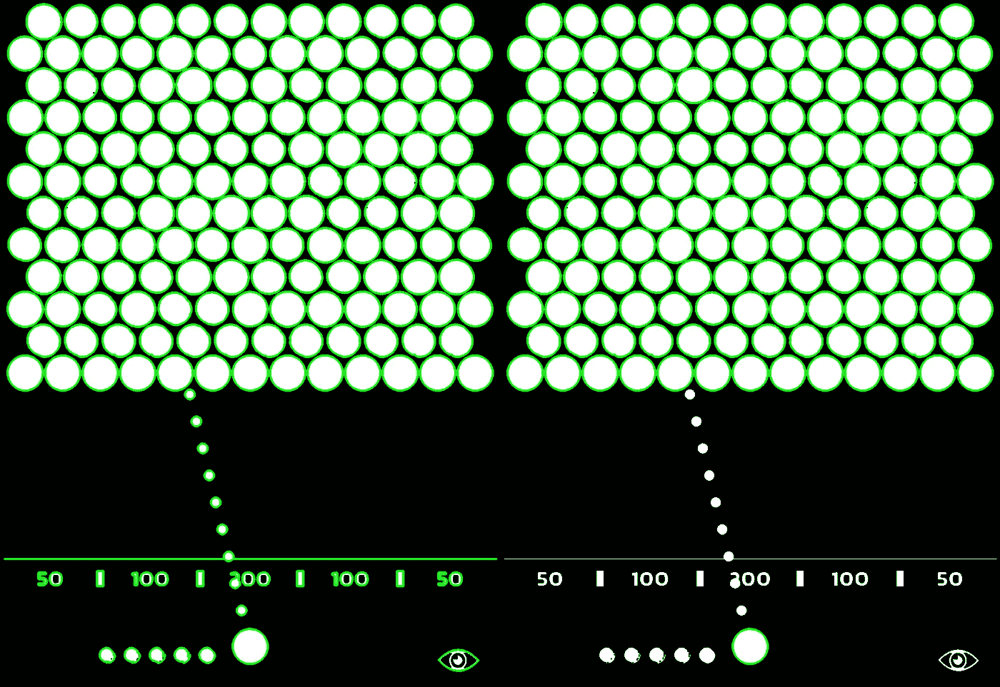

# 基于 K-均值聚类的颜色分割

> 原文：<https://towardsdatascience.com/image-color-segmentation-by-k-means-clustering-algorithm-5792e563f26e>

## 使用轮廓和 K-means 聚类，根据颜色识别和量化图像中的对象的详细指南。



**简介**

颜色分割是计算机视觉中使用的一种技术，用于根据颜色来识别和区分图像中的不同对象或区域。聚类算法可以自动将相似的颜色分组在一起，而无需为每种颜色指定阈值。当处理具有大范围颜色的图像时，或者当事先不知道精确的阈值时，这可能很有用。

在本教程中，我们将探讨如何使用 K-means 聚类算法来执行颜色分割，并计算每种颜色的对象数量。我们将使用“泡泡射手”游戏中的一幅图像作为例子，通过它们的轮廓找到并过滤泡泡对象，并应用 K-means 算法将具有相似颜色的泡泡分组在一起。这将允许我们计数和提取具有相似颜色的气泡的掩模，用于进一步的下游应用。我们将使用`OpenCV`和`scikit-learn`库进行图像分割和颜色聚类。

## **用阈值法提取二值掩模**

第一步是从背景中提取所有的气泡。为此，我们将首先使用`cv2.cvtColor()`函数将图像转换为灰度，然后使用`cv2.threshold()`将其转换为二值图像，其中像素为 0 或 255。阈值设置为 60，因此所有低于 60 的像素设置为 0，其他像素设置为 255。由于一些气泡在二值图像上有轻微的重叠，我们使用`cv2.erode()`函数来分离它们。腐蚀是一种形态学操作，可以缩小图像中对象的大小。它可以用来消除小的白噪声，也可以用来分离连接的对象。

```
image = cv2.imread(r'bubbles.jpeg', cv2.IMREAD_UNCHANGED)
gray = cv2.cvtColor(image, cv2.COLOR_BGR2GRAY)
_ , mask = cv2.threshold(gray, 60, 255, cv2.THRESH_BINARY)
mask = cv2.erode(mask, np.ones((7, 7), np.uint8))
```



左:输入图像。右图:二进制图片|作者图片

## **使用轮廓提取物体边界**

下一步是在二进制图像中查找对象。我们在二值图像上使用`cv2.findContours()`函数来检测物体的边界。轮廓被定义为在图像中形成对象边界的连续曲线。当 *cv2。使用 RETR _ 外部*标志，仅返回最外面的轮廓。该算法输出轮廓列表，每个轮廓代表图像中单个对象的边界。

```
contours, _ = cv2.findContours(mask, cv2.RETR_EXTERNAL, cv2.CHAIN_APPROX_SIMPLE)
```

## **过滤轮廓并提取平均颜色**

为了移除不代表气泡的轮廓，我们将迭代得到的轮廓，并且仅选择那些具有大面积(大于 3000 像素)的轮廓。这将允许我们分离气泡的轮廓，并丢弃任何较小的对象，如字母或背景的一部分。

```
filtered_contours = []
df_mean_color = pd.DataFrame()
for idx, contour in enumerate(contours):
    area = int(cv2.contourArea(contour))

    # if area is higher than 3000:
    if area > 3000:
        filtered_contours.append(contour)
        # get mean color of contour:
        masked = np.zeros_like(image[:, :, 0])  # This mask is used to get the mean color of the specific bead (contour), for kmeans
        cv2.drawContours(masked, [contour], 0, 255, -1)

        B_mean, G_mean, R_mean, _ = cv2.mean(image, mask=masked)
        df = pd.DataFrame({'B_mean': B_mean, 'G_mean': G_mean, 'R_mean': R_mean}, index=[idx])
        df_mean_color = pd.concat([df_mean_color, df])
```



过滤前(左)和过滤后(右)二值图像上的绿色等高线|作者的图像

为了找到每个气泡的平均颜色，我们将首先通过在黑色图像上绘制白色轮廓来为每个气泡创建一个遮罩。然后，我们将使用原始图像和气泡的遮罩，使用`cv2.mean()`函数来计算气泡的平均蓝色、绿色和红色(BGR)通道值。每个气泡的平均 BGR 值存储在熊猫数据帧中。

## **用 K-means 算法对相似颜色进行聚类**

最后，我们将应用 K-means 聚类算法将具有相似颜色的气泡分组在一起。我们将使用轮廓的平均颜色值作为来自`sklearn`库的`KMeans`算法的输入数据。`n_clusters`超参数指定算法要创建的聚类数。在这种情况下，由于有 6 个气泡颜色，我们将设置值为 6。

K-means 算法是一种流行的聚类方法，可用于将相似的数据点分组在一起。该算法的工作原理是将一组数据点作为输入，并将它们分成指定数量的聚类，每个聚类由一个质心表示。质心被初始化为数据空间内的随机位置，并且该算法迭代地将每个数据点分配给由最近质心表示的聚类。一旦所有数据点都被分配给一个聚类，质心就被更新为数据点在其聚类中的平均位置。重复该过程，直到质心收敛到稳定位置，并且数据点不再被重新分配给不同的聚类。通过使用以每个气泡的平均 BGR 值作为输入的 K-means 算法，我们可以将具有相似颜色的气泡分组在一起。

一旦初始化了`KMeans`类，就会调用`fit_predict`方法来执行聚类。`fit_predict`方法返回每个对象的分类标签，然后将这些标签分配给数据集中一个新的“标签”列。这允许我们识别哪些数据点属于哪个聚类。

```
km = KMeans( n_clusters=6)
df_mean_color['label'] = km.fit_predict(df_mean_color)
```

然后定义`draw_segmented_objects`函数，用相同颜色的气泡创建一个新的蒙版图像。这是通过首先创建一个二进制蒙版来实现的:具有相同标签的所有气泡的轮廓在黑色图像上以白色绘制。然后，使用来自`cv2`的`bitwise_and`函数将原始图像与蒙版结合，产生一个只有相同标签的气泡可见的图像。为方便起见，使用`cv2.putText()`功能将每种颜色的气泡数量绘制在图像上。

```
def draw_segmented_objects(image, contours, label_cnt_idx, bubbles_count):
    mask = np.zeros_like(image[:, :, 0])
    cv2.drawContours(mask, [contours[i] for i in label_cnt_idx], -1, (255), -1)
    masked_image = cv2.bitwise_and(image, image, mask=mask)
    masked_image = cv2.putText(masked_image, f'{bubbles_count} bubbles', (200, 1200), cv2.FONT_HERSHEY_SIMPLEX,
                        fontScale = 3, color = (255, 255, 255), thickness = 10, lineType = cv2.LINE_AA)
    return masked_image
```

为每组具有相同标签的气泡调用`draw_segmented_objects`函数，为每种颜色生成一幅蒙版图像。每种颜色中珠子的数量可以通过在数据帧按颜色分组后计数数据帧中的行数来确定。

```
img = image.copy()
for label, df_grouped in df_mean_color.groupby('label'):
    bubbles_amount = len(df_grouped)
    masked_image = draw_segmented_objects(image, contours, df_grouped.index, bubbles_amount)
    img = cv2.hconcat([img, masked_image])

plt.imshow(cv2.cvtColor(img, cv2.COLOR_BGR2RGB) )
```


原始图像(左)沿着每种颜色的分段图像|图像作者

## **结束语**

使用 K-均值聚类进行颜色分割是一种基于颜色识别和量化图像中对象的强大工具。在本教程中，我们演示了如何使用 K-means 算法以及 OpenCV 和 scikit-learn 来执行颜色分割并计算图像中每种颜色的对象数量。这种技术可以应用于各种需要根据颜色对图像中的对象进行分析和分类的场景。

*为了您的方便，我们提供了一个包含完整代码的用户友好的 Jupiter 笔记本:*

# 感谢您的阅读！

**想了解更多？**

*   [**探索**](https://medium.com/@lihigurarie) 我写的附加文章
*   [**订阅**](https://medium.com/@lihigurarie/subscribe) 在我发表文章时得到通知
*   在[上关注我 **Linkedin** 上关注我](https://www.linkedin.com/in/lihi-gur-arie/)