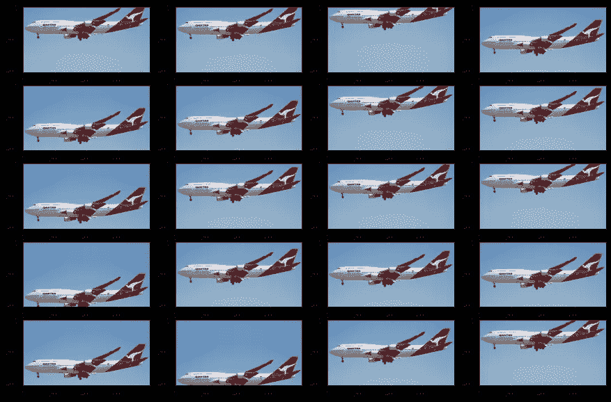
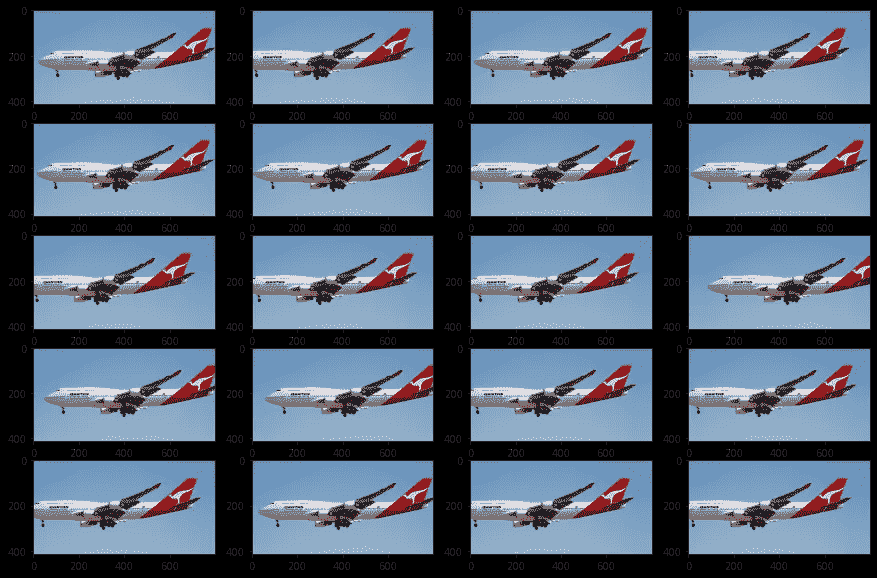
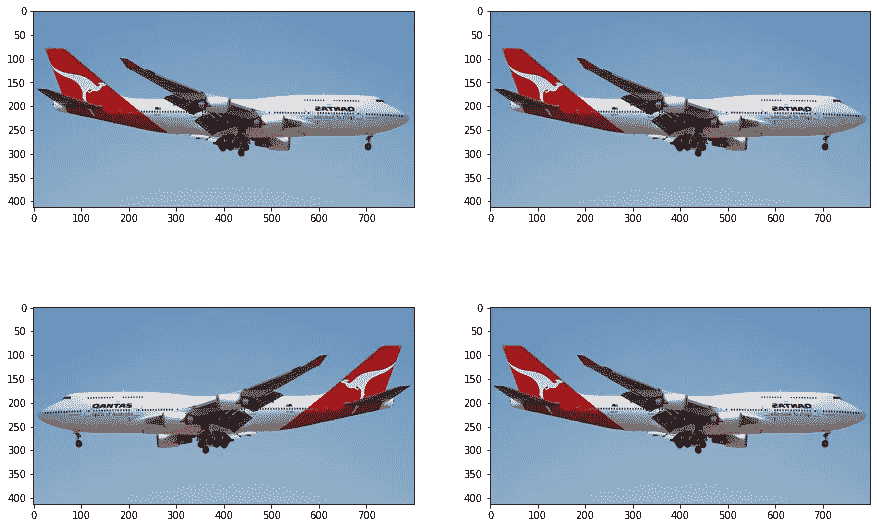
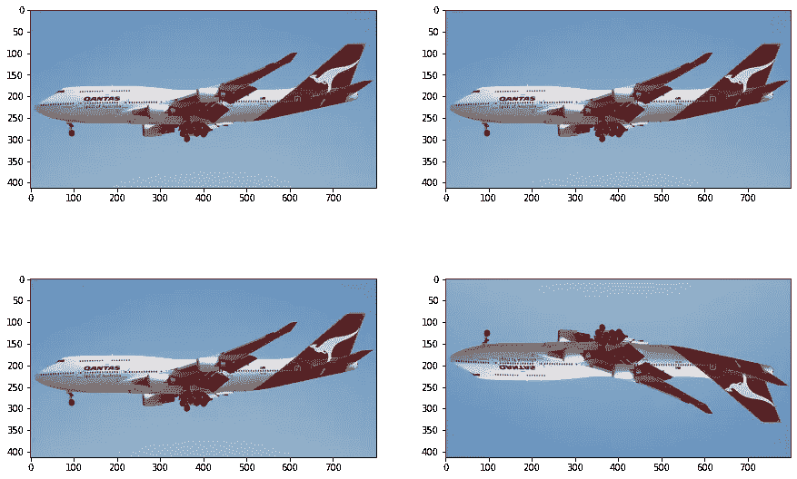
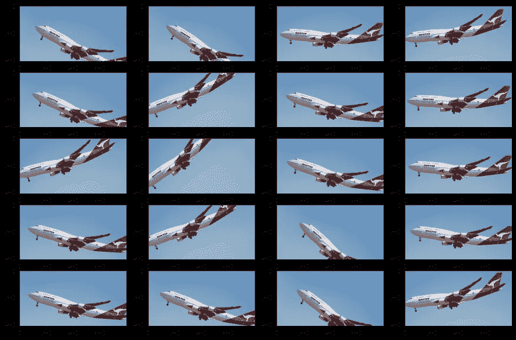
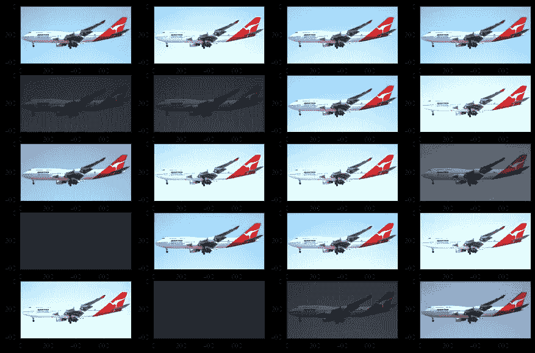
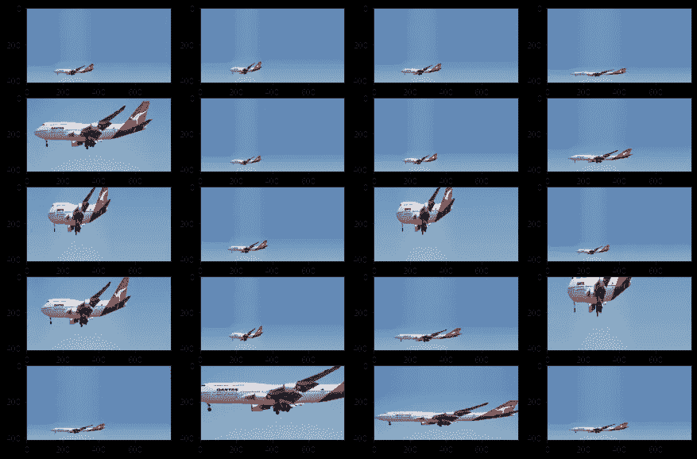
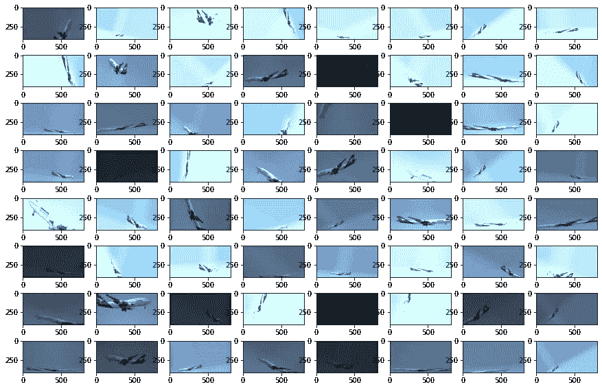
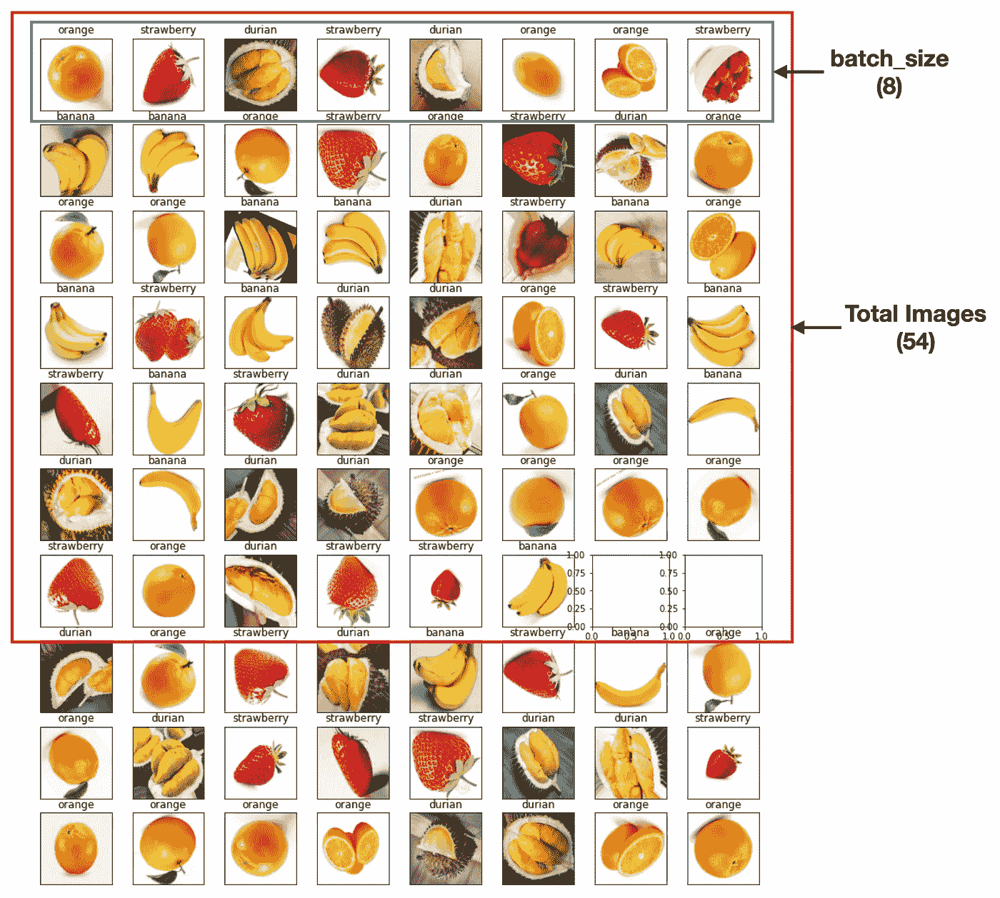

# 用于深度学习的图像数据增强

> 原文：<https://towardsdatascience.com/image-data-augmentation-for-deep-learning-77a87fabd2bf>

## 了解什么是图像数据增强，以及如何在深度学习项目中使用 Keras


克里斯·劳顿在 Unsplash[拍摄的照片](https://unsplash.com?utm_source=medium&utm_medium=referral)

如果你曾经尝试过使用深度学习进行图像识别，你就会知道一个好的数据集对于训练的重要性。但是，找到足够的图像进行训练并不总是容易的，并且模型的准确性直接取决于训练数据的质量。

幸运的是，您可以使用一些技术来补充他们用于训练的图像数据集。其中一种技术叫做*图像数据增强*。在本文中，我将讨论什么是图像数据增强，它如何工作，为什么它在深度学习中有用，以及最后如何使用 Keras 库执行图像数据增强。

# 什么是图像数据增强？

*图像数据增强*是一种*从现有图像*中创建新图像的技术。为此，您可以对它们进行一些小的更改，例如调整图像的亮度，旋转图像，或者水平或垂直移动图像中的主题。

图像增强技术允许您人为地增加训练集的大小，从而为您的模型训练提供更多的数据。这允许您通过增强模型识别训练数据的新变量的能力来提高模型的准确性。

## 图像数据增强的类型

图像增强有多种形式，下面是一些常见的形式——垂直移动、水平移动、垂直翻转、水平翻转、旋转、亮度调整和放大/缩小。

# 使用 Keras 的图像增强

我将首先使用 Python 和 Keras 演示各种图像增强技术。如果您想尝试，请确保您安装了以下软件和软件包:

*   **蟒蛇**。你可以从 https://www.anaconda.com/products/distribution/下载蟒蛇。
*   **张量流**。您可以使用命令`pip install tensorflow`安装 TensorFlow。

安装 Anaconda 和 TensorFlow 后，创建一个新的 Jupyter 笔记本。

## 垂直移位

我想展示的第一个图像增强技术是*垂直移动*。*垂直移动*随机上下垂直移动图像。对于这个例子，我将使用一个名为**747.jpg**的图片，它与我的 Jupyter 笔记本位于同一个文件夹中。


图片来源:[https://commons . wikimedia . org/wiki/File:Qantas _ Boeing _ 747-438 er _ VH-OEI _ at _ lax . jpg](https://commons.wikimedia.org/wiki/File:Qantas_Boeing_747-438ER_VH-OEI_at_LAX.jpg)。本文件在[知识共享](https://en.wikipedia.org/wiki/en:Creative_Commons) [署名-共享 2.0 通用](https://creativecommons.org/licenses/by-sa/2.0/deed.en)许可下获得许可。

下面的代码片段使用 Keras 中的`ImageDataGenerator`类来垂直移动图像。

> Keras 的`ImageDataGenerator`类通过实时数据扩充生成批量图像数据。

```
#---import the modules---
import numpy as np
import matplotlib.pyplot as pltfrom tensorflow.keras.preprocessing.image import load_img
from tensorflow.keras.preprocessing.image import img_to_array
from tensorflow.keras.preprocessing.image import ImageDataGenerator#---load the image---
image_filename = '747.jpg'
img = load_img(image_filename)#---convert the image to 3D array---
image_data = img_to_array(img)#---convert into a 4-D array of 1 element of 3D array representing
# the image---
images_data = np.expand_dims(image_data, axis=0)#---create image data augmentation generator---
datagen = ImageDataGenerator(width_shift_range=0.2)#---prepare the iterator; flow() takes in a 4D array and returns 
# an iterator containing a batch of images---
train_generator = datagen.flow(images_data, batch_size=1)rows = 5
columns = 4#---plot 5 rows and 4 columns---
fig, axes = plt.subplots(rows,columns)for r in range(rows):
    for c in range(columns):
        #---get the next image in the batch (one image since batch 
        # size is 1)---
        image_batch = train_generator.next()

        #---convert to unsigned integers for viewing---
        image = image_batch[0].astype('uint8') #---show the image---
        axes[r,c].imshow(image)#---set the size of the figure---
fig.set_size_inches(15,10)
```

上述代码片段产生以下输出:



从上面的输出可以看出，每次从`train_generator`对象中调用`next()`方法，都会得到一个略有变化的图像。在上面的代码片段中，每次调用`next()`方法时，都会返回一个基于原始图像高度移动了 20%的新图像:

```
datagen = ImageDataGenerator(**width_shift_range=0.2**)
```

> 有趣的是，对于这个版本的`ImageDataGenerator` ( `tensorflow.keras.preprocessing.image`)类，指定`width_shift_range`参数会垂直移动图像，而不是水平移动(这是来自`keras.preprocessing.image`模块的旧`*ImageDataGenerator*`的行为)。同样，如果你想让图像水平移动，你需要使用`height_shift_range`参数(见下一节)。

请注意，`next()`方法将根据您的需要多次返回一个增强的图像。在上面的代码片段中，我们调用了它 20 次(5 行乘以 4 列)。

## 水平移动

您现在可以尝试使用`height_shift_range`参数水平移动图像:

```
datagen = ImageDataGenerator(**height_shift_range=0.2**)
train_generator = datagen.flow(images_data, batch_size=1)rows = 5
columns = 4fig, axes = plt.subplots(rows,columns)
for r in range(rows):
    for c in range(columns):
        image_batch = train_generator.next()
        image = image_batch[0].astype('uint8')
        axes[r,c].imshow(image)fig.set_size_inches(15,10)
```

上述代码片段产生以下输出:



## 水平翻转

有时水平翻转图像是有意义的。就飞机而言，飞机的前部可能面向左，也可能面向右:

```
datagen = ImageDataGenerator(**horizontal_flip=True**)
train_generator = datagen.flow(images_data, batch_size=1)rows = 2
columns = 2fig, axes = plt.subplots(rows,columns)
for r in range(rows):
    for c in range(columns):        
        image_batch = train_generator.next()
        image = image_batch[0].astype('uint8')
        axes[r,c].imshow(image)fig.set_size_inches(15,10)
```

对于上面的代码片段，生成四个图像就足够了，因为飞机的正面可以面向左或右:



> 请记住，翻转是随机的(有时您会得到所有四个原始图像，有时您会得到水平翻转的图像)。很可能上面的四个图像都是相同的。如果发生这种情况，只需再次运行该代码块。

## 垂直翻转

就像水平翻转一样，您也可以执行垂直翻转:

```
datagen = ImageDataGenerator(**vertical_flip=True**)
train_generator = datagen.flow(images_data, batch_size=1)rows = 2
columns = 2fig, axes = plt.subplots(rows,columns)
for r in range(rows):
    for c in range(columns):
        image_batch = train_generator.next()
        image = image_batch[0].astype('uint8')
        axes[r,c].imshow(image)fig.set_size_inches(15,10)
```

以飞机为例，把我们的飞机翻个底朝天可能没什么意义！如果您正在尝试执行图像识别，那么您的平面图像很可能是垂直的，因此训练您的模型识别颠倒的平面可能不太常见。对于其他情况，垂直翻转很有意义。



## 旋转

旋转，顾名思义，就是旋转你的图像。这对我们的飞机图像非常有用。以下代码片段将图像随机旋转 50 度:

```
datagen = ImageDataGenerator(**rotation_range=50**)
train_generator = datagen.flow(images_data)rows = 5
columns = 4fig, axes = plt.subplots(rows,columns)
for r in range(rows):
    for c in range(columns):
        image_batch = train_generator.next()
        image = image_batch[0].astype('uint8')
        axes[r,c].imshow(image)fig.set_size_inches(15,10)
```

通过旋转，输出显示了不同位置的飞机，模拟起飞和着陆位置:



## 聪明

另一种增强技术是调整图像的亮度。以下代码片段设置了亮度偏移值的范围:

```
datagen = ImageDataGenerator(**brightness_range=[0.15,2.0]**)
train_generator = datagen.flow(images_data, batch_size=1)rows = 5
columns = 4fig, axes = plt.subplots(rows,columns)
for r in range(rows):
    for c in range(columns):
        image_batch = train_generator.next()
        image = image_batch[0].astype('uint8')
        axes[r,c].imshow(image)fig.set_size_inches(15,10)
```

输出包含一系列不同亮度的图像:



## 变焦

您还可以放大或缩小图像:

```
datagen = ImageDataGenerator(**zoom_range=[5,0.5]**)
train_generator = datagen.flow(images_data, batch_size=1)rows = 5
columns = 4fig, axes = plt.subplots(rows,columns)
for r in range(rows):
    for c in range(columns):
        image_batch = train_generator.next()
        image = image_batch[0].astype('uint8')
        axes[r,c].imshow(image)fig.set_size_inches(15,10)
```

输出以各种缩放比例显示图像:



> 请注意，缩放图像会改变图像的纵横比。

## 结合所有的增强

当然，到目前为止我所讨论的各种增强技术都可以结合起来:

```
datagen = ImageDataGenerator(**width_shift_range=0.2,
                             height_shift_range=0.2,
                             horizontal_flip=True,
                             rotation_range=50,
                             brightness_range=[0.15,2.0],
                             zoom_range=[5,0.5]**)train_generator = datagen.flow(images_data, batch_size=1)rows = 8
columns = 8fig, axes = plt.subplots(rows,columns)
for r in range(rows):
    for c in range(columns):
        image_batch = train_generator.next()
        image = image_batch[0].astype('uint8')
        axes[r,c].imshow(image)fig.set_size_inches(15,10)
```

> 请注意，我省略了垂直翻转，因为它对我们的示例没有意义。

现在，输出显示了应用了各种放大效果的图像:



# 对图像类别使用 ImageDataGenerator

前面几节介绍了图像数据增强的基础知识，以及如何将其应用于单个图像。在深度学习中，我们经常会处理一组图像。现在让我们看看如何将图像增强应用于一组图像。为了便于说明，我假设在包含 Jupyter 笔记本的文件夹中，有一个**水果**文件夹和以下子文件夹:

```
**Fruits**
  |**__banana**
       |__banana1.jpg
       |__banana2.jpg
       |__banana3.jpg
       |__ ...
  |**__durian**
       |__durian1.jpg
       |__durian2.jpg
       |__durian3.jpg
       |__ ...
  |**__orange**
       |__orange1.jpg
       |__orange2.jpg
       |__orange3.jpg
       |__ ...
  |**__strawberry**
       |__strawberry1.jpg
       |__strawberry2.jpg
       |__strawberry3.jpg
       |__ ...
```

每个子文件夹包含一组图像。例如，**香蕉**文件夹包含许多名为**banana1.jpg**、**banana2.jpg**等的图像。子文件夹的名称将作为各种图像的标签。这意味着**香蕉**文件夹下的所有文件都包含香蕉的图像，以此类推。

为了从磁盘加载一系列图像，现在调用`ImageDataGenerator`实例的`flow_from_directory()`方法，而不是`flow()`方法(用于从内存加载图像):

```
train_datagen = ImageDataGenerator(
    horizontal_flip=True,
    vertical_flip=True,
    rotation_range=50,
)**batch_size = 8**train_generator = **train_datagen.flow_from_directory(
    './Fruits',
    target_size=(224,224), 
    color_mode='rgb', 
    batch_size=batch_size, 
    class_mode='categorical', 
    shuffle=True)**
```

> 注意，我现在将`batch_size`设置为 8。您将很快看到批量大小的用法。

使用返回的迭代器，我可以找到各种水果的标签(香蕉、榴莲、橙子和草莓):

```
class_dictionary = train_generator.class_indices#---create a dictionary of labels---
class_dictionary = { value:key for key,value in
    class_dictionary.items()}#---convert the dictionary to a list---
class_list = [value for _,value in class_dictionary.items()]
print(class_list)
```

您将看到以下输出:

```
Found 54 images belonging to 4 classes.
['banana', 'durian', 'orange', 'strawberry']
```

总共有 54 张图片在 4 个文件夹中。另外，`class_list`变量包含水果列表。

我现在将打印出由`ImageDataGenerator`类创建的一组增强图像。我将任意地将行数设置为 10，对于每一行，我想打印出返回的一批图像(在本例中是 8):

```
rows = 10fig, axes = plt.subplots(rows,batch_size)for r in range(rows):    
    #---get the batch of augmented images---
    image_batch = train_generator.next()        #---get the number of images returned---
    images_count = image_batch[0].shape[0]

    for c in range(images_count):
        #---convert to unsigned integers for viewing---
        image = image_batch[0][c].astype('uint8')

        #---display the image---
        axes[r,c].imshow(image) #---display the label of the image---
        axes[r,c].title.set_text(
            class_list[np.argmax(image_batch[1][c])]) #---hides the x and y-ticks---
        axes[r,c].set_xticks([])
        axes[r,c].set_yticks([])fig.set_size_inches(15,18)
```

因为`batch_size`现在被设置为 8(而不再是 1)，所以每次调用`train_generator.next()`方法时，它都会返回一批*的八幅增强图像。返回的图像数量基于您之前在`flow_from_directory()`方法中设置的`batch_size`:*

```
train_generator = train_datagen.flow_from_directory(
    './Fruits',
    target_size=(224,224), 
    color_mode='rgb', 
 **batch_size=batch_size,**        # batch_size = 8
    class_mode='categorical', 
    shuffle=True)
```

`image_batch`变量的值(由`next()`方法返回)是两个元素的元组:

*   第一个元素(`image_batch[0]`)是一个由 *batch_size* 图像组成的数组(4D 数组)
*   第二个元素(`image_batch[1]`)包含图像的标签

上述代码片段产生以下输出:


请注意，在第七行，有两个没有图像的空图表。回想一下，图像集中总共有 54 幅图像，由于每批返回 8 幅图像(每行)，前七行将显示总共 54 幅图像(8x6 + 6)。下图说明了这一点:



> 请注意，您可以将`rows`设置为任何数字，并且`ImageDataGenerator`类将继续为您生成新的增强图像。

## 使用迁移学习建立模型

您现在知道如何使用`ImageDataGenerator`从磁盘加载图像集以进行增强。但是怎么用它来训练呢？以下代码片段展示了如何使用*迁移学习*构建深度学习模型。

> 迁移学习是一种机器学习方法，其中为一项任务开发的模型被重新用作第二项任务模型的起点。迁移学习减少了你需要花在培训上的时间。

```
from tensorflow.keras.models import Model
from tensorflow.keras.applications import VGG16
from tensorflow.keras.layers import Dense, GlobalAveragePooling2D#---number of fruits---
NO_CLASSES = max(train_generator.class_indices.values()) + 1#---load the VGG16 model as the base model for training---
base_model = VGG16(include_top=False, input_shape=(224, 224, 3))#---add our own layers---
x = base_model.output
x = GlobalAveragePooling2D()(x)
x = Dense(1024,activation='relu')(x)       # add dense layers so
                                           # that the model can 
                                           # learn more complex 
                                           # functions and 
                                           # classify for better 
                                           # results.
x = Dense(1024,activation='relu')(x)       # dense layer 2
x = Dense(512,activation='relu')(x)        # dense layer 3preds = Dense(NO_CLASSES,
              activation='softmax')(x)     # final layer with 
                                           # softmax activation#---create a new model with the base model's original 
# input and the new model's output---
model = Model(inputs = base_model.input, outputs = preds)#---don't train the first 19 layers - 0..18---
for layer in model.layers[:19]:
    layer.trainable=False#---train the rest of the layers - 19 onwards---
for layer in model.layers[19:]:
    layer.trainable=True

#---compile the model---    
model.compile(optimizer='Adam',
          loss='categorical_crossentropy',
          metrics=['accuracy'])
```

> 解释迁移学习如何工作超出了本文的范围。我将把它留给另一篇文章。

## 使用生成的图像进行训练

要使用增强图像进行训练，将`train_generator`传递到模型的`fit()`方法中:

```
#---train the model---
**step_size_train = train_generator.n // train_generator.batch_size**model.fit(**train_generator**,
 **steps_per_epoch=step_size_train,**
          epochs=15)
```

`steps_per_epoch`参数基本上表示一个纪元中有多少步骤——这取决于您拥有的图像数量以及之前定义的批次大小。如果你把这个设置得很高，那么你就是在做重复训练。您应该根据以下公式进行设置:

**图像数量/批量**

在我们的示例中，我们总共有 54 幅图像。因此在每个纪元中`ImageDataGenerator`类将变换所有 54 幅图像进行训练。在每个纪元中，模型将获得不同的图像变化。如果您有 15 个纪元，则总共将生成 15x54 个图像变体，并将其输入到训练模型中。

> `*ImageDataGenerator*`类允许您的模型在每个时期接收图像的新变体。但是请记住，它只返回转换后的图像，而不会将其添加到您已有的图像集中。

<https://weimenglee.medium.com/membership>  

# 摘要

我希望这篇文章已经给了你一个好主意，什么是图像数据增强的一切，为什么你需要他们在训练你的深度学习模型。特别是，我已经使用 TensorFlow 库中的 Keras 模块进行了演示。