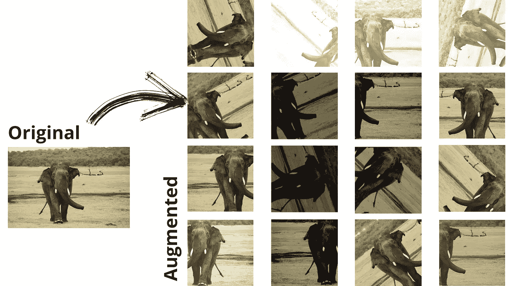
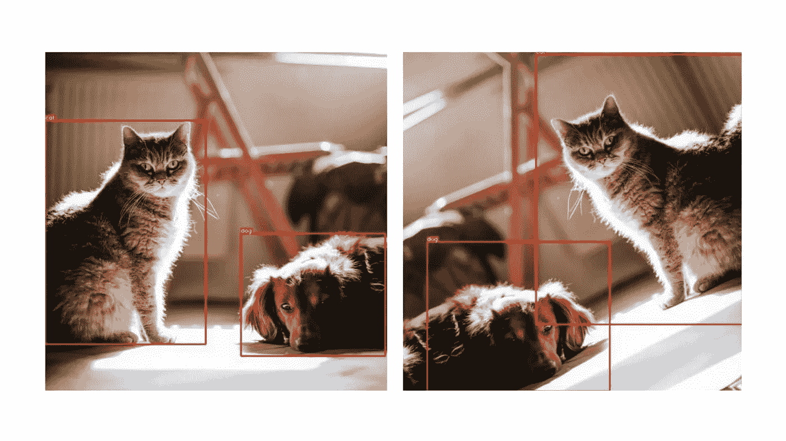
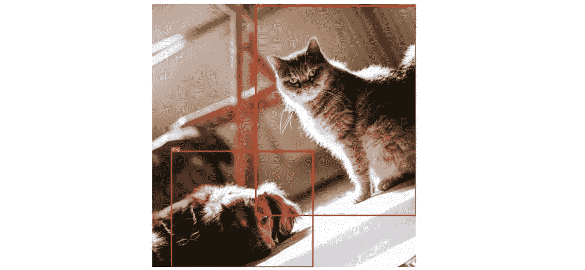

# 这个微小的 Python 包创建了巨大的扩充数据集

> 原文：<https://towardsdatascience.com/image-data-augmentation-pipeline-9841bc7bb56d>

## 如何创建图像数据扩充管道来生成大量合成数据点


图片来自[像素](https://www.pexels.com/)的[像素](https://www.pexels.com/@pixabay)。

经过几个月的努力，你和你的团队已经为你的机器学习项目收集了大量的数据。

项目预算快结束了，剩下的只够训练模型。

但是一旦你训练了这个模型，你就会发现这个模型不能很好地概括问题。你收集的数据还不够。训练精度是如此之好，但在验证集上，它急剧下降。

从技术上讲，这就是我们著名的所谓[过度拟合](https://www.ibm.com/cloud/learn/overfitting)。

处理过度拟合有不同的方法。但是你的团队认为它们都不起作用。

剩下的是两个选项之一:

*   收集更多数据
*   通过轻微调整创建现有数据点的副本(数据扩充)

数据扩充被证明[在不收集进一步数据的情况下提高机器学习模型的准确性](https://www.sciencedirect.com/science/article/abs/pii/S0957417420305200)。这是许多从业者经常使用的普遍技术。

在许多情况下，收集数据是一项昂贵的任务。你可能需要为设备、权限付费，更不用说在收集后给它们贴标签了。

</is-deep-learning-right-for-you-b59a2219c457>  

以医学图像分类问题为例。对于如何收集医疗保健数据，T4 有法律限制。而在收集之后，要给它们贴上标签，就需要医生等熟练专业人士的专业知识。

这篇文章将通过例子讨论一个叫做[albuminations](https://albumentations.ai/)的图像数据增强工具。这是一个在 MIT 许可下发布的开源 Python 库。

您可以从 PyPI 存储库中用下面的命令安装它。如果您正在寻找高级说明，请查阅官方[文档](https://albumentations.ai/docs/)。

```
pip install -U albumentations
```

# 数据增强能做什么？

数据扩充通过一些转换创建现有数据点的副本。例如，我们可以裁剪和旋转图像，使其看起来像新的一样。通过这种集成方法，我们可以将数据集进行多重化，并训练模型以提高其准确性。

这里有一个说明它的意思的例子。



图像数据增强如何工作的图解——作者使用来自 [Pexels](https://www.pexels.com/) 的 [Domenico Bertazzo](https://www.pexels.com/@domenicobertazzo) 拍摄的[斯里兰卡大象](https://www.worldwildlife.org/species/sri-lankan-elephant)的照片

我们用不同的技术转换了基础图像。在许多照片中，我们结合使用了不止一种技术。通过继续这个过程，我们可以生成大量的数据点。

</transfer-learning-in-deep-learning-641089950f5d>  

# 使用白蛋白创建图像增强管道。

使用白蛋白创建扩增管道非常简单。

最初，我们需要通过配置一系列转换来构建一个增强管道。然后我们可以使用任何图像处理库，如 [Pillow](https://pillow.readthedocs.io/en/stable/) 或 [OpenCV](https://opencv.org/) 从文件系统中读取图像。每次我们通过我们配置的转换列表传递一个图像，它都会给我们一个改变的图像。

这里有一个例子，你可以复制开始使用。

在上面的例子中，我们使用了四种类型的转换。

1.我们从随机位置开始裁剪图像。我们配置了 RandomCrop API 来生成一张 256x256 大小的图片。

2.我们用了水平翻转。请注意，此操作并不总是适用。我们已经为它配置了 0.5 的概率值。这意味着通过这条管道的每个图像都有 50%的机会被水平翻转。

3.对于 0.5 和 0.3 的限制，随机亮度和对比度 API 将改变各自的图像特征。我们没有像水平翻转那样明确提到概率值。但是 API 的默认值是 0.5。因此，每张图像都有 50%的机会轻微改变亮度和对比度。当它适用时，亮度不会改变超过 50%，对比度最大值为 30%。

4.最后，我们随机旋转图像。我们在这里没有覆盖任何默认值。

然后，我们使用 Pillow 从文件系统中读取一个图像，Pillow 是一个广泛使用的用于图像处理的 Python 库。我们还把它转换成了一个 NumPy 数组。

最后，我们通过配置好的管道发送图像并显示结果。

蛋白沉积有几十个这样的转变。你可以从他们的 [API 文档](https://albumentations.ai/docs/getting_started/transforms_and_targets/)中了解更多细节。

</the-prefect-way-to-automate-orchestrate-data-pipelines-d4465638bac2>  

# 如何创建带注释的扩充数据？

大多数计算机视觉应用必须处理带注释的图像。这些是在照片中标记和标注的对象，用于训练 ML 模型。

当扩充这样的数据集时，我们还需要知道那些被注释对象的新位置。



在增强过程中改变注释图像位置的图示。由作者使用来自 [Pexels](https://www.pexels.com/photo/dog-and-cat-on-the-floor-4214919/?utm_content=attributionCopyText&utm_medium=referral&utm_source=pexels) 的[marián sicko](https://www.pexels.com/@mariansicko?utm_content=attributionCopyText&utm_medium=referral&utm_source=pexels)的照片创建

我们的增强技术应该相应地重新计算坐标。这项任务在蛋白沉积方面毫不费力。我们需要向管道提供初始坐标和类别 id 的注释对象。结果会有它的新位置。

我们已经修改了上面创建增强管道的例子中的 Compose 方法。我们添加了另一个输入 bbox_params 及其配置。

这样，我们告诉 Albumentation 使用 coco 格式来扩充带注释的图像，并使用 category_label 来查找它的标签。Coco 是该库中可用的四种重记方法之一。

最后，我们在运行时为每个图像传递两个额外的参数。第一个通过它的起始坐标、宽度和高度来定义盒子。然后我们定义的每个容器的标签。

结果是这样的。



变换后，对象的位置发生了变化。然而，管道已经正确地找到了它的新位置。

</how-to-speed-up-python-data-pipelines-up-to-91x-80d7accfe7ec>  

# 最终想法

通过重用现有图像，数据扩充节省了大量的时间、精力和预算。我们可以用任何图像处理库做到这一点。但是一些特定的任务可能需要额外的努力才能正确完成。

例如，带注释的图像需要重新注释增强图像上的对象。在这些情况下，像 Albumentations 这样的工具就派上用场了。

这篇文章简要介绍了我们可以用这个 Python 库做什么。我希望下次你训练机器学习模型时，你会用它来提高准确性，而不用考虑进一步的数据收集。

</3-ways-to-deploy-machine-learning-models-in-production-cdba15b00e>  </5-python-gui-frameworks-to-create-desktop-web-and-even-mobile-apps-c25f1bcfb561>  

> 感谢阅读，朋友！在[**LinkedIn**](https://www.linkedin.com/in/thuwarakesh/)[**Twitter**](https://twitter.com/Thuwarakesh)[**Medium**](https://thuwarakesh.medium.com/)上跟我打招呼。
> 
> 还不是中等会员？请使用此链接 [**成为会员**](https://thuwarakesh.medium.com/membership) 因为，不需要你额外付费，我为你引荐赚取一小笔佣金。