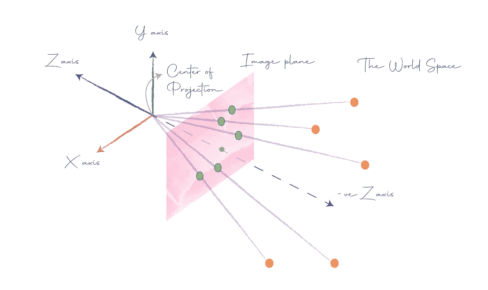
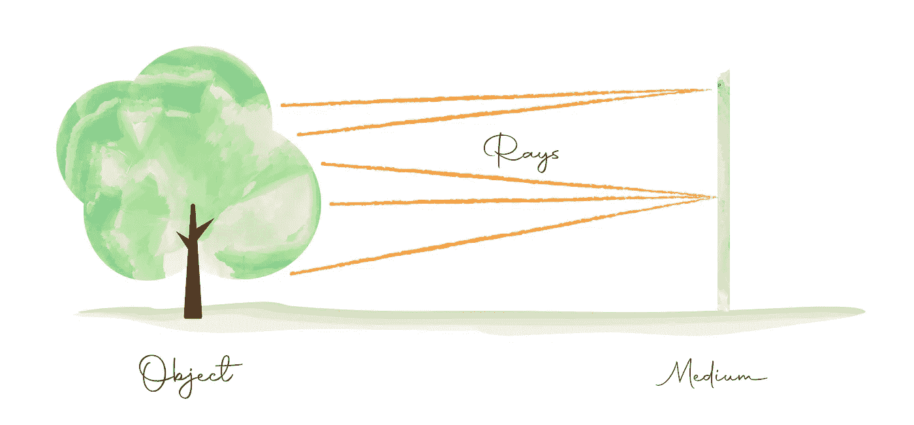
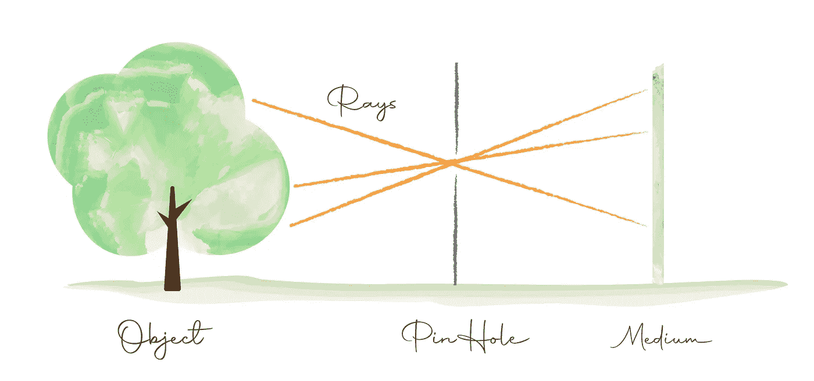
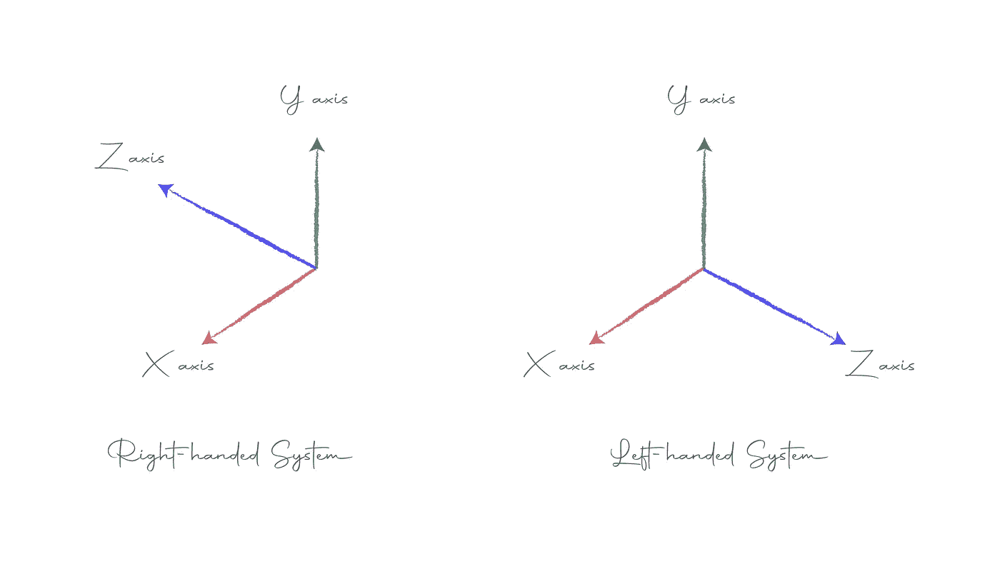

# 照相机的成像和针孔模型

> 原文：<https://towardsdatascience.com/image-formation-and-pinhole-model-of-the-camera-53872ee4ee92>

## Python 中图像形成和相机校准综合教程系列的第 1 部分

# 介绍

相机如何捕捉图像的基本概念很简单，但它是我们拥有的最强大的工具之一。在这一系列教程中，我们将学习如何对相机进行数学建模，并实现其在自动驾驶汽车、场景重建、多视图几何等方面的全部潜力。一旦你理解了这一点，你会惊讶于你能做的所有事情。

我强烈主张通过做来学习[，我们将在这个系列中做很多实际操作的例子，这将加强你的理解并使事情变得有趣。](https://medium.com/new-writers-welcome/learning-by-doing-5cb9010900b3)

## 先决条件

你应该熟悉矩阵、向量、线性变换和线性代数的基本概念。然而，你总是可以边走边学。

如果你是一个完全的初学者，我强烈推荐你先上 [Gilbert Strang 的线性代数](https://www.youtube.com/playlist?list=PL49CF3715CB9EF31D)课。

好吧，我们开始吧。

# 图像形成

成像的基本思想是捕捉从物体反射到介质上的光线。现在，我们可以简单地把媒介放在物体前面并捕捉它，如果你这样做，你会在整个胶片上只看到灰色。原因是来自物体不同点的光线在胶片上相互重叠，造成一片混乱。下图对此进行了说明:

我们要的是世界上的点和影片中的像素一一对应。我们如何实现这一目标？这个想法是在物体和胶片或介质之间放置一个带有针孔的屏障。这样我们可以确保没有重叠，如下图所示:

然而，这一次图像将被倒置在胶片上。这就是所谓的相机针孔模型，广泛应用于数学建模。

# 针孔摄像机

为了对针孔摄像机进行数学建模，我们做出以下假设:

*   像平面，即捕捉光线的胶片或介质，位于针孔的前面。然而，在现实世界中，它位于针孔的后面。这种假设使得投影建模更容易，因为我们不必担心反转图像。
*   来自不同点的所有光线会聚在针孔处，针孔也可以称为投影中心或相机中心。

其思想是，点的图像是该点在图像平面上的投影，或者是从相机中心到该点的线与图像平面相交的地方。

世界空间是相机、点和对象所在的位置。

照相机的针孔模型

上图显示了相机针孔模型的简单设置。这里，相机中心位于原点，图像平面平行于 XY 平面，并位于离它一定距离的位置(这个距离称为焦距，我们将在后面看到)。

## 左手系统与右手系统

给你提个问题:图中所示的坐标系是左手系还是右手系？现在，如果你尝试，你将能够沿着坐标轴对齐你的右手，所以这是一个右手坐标系。

右手系统与左手系统

我们假设在右手系统中相机指向-ve Z 轴。

# 几何摄像机校准

现在，摄像机可以放在世界上的任何地方，也可以以任何方式定向。我们的工作是弄清楚它是如何将世界空间中的点投射到图像平面上的。换句话说，我们必须弄清楚世界上的点和它们在相机拍摄的图像上对应的像素之间的关系。

我们需要搞清楚两个转变:

1.  世界坐标系到相机坐标系的基变换。本质上，这让我们从相机的角度看世界。这被称为相机姿势或相机外物。
2.  将从相机观察到的世界中的点投影到相机的图像平面上的投影变换。这就是所谓的相机固有特性。

找出这些转换的过程被称为相机校准，也是本系列的目标。

# 结论

现在我们已经看到了图像是如何形成的，我们可以把图像的定义重新思考为从三维空间到二维空间的投影。

在下一篇文章中，也就是系列文章的第 2 部分[，我们将通过一个实际操作的例子深入探讨相机的本质。](/camera-extrinsic-matrix-with-example-in-python-cfe80acab8dd)

# 参考

1.  [计算机视觉介绍— Udacity](https://classroom.udacity.com/courses/ud810)

# 图像制作者名单

本文中的所有图片和数字，除非在标题中明确提及其来源，否则均由作者提供。