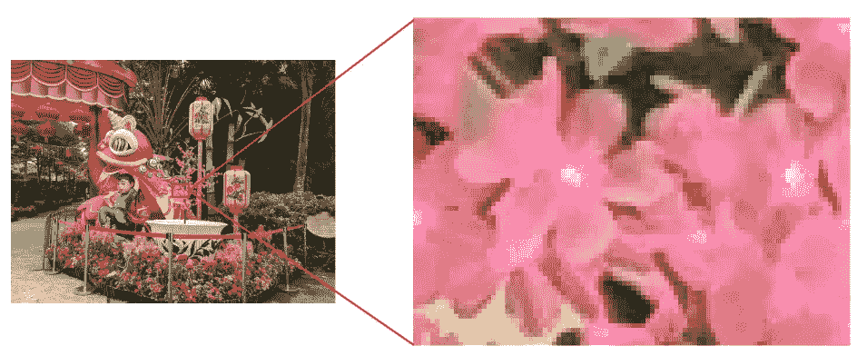
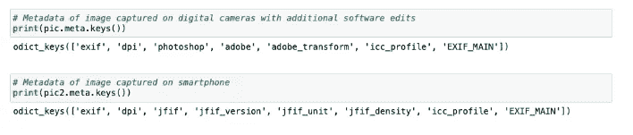
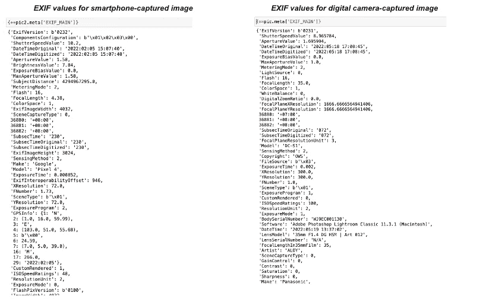
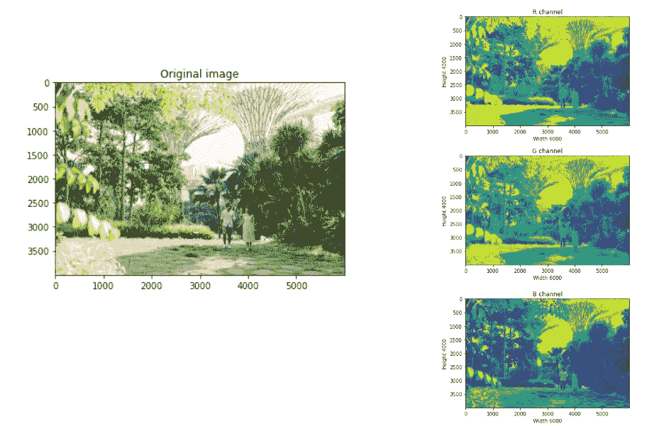
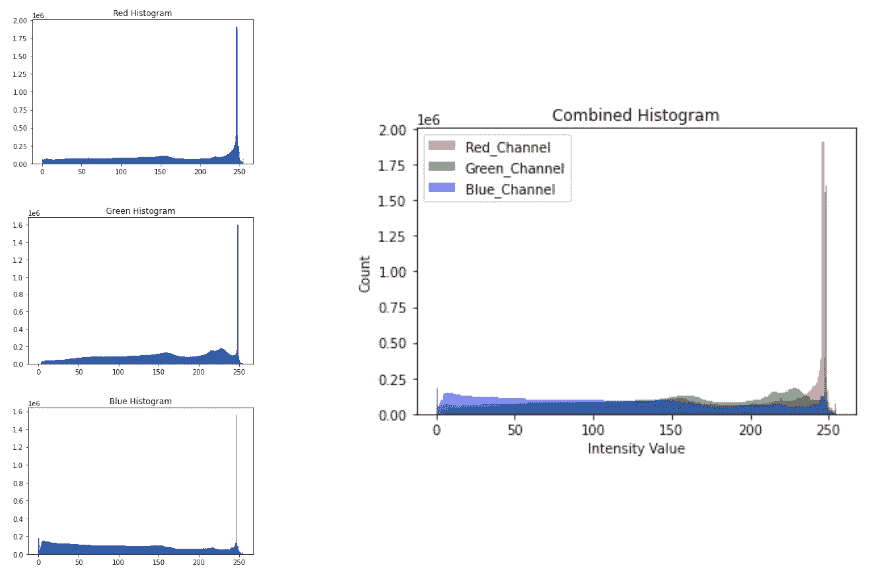
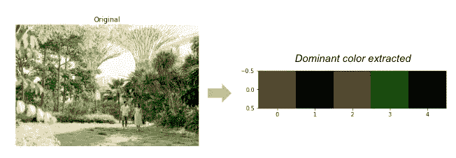
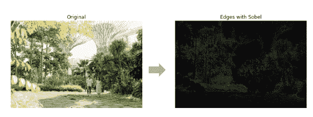

# Python 中的图像(元)数据特征提取

> 原文：<https://towardsdatascience.com/image-meta-data-feature-extraction-in-python-5fdf5778508a>

## 探索照片图像的元数据和颜色相关特征，以便进一步用于分析和 ML

在处理图像数据时，对象识别及其应用一直是数据分析师和数据科学家最关心的问题。很少关注利用这些图像的元数据。事实是，**我们可以仅从图像元数据中获得相当多的洞察力**。在本文中，我将分享我们如何从图像(照片)文件中提取一些突出的元数据相关特征，以便进一步处理和分析。

*本分析中使用的完整代码在这个* [*Github 项目下共享。*](https://github.com/oliviatan29/image-feature-extraction)

## 理解数字图像

计算机将数字图像存储为按列和行排列的**正方形像素**(图片元素)的阵列或矩阵:换句话说，是一个二维矩阵。根据这些正方形像素的大小，图像可能看起来更像马赛克(像素化)或更平滑；我们称之为**图像分辨率**。



数字图像是方形像素的阵列(图片由作者提供)

这些像素包含关于**颜色和强度的信息。**对于一幅**灰度图像，像素没有颜色信息**，但有一个 8 位整数的强度信息，给出 256 种可能的不同灰度。对于**彩色图像，像素用 RGB** — 3 层二维阵列表示，其中三层用相应的 8 位整数表示图像的红色、绿色和蓝色通道的强度。

来自数码相机(包括智能手机和扫描仪)的图像具有标准化的附加元数据，称为**可交换图像文件格式(Exif)。**引用[维基百科](https://en.wikipedia.org/wiki/Exif)，Exif 数据可以覆盖很广的范围，包括:

*   **相机设置**:相机型号和品牌、旋转、光圈、快门速度、焦距、测光模式、ISO 速度信息等
*   **图像指标**:像素尺寸、分辨率、色彩空间和文件大小
*   **日期和时间**信息
*   **位置**信息
*   **版权**信息

要从图像文件中提取的信息主要是直接数据或者只是上述主要属性的变换。

# 功能探索

为了这次探索，我使用了两个主要的 Python 库进行图像处理: [**imageio**](https://imageio.readthedocs.io/en/stable/) (用于图像读写)和[**skimage**](https://scikit-image.org/)**(高级图像处理)。**

## **提取图像属性**

**将图像数据导入 Python 记事本后，我们可以直接开始从图像中提取数据。可以生成的一些基本属性包括:**

*   **对象的类型(图像数组)**
*   **图像的形状:高度、宽度、大小(百万像素)**
*   **图像的维数:图像的数组维数；彩色图像通常为 3(R-G-B 通道)**

```
import imageio
import matplotlib.pyplot as plt# Load and show image
pic = imageio.imread('Documents/Photos/olivia-singapore-s1_11.jpg')plt.imshow(pic)# Getting basic properties
print('Type of the image : ',type(pic))print('Shape of the image : {}'.format(pic.shape))
print('Image Height : {}'.format(pic.shape[0]))
print('Image Width : {}'.format(pic.shape[1]))
megapixels = (pic.shape[0]*pic.shape[1]/1000000)
print('Megapixels : {}'.format(megapixels))print('Dimension of Image : {}'.format(pic.ndim))
```

**ImageIO 还允许将可用的元数据加载到字典中，可通过 *meta* 属性访问。**

```
# Print the available metadata fields
print(pic.meta.keys())
```

****每个图像的元数据可能因图像的捕获和处理方式而异**。例如，在 Adobe Photoshop 或 Lightroom 等软件中编辑过的图像可以有附加元数据来捕获应用程序配置。**

****

**不同图像文件上的不同元数据度量**

**可以使用`meta`函数提取每个元数据度量的值。**

```
print('DPI : ',pic.meta['dpi'])
print('Adobe : ',pic.meta['adobe'])
print('Adobe Transform : ',pic.meta['adobe_transform'])
print(pic.meta['exif'])
```

**和**在同一个元数据度量中，值可能不同**。例如，使用智能手机拍摄的图像的“EXIF”元数据可能有 GPS 位置数据，而使用数码相机(无 GPS)拍摄的图像可能没有。**

****

**不同影像文件上 EXIF 元数据的不同值**

**此 EXIF 元数据可用于多种用途:**

*   ****图像取证**(调查图像真实性、来源等)**
*   ****配置设置**(即复制相同的设置/颜色用于未来拍摄的图像)**

## **提取颜色属性**

**如上所述，数字图像是具有颜色和强度信息的像素的集合。因此，图像中要探索的主要属性是颜色和强度本身。**

**这些信息被记录在一个三层矩阵“ndarray”中。**第一和第二维是像素**的行和列，而**第三维是三个颜色通道**。为了获得特定像素的颜色强度，我们可以使用常用的数组访问语法`array[row,column,color]`来访问它，如下所示。**

```
# Accessing intesity for pixel located at Row : 100 ; Column : 50 
# Each channel's value of it, gradually R,G,Bprint('Value of only R channel {}'.format(pic[100, 50, 0])) #Red
print('Value of only G channel {}'.format(pic[100, 50, 1])) #Green
print('Value of only B channel {}'.format(pic[100, 50, 2])) #Blue
```

****

**访问特定像素的颜色强度**

**我们还可以剖析每个颜色通道的图像，即 **R** ed、**G**green 和 **B** lue 通道，并使用图像可视化和直方图按顺序探索亮度的变化。**

```
# Visualizing each color's channel# Red channel
plt.title('R channel')
plt.ylabel('Height {}'.format(pic.shape[0]))
plt.xlabel('Width {}'.format(pic.shape[1]))
plt.imshow(pic[ : , : , 0])
plt.show()# Green channel
plt.title('R channel')
plt.ylabel('Height {}'.format(pic.shape[0]))
plt.xlabel('Width {}'.format(pic.shape[1]))
plt.imshow(pic[ : , : , 1])
plt.show()# Blue channel
plt.title('R channel')
plt.ylabel('Height {}'.format(pic.shape[0]))
plt.xlabel('Width {}'.format(pic.shape[1]))
plt.imshow(pic[ : , : , 2])
plt.show()
```

****

**红色、绿色和蓝色通道的可视化**

```
# Showing color intensity distribution in a histogram# Obtain the red channel
red_channel = pic[:, :, 0]
# Plot the red histogram with bins in a range of 256
plt.hist(red_channel.ravel(), bins=256)
# Set title and show
plt.title('Red Histogram')
plt.show()# Obtain the green channel
green_channel = pic[:, :, 1]
plt.hist(green_channel.ravel(), bins=256)
plt.title('Green Histogram')
plt.show()# Obtain the blue channel
blue_channel = pic[:, :, 2]
plt.hist(blue_channel.ravel(), bins=256)
plt.title('Blue Histogram')
plt.show()# Combined Histogram
plt.hist(red_channel.ravel(), bins = 256, color = 'red', alpha = 0.5)
plt.hist(green_channel.ravel(), bins = 256, color = 'green', alpha = 0.5)
plt.hist(blue_channel.ravel(), bins = 256, color = 'blue', alpha = 0.5)plt.xlabel('Intensity Value')
plt.ylabel('Count')
plt.legend(['Red_Channel', 'Green_Channel', 'Blue_Channel'])plt.title('Combined Histogram')
plt.show()
```

****

**颜色强度直方图**

**这里我们可以看到，对于图像的每个颜色通道，大多数像素都具有高颜色强度(*看到直方图在 250 强度值*附近的尖峰)。蓝色通道具有相对较高的像素和较低的强度，这解释了整个 B 通道可视化中更多的填充颜色。**

**理解这一点对图像处理很有用。例如，如果图像想要在美学上被增强为更加暖色调 [**或冷色调**](https://www.johnpaulcaponigro.com/blog/5688/the-temperature-of-color-warm-or-cool/)**。要使图像更加暖色调，您可以增加 R 通道的亮度，而要使图像更加冷色调，您可以增加 B 通道的亮度。****

## ****高级功能****

****从上面的颜色强度数据提取中进一步探索，我们可以转换和外推它们以获得进一步的见解，如**获取图像调色板**和**边缘检测**。****

******获取图像调色板**可用于分析图像相似性(就光照和颜色而言)，而无需直接处理对象检测。想法是获得每个颜色通道的强度数据，然后**将具有相似强度的像素聚集在一起**。提取的主色是**聚类中心**数组。这种特征提取的代码和指南可以在[极客指南](https://www.geeksforgeeks.org/extract-dominant-colors-of-an-image-using-python/)中找到。****

********

****提取图像主色****

****可以对图像数据进行的其他变换是边缘检测和面部检测。这两者都可以使用 Python 中的`skimage`库进行处理。****

******边缘检测**通过检测像素亮度(强度值)的不连续性来工作。这种边缘检测的流行算法之一是 [**Sobel**](https://en.wikipedia.org/wiki/Sobel_operator) 。这是一个关于撇帐的功能，使用指南可以在[撇帐文档](https://scikit-image.org/docs/dev/auto_examples/edges/plot_edge_filter.html)中找到。****

********

****Sobel 边缘检测****

# ****结束语****

****除了直接处理和对象检测之外，图像数据还可能包含大量有价值的信息。范围从元数据到内容—颜色/强度提取和转换。**元数据(特别是 EXIF 值)对于数字取证分析和调查**-检查图像文件的真实性非常有用。**内容相关的特性(颜色)本身对调色板/vibes 探索**很有用。结合其他先进的处理和算法，它们可以用于具有各种应用的图像检测。****

*****本分析中使用的完整代码在这个* [*Github 项目下共享。*](https://github.com/oliviatan29/image-feature-extraction)****