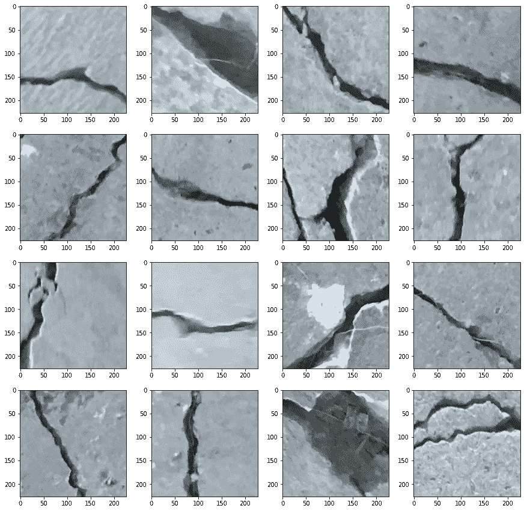
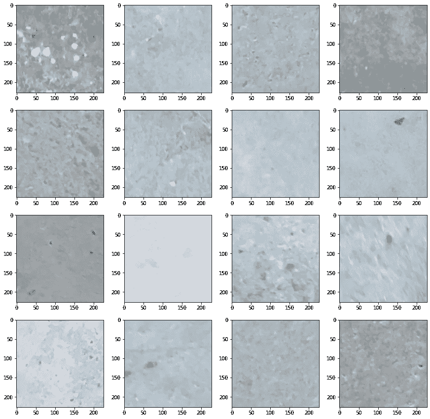
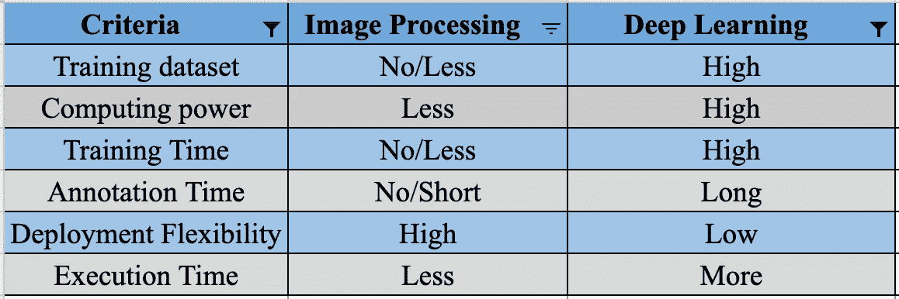

# 图像处理:平凡化

> 原文：<https://towardsdatascience.com/image-processing-trivialized-575bfa4bec3b>

## 深度学习，对于一切，为什么？


杰姆·萨哈冈在 [Unsplash](https://unsplash.com/s/photos/thinking-robots?utm_source=unsplash&utm_medium=referral&utm_content=creditCopyText) 上的照片

图像处理的意义正在递减，对于图像分类、物体检测等很多任务，它都被深度学习所取代。对于一些人来说，我同意深度学习比图像处理提供了更好的结果。但对于其他人，我会否认。在机器学习中，不能一刀切。根据我的经验，机器学习任务都是为了找到一个简单且接近准确的解决方案。客户和管理者都没有兴趣处理复杂和僵化的解决方案，除非它们比简单的解决方案好得多。

当采用深度学习代替图像处理时，也会出现类似的情况。它成为过度工程的典型案例。我最近在处理[表面裂纹检测](https://data.mendeley.com/datasets/5y9wdsg2zt/2)数据集时遇到了类似的情况。它受“CC by 4.0”许可。数据集包含有裂缝和无裂缝的各种混凝土表面的图像。数据集的目标是对图像进行分类。我喜欢浏览别人发表的作品。在这样做的时候，我惊讶地发现，他们中的大多数都实现了用于图像分类的卷积神经网络。我脑海中出现的即兴问题是，

> 为什么选择卷积神经网络？为什么不是图像处理？

这让我对自己实施图像处理的决定产生了怀疑，因为他们中的大多数人实施了用于图像分类的卷积神经网络。因此，我决定深入了解问题陈述，并设计合适的图像处理算法来破解它。在这篇文章中，我们将经历我所承担的整个过程。

# 目录

1.  [当前工业方法](https://medium.com/p/575bfa4bec3b/edit#a1dc)
2.  [数据集概述](https://medium.com/p/575bfa4bec3b/edit#3f52)
3.  [可用解决方案](https://medium.com/p/575bfa4bec3b/edit#1b37)
4.  [图像处理算法](https://medium.com/p/575bfa4bec3b/edit#8e99)
5.  [结论](https://medium.com/p/575bfa4bec3b/edit#dc05)

# 当前工业方法

裂缝是监测混凝土结构健康和诊断其劣化的一个重要方面。如果在早期阶段发现裂缝，可以采取进一步措施改善结构健康状况。

混凝土结构的检查每五到十年进行一次，以评估刚度和抗拉强度。在此过程中，经验丰富的土木工程师会目视检查裂缝及其特征，如长度、形状和深度。接下来，他们画出所有裂缝的草图，并准备检查报告。这一过程耗时、成本高，并且容易出现人为错误。这些行业最近开始使用摄像机进行基于图像的检测，以克服这些问题。公共数据集是可用的，包括有裂缝和没有裂缝的混凝土结构的图像。

# 数据集概述

用于问题陈述的数据集是“[表面裂纹检测](https://data.mendeley.com/datasets/5y9wdsg2zt/2)”。Kaggle 上也有。数据集包含有裂缝和无裂缝的各种混凝土表面的图像。图像数据分为两类，即负像(无裂纹)和正像(有裂纹)，放在单独的文件夹中进行图像分类。每个类有 20000 幅 RGB 图像，每幅图像的尺寸为 227 x 227 像素。高分辨率图像在表面光洁度和照明条件方面差异很大。

# 可用的解决方案

Kaggle 上可用于该数据集的大多数笔记本要么应用定制的 CNN 架构，要么微调预训练的模型。那很好，但是为什么不保持简单。在我们的领域中，图像处理是一个被严重低估的方面。对图像处理的深入理解有助于解决几个问题。

我用 OpenCV 开发了一个图像处理算法来解决图像分类的问题。对于那些不知道 OpenCV 的人来说，它是一个 python 库，提供了调整图像和对图像执行一些数学运算的功能。

# 图像处理算法

博客的这一部分将描述算法的代码演练，这将提供对解决方案的理解。首先，我比较了两类图像的数量，以确认我有足够的样本来测试我的算法。

```
Total number of positive images are 20000
Total number of negative images are 20000
```

可以实现翻转、旋转和颜色增强等数据增强技术来增加数据量，但对于图像处理来说似乎没有必要。首先，我们将看一些消极和积极类的例子。



来自[混凝土裂缝图像的正面图像用于分类](https://data.mendeley.com/datasets/5y9wdsg2zt/2)



用于分类的[混凝土裂缝图像的负像](https://data.mendeley.com/datasets/5y9wdsg2zt/2)

下一步我已经用 OpenCV 创建了一个图像处理算法。我把这个过程分成了四个简单的步骤。

1.  **锐化:**每一张通过算法的图像都会被初步锐化。这一步骤的目的是确保图像中的每个边缘都是明显可见的。
2.  **模糊:**我们只对捕捉大边缘感兴趣，因为它们代表裂缝。如果在不模糊的情况下应用锐化，它也将捕捉小边缘。因此，我在第二步中对图像进行了模糊处理，以消除小边缘。锐化的强度必须高于模糊，以确保大边缘在此步骤中不会模糊。
3.  **阈值处理:**首先将图像转换为灰度图像(单通道)，然后将灰度图像转换为二值图像。二进制图像是像素值为 0 或 255 的图像。通俗地说可以认为是黑白图像。我使用了一个简单的阈值技术，基本阈值为 230。
4.  **轮廓检测:**从第三步获得的二值图像中检测轮廓。对于每幅图像，我都提取了具有最大像素点的轮廓。图像分类的两个关键条件如下:

*   正片图像的最大轮廓应该超过 N 个像素。
*   负像的最大轮廓应该少于 N 个像素。

如果正类的分数接近于零，负类的分数接近于 20000，则该算法工作良好。在这种情况下，我们将 N 取为 100。可以对其进行优化以获得更好的结果。上面定义的方法在数据集的所有图像上实现。

```
{'Positive': 1582, 'Negative': 19962}
```

上述结果可以解释如下:

*   1582 张正面图像被错误分类
*   19962 张底片图像被正确分类

我也计算了算法的准确性。

```
Accuracy is 95.95%
```

# 结论

在代码演练之后，您可能会想，“这很简单。我也可以做到这一点”。确实如此。比起检测裂缝，**我更感兴趣的是传播对图像处理重要性的认识**。深度学习并不是所有问题的答案。一些用例可以用图像处理来解决，如寻找停车位、评估 MCQ 考试等。此外，还有许多额外津贴，如下所列。



图像处理津贴。来源:作者图片

除了 OpenCV，Scikit-image 也是一个著名的对图像进行操作的库。我希望通过这篇文章，你学会了图像处理的重要性。下面列出了一些通过 OpenCV 学习图像处理的资源，

*   [OpenCV 文档](https://docs.opencv.org/4.x/d1/dfb/intro.html)
*   [PyImageSearch 平台](https://pyimagesearch.com/category/image-processing/)

就这些了，伙计们。快乐学习。