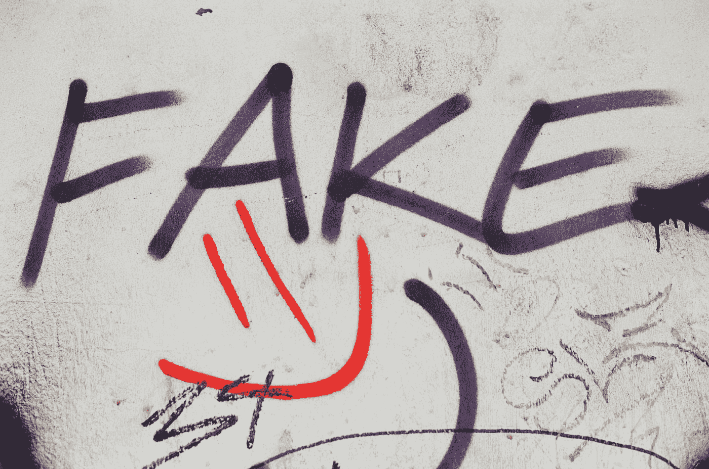
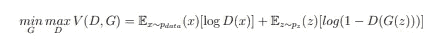
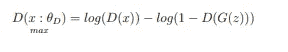
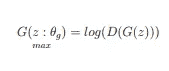
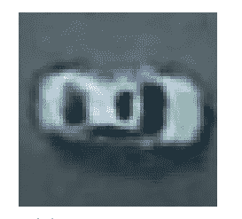
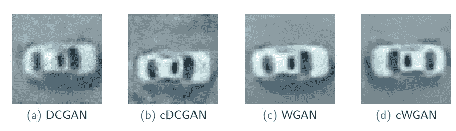

# 不同生成对抗网络产生的深度赝品图像质量评估

> 原文：<https://towardsdatascience.com/image-quality-assessment-of-deepfakes-produced-by-different-generative-adversarial-networks-b20513539cc6>

## 研究由不同 GAN 结构产生的深度假图像的质量

马库斯·斯皮斯克在 [Unsplash](https://unsplash.com?utm_source=medium&utm_medium=referral) 上的照片

**如果你喜欢今天的阅读，请关注我，并告诉我你是否还有其他话题想让我探讨！如果你没有中等账号，就通过我的链接** [**这里**](https://ben-mccloskey20.medium.com/membership) **报名吧！另外，在**[**LinkedIn**](https://www.linkedin.com/in/benjamin-mccloskey-169975a8/)**上加我，或者随时联系！感谢阅读！**

# 介绍

我最近完成了一项计算机视觉研究，并发现了我的 deepfake 图像的一个非常有趣的结果:GANs 的架构在 deep fake 的输出中创造了不同水平的“质量”。在这个定义中，质量可以联系到用手机的低像素镜头拍摄照片和专业摄影师使用的更复杂的设置之间的差异。

# 生成对抗网络

你可能想知道，什么是生成性对抗网络(GAN)？简而言之，GAN 有两个子角色，称为鉴别器和生成器，它们相互作用。这些连续的相互作用导致合成数据的输出。不仅是创建的数据是人工的，更重要的是它真实地呈现了它试图模仿的真实数据的分布和特征。看看我在下面创建的 deepfake 图片。人眼很难分辨真假！GANs 可以帮助平衡数据集，并为您的数据提供独特的样本，以增加数据集的多样性。

## 技术性较低的深潜

正如我所说，GAN 是一个由两部分组成的网络，一旦经过训练，它就会输出合成数据。请记住，一个“好”的 GAN 产生的数据我们无法分辨是假还是真！

* ***注意:虽然我说的是 GAN 会产生图像，但它也能产生表格数据！***

**鉴别器**

GAN 中鉴别器的工作是确定图像是真是假。我们给鉴别者真实的图像，而假图像来自发生器。随着时间的推移，鉴别器学会了如何更好地检测更逼真的假图像和真实图像之间的差异。

**发电机**

生成器的工作是创建假图像，称为 *deepfakes* 。一般来说，在模型训练的每一轮之后，生成器将被告知其图像基于鉴别器标记其样本的真实程度(如果许多样本被标记为“真实”，则生成器将继续制作与这些图像对齐的图像，因为它们欺骗了鉴别器)。随着发生器欺骗鉴别器的能力越来越强，看起来更真实的数据和图像就产生了。生成器正在通过提供给它的资源构建样本以提供给鉴别器。

## 更多技术深度潜水

如上所述，GAN 由两个模型组成:鉴别器和发生器。这是一个最小-最大游戏，输出是真实的合成数据。

甘函数(图片来自作者)

生成器的目标是两个最小化上面的函数(即将函数发送到 0)而鉴别器的目标是最大化上面的函数(即发送到 1)。该函数表示一个 ***纳什均衡问题*** ，其中鉴别器和发生器将有希望一起达到均衡。在模型训练中，重要的是鉴别器和生成器都不比另一个强，以便它们能够更好地一起检测和生成假图像。

**鉴别器**

鉴别器的功能(图片来自作者)

鉴别器希望最大化图像为真的对数概率减去图像为反的对数概率。这在数学上是有意义的。该算法在任何时候将假图像误标为真图像时都会对鉴别器进行处罚。在训练鉴别器时，建议给出一批真的和假的样品，而不是单个的混合样品，以增加稳定性。

**发电机**

生成器的功能(图片来自作者)

现在，之前我已经说过生成器试图*最小化*整体函数，但是从数学上来说，这个函数可以通过查看图像是假的而不是真实的概率来表示为最大化函数。生成器希望最大化图像是假的对数可能性。

您可能想知道，*GAN 是如何创建假数据的？*当向生成器提供来自向量空间的随机噪声时，它会这样做。随着时间的推移，生成器将学会将不同的特征映射到该向量空间，并将这些特征汇集在一起，以创建我们从其输出中获得的真实数据。生成器实际上是从零开始构建数据！

# 我使用的 GANS 类型

由于我使用了创建 deepfake 图像的 GANs，鉴别器和生成器网络是**卷积神经网络(CNN)。**阅读下面关于 CNN 的更多信息！

  

鉴别器是典型的 CNN，而发生器是一个 transpose CNN，它会随着时间的推移进行上采样并创建 deepfake 图像。我使用的 GAN 的变体是深度卷积 GAN (DCGAN)(在此了解更多关于此变体的信息)、条件化 DCGAN (cDCGAN)、Wasserstein GAN (WGAN)(在此了解更多关于此变体的信息)和条件化 WGAN (cWGAN)。

我不会深入每个变体的本质，但 DCGAN 是所有 GAN 变体中最不稳定的。GAN 模型通常在本质上是不稳定的，并且可能难以训练。通过调节 GAN，在这种情况下，我在图像标签上调节 GAN，我们可以获得更高质量的输出。Wasserstein GAN 比 DCGAN 更稳定，其架构有多种变化，包括采用推土机距离度量作为模型训练函数，该函数查看两个概率分布之间的相似性。

# 结果

我试图再造的一件物品是一辆汽车:

汽车(图片来自作者)

有趣的是，汽车图像的质量刚刚好，甘实际上是要清除一些明显的模糊。

Deepfake 汽车(图片来自作者)

请从左到右注意图像质量如何提高。在 DCGAN 中，你可以看到许多模糊的 RBG 噪声的迹象。当我们从左向右前进时，RGB 和模糊随着时间慢慢消失，cWGAN 变体能够产生最高质量的图像。所有的 GANs 都接受了相同数量的训练。这表明 GAN 的稳定性如何直接影响 deepfake 图像的“纯净”和逼真程度。

另一个有趣的发现是 WGAN 变体如何产生比原始图像更高质量和更清晰的图像。这可能部分是由于架构中增加的稳定性允许 GAN 捕捉高质量的像素特征并产生更真实的深度赝品。此外，WGANs 产生了更加逼真的阴影。

# 结论

如果您计划在研究中使用 GAN，我强烈建议您使用 WGAN 变体，并对数据集的某个要素进行调节(使用嵌入向量对图像标签上的 GAN 进行调节非常容易)。我希望这项研究向你展示了在任何模型中稳定性是多么重要，并且能够产生更强的输出。我的发现显示了不同的 GAN 变体如何产生不同质量的图像，以至于看起来好像 deepfakes 是用不同类型的相机拍摄的。当您想要平衡数据集或增加数据集的多样性以生成更通用、性能更高的模型时，这些发现会派上用场。感谢阅读！