# 基于 K 均值的图像量化

> 原文：<https://towardsdatascience.com/image-quantization-with-k-means-db7127503bcb>

## 使用 python、scikit-learn、numpy、PIL 和 matplotlib 通过量化进行图像压缩的简单实践教程

量子化指的是一种用单个量子值来表示一系列值的技术。对于图像，这意味着我们可以将整个颜色范围压缩成一种特定的颜色。这种技术是有损耗的，也就是说，我们故意丢失信息以支持更低的内存消耗。在本教程中，我将向你展示如何用很少的代码自己实现颜色量化。我们将使用 Python 和 scikit-learn、numpy、PIL 和 matplotlib。

让我们从下载由 [Pascal van Soest](https://unsplash.com/@pascalvansoest?utm_source=unsplash&utm_medium=referral&utm_content=creditCopyText) 拍摄的“Storr 老人”的美丽图像开始，我们将使用它(如果您使用 Windows 或没有 wget 访问权限，只需下载图像并将其保存为 image.jpeg):

```
wget -O image.jpg [https://unsplash.com/photos/ZI9X8Kz3ccw/download?ixid=MnwxMjA3fDB8MXxhbGx8MjN8fHx8fHwyfHwxNjY1MzE2ODE1&force=true](https://unsplash.com/photos/ZI9X8Kz3ccw/download?ixid=MnwxMjA3fDB8MXxhbGx8MjN8fHx8fHwyfHwxNjY1MzE2ODE1&force=true)
```


原始(调整大小)图像。由[帕斯卡尔·范·索斯特](https://unsplash.com/@pascalvansoest?utm_source=unsplash&utm_medium=referral&utm_content=creditCopyText)在 [Unsplash](https://unsplash.com/?utm_source=unsplash&utm_medium=referral&utm_content=creditCopyText) 上拍摄的照片。

接下来，我们可以加载图像，调整其大小以获得更好的性能，并将其作为 numpy-array 查看:

```
from PIL import Image
import numpy as np
import matplotlib.pyplot as pltimg = Image.open("image.jpg").resize((960, 600))
x = np.asarray(img)
```

图像编码成*宽*高*通道*大数组(这里: *960 * 600 * 3* )。通常，彩色图像存储为 RGB，并具有 3 个颜色通道(红色、绿色和蓝色)。你可以把它想象成一个大的 2D 数组，每个条目包含 3 个值。每个值代表 0 到 255 (2**8-1)之间的特定颜色通道的强度。其实这本身已经是 8 位量化了。

对于全局量化，我们丢弃关于每个通道的信息，并简单地将我们阵列中的所有强度作为一个大向量来处理。我们可以使用 matplotlib 轻松绘制结果直方图:

```
plt.figure(figsize=(16, 6))
plt.hist(x.ravel(), bins=np.arange(256), density=True, linewidth=0)
plt.xlabel("Value")
plt.ylabel("Density")
```


颜色强度的全局分布。

为了量化，我们希望用一个更小的数来代替这 256 个值，例如 8。为了实现这一点，我们可以简单地将空间平均分成 8 个“箱”,并将其中的所有值映射到该箱的平均值。但我们可以看到，我们的图像中的强度并不是均匀分布的:在略高于零的位置有一个较大的峰值，在 160°附近有一个较大的强度累积。如果我们平均划分空间，我们将忽略偏斜的分布，并且低估/高估特定的强度。相反，我们希望在密度高的区域有更窄的面元以获得更高的精度，而在密度较低的区域有更宽的面元，因为我们在那里没有太多的样本。

我们可以通过使用 K-Means 来实现这一点。这是一种无监督聚类算法，常用于在给定数据中寻找 **k** 聚类中心(称为**质心**)。你可能已经看到了在多维问题中的应用，但它也适用于 1D 分布，如我们的问题。我不打算在这里介绍 K-Means——有无数的文章解释得比我更好，或者，如果你更喜欢一个视频，我强烈建议你看一下 [Josh Starmer 的 StatQuest](https://www.youtube.com/watch?v=4b5d3muPQmA) 。

对于本文，我们将使用 K-Means 的一个略有不同的版本，称为 MiniBatchKMeans。类似地，对于深度学习中的优化，这里的想法是不在所有样本上计算聚类，而是通过在较小的批次上计算聚类来贪婪地逼近解决方案。这大大加快了收敛速度！

借助 scikit-learn，培训迷你批处理方式变得非常简单:

```
from sklearn.cluster import MiniBatchKMeansk_means = MiniBatchKMeans(k, compute_labels=False)
k_means.fit(x.reshape(-1, 1))
```

注意，我们将`x.reshape(-1, 1)`传递给 MiniBatchKMeans。这将我们的 3D 矩阵展平为一个向量，并增加了一个大小为 1 的伪维度，因为估计器只支持 2D 形状的阵列。此外，我们告诉评估者不要通过`compute_labels=False`计算每批标签，否则会显著增加训练时间。训练之后，我们希望将颜色强度映射到最近的质心。估计器没有直接这样做的功能，但是我们可以预测每个样本的质心标签，然后使用这个标签来求解质心的值:

```
labels = k_means.predict(x.reshape(-1, 1))
q_x = k_means.cluster_centers_[labels]
```

我们现在已经有了原始图像的量化表示，但我们需要将数组重新整形为原始图像形状，并将 scikit-learn 处理的所有浮点数转换回整数:

```
q_img = np.uint8(q_x.reshape(x.shape)
```

让我们把它们放在一个函数中，这个函数将把量化图像作为 numpy 数组返回:

```
from sklearn.cluster import MiniBatchKMeansdef quantize_global(x, k):
  k_means = MiniBatchKMeans(k, compute_labels=False)
  k_means.fit(x.reshape(-1, 1))
  labels = k_means.predict(x.reshape(-1, 1))
  q_x = k_means.cluster_centers_[labels]
  q_img = np.uint8(q_x.reshape(x.shape)
  return q_img
```

让我们看看量化 k=8 后强度分布会发生什么变化:

```
quantized_img  = quantize_global(x, 8)plt.figure(figsize=(16, 6))
plt.hist(x.ravel(), bins=np.arange(256), density=True, linewidth=0, label="original")
plt.hist(quantized_img.ravel(), bins=np.arange(256), density=True, linewidth=0, label="quantized")
plt.xlabel("Value")
plt.ylabel("Density")
```

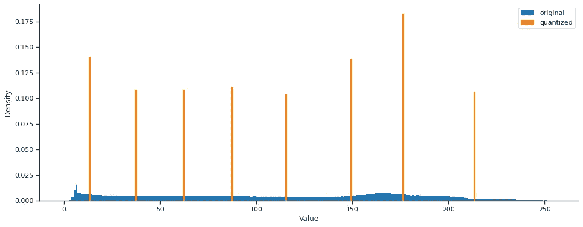

量化前后颜色强度的全局分布(全局，k=8)。

正如我们所看到的，正如我们所要求的，我们的原始分布已经被 8 个值所取代。请注意，根据原始分布的密度，质心的间距是不相等的。

最后，让我们测试一下 *k* 的值，看看这会如何影响我们的结果:

```
Image.fromarray(quantize_global(x, k))
```

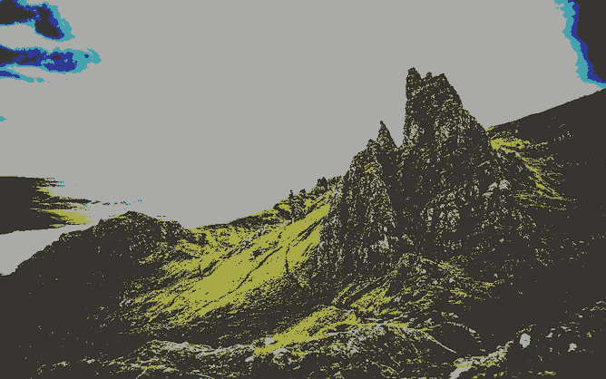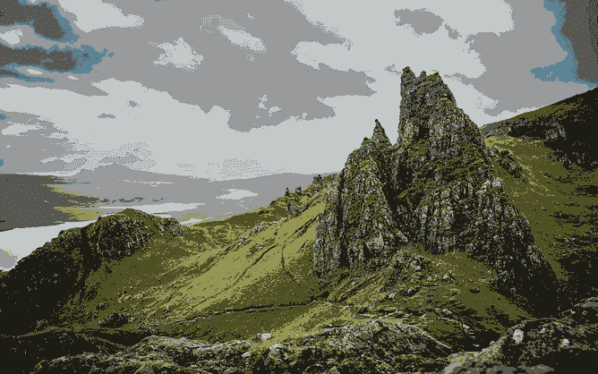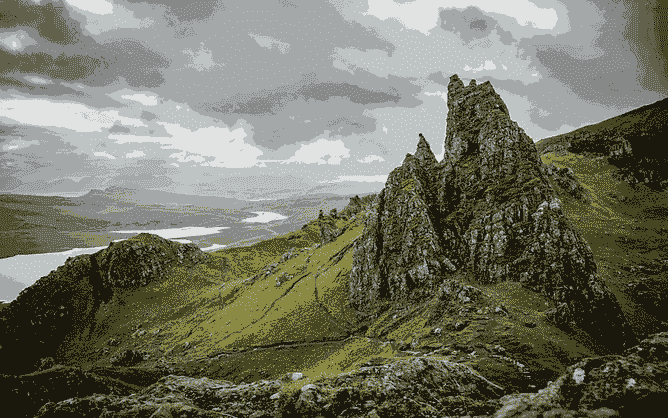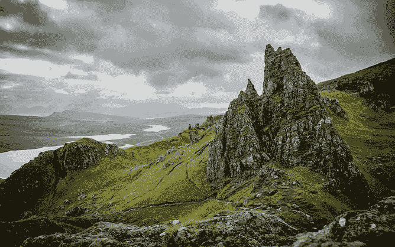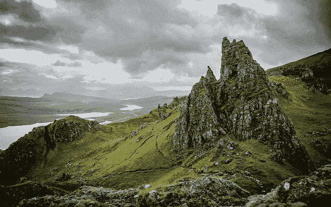

全局 K-表示 k=1、2、4、8、16 和 32(从上到下，从左到右)的量化。

对于 k=1，我们只看到一个灰色的图像。这并不奇怪，因为我们只剩下一种颜色强度，它将位于我们颜色空间的中间(即大约 125)。 *(125，125，125)* 在 RGB 中是灰色。随着我们增加 *k* ，我们看到结果图像更准确地代表了原始图像，因为我们学习了更多的强度来描述我们的图像。现在，注意一下 k=8 的图像—图像前景看起来非常准确，但背景非常分散。由此有两个重要的收获:1)量化使渐变(比如在灰色的天空中)看起来很糟糕；2)由于我们的 KMeans 方法，我们更关注前景，其看起来具有更密集的强度分布。

你可能会惊讶地发现每个图像中不止有 *k* 种颜色(例如，看到 k=2 的图像)，但解释相当简单:尽管我们只学会用 *k* 的强度来表示我们的图像，但我们仍然有 3 个通道，这给了我们可以表示的 k**3 种颜色组合。

但是图像大小会怎样呢？如果我们将图像保存到磁盘上，我们已经可以看到图像大小的减小，尽管在保存过程中还做了更多我们不知道的处理。

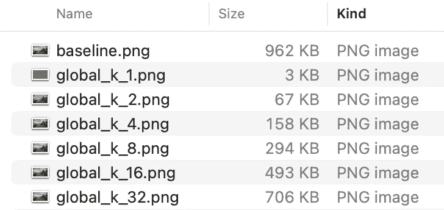

磁盘上的图像大小(如 PNG)随着质心数量(k)的增加而增加。

在科学领域，为你的方法设定基准是很好的实践。所以你可能想知道我们重建原始图像的效果如何。让我们通过使用 numpy 计算量化图像和原始图像之间的绝对误差和平方误差来进行测试，并将误差绘制成柱状图:

```
plt.figure(figsize=(8, 5))
plt.bar(range(9), [np.linalg.norm((x - quantize_global(x, 2**i)).ravel(), ord=1) for i in range(9)])
plt.xlabel(r"Number of Centroids ($2^k$)")
plt.ylabel(r"Absolute Error")plt.figure(figsize=(8, 5))
plt.bar(range(9), [np.linalg.norm((x - quantize_global(x, 2**i)).ravel(), ord=2) for i in range(9)])
plt.xlabel(r"Number of Centroids ($2^k$)")
plt.ylabel(r"Squared Error")
```

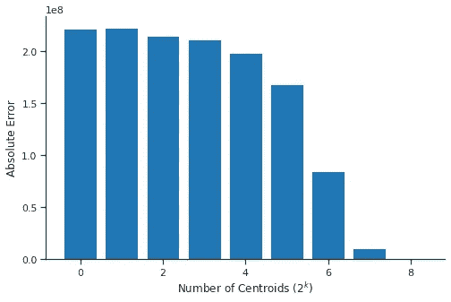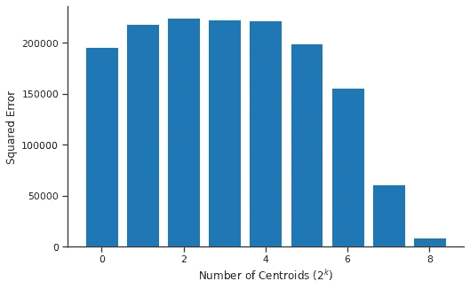

不同 k 值下量化图像的绝对(左)和平方(右)误差。

我们可以看到，绝对误差随着质心数量的增加而减小，最终在 k=256 时变为零(这时我们没有压缩)。尽管如此，还是存在一些误差，例如，由于我们在没有舍入的情况下对 uint8 进行了简单的转换，这导致了一些可见的平方误差。有趣的是，平方误差似乎也在增加，直到 k=4。请理解，误差是一种从数学上捕捉差异的好方法，但我们的人眼可能对这种差异不太敏感。毕竟，从这个意义上来说，这个错误可能并不意味着什么。问问你自己:我能发现 k=32 和上面的原始图像之间的错误吗？

## 逐通道量化

到目前为止，我们已经将所有强度视为相似的，与通道无关。然而，如果我们绘制每个通道的强度分布，我们可以看到一些差异，特别是在蓝色通道中:

```
plt.figure(figsize=(16, 6))plt.hist(x[:, :, 0].ravel(), color="red", bins=np.arange(256), density=True, linewidth=0, alpha=0.5)
plt.hist(x[:, :, 1].ravel(), color="green", bins=np.arange(256), density=True, linewidth=0, alpha=0.5)
plt.hist(x[:, :, 2].ravel(), color="blue", bins=np.arange(256), density=True, linewidth=0, alpha=0.5)plt.xlabel("Value")
plt.ylabel("Density")
```

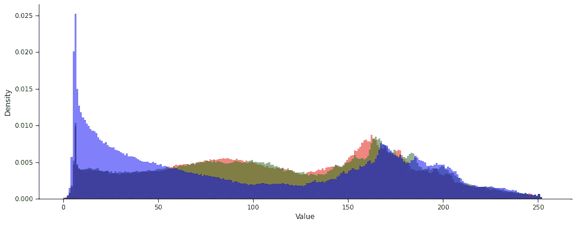

颜色强度的通道式分布。

我们还可以轻松调整代码，计算每个通道的量化，而不是全局量化:

```
def quantize_channels(x, k):
  quantized_x = x.copy()
  for d in range(3):
    channel = x[:, :, d].copy()
    k_means = MiniBatchKMeans(k, compute_labels=False)
    k_means.fit(channel.reshape(-1, 1))
    labels = k_means.predict(channel.reshape(-1, 1))
    quantized_x[:, :, d] = np.uint8(k_means.cluster_centers_[labels]).reshape(channel.shape)
  return quantized_x
```

然后根据全局量化，通过上面的代码对损失进行基准测试:

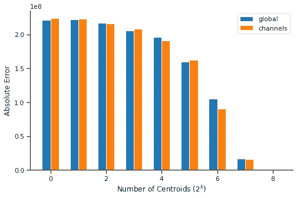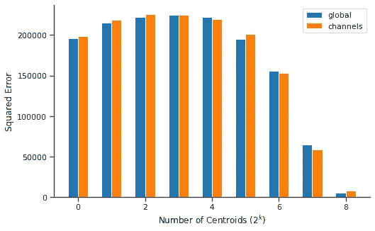

采用全局和通道量化时，不同 k 值下量化图像的绝对(左)和平方(右)误差。

然而，在最好的情况下，它比全局量化稍好，有时甚至更差。事实上，它需要多达 3 倍的内存，训练成本也是 3 倍以上的昂贵，似乎全局量化是一个更好的方法。

我试图理解为什么通道量化性能如此之差，似乎原因很简单，我们独立处理颜色通道，质心没有太大差异:

```
quantized_img = quantize_channels(x, 8)plt.figure(figsize=(16, 6))
plt.hist(quantized_img[:, :, 0].ravel(), bins=np.arange(256), density=True, linewidth=0, label="R", color="red")
plt.hist(quantized_img[:, :, 1].ravel(), bins=np.arange(256), density=True, linewidth=0, label="G", color="green")
plt.hist(quantized_img[:, :, 2].ravel(), bins=np.arange(256), density=True, linewidth=0, label="B", color="blue")
plt.xlabel("Value")
plt.ylabel("Density")
```

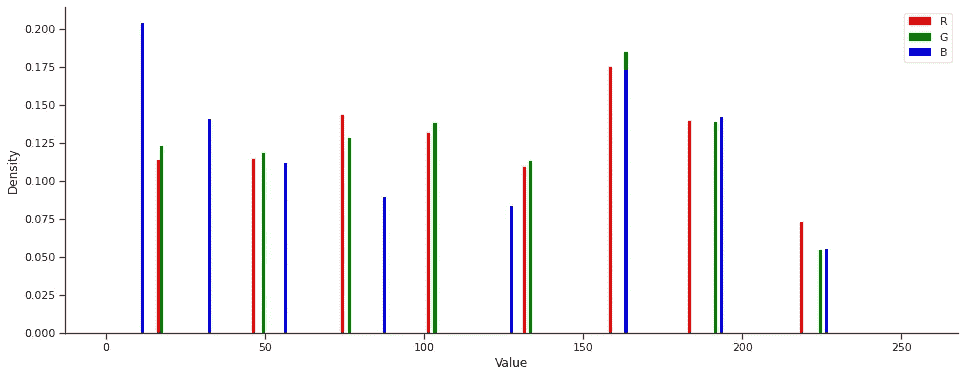

k=8 时逐通道量化后的色彩强度分布。

更好的方法可能是将每种颜色视为 3D RGB 向量，并在该空间中应用聚类。但我会让你决定的！根据上面的代码片段，你应该可以很容易地创建它。

我们已经成功地应用量化来压缩我们的颜色空间，但是也可以在其他域中应用量化，例如频域，这允许更大的压缩。敬请期待下一部分！

可以用 Google Colab 重现本文所有结果:[https://Colab . research . Google . com/drive/1 _ touwup 30 e 23 vkpqt 4 ohw kjy _ ddhlqn 9？usp =共享](https://colab.research.google.com/drive/1_TouWuP30e23VkPqT4ohWkjY_ddhLQn9?usp=sharing)

*感谢您阅读这篇文章！如果你喜欢它，请考虑订阅我的更新。如果你有任何问题，欢迎在评论中提出。*