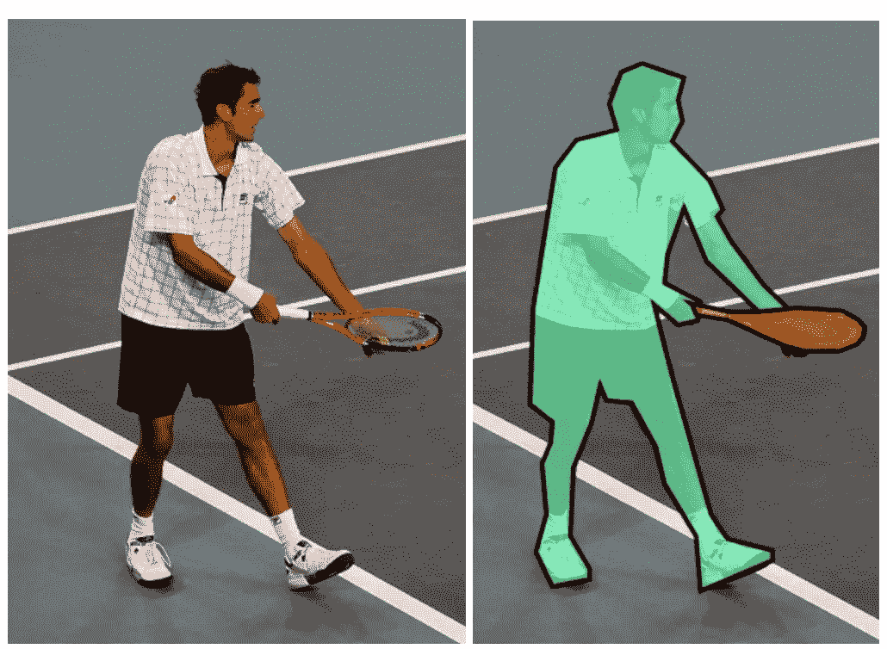
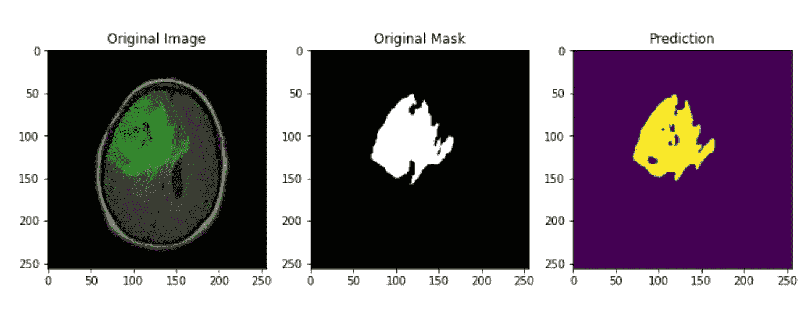
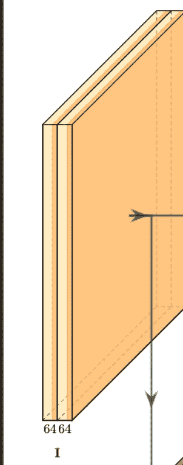
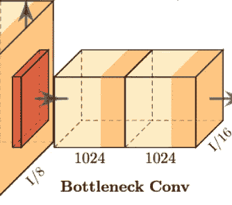
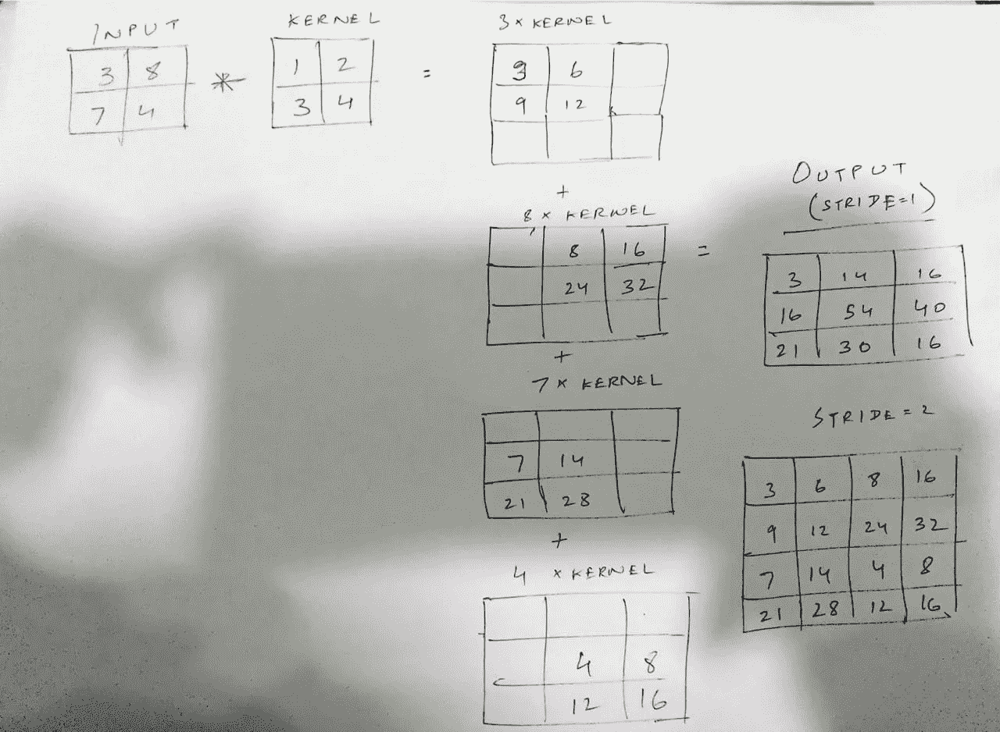
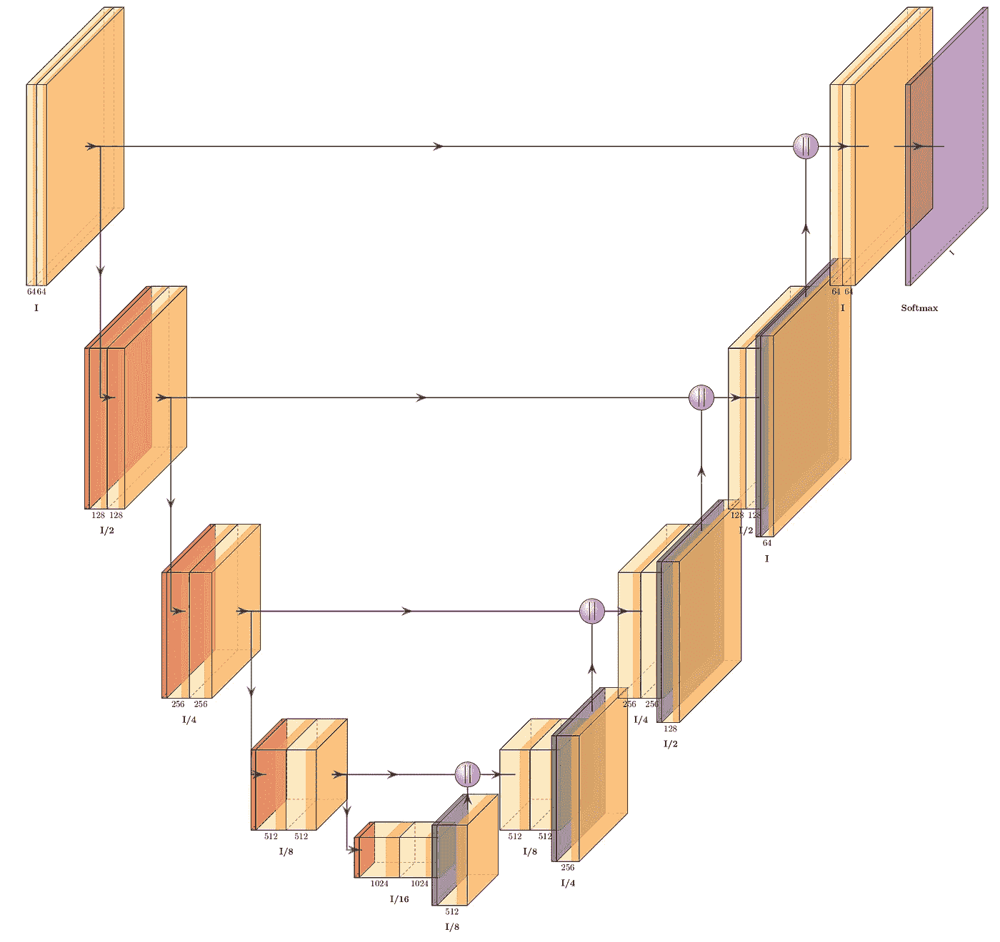
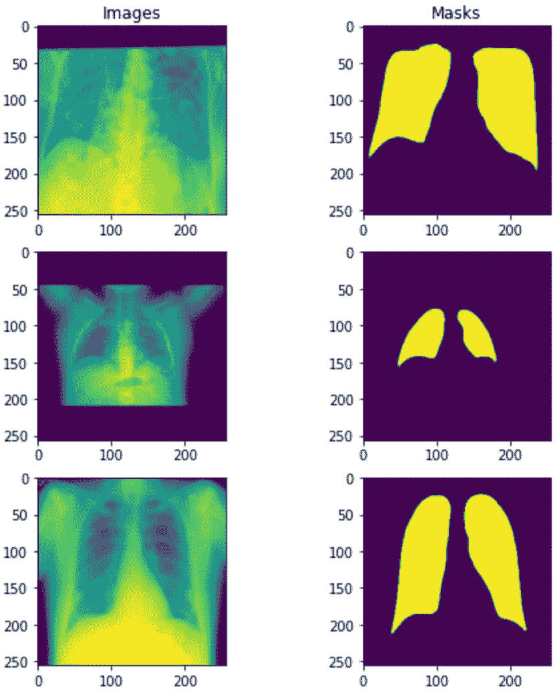
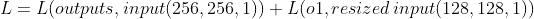
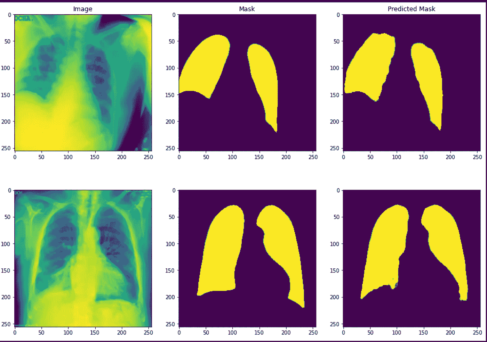

# 使用 Keras 模型的图像分割、UNet 和深度监督损失

> 原文：<https://towardsdatascience.com/image-segmentation-unet-and-deep-supervision-loss-using-keras-model-f21a9856750a>

## 用于分割的深度 CNN 经常遭受消失梯度。我们能通过计算不同输出水平的损耗来解决这个问题吗？

图像分割需要将图像像素分成不同的类别。一些应用包括识别医学图像中的肿瘤区域，在无人机图像中分离陆地和水域等。与 CNN 输出类别概率得分向量的分类不同，分割需要 CNN 输出图像。



网球运动员的图像分割([来源](https://cocodataset.org/#explore?id=47780) - [知识共享署名 4.0 许可](https://cocodataset.org/#termsofuse)

因此，传统的 CNN 架构被调整以产生期望的结果。包括变压器在内的一系列架构可用于分割图像。但除了改进网络设计，研究人员还在不断尝试其他方法来提高分段性能。最近，我偶然看到一部[作品](https://arxiv.org/pdf/1505.04597.pdf)，它简要描述了在多个输出级别计算损耗(深度监督损耗)的想法。在这个帖子里，我也想分享一下。

我们将实现一个类似于 UNet 的模型，这是一个常用的分段架构，并使用 Keras 模型子类训练它的监督损失。代码可以参考附带的 [Github](https://github.com/shashank14k/Medical-Imaging/blob/main/Deep%20Supervision/unet-supervision-loss.ipynb) / [Kaggle](https://www.kaggle.com/code/shashank069/unet-supervision-loss/notebook) 链接。我假设你熟悉 Keras 的基础知识。由于我们有很多内容要介绍，我将链接所有资源并跳过一些事情，如[骰子损失](https://medium.com/ai-salon/understanding-dice-loss-for-crisp-boundary-detection-bb30c2e5f62b)，使用 [model.fit](https://www.tensorflow.org/api_docs/python/tf/keras/Model) 、[图像生成器](https://www.tensorflow.org/api_docs/python/tf/keras/preprocessing/image/ImageDataGenerator)等的 keras 训练。

我们先从了解图像分割开始。

# 1.图象分割法

通俗地说，分割就是像素分类。如果一幅图像有一只猫和一只狗，我们希望机器识别猫和狗的像素，并在输出中将它们标记为 1(猫)或 2(狗)。每隔一个像素(背景、噪声等)为 0。为了训练这样的模型，我们使用成对的图像和遮罩。


[来源](https://cocodataset.org/#explore?id=47780) ( [知识共享署名 4.0 许可](https://cocodataset.org/#termsofuse))

假设您想在 MRI 扫描中识别脑瘤。您将首先创建一组阳性(肿瘤)和阴性(非肿瘤)图像的训练集。然后，您将为每个对象创建相应的遮罩。怎么做到的？进行 MRI 扫描，定位肿瘤区域，将该区域中的所有像素值转换为 0，并将所有其他像素设置为 1。自然地，非肿瘤口罩将是全黑的。在这些对(输入=MRI，输出=掩模)上训练的模型将在 MRI 扫描中识别肿瘤。有用，不是吗？



[来源](https://www.kaggle.com/code/shashank069/brainmri-image-segmentation-attentionunet)——来自我建立的一个肿瘤识别模型

现在，让我们深入研究分割图像所需的神经网络架构。

# 2.Unet

传统上，CNN 善于识别图像中的内容。对于分割，CNN 还需要学习精确定位图像成分。UNet 有能力做到这一点。最初的 [UNet](https://arxiv.org/abs/1505.04597) 论文将其描述为一个分为两部分的网络——收缩(编码器)和扩张(解码器)。让我们从编码器部分开始(注意，我对 [UNet](https://arxiv.org/abs/1505.04597) 论文中提出的架构做了一些小的修改)。

```
# Important Libraries to import
import pandas as pd
import numpy as np
import matplotlib.pyplot as plt
import os
import cv2
import tensorflow as tf
from tensorflow.keras import Input
from tensorflow.keras.models import Model, load_model, save_model
from tensorflow.keras.layers import Input, Activation, BatchNormalization, Lambda, Conv2D, Conv2DTranspose,MaxPooling2D, concatenate,UpSampling2D,Dropout
from tensorflow.keras.optimizers import Adam
from tensorflow.keras.callbacks import EarlyStopping, ModelCheckpoint,ReduceLROnPlateau
from tensorflow.keras import backend as K
from tensorflow.keras.preprocessing.image import ImageDataGenerator
from sklearn.model_selection import KFold
from tensorflow.keras.losses import BinaryCrossentropy
import random
```

## 2.1 编码器

编码器的功能类似于普通的 CNN。它不断地分解输入，以辨别与图像中的对象相关联的特征。该过程在多个块中重复进行(**编码器块**)。每个块由以下部分组成:

1.  具有填充和(3，3)内核的两个卷积层相继出现(我们称之为**卷积块**)。必要时还可以包括批量标准化/删除层[原始文件使用无填充卷积]。我们将使用 relu 作为激活函数。
2.  跨距为 2 的最大池层，用于压缩图像

```
# Functions to build the encoder path
def conv_block(inp, filters, padding='same', activation='relu'):
    *"""
    Convolution block of a UNet encoder
    """* x = Conv2D(filters, (3, 3), padding=padding, activation=activation)(inp)
    x = Conv2D(filters, (3, 3), padding=padding)(x)
    x = BatchNormalization(axis=3)(x)
    x = Activation(activation)(x)
    return x

def encoder_block(inp, filters, padding='same', pool_stride=2,
                  activation='relu'):
    *"""
    Encoder block of a UNet passes the result from the convolution block
    above to a max pooling layer
    """* x = conv_block(inp, filters, padding, activation)
    p = MaxPooling2D(pool_size=(2, 2), strides=pool_stride)(x)
    return x, p
```

如果您注意到，encoder_block 返回两个值-max-pooling 前后的图像。UNet 将后者(p)传递给下一个块，并将前者(x)存储在内存中。为什么？我们稍后将对此进行阐述。



图片[来源](https://github.com/HarisIqbal88/PlotNeuralNet/blob/master/examples/Unet_Ushape/Unet_ushape.pdf)(麻省理工学院[授权](https://github.com/HarisIqbal88/PlotNeuralNet/blob/master/LICENSE))

以上是在 [UNet](https://arxiv.org/pdf/1505.04597.pdf) 论文中描述的第一个编码器模块的副本。它包括两个卷积层，顺序应用 64 个滤波器，随后是最大池层(由向下的绿色箭头表示)。我们将用上面讨论的修改来复制它。对于像 UNet 这样不包含密集(平坦)图层的网络，输入形状规范不是强制性的，但我们将输入形状定义为(256，256，1)。

```
# Building the first block
inputs = Input((256,256,1))
d1,p1 = encoder_block(inputs,64)
```

第一个块之后是三个类似的块，具有滤波器= 128，256，512。这四个模块一起构成收缩路径/编码器。

```
#Building the other four blocks
d2,p2 = encoder_block(p1,128)
d3,p3 = encoder_block(p2,256)
d4,p4 = encoder_block(p3,512)
```

## 1.2 中部

是的，我们讨论过网络有两个部分，但我喜欢分开处理中间部分。



图片[来源](https://github.com/HarisIqbal88/PlotNeuralNet/blob/master/examples/Unet/Unet.pdf)(麻省理工[授权](https://github.com/HarisIqbal88/PlotNeuralNet/blob/master/LICENSE))

它从先前的编码器模块中获取最大汇集输出，并使其通过 1024 个滤波器的两个连续(3，3)卷积。就像卷积块一样，你问？是的，只是这一次，输出没有通过最大池。因此，我们将使用 conv 块，而不是编码器块，来创建中间部分。

```
# Middle convolution block (no max pooling)
mid = conv_block(p4,1024) #Midsection
```

这个最终输出现在将被**上采样**。

## 1.3 解码器

UNet 已经将图像塑造成许多特征地图，对输入图像中的内容有了一个公平的想法。它知道图像包含的不同类别(对象)。现在，它需要预测所有这些类的正确位置，并在最终输出中相应地标记它们的像素。为此，UNet 利用了两个关键理念——跳过连接和上采样。

## 1.3.1 置换卷积

在遍历编码器并通过中间块之后，输入转换为 shape (16，16，1024)[您可以使用 keras 的 model.summary( ) api 检查这一点]。UNet 然后应用转置卷积对输出进行上采样。那么什么是转置卷积呢？看看，如果下图回答了你的问题。



转置卷积

本质上，我们将输入中的每个条目乘以内核权重，并将所有(2，2)输出缝合在一起，得到最终输出。在共同指数中，这些数字相加。像卷积核一样，转置卷积核中的权重也是可学习的。网络在反向传播期间学习它们，以精确地对特征图进行上采样。参考这篇[文章](/understand-transposed-convolutions-and-build-your-own-transposed-convolution-layer-from-scratch-4f5d97b2967)以了解转置卷积的更多信息。

## 跳过连接

对于每个编码器模块，UNet 还有一个共轭解码器模块。我们已经讨论过，解码器模块学习对图像进行上采样。为了增强他们的学习能力，并确保像素在最终输出中的位置正确，解码器会向相应的编码器寻求帮助。他们以**跳过连接**的形式利用这一点。

跳过连接是 UNet 的本质。如果您以前使用过 resnets，您应该对这个概念很熟悉。在 1.1 中，我们讨论了 UNet 将卷积模块的输出(x)存储在内存中。这些输出与来自每个解码器模块的上采样图像连接在一起。下图中的水平箭头表示跳过连接。



图片[来源](https://github.com/HarisIqbal88/PlotNeuralNet/blob/master/examples/Unet_Ushape/Unet_ushape.pdf)(麻省理工[授权](https://github.com/HarisIqbal88/PlotNeuralNet/blob/master/LICENSE))

研究人员认为，随着输入图像在网络中滚动得越来越深，更精细的细节，如图像中不同对象/类别的位置，会丢失。跳过连接从初始层转移放错位置的信息，使 UNet 能够创建更好的分段图。

然后，连接的上采样图像流入卷积块(2 个连续的卷积层)。因此，我们使用以下函数来创建解码器模块。

```
# Functions to build the decoder block
def decoder_block(inp,filters,concat_layer,padding='same'):
    #Upsample the feature maps
    x=Conv2DTranspose(filters,(2,2),strides=(2,2),padding=padding)(inp)
    x=concatenate([x,concat_layer])#Concatenation/Skip conncetion with conjuagte encoder
    x=conv_block(x,filters)#Passed into the convolution block above
    return x
```

## 1.4 最终的联合国电子信息网网络

下面是我们最后的 UNet 网络。e5 之后的输出具有形状(256，256，64)。为了将其与输入(256，256，1)匹配，我们将使用一个带有 1 个过滤器的(1，1)卷积层。如果你对 1，1 卷积感兴趣，一定要看这个吴恩达的视频。

```
# Bulding the Unet model using the above functions
inputs=Input((256,256,1))
d1,p1=encoder_block(inputs,64)
d2,p2=encoder_block(p1,128)
d3,p3=encoder_block(p2,256)
d4,p4=encoder_block(p3,512)
mid=conv_block(p4,1024) #Midsection
e2=decoder_block(mid,512,d4) #Conjugate of encoder 4
e3=decoder_block(e2,256,d3) #Conjugate of encoder 3
e4=decoder_block(e3,128,d2) #Conjugate of encoder 2 
e5=decoder_block(e4,64,d1) #Conjugate of encoder 1
outputs = Conv2D(1, (1,1),activation=None)(e5) #Final Output
ml=Model(inputs=[inputs],outputs=[outputs,o1],name='Unet')
```

## 2.图像分割和深度监控

好了，该实施我们所学的内容了。

我们将在这个[新冠肺炎胸部 x 光](https://www.kaggle.com/datasets/tawsifurrahman/covid19-radiography-database) ( [主数据集](https://www.kaggle.com/datasets/anasmohammedtahir/covidqu))数据库上执行图像分割。它包括四个图像类别— Covid、正常、肺部阴影和病毒性肺炎。通过这篇文章，我只想分享如何使用监督损失和 Keras 模型子类来分割图像。性能在这里不是一个因素。

因此，我将构建一个简单的问题。我们将从 Covid 类获取图像，并将它们的像素分割成肺和非肺。(注意，我们并不试图训练模型来识别 covid 受影响的区域，而是绘制肺部所占据的空间)。然而，典型地，医学成像涉及极其复杂的情况，如发现肿瘤影响的器官等。虽然我们不会在这里讨论它们，但是您可以使用/修改所附的代码来实现这些引人注目的应用程序。

我们使用以下代码块从目录中检索图像/遮罩路径

```
# Block to read image paths, will be used in image data generator
df = pd.DataFrame(columns=['img_path','msk_path','img_shape','msk_shape','class'])
for cat in ['COVID']:
    dir_ = f"../input/covid19-radiography-database/COVID-19_Radiography_Dataset/{cat}"
    for f in os.listdir(f"{dir_}/images"):
        s1 = cv2.imread(f"{dir_}/images/{f}",config.img_type_num).shape
        s2 = cv2.imread(f"{dir_}/masks/{f}",config.msk_type_num).shape
        dic={'img_path':f"{dir_}/images/{f}",'msk_path':f"{dir_}/masks/{f}",'img_shape':s1,
            'msk_shape':s2}
        df = df.append(dic,ignore_index=True)
```

以下是数据集中的一些图像及其对应的遮罩。如上所述，掩码有两类:

0:肺

1:非肺



作者图片

**2.1 功能缺失和深度监管缺失**

训练掩码只有两个值，0 和 1。因此，我们可以使用[二元交叉熵](/understanding-binary-cross-entropy-log-loss-a-visual-explanation-a3ac6025181a)来计算它们和我们最终输出之间的损耗。现在，让我们解决房间里的大象——监督缺失。

深度神经结构的一个问题是梯度损失。一些架构如此之深，以至于梯度在反向传播到初始层时消失，导致初始层中最小的权重偏移，从而导致学习不足。此外，这使得模型不成比例地依赖于更深层的性能。

为了提高梯度流，这篇论文建议计算不同解码器级别的损耗。你会问，具体是怎样的？首先，如下所示，我们将从网络中提取一个额外的输出‘O1’。我们将从倒数第二个解码器(e4)获得形状为(128，128，128)的结果，并使用(1，1)卷积滤波器将其缩小到(128，128，1)。

```
# Adding output from 2nd last decoder block
inputs=Input((256,256,1))
d1,p1=encoder_block(inputs,64)
d2,p2=encoder_block(p1,128)
d3,p3=encoder_block(p2,256)
d4,p4=encoder_block(p3,512)
mid=conv_block(p4,1024) #Midsection
e2=decoder_block(mid,512,d4) #Conjugate of encoder 4
e3=decoder_block(e2,256,d3) #Conjugate of encoder 3
e4=decoder_block(e3,128,d2) #Conjugate of encoder 2 
o1 = Conv2D(1,(1,1),activation=None)(e4) # Output from 2nd last decoder
e5=decoder_block(e4,64,d1) #Conjugate of encoder 1
outputs = Conv2D(1, (1,1),activation=None)(e5) #Final Output
```

然后，我们将 o1 作为模型输出添加到 Keras 的模型 API 的输出列表中。

```
# Adding output to output list in keras model API
ml=Model(inputs=[inputs],outputs=[outputs,o1],name='Unet')
```

接下来，为了计算这个级别的损失，我们还需要将输入的副本调整为(128，128，1)。现在，最后的损失将是:



我们也可以对这两个损失进行加权组合。计算不同层的损耗也使它们能够更好地逼近最终输出。

## 2.2 使用 Keras 模型子类进行培训

好的，现在剩下的就是训练了。虽然从技术上讲，您可以在著名的“ml.fit”中传递输入列表和调整大小的输入，但我更喜欢使用 keras model 子类。它允许我们更多地使用损失函数。

我们创建一个继承 tf.keras.Model 的类网络。在初始化类网络的对象时，我们将传递要使用的模型(ml)、损失函数(二进制交叉熵)、度量([骰子损失](https://medium.com/ai-salon/understanding-dice-loss-for-crisp-boundary-detection-bb30c2e5f62b))和损失权重(对两个解码器级别的损失进行加权)。

```
# Defining network class which inherits keras model class
class network(tf.keras.Model):

    def __init__(self,model,loss,metric,loss_weights):
        super().__init__()
        self.loss = loss
        self.metric = metric
        self.model = model
        self.loss_weights = loss_weights
```

然后，我们将使用函数 train_step 覆盖“ml.fit”中发生的情况。输入图像通过网络的整个流程和损失计算都是在' [tf 范围内完成的。GradientTape'](https://www.tensorflow.org/api_docs/python/tf/GradientTape) ,仅用两条线表示梯度。

```
# Overriding model.fit using def train_step
def call(self,inputs,training):
        out = self.model(inputs)
        if training==True:
            return out
        else:
            if type(out) == list:
                return out[0]
            else:
                return out

    def calc_supervision_loss(self,y_true,y_preds):
        loss = 0
        for i,pred in enumerate(y_preds):
            y_resized = tf.image.resize(y_true,[*pred.shape[1:3]])
            loss+= self.loss_weights[i+1] * self.loss(y_resized,pred)
            return loss

    def train_step(self,data):
        x,y = data
        with tf.GradientTape() as tape:
            y_preds = self(x,training=True)
            if type(y_preds) == list:
                loss = self.loss_weights[0] * self.loss(y,y_preds[0])
                acc = self.metric(y,y_preds[0])
                loss += self.calc_supervision_loss(y,y_preds[1:])
            else:
                loss = self.loss(y,y_preds)
                acc = self.metric(y,y_preds)
        trainable_vars = self.trainable_variables #Network trainable parameters
        gradients = tape.gradient(loss, trainable_vars) #Calculating gradients 
        #Applying gradients to optimizer
        self.optimizer.apply_gradients(zip(gradients, trainable_vars)) 
        return loss,acc
```

当我们操作监督损失时，网络返回列表中的输出，我们调用函数 calc_supervision_loss 来计算最终损失。

类似地，我们可以覆盖验证步骤

```
# Overriding validation step
def test_step(self,data):
        x,y=data
        y_pred = self(x,training=False)
        loss = self.loss(y,y_pred)
        acc = self.metric(y,y_pred)
        return loss,acc
```

从现在开始，一切都是惯例。我们将使用 [Keras ImageDataGenerator](https://www.tensorflow.org/api_docs/python/tf/keras/preprocessing/image/ImageDataGenerator) 来传递用于训练的图像-遮罩对。

```
# Keras Image data generator
def img_dataset(df_inp,path_img,path_mask,batch):
    img_gen=ImageDataGenerator(rescale=1./255.)
    df_img = img_gen.flow_from_dataframe(dataframe=df_inp,
                                     x_col=path_img,
                                     class_mode=None,
                                     batch_size=batch,
                                    color_mode=config.img_mode,
                                         seed=config.seed,
                                     target_size=config.img_size)
    df_mask=img_gen.flow_from_dataframe(dataframe=df_inp,
                                     x_col=path_mask,
                                     class_mode=None,
                                     batch_size=batch,
                                    color_mode=config.msk_mode,
                                        seed=config.seed,
                                     target_size=config.img_size)
    data_gen = zip(df_img,df_mask)
    return data_gen
```

接下来，我们创建训练集和验证集，设置优化器，实例化我们上面创建的网络类并编译它。(正如我们从 keras 继承类网络一样，我们可以使用。直接编译功能)

```
train=img_dataset(train_ds,'img_path','msk_path',config.batch_size)
        val=img_dataset(val_ds,'img_path','msk_path',config.batch_size)
        opt = Adam(learning_rate=config.lr, epsilon=None, amsgrad=False,beta_1=0.9,beta_2=0.99)

        model = network(ml,BinaryCrossentropy(),dice_coef,[1,0.5])
        model.compile(optimizer=opt,loss=BinaryCrossentropy(),metrics=[dice_coef])
```

进入训练循环

```
# Custom training loop
best_val = np.inf
        for epoch in range(config.train_epochs):
            epoch_train_loss = 0.0
            epoch_train_acc=0.0
            epoch_val_acc=0.0
            epoch_val_loss=0.0
            num_batches = 0
            for x in train:
                if num_batches > (len(train_ds)//config.batch_size):
                    break
                a,b = model.train_step(x)
                epoch_train_loss+=a
                epoch_train_acc+=b
                num_batches+=1
            epoch_train_loss = epoch_train_loss/num_batches
            epoch_train_acc = epoch_train_acc/num_batches
            num_batches_v=0
            for x in val:
                if num_batches_v > (len(val_ds)//config.batch_size):
                    break
                a,b = model.test_step(x)
                epoch_val_loss+=a
                epoch_val_acc+=b
                num_batches_v+=1
            epoch_val_loss=epoch_val_loss/num_batches_v
            if epoch_val_loss < best_val:
                best_val = epoch_val_loss
                print('---Validation Loss improved,saving model---')
                model.model.save('./weights',save_format='tf')
            epoch_val_acc=epoch_val_acc/num_batches_v
            template = ("Epoch: {}, TrainLoss: {}, TainAcc: {}, ValLoss: {}, ValAcc {}")
            print(template.format(epoch,epoch_train_loss,epoch_train_acc,
                                  epoch_val_loss,epoch_val_acc))
```

## 2.3 结果



预测(图片由作者提供)

预测的掩模相当准确。该模型的验证骰子得分为 0.96，验证损失为 0.55。然而，正如我们所讨论的，我们不应该过多地解读这些值，因为手头的问题是粗糙的。目的是展示如何使用监督损失。在上面提到的[论文](https://arxiv.org/abs/2110.03352v2)中，作者使用三个解码器的输出来计算最终损耗。

谢谢你一直读到最后。我希望这能使你在将来使用监督损失。如果你喜欢这份工作，一定要检查我的 Github。

参考资料:

[https://arxiv.org/abs/1505.04597](https://arxiv.org/abs/1505.04597)

[](https://arxiv.org/abs/2110.03352v2) [## 优化的 U-Net 用于脑肿瘤分割

### 我们提出了一个优化的 U-Net 架构，用于 BraTS21 挑战赛中的脑肿瘤分割任务。找到…

arxiv.org](https://arxiv.org/abs/2110.03352v2) [](https://www.jeremyjordan.me/semantic-segmentation/) [## 语义图像分割综述。

### 在这篇文章中，我将讨论如何使用卷积神经网络来完成语义图像分割的任务。图像…

www.jeremyjordan.me](https://www.jeremyjordan.me/semantic-segmentation/) [](https://github.com/shashank14k/Medical-Imaging/tree/main/BrainMRI_Image%20Segmentation) [## 医学成像/大脑 main 主沙山 14k 图像分割/医学成像

### 这个项目的目标是使用卷积神经网络(CNN)的医学图像分割…

github.com](https://github.com/shashank14k/Medical-Imaging/tree/main/BrainMRI_Image%20Segmentation) [](https://ieeexplore.ieee.org/document/9144185) [## 人工智能能帮助筛查病毒性和新冠肺炎肺炎吗？

### 冠状病毒病(新冠肺炎)是一种疫情疾病，已经造成数千人死亡和感染…

ieeexplore.ieee.org](https://ieeexplore.ieee.org/document/9144185) 

[https://linking hub . Elsevier . com/retrieve/pii/s 001048252100113 x](https://linkinghub.elsevier.com/retrieve/pii/S001048252100113X)