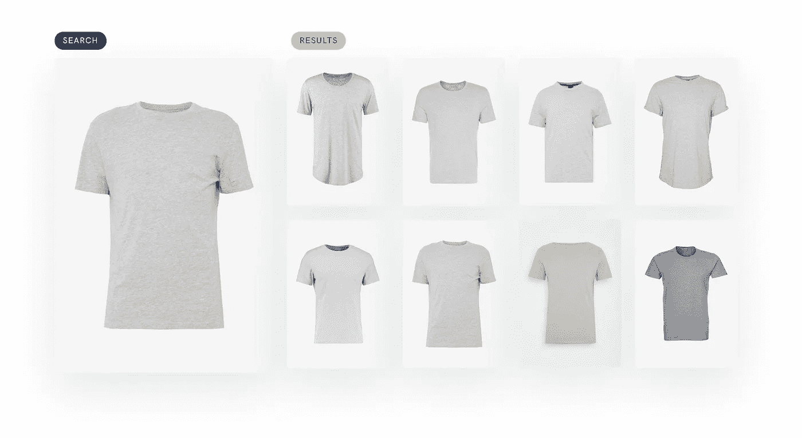
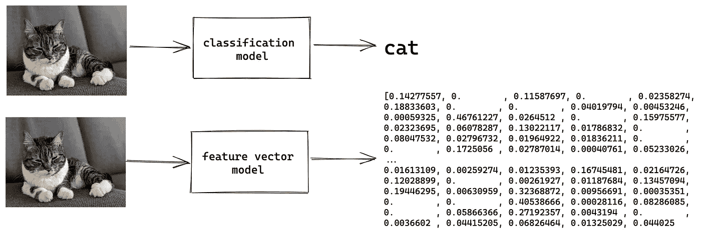
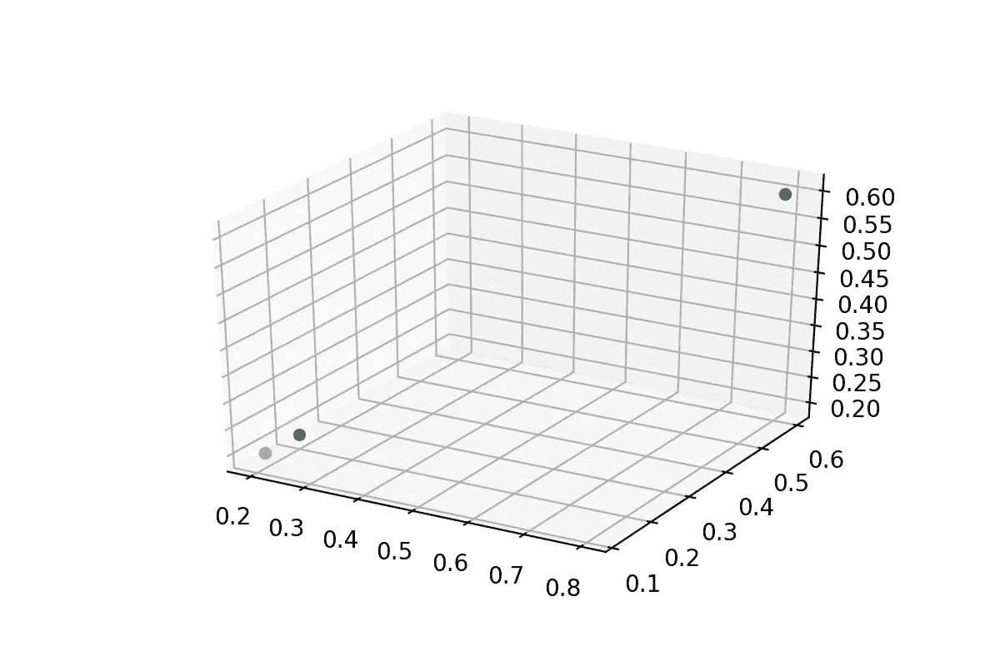
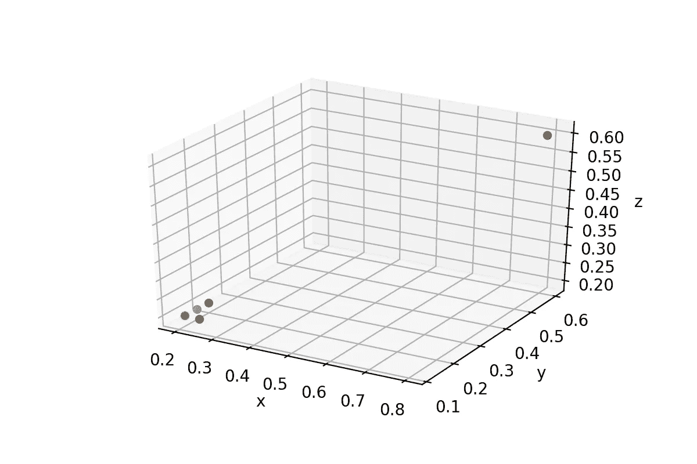
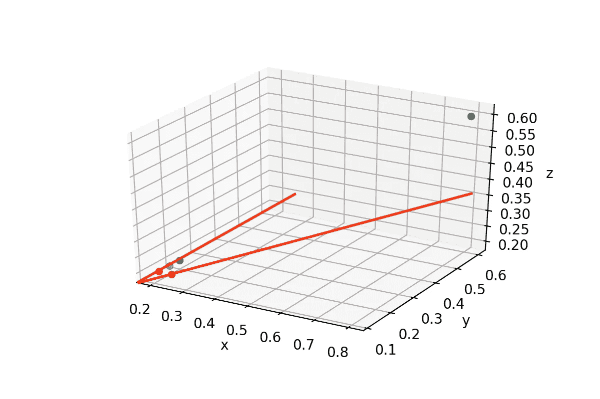
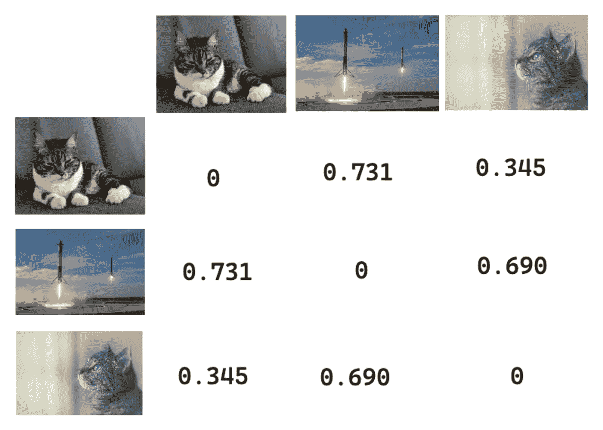

# 如何利用深度学习实现图像相似性

> 原文：<https://towardsdatascience.com/image-similarity-with-deep-learning-c17d83068f59>

## 我们可以使用机器学习在适当的上下文中返回有意义的相似图像、文本或音频。简单快捷。

想象一下，实现一种算法来直观地比较不同的 t 恤以找到匹配的 t 恤，需要付出多少编程上的努力。用传统的编程方法归档好的结果是一项挑战。

通过深度学习，我们可以轻松地将其扩展到无限数量的不同用例。我们通过使用深度学习模型的已学习视觉表示来做到这一点。

本文介绍了一种简单快速的方法来实现图像相似性搜索。

*为了简单起见，我们使用图像，但是同样的方法也可以推广到任何可以用向量表示的东西。*

作者图片——基于深度学习的图像相似度结果，来源:【https://ioannotator.com/image-similarity-search 

# 直接跳到笔记本上编码

如果你想运行本文中的代码，可以去 Google Colab 笔记本。
*您需要在笔记本中上传并引用自己的图片。*

 [## 谷歌联合实验室

### 图像相似度

colab.research.google.com](https://colab.research.google.com/drive/1fgFMR-9dpx13CKZm_uYRwbji79PT83Pu?usp=sharing) 

# 用例

在我们深入挖掘技术细节之前，让我们从几个用例开始启发您。用例是无穷无尽的，您可以在许多不同的领域使用图像相似性。
我在过去几年中参与的一些用例:

## **电子商务**

电子商务有许多相似性搜索的用例。最明显的一个，根据实际的产品图片找到相似的产品。还有一些不太明显的问题，比如通过防止上传同一产品的多个图片来保持产品目录的整洁。

## 数字文献档案

想象一下，一个拥有数百万扫描文档的大型非结构化数字归档。放置正确的标签来查找相似的文档是非常耗时的。深度学习方法消除了在图像上贴标签的需要。

## **机器学习**

高质量的训练数据是成功的机器学习项目的关键。训练数据中有重复项会导致不好的结果。图像相似性可用于在数据集中查找重复项。

# 图像的视觉表示

当使用深度学习模型时，我们通常使用模型的最后一层，即输出层。这一层为我们提供了图像的**类。图像上这是猫、车、桌子、狗，还是老鼠？**

我们可以移除这个分类层，并获得为输入图像生成的模型的**视觉表示**。该表示是介于 0 和 1 之间的浮点数的向量**。**

作者照片—分类与特征向量

让我们概括这种方法，并将其与我们人类感知世界的方式进行比较。我们从小就知道独特的细节，比如汽车大部分是方形的，有轮胎、灯和门。我们向量的数字可能代表相似的细节。深度学习模型在训练过程中学习了这些信息。

模型学到的是“*多半是”*一个黑箱。最近的研究帮助我们更好地理解这一点。如果你对特定的主题感兴趣，我推荐你多读一些关于可解释的人工智能的书。

为了得到这样一个向量(也称为嵌入)，我们只需要几行代码和一个预先训练好的模型。

## 预训练模型

我们可以利用许多预先训练的深度学习模型中的一个。它们概括得足够好，适合大多数用例。根据您的具体使用情况对预训练模型进行微调是有意义的。但是在你投入精力之前，我建议不要微调。

TensorFlow Hub 可以轻松重用已经预先训练好的[图像特征和矢量模型](https://tfhub.dev/s?module-type=image-feature-vector)。
我们使用 TensorFlow Keras 加载模型。输入形状定义了模型被训练的图像大小。这意味着模型学会了寻找特定大小的图案，我们通过遵循推荐的图像大小来做正确的事情。

如果你改变模型的网址，请记住不同的模型期望不同的图像形状。

## 把...嵌入

为了得到嵌入，我们输入一幅图像，并让模型进行预测。图像本身需要一些预处理

1.  调整到模型训练时的大小
2.  将图像转换成每个像素的颜色表示
3.  将 0 和 1 之间的值标准化

有了这几行代码，我们就可以得到 0 到 1 之间浮点数的**可视化表示、**向量**。向量的长度因型号而异。在我们的例子中，使用的模型具有 1280 个数字的向量长度。**

我们可以用这种视觉表现来计算图像有多相似。

# 如何度量图像相似度

为了计算图像的相似性，我们需要一个度量。为了简单起见，我们只涵盖最常见的`euclidean`、`cosine`和`dot`。

为了避免不必要的数学，我试图尽可能实际地描述它。

想象一个有 3 个轴`x`、`y,`和`z`的坐标系，并假设我们的特征向量有 3 个元素的长度，而不是 1280。
让我们也想象我们有在该坐标系中表示的 3 幅图像的以下特征向量。

*   卡特彼勒`[0.1, 0.1, 0.2]`(蓝点)
*   猫`[0.2, 0.12, 0.2]`(橙点)
*   工作台`[0.8, 0.6, 0.6]`(绿点)

作者照片

`euclidean`距离顾名思义就是测量点与点之间的距离。我们可以清楚地看到，与桌子(绿色)相比，猫(橙色和蓝色)之间的距离更小。

虽然这种方法适用于这种特殊情况，但可能并不总是适用。让我们添加两个额外的向量。

*   鼠标`[0.8, 0.6, 0.6]`(红点)
*   猫`[0.2, 0.16, 0.2]`(紫点)

我们可以看到**老鼠**(红色)靠近**猫**(紫色)，如果我们测量欧几里德距离，事实上，它甚至比另一只**猫**(蓝色)更近。我们需要另一个因素来准确衡量相似性。我们可以用坐标系内点的方向。

作者照片

如果我们画几条线来可视化方向，它会变得更清楚，这样我们可以看到相似的图像共享相同的方向。与`euclidean`相比，`dot`度量使用距离和方向来计算相似性。

作者照片

最后一个度量是`cosine`相似度，它只考虑方向，而不考虑两点之间的距离。您需要选择哪一个取决于您的具体用例。如果你不确定，我建议从`cosine`开始评估所有 3 个。

我们刚刚提到的例子是一种简化，我们从模型中得到的特征向量具有更高的维数。

为了计算相似性值，我们不需要自己实现数学运算。许多图书馆为我们提供了这种方法，随时可以使用。

对于这个例子，我们使用 **SciPy** 但是你也可以使用 **sklearn** 来仅仅提到两个。

值越小，图像越相似。你可以看到猫彼此非常接近，数值为 0.345。而猫与火箭相比具有更高的 0.731 和 0.690 的数值，这意味着更低的相似性。

作者照片

# 如何将它放大到数百万张图片

如果我们每次想要找到一个相似的图像时都需要处理所有的图像，那么迭代数百万个图像来找到最相似的图像并不能很好地扩展。为了优化这个过程，我们需要建立某种索引，并找到一种更有效地迭代它的方法。幸运的是，Spotify、谷歌和脸书针对这个问题开源了他们的解决方案。但是，如果您不想自己负责所需的基础架构和扩展，也可以选择托管服务。

*   像[脸书的 Faiss](https://github.com/facebookresearch/faiss) 和 [Spotify 这样的开源框架惹恼了](https://github.com/spotify/annoy)，[谷歌的 ScaNN](https://github.com/google-research/google-research/tree/master/scann)
*   类似 Google [顶点 AI 匹配引擎](https://cloud.google.com/vertex-ai/docs/matching-engine/overview)、 [IO 相似度搜索](https://ioannotator.com/image-similarity-search)、[松果](https://www.pinecone.io/)、 [Milvus](https://milvus.io/docs/overview.md) 等服务

# 接下来呢？

本文涵盖的方法可以很容易地应用于其他机器学习领域，如文本、视频、音频，甚至表格数据。输出特征向量的每个模型都是合适的。

如果您有兴趣深入了解某个开源框架或托管服务，请告诉我。

我希望这篇文章能启发您思考您特定领域中的用例。如果你打算将相似性搜索投入生产，我有一篇谷歌顶点人工智能匹配引擎的文章和视频。

 [## 所有你需要知道的谷歌顶点人工智能匹配引擎

### 好的和坏的东西，没有认真只是深入研究产品

medium.com](https://medium.com/google-cloud/all-you-need-to-know-about-google-vertex-ai-matching-engine-3344e85ad565)  [## 实时深度学习向量相似性搜索

### 只有 100 行代码的生产规模矢量相似性搜索

medium.com](https://medium.com/google-cloud/real-time-deep-learning-vector-similarity-search-8d791821f3ad) 

# 感谢阅读

非常感谢您的反馈和问题。你可以在 Twitter[*@ HeyerSascha*](https://twitter.com/HeyerSascha)*找到我或者通过* [LinkedIn](https://www.linkedin.com/in/saschaheyer/) *与我联系。更好的是，订阅我的*[*YouTube*](https://www.youtube.com/channel/@ml-engineer)*频道* ❤️ *。*