# 图像超分辨率:研究现状综述

> 原文：<https://towardsdatascience.com/image-super-resolution-an-overview-of-the-current-state-of-research-94294a77ed5a>

## 对流行技术和剩余挑战的回顾

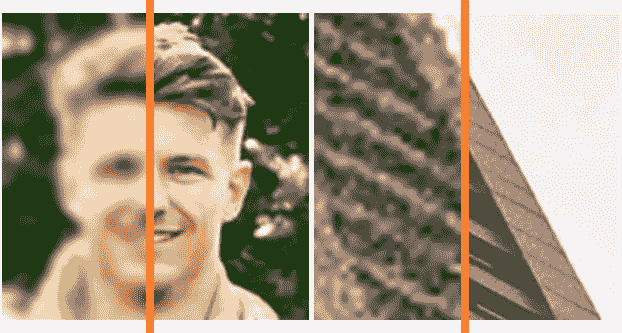

两幅图像，其中左半部分对应于低分辨率图像，右半部分描绘高分辨率图像。超分辨率方法的目的是改善低分辨率图像，使其尽可能接近高分辨率图像。由[拉斯·博·尼尔森](https://unsplash.com/es/@lbnielsen?utm_source=unsplash&utm_medium=referral&utm_content=creditCopyText)(左)和[索拉萨克](https://unsplash.com/@boontohhgraphy?utm_source=unsplash&utm_medium=referral&utm_content=creditCopyText)(右)在 [Unsplash](https://unsplash.com/s/photos/building?utm_source=unsplash&utm_medium=referral&utm_content=creditCopyText) 上拍摄的原始图像

在[之前的一篇文章](/what-is-image-super-resolution-and-why-do-we-need-it-9c3bd9dc233e)中，给出了超分辨率(SR)的概述以及它为什么会成为一个重要的研究课题。概括地说，它是对低分辨率(LR)图像进行上采样以恢复基础高质量图像的过程。除了分辨率，SR 方法通常需要考虑其他因素，如模糊、传感器噪声和压缩，这些因素也可能降低图像质量。

存在许多解决 SR 的方法，这些方法可以大致分为“*非盲*”，其中假定影响图像的退化是已知的，或者“*盲*”，其中影响图像的确切退化是未知的。

无论采用哪种方法，它们都必须定义一个退化模型，用于确定要使用的 LR 图像的类型。鉴于大多数现代方法都是基于深度学习的，因此已经对要使用的损失函数和评估指标进行了大量研究，这些损失函数和评估指标会显著影响最终结果的外观和质量。

我们将更详细地讨论所有这些，并概述软件无线电领域最流行和最先进的方法。

概括来说，本文将涉及的主题如下:

1.  [退化模型](#dd8f)
2.  [非盲 SR 方法](#2449)
3.  [盲 SR 方法](#1aa0)
4.  [损失函数和评估指标](#5890)
5.  [结论和未来方向](#4183)

# 退化模型

任何 SR 算法的关键组成部分之一实际上与方法本身无关，而是与所使用的数据有关。具体来说，应用了一个*退化模型*,以便制定要使用哪种数据。

大多数方法倾向于基于*监督*学习的方法，需要使用地面真实信息(在 SR 的情况下对应于原始 HR 图像),以便算法知道当超解析给定的 LR 图像时最终结果应该是什么样子。因此，这种退化模型被直接应用于 HR 图像以产生低分辨率图像。典型地，诸如所考虑的退化幅度的参数被改变以产生多个 LR 图像。

“经典”退化模型是最常用的，它考虑了下采样、模糊和噪声:

其中⊗表示卷积运算， *k* 是核(通常是高斯模糊核，但是它也可以表示诸如点扩展函数(PSF)之类的其他函数)， *n* 表示加性噪声，并且↓ *s* 是缩减操作，其通常被假定为具有比例因子 *s* 的双三次下采样。

该模型被批评为过于简单，利用它的方法不能很好地概括更复杂的退化，这种退化通常在现实世界的图像中发现。因此，最近的努力试图设计更真实的退化模型，例如通过包括由图像中非常普遍的压缩引起的伪像:

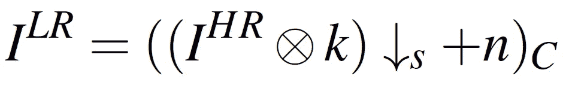

其中 *C* 是 JPEG 等压缩方案。

还提出了其他方案，例如通过不止一次地应用经典退化模型的[、](https://doi.org/10.1109/ICCVW54120.2021.00217)[随机打乱应用退化的顺序的](https://doi.org/10.1109/ICCV48922.2021.00475)，以及最近的[使用“随机门控制器”，其随机选择要使用哪些基础退化](https://doi.org/10.1109/CVPRW56347.2022.00068)。

SR 的目的是然后反转所考虑的任何退化过程，以恢复原始的基本高保真图像。现在将提供执行该任务的流行方法的概述。

# 非盲随机共振方法

大多数作品倾向于了解使用了哪种退化模型，因此被称为“非盲”方法。这与“盲目”模型相反，盲目模型不能“看见”，因此对可能影响图像的退化一无所知。虽然非盲方法不太现实，但它们已经形成了包括盲 SR 方法在内的更复杂方法的基础。

超分辨率卷积神经网络(SRCNN) [1，2]被认为是使用深度学习和卷积神经网络完成 SR 任务的开创性工作。它仅由三层组成，要求 LR 图像在被网络处理之前使用双三次插值进行上采样，但它的性能优于当时的最新方法，如 A+ [3]和基于稀疏表示的方法[4]。研究还表明，基于稀疏编码的方法等效于卷积神经网络，这影响了 SRCNN 的超参数设置。

虽然 SRCNN 已被许多研究人员用作基准，但它现在已被广泛超越，不再经常用于比较目的。然而，由于其相对简单，它可以作为任何对基于深度学习的人工智能领域感兴趣的人的良好起点。

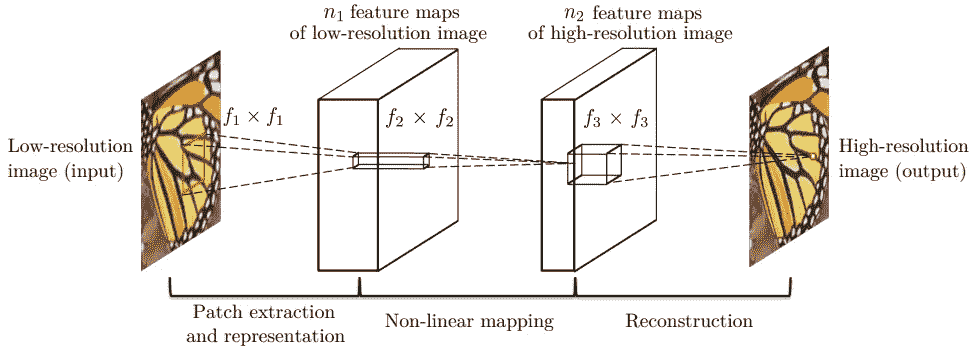

SRCNN 方法的架构[1，2]

残差网络(ResNet)架构[5，6]主要用于随着层数的增加而简化网络的训练。事实上，虽然文献中的许多作品都表明，更深的网络提供了更好的性能，但准确性会达到饱和，然后迅速下降。研究表明，这不是由于过拟合，而是由于优化和训练非常深的网络的困难。特别是，有人指出，深层网络可能会发现很难学习身份功能。

为了解决这个问题，许多跳过/快捷连接被用来将网络的任何给定级别的特征地图直接馈送到更高层，因此对应于身份功能。这样，网络将只需要学习抑制中间层的响应(将输出驱动到零)的函数。

在[7]中，ResNet 被应用于 SR 域以创建 SRResNet，其中它也被用作基于生成对抗网络(GAN)的网络(称为 SRGAN)的基础。

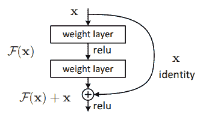

ResNet 中剩余学习的构建模块[5，6]

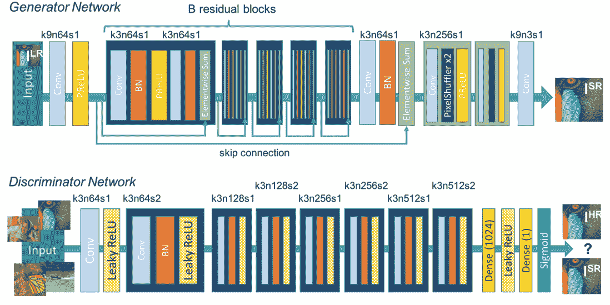

SRGAN 的生成器(基于 SRResNet)和鉴别器网络的架构，其中 *k* 表示内核大小， *n* 是特征映射的数量， *s* 是步距[7]

增强型深度超分辨率(EDSR)方法[8]也是基于 ResNet，并结合了 SRResNet 等先前工作中报告的结论。所提出的方法的贡献之一是去除了[批标准化](https://en.wikipedia.org/wiki/Batch_normalization)层，以禁用特征值的限制并减少训练期间的内存使用，从而允许使用更多的层和过滤器。残差缩放还用于确保网络的稳定性(尤其是在使用大量要素时)。

还设计了称为多尺度深度超分辨率(MDSR)的多尺度网络，其本质上包括用于三个不同上采样因子(2，3，4)的公共网络，以及在预处理阶段的尺度特定模块和在由卷积和“洗牌”层组成的网络末端的上采样模块。因此，所提出的方法不需要像在一些其他工作中(例如 SRCNN)那样对输入图像进行双三次插值。提出的方法被证明超过了 NTIRE 2017 竞赛中评估的方法的性能[9]。

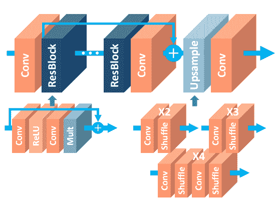

EDSR 建筑[8]

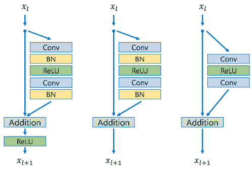

ResNet(左)、SRResNet(中)和 EDSR(右)中使用的残差块之间的差异[8]

剩余通道注意力网络(RCAN)是在[10]中提出的，以抵消训练非常深的 CNN 的困难和跨通道的低频信息的同等重要性的分配。因此，RCAN 由“剩余组”组成，每个“剩余组”包含多个“剩余频道注意块”。“长跳跃连接”与残差组一起使用，使得信息能够从网络的早期阶段传播到最终阶段，而“短跳跃连接”在残差块内使用，用于以更精细的级别传播信息。作者还指出，这种残差中残差的架构能够训练非常深的 CNN(超过 400 层)。

RCAN 的表现优于美国有线电视新闻网(SRCNN)和 EDSR 等方法，并与更现代的方法保持相当的竞争力。它还被证明对于物体识别是有效的，其中当与通过其他方法上采样的图像相比时，由 RCAN 输出的上采样图像能够实现更高的精度。

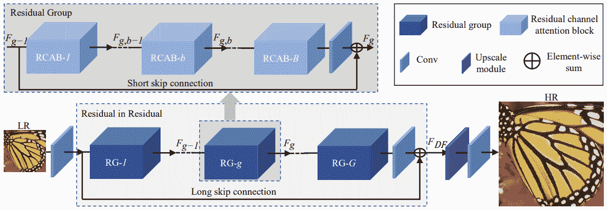

RCAN 建筑[10]

SRGAN 在[11]中进行了改进，以产生增强的 SRGAN (ESRGAN)，改进集中在:(I)网络架构，其中去除了批量归一化(类似于 EDSR ),并且残差中残差密集块(RRDB)被提议作为网络的基本构建块，以实现更高的网络容量并促进训练，(ii)对抗损失，其被修改以确定图像的相对“真实度”(即，如果图像比假数据更真实或者比真实数据更不真实， 而不是简单的真实或虚假)，以及(iii)感知损失，通过使用在卷积发生之后(即在激活之前)立即计算的特征来减少特征的稀疏性并更好地监控亮度一致性和纹理恢复。 “网络插值”也使用户能够平衡感知质量和 PSNR 之间的折衷。

与包括 SRCNN [1，2]，EDSR [8]，RCAN [10]和 SRGAN [7]在内的其他方法相比，结果表明，ESRGAN 产生的图像边缘更清晰，纹理更好，同时减少了不希望的伪影。ESRGAN 还赢得了 PIRM2018-SR 挑战赛[12]。

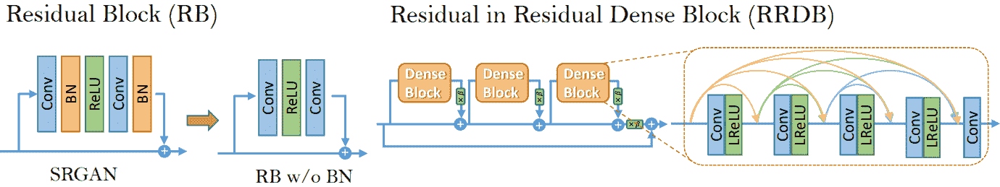

在 ESRGAN 中，移除了 SRGAN 中存在的批量标准化层，同时使用了新的 RRDB 模块。还采用了剩余比例参数*β*[11]。

[Transformers](https://en.wikipedia.org/wiki/Transformer_(machine_learning_model)) ，最初提出用于自然语言处理(NLP)领域，是深度学习模型，它使用一种注意机制来决定序列中的哪些部分最重要。它们已经成为一个热门的研究课题，并已被应用于计算机视觉任务，视觉变压器(ViT)被认为是这一领域的开创性工作[13]。最近，在[14]中提出了基于变换器的方法的应用，命名为高效超分辨率变换器(ESRT)。

轻量级 Transformer Backbone (LTB)的任务是捕获图像中跨局部区域的长期空间依赖性。如果图像在不同位置包含相似的补丁，这将特别有用。CNN 也被用作轻量级 CNN 主干(LCB)的一部分，它可以动态调整特征大小以提取深层特征，同时保持低计算成本。实验表明，ESRT 可以在性能和计算复杂度之间取得很好的平衡。

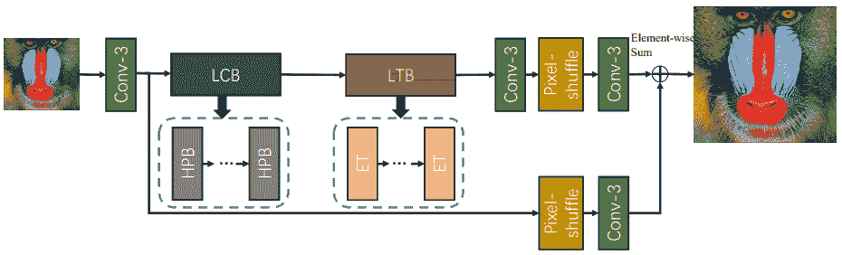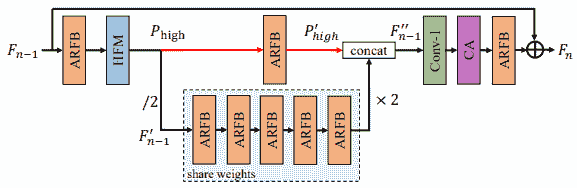

ESRT 的建筑(上)和高保护街区(HPB)(下)。LCB、LTB、HPB 和 ET 分别代表轻量级 CNN 主干、轻量级变压器主干、高保护块和高效变压器。在 HPB 架构中，HFM 和 ARFB 代表高频滤波模块和自适应残差特征块[14]。

# 盲随机共振方法

虽然上面提到的非盲方法为 SR 的网络开发提供了许多有用的见解，但是它们往往不完全适用于真实世界的场景。这是因为这些方法假定了一个已知的固定退化过程，因此当遇到与它们专门训练的退化不同且更复杂的退化时，往往会失败，这在现实世界中是常见的。此外，影响图像的退化类型通常是未知的。

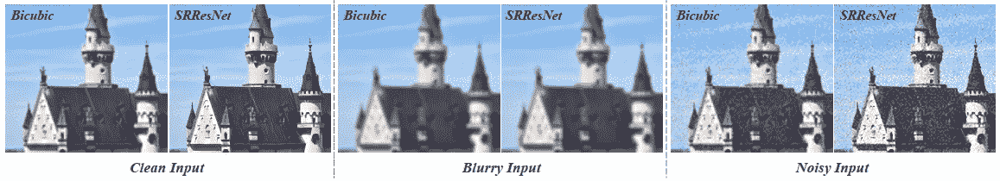

非盲 SR 方法的失败案例，在模糊输入的情况下无法锐化纹理，在有噪声输入的情况下保持噪声[15]

盲 SR 方法试图通过减少所做的假设来对这个问题更加鲁棒，即使大多数方法仍然对输入降级做一些假设。刘等人[15]的一项调查将开创性的 SRCNN 的第一作者(C. Dong)列为其作者之一，该调查提出了一种基于所用数据类型及其建模方式的分类法。

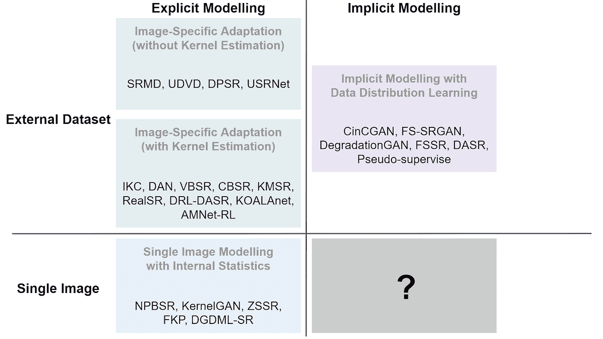

盲 SR 方法的分类和一些相应的代表性方法，如[15]中所述，其中也揭示了研究缺口。

一组方法通过除了 LR 图像之外还允许输入表示估计退化的其他特征来执行 SR。因此，这些方法的主要任务是如何最好地利用这些附加信息。

用于多重降级的 12 层超分辨率网络(SRMD) [16]就是这样一种方法，它考虑了高斯模糊、噪声和下采样。使用“维度拉伸”方法，其中使用[主成分分析(PCA)](https://en.wikipedia.org/wiki/Principal_component_analysis) 将模糊内核矢量化并投影到更小的维度，然后将其与降级图像的噪声级别连接。然后复制该向量中的每个维度(元素)以获得其宽度和高度与输入 LR 图像的宽度和高度相同的矩阵。

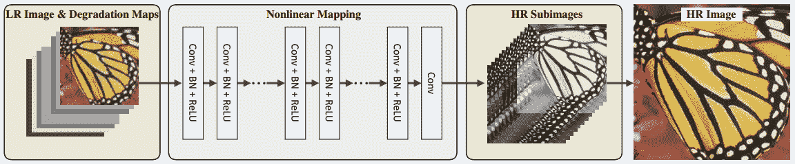

SRMD 建筑[16]

SRMD 提出的维度拉伸方法[16]

还提出了扩展现有非盲方法以利用退化信息的技术[17，18]。这种方法的缺点是，它们需要精确的退化信息(这不是一项简单的任务)，因为估计输入的任何偏差都会导致内核不匹配，从而对性能有害。

[18]中提出的“元注意力”块，以及在典型的单幅图像超分辨率网络中的放置

为了缓解这些问题，已经提出了在 SR 过程中估计退化核的方法，例如迭代核校正(IKC) [19]。这种方法利用了任何核不匹配都可能导致规则模式的观察结果，实现了对核的估计，并使用校正器网络以迭代方式对其进行校正，以逐步改善超分辨率图像。结合非盲网络(也在[19]中提出)，空间特征变换多重降级(SFTMD)网络，据报道实现了优于诸如 SRMD 的方法的性能。

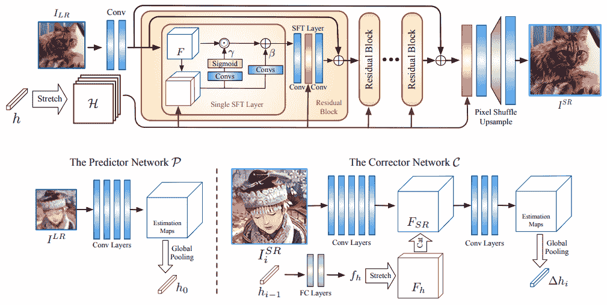

SFTMD(上图)、预测器和校正器网络(下图)的架构[19]

深度交替网络(DAN) [20](也称为 DANv1)及其更新版本 DANv2 [21]通过在单个端到端可训练网络内统一 SR 和内核校正器网络来构建 IKC，这可以使两个网络更有效地相互操作。为了提高核估计的鲁棒性，校正器也被修改为使用以中间 SR 结果为条件的 LR 输入，而不是像在 IKC 中执行的那样，以估计的核为条件来调节超分辨率图像。

丹建筑[20]

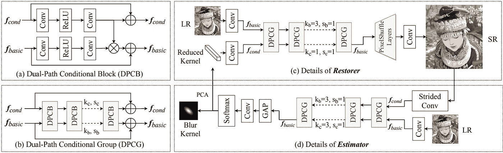

DANv2 [21]中的(a)双路径条件块(DPCB)、(b)双路径条件组(DPCG)、(c)恢复器和(d)估计器的架构。‘GAP’表示全局平均池，f_basic 表示基本输入，f_cond 表示条件输入。

面向内核的自适应局部调整网络(KOALAnet) [22]考虑图像内的空间变化特征，并因此尝试执行局部自适应。这使得能够区分由于不期望的效果引起的模糊和出于美学目的故意引起的模糊(例如[散景](https://en.wikipedia.org/wiki/Bokeh)效果)。

KOALAnet 架构[22]

如果 LR 图像包含与训练模型时考虑的退化不同的退化，则上述方法可能仍然表现出较差的性能，假设它们依赖于核估计。因此，另一组方法，如 KernelGAN [23]和“零炮”SR (ZSSR) [24]利用自然图像的内部统计和观察，一些模式在尺度内(即在图像内的不同位置)和跨尺度(即本质上不同的大小)重复。这使得模型可以自我监督，一次适应一幅图像。

然而，有争议的是，在尺度内和跨尺度具有重复出现的斑块的假设可能并不适用于所有图像(例如，那些包含各种各样的内容或者相反地具有大部分同质区域的图像)。

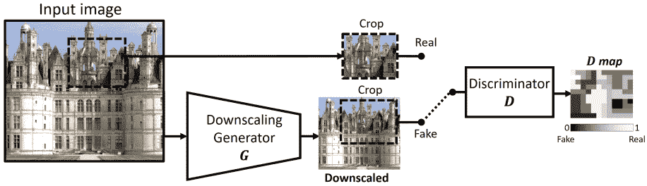

KernelGAN 建筑[23]

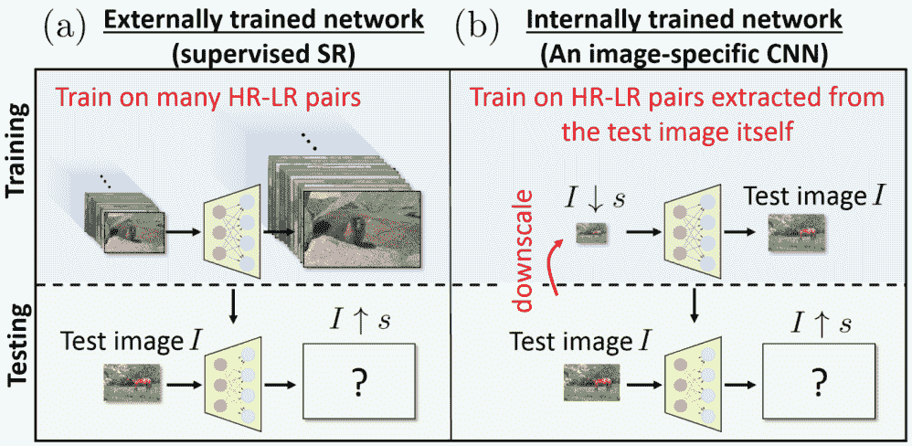

在外部数据集上训练的网络(a)和 ZSSR 方法(b)之间的差异，在后者中，网络在图像上训练，以自我超分辨[24]

另一组方法试图隐式地对潜在的退化模型进行建模，以便对真实世界的 LR 图像更加鲁棒，其中 HR 图像不可用并且因此是未知的。循环中循环 GAN (CinCGAN) [25]就是这样一种方法，它由两个循环 GAN [26]网络组成。第一个网络试图对输入图像去噪(以产生“干净的 LR”图像)，而第二个网络则学习从 LR 空间到 HR 空间的映射，以及基于 EDSR 的 SR 网络[8]。

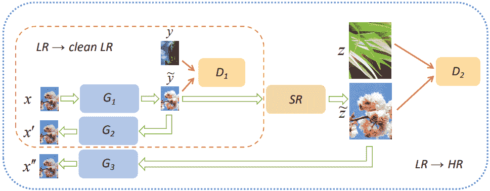

CinCGAN 架构，其中 G1-G3 是生成器，D1-D2 是鉴别器，SR 是超分辨率网络[25]

另一种方法 Real-ESRGAN [27]是 ESRGAN [11]的扩展，它使用“高阶”退化过程生成合成图像，其中退化模型实际上应用了两次。这种方法的主要缺点是需要大量的数据。

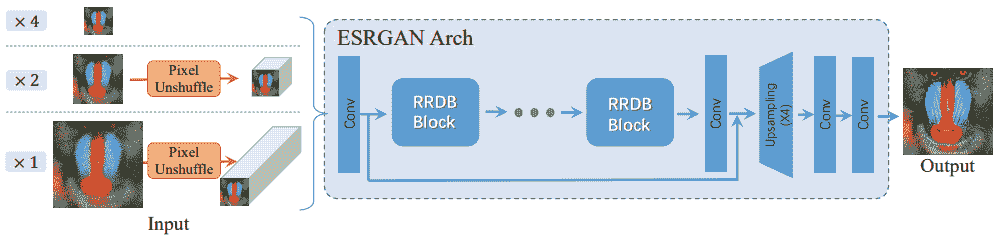

Real-ESRGAN 架构[27]

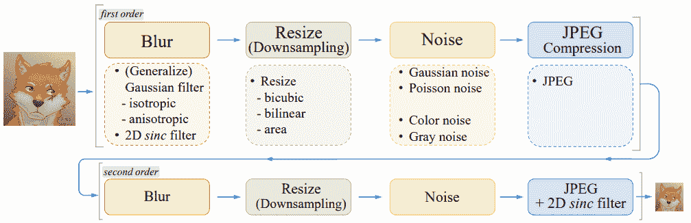

用于 Real-ESRGAN 的合成数据生成管道[27]

虽然退化 GAN [17]等方法试图通过学习 HR 到 LR 的退化过程来解决这一问题，从而允许在 SR 模型的训练过程中生成和使用真实的 LR 样本，但大多数为隐式退化建模而设计的模型倾向于使用不易训练的 GAN，并可能引入对取证或旧照片恢复等应用有害的假纹理或伪影。

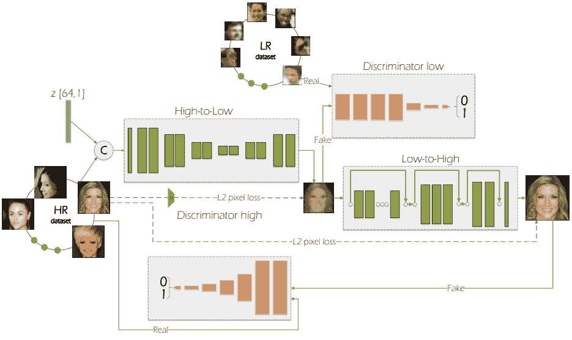

退化 GAN 的架构和训练管道[17]

一些方法还考虑了多种建模模式和数据源，例如混合专家(MoESR) [28]，其中不同的退化内核分别由特定的 SR 网络(称为“专家”)处理。然后，最好的专家被用于内核预测，而图像的内部统计数据则被用于执行微调。

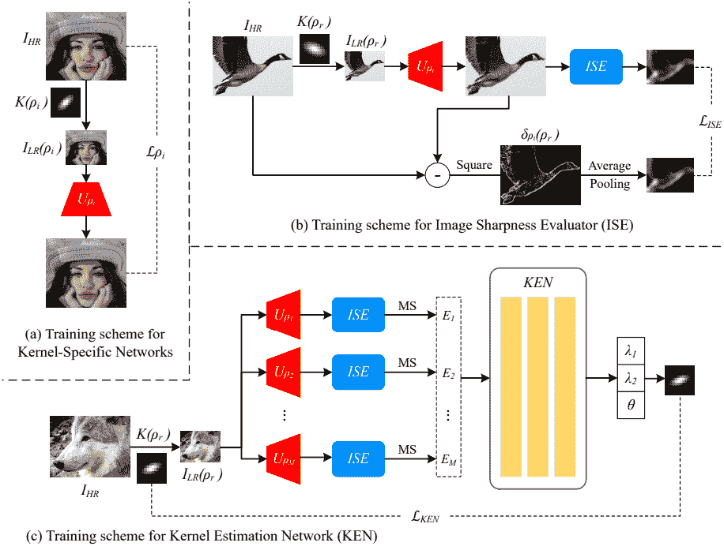

教育和科学研究部各种网络的培训计划[28]

最近重新兴起的一股研究潮流是*对比学习*，它也被应用于诸如降解感知 SR (DASR)网络【29】和为遥感图像设计的方法【30】等方法中的 SR。对比学习是自我监督学习的一种形式，其中从表现出与“锚”表示相似的特征的图像样本(通常称为“正”样本)获得的特征表示被拉近，而从具有与锚不同的特征的样本(通常称为“负”样本)获得的表示被推开。

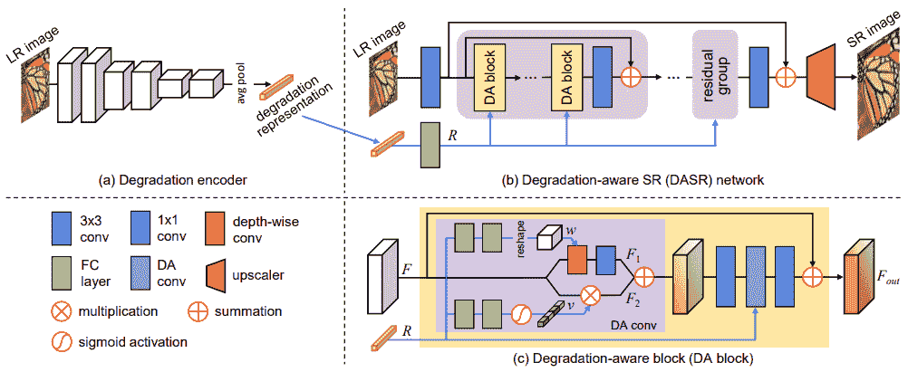

DASR 建筑(下)[29]

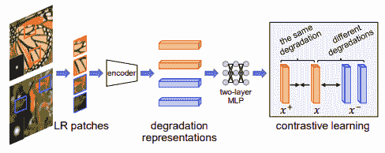

DASR 使用的无监督退化表示学习方案的示例[29]

# 损失函数和评估指标

上述所有方法都使用机器学习，其中需要一些方法来确定学习的参数是否朝着正确的方向移动。然后进行任何调整以进一步优化这些参数，并进而产生(希望)更令人满意的结果。这是使用所谓的*损失函数*来执行的，该函数测量网络在训练阶段输出的结果的质量。

最常用的损失函数直接比较 LR 图像和目标(HR)图像，例如 L2 损失，其形成了[均方误差(MSE)](https://en.wikipedia.org/wiki/Mean_squared_error) 和密切相关的[峰值信噪比(PSNR)](https://en.wikipedia.org/wiki/Peak_signal-to-noise_ratio) 的基础。这些所谓的全参考图像质量评估(FR-IQA)度量本质上是在超分辨率的情况下测量 HR 和 LR 图像的对应像素之间的差异。训练函数的任务是理想地最小化 MSE 到零，相反地尽可能最大化 PSNR。

然而，这些指标长期以来一直被批评为与主观质量感觉不太相关，因为它们对可能的解决方案进行像素平均，从而导致模糊的结果。因此，与看起来质量较低的图像相比，在感知上看起来更令人愉悦的图像可能产生较低的 PSNR 值。此外，即使在垂直或水平方向上移动图像一个像素也会导致 MSE 变大(并且 PSNR 非常低)，即使要评估的图片与原始图像相同。

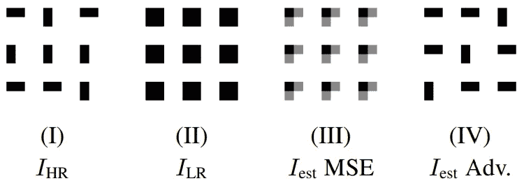

MSE / PSNR 的问题:可能的解决方案被平均，导致模糊的结果；换句话说，由于 MSE [31]固有的平均特性，模糊性受到鼓励

上述问题引发了对*感知指标*的使用，该指标旨在衡量与人类感知质量相关的图像整体质量。结构相似性指数(SSIM) [32]旨在解决这一问题，在 SR 方法的开发和评估中非常常用。

然而，SSIM 仍然将被评估的图像与原始 HR 图像进行比较，因此仍然对一些因素敏感。此外，自从 SSIM 创立以来，已经开发了许多方法，这些方法被证明与人类对图像质量的感知更好地相关。

那么为什么不使用这些相关性更好的方法呢？嗯，MSE、PSNR 和 SSIM 是简单的指标，计算速度非常快(当你需要评估数千甚至数百万张图像时很方便)，并且在许多常见的编程库中实现，使它们非常方便易用。此外，它们是可微分的，这是使深度学习方法能够更新其参数所必需的属性。

还设计了不需要原始 HR 图像的感知度量，称为无参考 IQA (NR-IQA)度量。例子包括 BRISQUE [33]和 NIQE [34]，但这些往往主要用于评估，因为它们是不可微的。

一种在增强感知愉悦图像方面非常流行的方法是从其他网络中提取和使用中间特征，以产生一种类型的*感知损失*。

例如，在人脸 SR 的情况下，为人脸识别而设计和训练的诸如 VGG-Face [35]的网络可以用于强制在处理 HR 图像时获得的中间特征和在使用超分辨率图像时获得的特征彼此相似。这样，损失是在特征级而不是图像级计算的。

此外，假设为面部训练的网络提取与辨别面部最相关的显著特征，那么特征相似性的实施也将面部的身份和特征实施为相似的。这有助于防止网络“幻觉”原始图像中可能不存在的新细节，从而防止身份的改变，这种改变在一些应用中是有害的，如前一篇文章中的[所述。](/what-is-image-super-resolution-and-why-do-we-need-it-9c3bd9dc233e)

感知损失函数可以用于几乎任何 SR 应用，而不仅仅是人脸。事实上，感知损失最初应用于普通图像内容的超分辨率[36]。

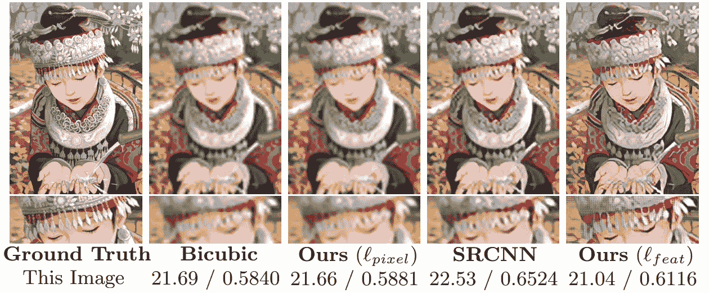

双三次插值、使用基于像素的损失的超分辨率、SRCNN [1，2]和使用特征重建损失(一种感知损失函数)的超分辨率之间的比较。每个图像还显示了 PSNR / SSIM。从[36]获取的图像。

在上面的图像中，可以注意到使用感知损失获得的方法的 PSNR 值比使用每像素损失获得的结果低(差)，而 SSIM 值仅略高。此外，PSNR 和 SSIM 都低于不仅通过 SRCNN 超分辨的图像获得的值，而且还低于通过基本双三次插值上采样的图像获得的值。

然而，可以认为，与使用基于像素的损失和 SRCNN 导出的图像相比，基于感知损失的结果实际上更清晰且更接近地面真实图像。[36]的作者指出，与基线方法相比，放大后可见的轻微交叉图案会损害 PSNR 和 SSIM 值。这突出了使用与主观质量感觉更好相关的 IQA 度量的需要。

尽管 PSNR 等度量标准存在缺点，但它们仍然有助于确保超分辨率图像的内容与原始图像保持相似。换句话说，如果不进行逐像素的比较，如果图像只是好看，网络可以彻底改变图像内容而不会受到惩罚。事实上，这是 GANs 的缺点之一(在某些应用中也是一个优点),它往往以合成原始图像中可能不存在的纹理和内容为代价来产生好看的图像。

如上所述，这在一些应用中可能是有害的，例如在人脸识别中，如果身份被改变，错误的人可能被定罪，而实际的犯罪者可能无法被识别。例如，在由[于*等人* (2018)](https://basurafernando.github.io/papers/XinYuCVPR18.pdf) 提出的工作的图 5 中，所提出的方法的超分辨率结果看起来相当好，特别是考虑到要超分辨率的低分辨率图像的大小仅为 16 × 16 像素。然而，有人可能会说，一些人的身份与原始图像中的身份不同。

针对一种损失函数类型调整网络往往会降低另一种损失函数类型的性能，反之亦然。例如，SRResNet 在 PSNR 方面优于 SRGAN，但在感知质量方面不如 SRGAN。因此，通常需要在这两种度量之间进行权衡，以确保图像内容与原始内容相似，同时使结果在感觉上令人满意。显然，这取决于目标应用程序，因此可能需要给予一种类型的度量比其他类型的度量更大的重要性。

# 结论和未来方向

可以看出，在软件无线电领域已经做了许多工作，但仍然存在许多需要克服的挑战。其中一个主要问题是 SR 方法的开发，该方法真正能够在盲设置中对真实世界的图像进行操作，在盲设置中没有关于可能影响图像的退化的信息被假定。

此外，以上讨论集中在通用图像内容上；有一些方法是为特定应用设计的，例如人脸 SR。这些方法也是一次对一幅图像进行操作，因此被称为单幅图像 SR (SISR)方法；虽然也做了工作来使用多幅图像(例如视频和多光谱卫星图像)提取更多信息，从而提高性能，但与 SISR 相比，这方面的进展更为有限。

总之，未来的研究有很多途径，这至少保证了一件事:软件无线电的未来是光明的(即使有时事情看起来模糊和扭曲😉)!

*你对这篇文章有什么想法吗？欢迎直接在* [*LinkedIn*](https://www.linkedin.com/in/cgalea) 上留言、评论或给我发消息！

*此外，确保* [***关注***](https://medium.com/m/signin?actionUrl=https%3A%2F%2Fmedium.com%2F_%2Fsubscribe%2Fuser%2Fa9be78db0c9b&operation=register&redirect=https%3A%2F%2Ftowardsdatascience.com%2Fimage-super-resolution-an-overview-of-the-current-state-of-research-94294a77ed5a&user=Christian+Galea&userId=a9be78db0c9b&source=post_page-a9be78db0c9b--three_column_layout_sidebar-----------------------follow_profile-----------) *me，以确保您在未来文章发表时得到通知。*

*作者是马耳他大学* [*博士后研究员*](https://www.um.edu.mt/) *在* [*深松*](https://www.um.edu.mt/projects/deep-fir/) *项目，该项目是与* [*Ascent 软件*](https://www.ascent.io) *合作完成的，由马耳他科学委员会&技术(MCST)资助，并代表科学基金会&技术，通过*

# 参考

[1] C. Dong、C. C. Loy、K. He 和 X. Tang，[学习用于图像超分辨率的深度卷积网络](https://doi.org/10.1007/978-3-319-10593-2_13) (2014)，欧洲计算机视觉会议(ECCV，2014)

[2]董，卢，何，唐，[基于深度卷积网络的图像超分辨率处理](https://arxiv.org/abs/1501.00092) (2016)，IEEE 模式分析与机器智能汇刊

[3] R .蒂莫夫特、V. D .斯梅特和 L. V .古尔， [A+:用于快速超分辨率的调整锚定邻域回归](https://doi.org/10.1007/978-3-319-16817-3_8) (2014)，亚洲计算机视觉会议(ACCV，2014)

[4] J. Yang，J. Wright，T. S. Huang，和 Y. Ma，[基于稀疏表示的图像超分辨率技术](https://doi.org/10.1109/TIP.2010.2050625) (2010)，IEEE 图像处理汇刊

[5]何国光，张，任，孙，[深度残差学习用于图像识别](https://arxiv.org/abs/1512.03385) (2016)，IEEE 计算机视觉与模式识别会议(2016)

[6]何国光，张，任，孙，[深度剩余网络中的身份映射](https://arxiv.org/abs/1603.05027) (2016)，欧洲计算机视觉会议(ECCV，2016)

[7] C. Ledig，L. Theis，F. Huszr，J. Caballero，A. Cunningham，A. Acosta，A. Aitken，A. Tejani，J. Totz，Z. Wang 和 W. Shi，[使用生成式对抗网络的照片真实感单幅图像超分辨率](https://arxiv.org/abs/1609.04802) (2017)，IEEE 计算机视觉和模式识别会议(CVPR 2017)

[8] B. Lim、S. Son、H. Kim、S. Nah 和 K. M. Lee，(2017)，IEEE 计算机视觉和模式识别研讨会会议(CVPRW 2017)

[9] E. Agustsson 和 r .蒂莫夫特，[2017 年单幅图像超分辨率挑战:数据集和研究](https://openaccess.thecvf.com/content_cvpr_2017_workshops/w12/html/Agustsson_NTIRE_2017_Challenge_CVPR_2017_paper.html) (2017)，IEEE 计算机视觉和模式识别研讨会会议(CVPRW 2017)

[10] Y. Zhang，K. Li，K. Li，L. Wang，B. Zhong，和 Y. Fu，[使用极深残差通道注意网络的图像超分辨率](https://arxiv.org/abs/1807.02758) (2018)，欧洲计算机视觉会议(ECCV，2018)

[11] X. Wang，K. Yu，S. Wu，J. Gu，Y. Liu，C. Dong，Y. Qiao，C. C. Loy， [ESRGAN:增强型超分辨率生成对抗网络](https://arxiv.org/abs/1809.00219) (2018)，欧洲计算机视觉会议(ECCV，2018)

[12] Y. Blau，R. Mechrez，r .蒂莫夫特，T. Michaeli 和 L. Zelnik-Manor，[2018 年感知图像超分辨率 PIRM 挑战赛](https://arxiv.org/abs/1809.07517) (2018)，arXiv

[13] A. Dosovitskiy，L. Beyer，a .科列斯尼科夫，D. Weissenborn，X. Zhai，T. Unterthiner，M. Dehghani，M. Minderer，G. Heigold，S. Gelly，J. Uszkoreit 和 N. Houlsby，[一幅图像相当于 16x16 个词:大规模图像识别的变形金刚](https://iclr.cc/virtual/2021/poster/3013) (2021)，国际学习表征会议(ICLR 2021)

[14] [Z. Lu](https://arxiv.org/search/cs?searchtype=author&query=Lu%2C+Z) ， [J. Li](https://arxiv.org/search/cs?searchtype=author&query=Li%2C+J) ， [H .刘](https://arxiv.org/search/cs?searchtype=author&query=Liu%2C+H)， [C .黄](https://arxiv.org/search/cs?searchtype=author&query=Huang%2C+C)， [L .张](https://arxiv.org/search/cs?searchtype=author&query=Zhang%2C+L)， [T .曾](https://arxiv.org/search/cs?searchtype=author&query=Zeng%2C+T)，[单幅图像超分辨率变换](https://arxiv.org/abs/2108.11084) (2022)，IEEE 计算机视觉与模式识别研讨会(CVPRW 2022)

[15] A. Liu，Y. Liu，J. Gu，Y. Qiao，C. Dong，[盲图像超分辨率:综述与超越](https://arxiv.org/abs/2107.03055)，(2022)，IEEE 模式分析与机器智能汇刊

[16] K. Zhang，W. Zuo，和 L. Zhang，[学习单个卷积超分辨率网络的多重退化](https://arxiv.org/abs/1712.06116) (2018)，IEEE/CVF 计算机视觉和模式识别会议(CVPR，2018)

[17] A. Bulat，J. Yang，G. Tzimiropoulos，[学习图像超分辨率，先用 GAN 学习如何做图像退化](https://arxiv.org/abs/1807.11458) (2018)，欧洲计算机视觉会议(ECCV 2018)

[18] M. Aquilina，C. Galea，J. Abela，K. P. Camilleri 和 R. A .法鲁吉亚，[使用元注意层提高超分辨率性能](https://arxiv.org/abs/2110.14638) (2021)，IEEE 信号处理快报

[19]顾，陆，左，董，[迭代核校正的盲超分辨率算法](https://arxiv.org/abs/1904.03377) (2019)，IEEE/CVF 计算机视觉与模式识别会议(CVPR，2019)

[20]罗，黄，李，王，谭，(2020)，神经信息处理系统进展

[21]罗，黄，李，王，谭，[盲超分辨率的端到端交替优化](https://arxiv.org/abs/2105.06878) (2021)，arXiv

[22] S. Y. Kim，H. Sim，M. Kim， [KOALAnet:使用面向内核的自适应局部调整的盲超分辨率](https://arxiv.org/abs/2012.08103) (2021)，IEEE/CVF 计算机视觉和模式识别会议(CVPR 2021)

[23] S. Bell-Kligler、A. Shocher 和 m .伊拉尼，[使用内部 g an 的盲超分辨率核估计](https://arxiv.org/abs/1909.06581) (2019)，神经信息处理系统进展(NeurIPS)

[24] A. Shocher，N. Cohen 和 m .伊拉尼，[“零射击”使用深度内部学习的超分辨率](https://arxiv.org/abs/1712.06087) (2018)，IEEE/CVF 计算机视觉和模式识别会议(CVPR 2018)

[25]Yuan，S. Liu，J. Zhang，Y. Zhang，C. Dong 和 L. Lin，[使用循环生成对抗网络的无监督图像超分辨率](https://arxiv.org/abs/1809.00437) (2018)，IEEE/CVF 计算机视觉和模式识别研讨会(CVPRW 2018)

[26] J. Zhu，T. Park，P. Isola 和 A. A. Efros，[使用循环一致对抗网络的不成对图像到图像翻译](https://arxiv.org/abs/1703.10593) (2017)，IEEE 计算机视觉国际会议(ICCV，2017)

[27] X. Wang，L. Xie，C. Dong，和 Y. Shan， [Real-ESRGAN:用纯合成数据训练真实世界盲超分辨率](https://arxiv.org/abs/2107.10833) (2021)，国际计算机视觉研讨会会议(ICCVW 2021)

[28] M .艾玛德、m .皮曼和 H. Corporaal， [MoESR:使用核感知专家混合的盲超分辨率](https://openaccess.thecvf.com/content/WACV2022/html/Emad_MoESR_Blind_Super-Resolution_Using_Kernel-Aware_Mixture_of_Experts_WACV_2022_paper.html) (2022)，IEEE/CVF 计算机视觉应用冬季会议(WACV 2022)

[29] L. Wang，Y. Wang，X. Dong，Q. Xu，J. Yang，W. An，和 Y. Guo，[用于盲超分辨率的无监督退化表示学习](https://arxiv.org/abs/2104.00416) (2021)，IEEE/CVF 计算机视觉和模式识别会议(CVPR 2021)

[30] G. Yin，W. Wang，z . Yu，W. Ji，D. Yu，S. Sun，t-s . Chua，和 C. Wang，[用于多降级的盲超分辨率的条件超网络](https://arxiv.org/abs/2104.03926) (2022)，IEEE 图像处理汇刊

[31] M. S. M. Sajjadi、B. Schlkopf 和 M. Hirsch， [EnhanceNet:通过自动纹理合成实现单幅图像超分辨率](https://arxiv.org/abs/1612.07919) (2017)，IEEE 计算机视觉国际会议(ICCV，2017)

[32]纣王，A. C .博维克，H. R .谢赫和 E. P .西蒙切利，[图像质量评估:从错误可见性到结构相似性](https://www.cns.nyu.edu/pub/lcv/wang03-preprint.pdf) (2004)，IEEE 图像处理汇刊

[33] A. Mittal，A. K. Moorthy 和 A. C. Bovik，[空间域中的无参考图像质量评估](https://live.ece.utexas.edu/publications/2012/TIP%20BRISQUE.pdf) (2012)，IEEE 图像处理汇刊

[34] A. Mittal、R. Soundararajan 和 A. C. Bovik，[制作“完全盲”图像质量分析仪](http://live.ece.utexas.edu/research/quality/niqe_spl.pdf) (2013)，IEEE 信号处理快报

[35] O. M. Parkhi，A. Vedaldi 和 A. Zisserman，[深度人脸识别](https://www.robots.ox.ac.uk/~vgg/publications/2015/Parkhi15/) (2015)，英国机器视觉大会(BMVC 2015)

[36] J. Johnson，A. Alahi，l .飞飞，[实时风格转换和超分辨率的感知损失](https://arxiv.org/abs/1603.08155) (2016)，欧洲计算机视觉会议(ECCV，2016)